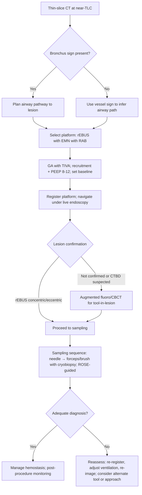
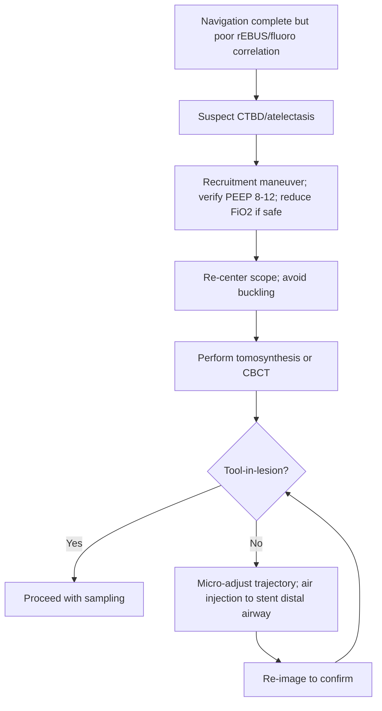

Advanced Peripheral Bronchoscopy: Radial Probe, Electromagnetic Navigation, and Robotic Bronchoscopy
Exam Mapping & Scope

This chapter covers diagnostic approaches to peripheral pulmonary lesions (PPLs) using radial endobronchial ultrasound (rEBUS), electromagnetic navigation (EMN), and robotic‑assisted bronchoscopy (RAB). It aligns with AABIP IP Board domains on peripheral bronchoscopy indications, imaging/navigation, anesthesia/ventilation strategies, complications, radiation safety, and evidence interpretation.

Learning Objectives

By the end of this chapter, learners will be able to:

Select between rEBUS, EMN, ultrathin bronchoscopy, and RAB for specific PPL presentations.

Plan navigation using thin‑slice CT, interpret “bronchus sign” and “vessel sign,” and mitigate CT‑to‑body divergence (CTBD).

Execute stepwise registration, navigation, lesion confirmation, and sampling across platforms.

Interpret rEBUS patterns (concentric vs eccentric) and adjust tools/trajectory accordingly.

Apply anesthesia and ventilator strategies that reduce atelectasis and improve tool‑in‑lesion confirmation.

Anticipate, prevent, and manage bleeding, pneumothorax, and radiation exposure.

Critically appraise yield data and definitions and identify scenarios where adjunct imaging (augmented fluoroscopy, cone‑beam CT) adds value.

High‑Yield One‑Pager

Why bronchoscopy for PPLs? Lower pneumothorax risk than transthoracic routes and ability to combine diagnosis with mediastinal staging in one anesthetic.

Pre‑planning wins cases: Thin‑slice (&lt;1 mm) CT at near‑TLC; map the target’s airway generation; note bronchus sign and—if absent—follow the vessel sign (bronchovascular bundle).

CT‑to‑body divergence (CTBD) is the enemy: Expect more in lower lobes and with GA. Use recruitment maneuvers, PEEP 8-12 cmH₂O (as tolerated), and avoid high FiO₂ when safe.

Registration matters: Center the scope, avoid wall contact or buckling; confirm main carina alignment; complete platform‑specific sequences before navigation.

rEBUS patterns predict success: Concentric = tool centered in lesion; eccentric = adjacent; account for atelectasis mimics (look for air bronchograms).

Adjunct imaging fixes misalignment: Augmented fluoroscopy/tomosynthesis or CBCT can correct for CTBD and confirm tool‑in‑lesion.

Robotics extends reach and stability: Monarch and Galaxy (EMN‑based; continuous vision during sampling for both), Ion (shape‑sensing; vision probe removed during sampling).

Ultrathin scopes go distal: 3.0 mm OD / 1.7 mm channel reaches ~5th‑generation bronchi and accommodates rEBUS and mini‑tools.

Sampling strategy: Start with needle (creates tract if no bronchus sign), add forceps/brush; consider cryobiopsy when larger architecture is needed.

Complication profile: Pneumothorax rates with RAB are generally low; bleeding is usually mild-moderate and managed with wedging, cold saline, topical epinephrine, tranexamic acid, or tamponade balloons.

Radiation safety is part of the procedure: Use ALARA, pulsed fluoro, collimation; increase distance from the X‑ray source; wear eye/thyroid/torso protection.

Yield definitions vary widely: “Diagnostic yield” inflates when liberal definitions or follow‑up outcomes are included. Know the trial’s definition.

Common exam traps: Misreading atelectasis on rEBUS as tumor; trusting the virtual path over live endoscopic anatomy; failing to re‑register after major ventilator or patient position changes.

Core Concepts
Pathophysiology / Epidemiology

Pulmonary nodules are common on chest CT (on the order of one in five scans). Screening trials report high positive rates and demonstrated mortality benefits of CT screening, which drives more incident and screen‑detected nodules and the need for safe, accurate bronchoscopic diagnosis.

Indications & Contraindications

Indications: Diagnosis of solid/subsolid PPLs; integration with same‑session mediastinal staging; access to lesions beyond the reach of standard scopes; need to minimize pneumothorax risk relative to transthoracic biopsy; targeting for potential therapeutic interventions (e.g., ablation).

Contraindications: Gap: Not in provided materials.
(Use institutional standards for anesthesia, anticoagulation, and cardiopulmonary instability.)

Pre‑procedure Evaluation

CT planning: Thin‑slice (&lt;1 mm) inspiratory breath‑hold near TLC for optimal airway segmentation and pathway generation. Identify bronchus sign (airway to lesion) or vessel sign (paired artery indicating a likely accompanying airway when bronchus not visible).

Mental map: Document sequential airway branches and lesion position, anticipating software inaccuracies and CTBD.

Room setup: Fluoroscopy‑compatible bed; position robotic tower, bronchoscopy tower, anesthesia machine, C‑arm/CBCT; plan ROSE/specimen workflow; for EMN, clear metal from the field generator’s vicinity during registration.

Anesthesia/ventilation: GA with TIVA is preferred for guided peripheral procedures and robotics. Use recruitment maneuvers and PEEP 8-12 cmH₂O (hemodynamics permitting), and titrate FiO₂ to the minimum needed to maintain safe saturations to reduce atelectasis. Lower Vt with increased rate helps minimize airway motion.

Equipment & Setup (selected sizes/features)

rEBUS: ~1.4 mm probe; 360° imaging; recognize concentric vs eccentric vs atelectasis patterns.

Ultrathin bronchoscopy: ~3.0 mm OD with 1.7 mm channel; accommodates rEBUS and mini‑cryoprobe/needle; reaches more distal bronchi than thin scopes.

EMN platforms: Preplan pathway on thin‑slice CT; register with patient; steerable catheters/guide sheaths; modern systems integrate augmented fluoroscopy (e.g., tomosynthesis) to update lesion position intra‑operatively.

RAB platforms:

Monarch™: Telescoping sheath (6.0 mm OD) and inner scope (4.2 mm OD; 2.1 mm channel); continuous vision during sampling; EMN‑based hybrid tracking.

Ion™: 3.5 mm OD catheter with 2.0 mm channel; shape‑sensing; requires removal of vision probe for sampling; endoluminal compass for orientation.

Galaxy™: 4.0 mm single‑use scope with 2.1 mm channel; EMN‑based; integrated augmented fluoroscopy (TiLT) for real‑time CTBD correction.

Adjunct imaging:

Augmented fluoroscopy/tomosynthesis: Updates target location; supports “tool‑in‑lesion” confirmation.

CBCT (mobile or ceiling‑mounted) / O‑arm: Provides 3D intra‑op imaging; confirms tool‑target relationship; dose similar to low‑dose CT per spin in many protocols.

Step‑by‑Step Technique / Procedural Checklist

Pre‑op planning: Review CT; mark target; choose route favoring gradual branching; anticipate sharp turns and lower lobe motion.

Anesthesia & ventilation: Intubate with appropriately sized ETT (&gt;=8.0 mm when possible for robotics). Apply recruitment; set PEEP 8-12 cmH₂O; minimize FiO₂ while maintaining safety.

Airway inspection & clearance: Use a conventional bronchoscope to suction secretions judiciously (avoid inducing atelectasis).

Registration: Perform platform‑specific registration (carina alignment, contralateral bronchus passes, lobar/segmental mapping).

Navigation: Advance under live endoscopic view; keep scope centered; avoid buckling/airway wall trauma; use preview‑path features (where available).

Lesion confirmation:

rEBUS for pattern (concentric > eccentric) and depth; beware atelectasis mimics (air bronchograms).

Use augmented fluoroscopy or CBCT to correct CTBD and confirm tool‑in‑lesion.

Sampling: Start with needle (creates tract when no bronchus sign), then forceps ± brush; consider cryobiopsy for architecture, especially subsolid lesions. Use ROSE to guide passes (often 3-4 needle passes before switching tools).

Troubleshooting: If collapse blocks progress, inject small aliquots of air via the working channel to stent distal airways; re‑recruit and re‑register after major changes.

Hemostasis/readiness: Keep epinephrine, tranexamic acid, and tamponade balloons available; wedge the sheath in the most distal airway to confine any bleeding.

Post‑procedure: Ventilator parameters back to baseline; monitor for pneumothorax/bleeding; adhere to radiation‑safety doffing and dose recording.

Troubleshooting & Intra‑procedure Management

CTBD: Expect larger divergence in lower lobes. Re‑acquire tomosynthesis or CBCT; adjust scope trajectory; repeat recruitment; ensure consistent ventilator settings throughout imaging and sampling.

Atelectasis misreads on rEBUS: Look for hyperechoic air bronchograms and uniform patterns that suggest collapse rather than tumor.

Distal airway collapse: Use small air injections (e.g., ~20 mL) via working channel to splint open; avoid saline if image quality for rEBUS/CBCT is critical.

Scope instability during sampling: For telescoping systems, “park” the sheath segmentally; advance the inner scope or tools over a visible guide.

EMN interference: Remove metal from field; verify sensor integrity; consider re‑registration if the C‑arm or table position changed substantially.

Post‑procedure Care & Follow‑up

Observe for hypoxia, bleeding, and pneumothorax; chest imaging per institutional protocol and clinical suspicion. Ensure pathology/ROSE communication and plan for follow‑up or repeat sampling if initial results are non‑diagnostic under strict definitions.

Complications (prevention, recognition, management)

Bleeding: Wedge position; cold saline; topical epinephrine (0.1 mg/mL × 4 mL); tranexamic acid (250-500 mg); endoballoon tamponade when needed. Escalate to a therapeutic bronchoscope if necessary while preserving airway control.

Pneumothorax: Low incidence with RAB; wedge sheath distally; maintain PEEP prudently; consider small saline instillation at the end to reduce air leak risk.

Radiation: Follow ALARA; pulsed fluoro; tight collimation; maximize distance from the source; wear protective aprons, thyroid shields, and lead glasses.

Special Populations / Situations

Lower lobe lesions / high BMI / long cases: Anticipate more CTBD and atelectasis; consider lateral decubitus positioning (target side up) when mobile CT is used to mitigate dependent collapse.

Altered anatomy (post‑resection): Some systems allow partial registration limited to remaining lobes.

Emphysema with collapsible airways: Airway stenting with air injections and careful PEEP titration can facilitate distal navigation.

Subsolid/ground‑glass lesions: Often not visible on fluoro; rely on CBCT confirmation and consider cryobiopsy for histoarchitecture.

Evidence & Outcomes (selected signals for exam thinking)

rEBUS overall yield ~70%, with higher yields for concentric versus eccentric views; robotic visualization may mitigate the gap in some series.

Large EMN cohorts show improved yields when combined with rEBUS and augmented imaging; modern EMN with tomosynthesis achieved non‑inferior diagnostic yield to CT‑guided transthoracic biopsy in randomized data, with far lower pneumothorax rates.

RAB platforms demonstrate high navigational success with low complication rates; prospective and multicenter data show yields commonly in the mid‑70s to mid‑80s range when paired with rEBUS and/or 3D imaging.

Definitions matter: strict vs liberal yield definitions can shift reported yield by &gt;20 percentage points; recent consensus statements standardize reporting.

Diagnostic & Therapeutic Algorithms
Algorithm 1 — Workup of a Peripheral Pulmonary Lesion for Bronchoscopic Sampling

Parallel bullet algorithm

Obtain thin‑slice CT → identify bronchus or vessel sign → choose rEBUS/EMN/RAB.

Optimize ventilation (recruitment, PEEP, FiO₂) → register → navigate.

Confirm with rEBUS (prefer concentric) ± augmented fluoro/CBCT → sample (needle first).

Use ROSE to iterate tools/passes → if non‑diagnostic, re‑image and adjust plan.

Algorithm 2 — CT‑to‑Body Divergence and Atelectasis Mitigation During PPL Bronchoscopy

Parallel bullet algorithm

If divergence suspected: re‑recruit → ensure PEEP/FiO₂ targets → maintain consistent ventilator settings.

Use augmented imaging; adjust trajectory; consider small air injections to reopen distal bronchi.

Reconfirm tool‑in‑lesion before sampling.

Tables & Quick‑Reference Boxes
Table 1. Robotic and Navigation Platforms—At‑a‑Glance

| Feature                       | Monarch™                                         | Ion™                                  | Galaxy™                        |
| ----------------------------- | ------------------------------------------------- | -------------------------------------- | ------------------------------- |
| Guidance                      | EMN hybrid with optical cues                      | Shape‑sensing                          | EMN + integrated tomosynthesis  |
| Visualization during sampling | Continuous                                        | Vision probe removed for tools         | Continuous                      |
| Dimensions                    | Sheath 6.0 mm OD; scope 4.2 mm OD; 2.1 mm channel | Catheter 3.5 mm OD; 2.0 mm channel     | Scope 4.0 mm OD; 2.1 mm channel |
| Distal maneuvering            | Telescoping “leapfrog” over sheath                | Fine articulation; endoluminal compass | EMN + real‑time target updates  |
| Notes                         | Sheath parking reduces PTX/bleeding spill         | Not affected by EM interference        | Single‑cart, single‑use scope   |

Abbreviations: EMN, electromagnetic navigation; OD, outer diameter; PTX, pneumothorax.

Table 2. rEBUS Patterns and What To Do

| rEBUS pattern                                                | Interpretation              | Action                                                                |
| ------------------------------------------------------------ | --------------------------- | --------------------------------------------------------------------- |
| Concentric hypoechoic ring around probe                      | Tool centered within lesion | Sample—highest yield                                                  |
| Eccentric interface with partial contact                     | Adjacent to lesion          | Micro‑adjust trajectory; consider air injection; confirm with imaging |
| Homogeneous pattern with hyperechoic dots (air bronchograms) | Atelectasis mimic           | Recruit; adjust PEEP/FiO₂; avoid misclassification; re‑image          |

Abbreviations: rEBUS, radial endobronchial ultrasound; FiO₂, fraction of inspired oxygen; PEEP, positive end‑expiratory pressure.

Table 3. Anesthesia & Ventilator Settings That Help Navigation

| Phase                | Practical tip                                                                                                                                               |
| -------------------- | ----------------------------------------------------------------------------------------------------------------------------------------------------------- |
| Pre‑intubation       | Avoid prolonged 100% FiO₂ preoxygenation when safe; plan ETT size &gt;=8.0 mm for RAB tools                                                                 |
| After intubation     | Recruitment maneuver (e.g., pressure > 20 cmH₂O for > 20 s)                                                                                                 |
| Maintenance          | PEEP 8-12 cmH₂O (hemodynamics permitting); low Vt with higher rate; minimize FiO₂ to maintain SpO₂ safely; keep parameters constant during imaging/sampling |
| Imaging              | Breath‑hold at target pressure during tomosynthesis/CBCT; avoid moving the C‑arm/table without re‑registration                                              |
| Hemostasis readiness | Have cold saline, epinephrine 0.1 mg/mL, tranexamic acid 250-500 mg, and tamponade balloon available                                                        |

Abbreviations: CBCT, cone‑beam CT; ETT, endotracheal tube; Vt, tidal volume; SpO₂, oxygen saturation.

Imaging & Figure Callouts (Placeholders)

Figure 1. rEBUS Concentric vs Eccentric Views. Alt text: Side‑by‑side ultrasound frames illustrating classic concentric and eccentric patterns and an atelectasis mimic with air bronchograms.

Figure 2. Augmented Fluoroscopy Workflow. Alt text: Tomosynthesis spin with iso‑centered lesion and overlaid tool trajectory during final adjustments.

Figure 3. Telescoping Technique in Robotics. Alt text: Sequence showing parking the sheath segmentally and advancing the inner scope/tools over it.

Cases & Applied Learning

Case 1. A 64‑year‑old woman with a 14 mm RLL nodule and no bronchus sign is scheduled for RAB. Under GA, rEBUS shows no signal at the virtual target.
What’s the next best step?
A. Increase FiO₂ to 100% and reattempt rEBUS
B. Perform blind forceps biopsy
C. Perform recruitment and PEEP optimization, then tomosynthesis to update target
D. Abandon bronchoscopy and schedule transthoracic biopsy
E. Switch immediately to cryobiopsy
Answer: C. CTBD and atelectasis are common in lower lobes under GA. Recruitment/PEEP and tomosynthesis can realign target and confirm tool‑in‑lesion before sampling.

Case 2. A 53‑year‑old man with a 10 mm mixed GGO in RUL undergoes Ion‑based RAB. Lesion not seen on fluoro; rEBUS is equivocal.
Best way to confirm tool‑in‑lesion?
A. Two‑plane conventional fluoroscopy
B. CBCT with breath‑hold and then cryobiopsy
C. Increase suction to improve rEBUS image
D. Escalate to rigid bronchoscopy
E. Abort procedure
Answer: B. Subsolid lesions are often fluoro‑invisible; CBCT provides 3D confirmation and supports cryobiopsy for architecture.

Case 3. During forceps biopsy of a peripheral lesion with Monarch, oozing obscures the field.
Immediate management?
A. Withdraw to the trachea and ventilate with high Vt
B. Wedge the sheath distally, apply cold saline and suction; consider topical epinephrine
C. Deflate PEEP to zero
D. Remove the robot and re‑intubate with a larger ETT
E. Place chest tube
Answer: B. Wedging confines bleeding; topical agents and suction are first‑line.

Question Bank (MCQs)

Next best step (navigation). During EMN bronchoscopy, registration completes but live endoscopy shows misaligned virtual anatomy at subsegmental branches.
A. Trust the software and proceed
B. Re‑register only at the main carina
C. Reorient using the live bronchoscopic view and “preview path”; avoid wall contact
D. Increase FiO₂ to 1.0
E. Abort and reschedule
Answer: C. Live visualization guides navigation; use preview‑path features and avoid buckling.

Troubleshooting (CTBD). While using RAB for a lower‑lobe lesion, rEBUS is negative despite “on‑target” navigation.
A. Add more suction
B. Perform recruitment, confirm PEEP, and acquire tomosynthesis/CBCT
C. Proceed to blind forceps biopsy
D. Switch to rigid bronchoscopy
E. Extubate and retry under moderate sedation
Answer: B.

Indications. Which scenario most favors bronchoscopic over transthoracic biopsy?
A. 14 mm pleural‑based posterior lesion in a normal lung
B. 28 mm upper‑lobe lesion with bulky mediastinal nodes needing staging
C. 8 mm deep lower‑lobe nodule in an emphysematous lung with bullae
D. Diffuse interstitial changes without discrete nodules
E. Large cavitary lesion adjacent to chest wall
Answer: B. Bronchoscopy can diagnose and stage in one session.

rEBUS interpretation. Concentric rEBUS is obtained; what is the most appropriate immediate action?
A. Switch to cryobiopsy only
B. Proceed with needle, then forceps, maintaining alignment
C. Re‑register before sampling
D. Assume atelectasis and relocate
E. Inject saline to improve the image
Answer: B.

Anesthesia/ventilation. To reduce atelectasis during RAB, the most evidence‑based approach is:
A. High Vt with low rate and FiO₂ 1.0
B. Recruitment maneuver and PEEP 8-12 cmH₂O with minimal FiO₂ needed
C. Zero PEEP and apneic periods
D. Nitrous oxide anesthesia
E. Prolonged preoxygenation at FiO₂ 1.0
Answer: B.

Platform nuance. Which statement is correct?
A. Ion provides continuous endoscopic visualization during sampling
B. Monarch requires vision probe removal for sampling
C. Galaxy integrates augmented fluoroscopy to correct CTBD intra‑op
D. All platforms are self‑driving once registered
E. None allow rEBUS use
Answer: C.

Bleeding control. Moderate bleeding after transbronchial sampling is best managed initially by:
A. Positive pressure only
B. Nebulized vasopressin
C. Wedge the sheath distally, cold saline, suction; consider topical epinephrine or tranexamic acid
D. Immediate chest tube placement
E. Trendelenburg positioning
Answer: C.

Radiation safety. Which reduces operator dose most effectively?
A. Longer continuous fluoro runs
B. Standing closer to the X‑ray tube
C. Collimation, pulsed fluoro, and maximizing distance from the source
D. Removing the thyroid shield to improve comfort
E. Switching to analog image intensifier
Answer: C.

Sampling sequence. With no bronchus sign, initial tool of choice often is:
A. Forceps biopsy
B. Needle to create a tract, then forceps/brush
C. Brush alone
D. BAL only
E. Cryobiopsy only
Answer: B.

Special situation. Emphysematous patient with distal airway collapse on navigation—most helpful maneuver:
A. High‑flow suction
B. Small air injection via working channel to stent airway
C. Instill 20-30 mL saline to opacify lung
D. Eliminate PEEP
E. Immediate conversion to percutaneous biopsy
Answer: B.

Yield definitions. Liberal yield definitions can:
A. Lower reported yields by excluding follow‑up outcomes
B. Raise reported yields by counting follow‑up as diagnostic
C. Have no effect on reported yields
D. Only apply to robotic studies
E. Only apply to ground‑glass nodules
Answer: B.

Complication rates (RAB). Which is most accurate?
A. Pneumothorax is common (&gt;10%) in all RAB cohorts
B. Bleeding requiring thoracotomy is frequent
C. Pneumothorax rates are generally low; wedging and stable platforms may reduce risk
D. Radiation is negligible, so shielding is optional
E. RAB cannot be used with CBCT
Answer: C.

Controversies, Variability, and Evolving Evidence

Does robotics improve yield over state‑of‑the‑art EMN? Comparative data suggest similar diagnostic yields when EMN is combined with tomosynthesis, though robotics may confer advantages in reach, stability, and tool control.

How much do adjunct imaging modalities improve outcomes? They reliably correct CTBD and confirm tool‑in‑lesion, but the incremental effect on diagnostic yield varies across studies and depends on definitions and case mix.

What is the optimal sampling toolset? Needles and forceps remain foundational; cryobiopsy is promising for subsolid lesions but adds cost and bleeding considerations.

Yield definitions: Without standardized definitions, headline numbers are not comparable; recent consensus aims to harmonize reporting across studies.

Take‑Home Checklist

Thin‑slice CT at near‑TLC; mark bronchus or vessel sign; build a mental map.

Choose rEBUS/EMN/RAB based on lesion size, location, access, and local resources.

GA with TIVA; recruitment and PEEP 8-12 cmH₂O; minimize FiO₂ safely.

Complete robust registration; center the scope; avoid wall contact/buckling.

Confirm lesion with rEBUS (seek concentric) and/or augmented fluoro/CBCT.

Start with needle in no‑bronchus‑sign cases; add forceps/brush; consider cryobiopsy.

Use ROSE to guide passes; re‑image if non‑diagnostic before abandoning.

Wedge sheath for hemostasis; have cold saline, epinephrine, TXA, balloon ready.

Practice radiation discipline: pulsed fluoro, collimation, distance, shielding.

Document ventilator settings and keep them constant during imaging/sampling.

Understand how yield is defined in your reports and trials you quote.

Plan room ergonomics and team roles before the patient enters the suite.

Abbreviations & Glossary

AABIP: American Association for Bronchology and Interventional Pulmonology

ALARA: As Low As Reasonably Achievable (radiation safety)

CBCT: Cone‑beam computed tomography

CTBD: CT‑to‑body divergence

EMN/ENB: Electromagnetic navigation bronchoscopy

GA: General anesthesia

GGO: Ground‑glass opacity

PEEP: Positive end‑expiratory pressure

PPL: Peripheral pulmonary lesion

RAB: Robotic‑assisted bronchoscopy

rEBUS: Radial endobronchial ultrasound

ROSE: Rapid on‑site evaluation

TIVA: Total intravenous anesthesia

References (AMA style; used in chapter)

Gould MK, Tang T, et al. Recent trends in the identification of incidental pulmonary nodules. Am J Respir Crit Care Med. 2015;192(10):1208‑1214.

National Lung Screening Trial Research Team; Church TR, Black WC, et al. Results of initial low‑dose computed tomographic screening for lung cancer. N Engl J Med. 2013;368(21):1980‑1991.

de Koning HJ, van der Aalst CM, et al. Reduced lung‑cancer mortality with volume CT screening in a randomized trial. N Engl J Med. 2020;382(6):503‑513.

Ali MS, Sethi J, et al. Computed tomography bronchus sign and the diagnostic yield of guided bronchoscopy for peripheral pulmonary lesions: a systematic review and meta‑analysis. Ann Am Thorac Soc. 2018;15(8):978‑987.

Ho E, Cho RJ, et al. The feasibility of using the “artery sign” for pre‑procedural planning in navigational bronchoscopy for parenchymal pulmonary lesion sampling. Diagnostics (Basel). 2022;12(12):3059.

Sagar AS, Sabath BF, et al. Incidence and location of atelectasis developed during bronchoscopy under general anesthesia: the I‑LOCATE trial. Chest. 2020;158(6):2658‑2666.

Salahuddin M, Sarkiss M, et al. Ventilatory strategy to prevent atelectasis during bronchoscopy under general anesthesia (VESPA). Chest. 2022;162(6):1393‑1401.

Akulian JA, Molena D, et al. A direct comparative study of bronchoscopic navigation planning platforms for peripheral lung navigation (ATLAS). J Bronchol Interv Pulmonol. 2022;29(3):171‑178.

Ali MS, Trick W, et al. Radial endobronchial ultrasound for the diagnosis of peripheral pulmonary lesions: a systematic review and meta‑analysis. Respirology. 2017;22(3):443‑453.

Steinfort DP, Khor YH, et al. Radial probe endobronchial ultrasound for the diagnosis of peripheral lung cancer: systematic review and meta‑analysis. Eur Respir J. 2011;37(4):902‑910.

Tanner NT, Yarmus L, et al. Standard bronchoscopy with fluoroscopy vs thin bronchoscopy and rEBUS for biopsy of pulmonary lesions: a multicenter randomized trial. Chest. 2018;154(5):1035‑1043.

Chen A, Pastis NJ Jr, et al. Robotic bronchoscopy for peripheral pulmonary lesions: the BENEFIT study. Chest. 2021;159(2):845‑852.

Murgu S, Chen AC, et al. A prospective, multicenter evaluation of safety and diagnostic outcomes with robotic‑assisted bronchoscopy (TARGET). Chest. 2025;166(4):A5268‑A5270.

Kalchiem‑Dekel O, Fuentes P, et al. Multiplanar 3D fluoroscopy redefines tool‑lesion relationship during robotic‑assisted bronchoscopy. Respirology. 2021;26(1):120‑123.

Pritchett MA. Prospective analysis of an endobronchial augmented fluoroscopic navigation system for PPLs. J Bronchol Interv Pulmonol. 2021;28(2):107‑115.

Dunn BK, Blaj M, et al. Tomosynthesis‑assisted visualization and intraprocedural positional correction with EMN. J Bronchol Interv Pulmonol. 2023;30(1):16‑23.

Reisenauer J, Duke JD, et al. Combining shape‑sensing robotic bronchoscopy with mobile 3D imaging to verify tool‑in‑lesion. Mayo Clin Proc Innov Qual Outcomes. 2022;6(3):177‑185.

Saghaie T, Williamson JP, et al. First‑in‑human use of a robotic EMN platform with integrated tomosynthesis (FRONTIER). Respirology. 2024;29(11):969‑975.

Lentz RJ, Frederick‑Dyer K, et al. Navigational bronchoscopy or transthoracic needle biopsy for lung nodules (VERITAS). N Engl J Med. 2025;392(21):2100‑2112.

Ost DE, Ernst A, et al. Diagnostic yield and complications of bronchoscopy for peripheral lung lesions (AQuIRE). Am J Respir Crit Care Med. 2016;193(1):68‑77.

Folch EE, Pritchett MA, et al. Electromagnetic navigation bronchoscopy for PPLs: NAVIGATE 1‑year results. J Thorac Oncol. 2019;14(3):445‑458.

Oki M, Saka H, et al. Ultrathin bronchoscopy with multimodal devices for PPLs: randomized trial. Am J Respir Crit Care Med. 2015;192:468‑476.

Oki M, Saka H, et al. Use of an ultrathin vs thin bronchoscope for PPLs: randomized trial. Chest. 2019;156:954‑964.

Oberg CL, Lau RP, et al. Robotic‑assisted cryobiopsy for PPLs. Lung. 2022;200(6):737‑745.

Kops SEP, Heus P, Korevaar DA, et al. Diagnostic yield and safety of navigation bronchoscopy: systematic review and meta‑analysis. Lung Cancer. 2023;180:107196.

Nadig TR, Thomas N, et al. Guided bronchoscopy for pulmonary lesions: updated meta‑analysis. Chest. 2023;163(6):1589‑1598.

Pyarali FF, Hakami‑Majd N, et al. Robotic‑assisted navigation bronchoscopy: meta‑analysis of yield and complications. J Bronchol Interv Pulmonol. 2024;31(1):70‑81.

Vachani A, Maldonado F, et al. Alternative approaches to diagnostic yield calculation in bronchoscopy. Chest. 2022;161(5):1426‑1428.

Gonzalez AV, Silvestri GA, et al. Advanced diagnostic bronchoscopy outcomes for PPLs: research statement on yield and study design. Am J Respir Crit Care Med. 2024;209(6):634‑646.
