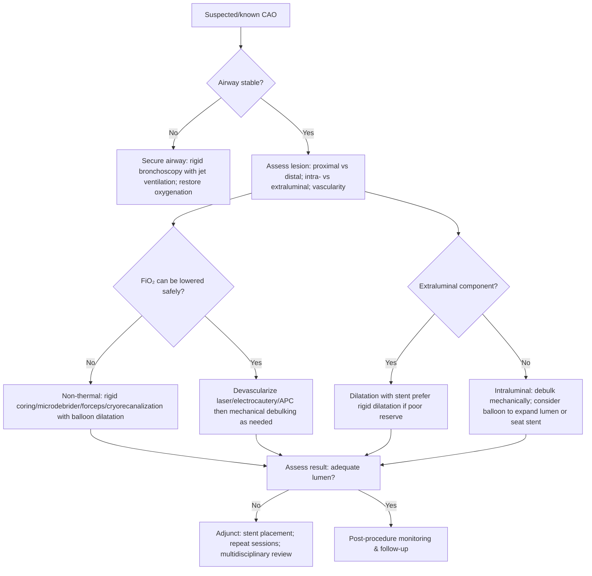
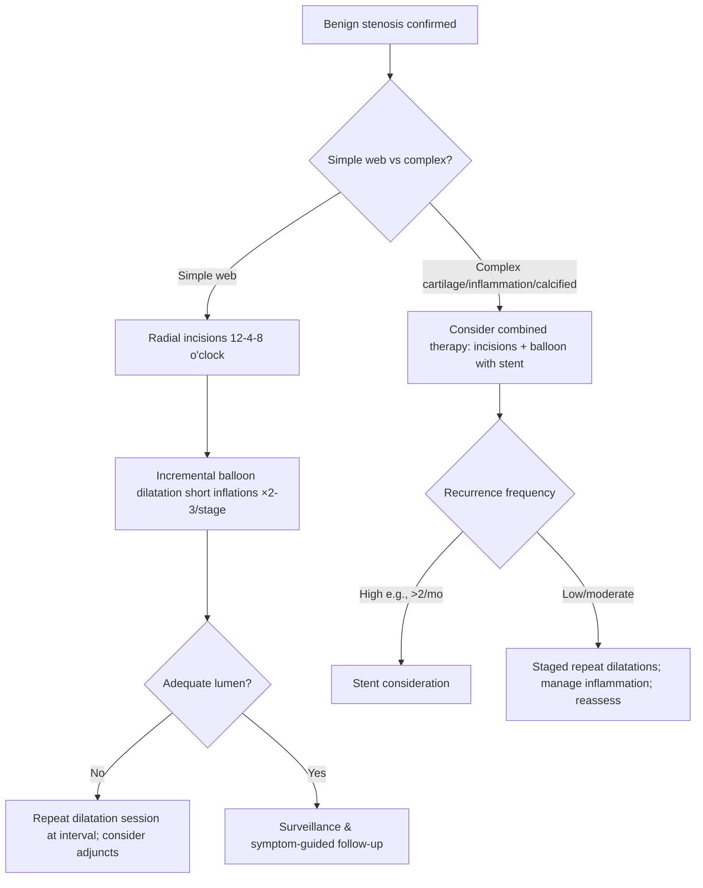

Mechanical Debridement and Balloon Dilitation

Target audience: IP fellows and practicing pulmonologists

Exam Mapping & Scope

This chapter covers the interventional bronchoscopy management of central airway obstruction (CAO) with a focus on non‑thermal mechanical modalities (rigid coring, rigid and flexible forceps, microdebrider, cryorecanalization) and airway balloon dilatation (bronchoplasty). Content maps to AABIP blueprint domains in therapeutic bronchoscopy for malignant and benign airway stenosis, peri‑procedural management, device selection, complication recognition/management, and post‑transplant airway complications.

Learning Objectives

By the end of this chapter, learners will be able to:

Select appropriate mechanical debridement and balloon dilatation strategies for malignant and benign CAO.

Prepare patients for safe, effective dilatation or mechanical debulking, including oxygenation/ventilation planning and anesthesia choice.

Execute step‑by‑step techniques for rigid coring, forceps debulking, microdebrider use, cryorecanalization, and balloon dilatation.

Anticipate, prevent, and manage complications such as airway laceration, bleeding, barotrauma, and pneumomediastinum.

Apply algorithms for CAO triage and benign stenosis management, including when to add radial incisions, stents, or repeat sessions.

Interpret outcome data to counsel patients on expected durability and the role of adjunct therapies, especially after lung transplantation.

High‑Yield One‑Pager

First priorities in CAO: airway control, oxygenation/ventilation, hemodynamics; then choose the safest effective debulking/dilation modality.

Mechanical tools work when FiO₂ is high. Use them when thermal devices are contraindicated due to fire risk.

Devascularize before you debulk—when feasible. Coagulate with laser/electrocautery before mechanical coring/forceps/microdebrider to reduce bleeding; exception: refractory hypoxemia or scenarios precluding thermal use.

Balloon vs rigid dilatation: balloons minimize longitudinal shearing and mucosal injury; rigid dilatation preserves ventilation and provides tactile feedback in low‑reserve patients.

Benign “simple” web stenosis: best results with radial incisions (e.g., 12‑4‑8 o’clock) followed by incremental balloon dilatation.

Complex stenosis (cartilage involvement/inflammation/calcified): less responsive to dilatation alone; plan for adjuncts/stenting.

Balloon timing: commonly 30-90 s inflations ×2-3 per stage (mechanical perspective) or ~1 min inflations repeated three times (bronchoplasty perspective); escalate diameter stepwise.

Positioning matters: center the noncompliant balloon with slight overlap on each side of the stenosis; keep the balloon entirely distal to the scope tip before inflation.

Watch through the balloon: gentle suction on the fluid‑filled balloon gives a 360° view to detect developing tears.

Communication saves airways: never confuse millimeters with atmospheres when instructing inflation targets.

Complications are usually self‑limited. Superficial lacerations are common and can correlate with longer patency in some benign stenoses; manage conservatively unless instability arises.

Transplant airway complications: repeated dilatations are common; consider stent if dilatations are required more than twice monthly.

Fluoroscopy rarely required for balloon dilatation; reserve for pediatric/small‑ETT scenarios or when bronchoscopic guidance is not feasible.

Microdebrider: rapid debulking plus continuous suction; powerful but unforgiving—strict visualization and respect for airway planes.

Cryorecanalization: fast, effective for loosely adherent, water‑rich tissue; not hemostatic and avoid near vascular invasion.

Avoid over‑instrumentation through a rigid scope during ventilation—risk of expiratory occlusion and barotrauma.

Outcome expectations: immediate symptom relief is common; repeated sessions often needed for durability in benign disease; malignant disease typically needs adjuncts/stenting.

Core Concepts
Pathophysiology / Epidemiology

Central airway stenosis arises from post‑intubation injury, surgical anastomoses (transplant, sleeve resection), infections (e.g., tuberculosis), inflammatory diseases (sarcoidosis, EGPA, relapsing polychondritis), malignancy, idiopathic etiologies, radiation, inhalational injury, and trauma. Patients often present with exertional dyspnea and focal monophonic wheeze and may be misdiagnosed with asthma until bronchoscopy confirms a discrete obstruction or stricture. Bronchoscopic visualization remains the gold standard for defining location, length, morphology (exophytic vs web vs circumferential), and etiology while permitting immediate therapy.

Indications & Contraindications

Indications

Symptomatic malignant or benign endoluminal obstruction causing dyspnea, wheeze, post‑obstructive infection, or failure to wean ventilation.

Benign focal “web‑like” stenosis amenable to dilatation ± radial incisions.

Malignant narrowing requiring temporary expansion to allow stent placement or passage of debulking tools.

Post‑transplant anastomotic stenosis.

Relative Contraindications / Caution

Poor visualization or inability to control the airway/ventilation.

Highly vascular tumors or lesions invading adjacent vasculature (cryorecanalization and aggressive dilation increase hemorrhage risk).

Complex benign strictures with cartilage involvement/inflammation/calcification—consider combined approaches or stenting.

Balloon inflation in patients who cannot tolerate brief occlusion; prefer rigid dilatation with continuous ventilation.

Distal procedures via small ETTs/little reserve—consider fluoroscopic wire‑guided techniques.

Pre‑procedure Evaluation

Airway plan: Determine need for LMA, endotracheal tube, or rigid bronchoscope. Rigid bronchoscopy is preferred for life‑threatening CAO, heavy bleeding risk, or when ventilation must be maintained throughout.

Oxygenation/ventilation: Assess ability to momentarily tolerate balloon occlusion; if not, use rigid dilatation or mechanical debulking while ventilating.

Imaging/physiology: Review CT (preferably with reconstruction) and flow‑volume loops; however, bronchoscopy directs real‑time decisions.

Sedation/anesthesia: Deep sedation or general anesthesia is typical; tracheal dilatation often requires GA due to distress from asphyxiation sensation during occlusion.

Consent/risk discussion: Bleeding, mucosal tears/laceration, pneumothorax, pneumomediastinum, mediastinitis, chest pain; need for repeat sessions or stent placement.

Adjunct preparedness: Thermal devices for devascularization (if FiO₂ allows), hemostatic agents (epinephrine, topical tranexamic acid, cold saline), Fogarty balloon or endobronchial blocker, stent kits, and suction.

Equipment & Setup

Balloons: High‑pressure, low‑compliance, nonconformal balloons sized to straddle the stenosis with modest overlap on both sides. Single‑ or multi‑diameter designs (diameter achieved by inflation pressure) connect to a manometer‑equipped inflation syringe filled with saline or diluted contrast when fluoroscopic guidance is used.

Rigid bronchoscope system: Ventilating tracheoscope and bronchoscopes (modular system preferred for serial dilatation), optical telescope(s), large‑bore suction.

Mechanical tools:

Rigid coring (beveled rigid scope tip) for exophytic lesions.

Rigid and flexible forceps (including large/jumbo forceps through therapeutic channels) for tissue extraction.

Microdebrider (4‑mm, ~45‑mm serrated, angulated “hockey‑stick” blade), console with suction/irrigation and 500-1200 rpm settings.

Cryoprobes (flexible, console‑driven; nitrous oxide or CO₂ coolant; ~−89°C tip).

Fogarty balloons for tamponade or retrograde compression/extraction in small/distal airways.

Step‑by‑Step Technique / Procedural Checklist

Balloon Dilatation (Bronchoplasty)

Airway & oxygenation: Secure airway (LMA/ETT/rigid) and pre‑oxygenate.

Lesion assessment: Define stenosis length, tightness, and morphology.

Balloon selection: Choose a balloon that centers across the stenosis with slight proximal/distal overlap; start slightly larger than the native lumen and escalate serially.

Positioning: Advance the deflated balloon beyond the scope tip into the stenosis; ensure the balloon is entirely out of the working channel before inflation.

Stabilization: Retract gently until the balloon contacts the scope tip for stability.

Inflation cycles: Inflate to target diameter for ~1 minute ×3 at a given size or 30-90 s ×2-3 per stage (institutional practice varies); interrupt early if desaturation occurs.

Visualization trick: Apply gentle suction to the fluid‑filled balloon to obtain a 360° view for mucosal tears; deflate immediately if deep laceration is suspected.

Escalation: If minimal resistance is encountered, progress to the next diameter.

Adjuncts: Use balloons to help seat stents, tamponade bleeding, or deliberately occlude an airway if needed transiently.

Exit: Deflate fully, withdraw, re‑inspect for tears/bleeding; consider stent if recoil or persistent malacia.

Rigid Dilatation

General anesthesia and rigid tracheoscopy.

Insert a large tracheoscope, detach base, then pass longer smaller‑diameter ventilating bronchoscopes serially using a gentle twisting (“apple‑coring”) motion through the stenosis while maintaining ventilation.

Monitor for barotrauma if jet ventilation is used; avoid occluding proximal ports with multiple instruments.

Radial Incisions (for Web Stenosis)

Using electrocautery knife or cutting laser, create three 1-2‑mm radial incisions at 12, 4, and 8 o’clock to create controlled tear points. Follow with incremental balloon dilatation.

Rigid Coring

Under direct telescope visualization, keep the bronchoscope parallel to the airway axis; corkscrew the beveled tip along the lesion-mucosa plane to detach exophytic tumors. Use in‑line large‑bore suction; tamponade the base for several minutes if bleeding.

Rigid & Flexible Forceps

Rigid: insert alongside telescope; grasp and remove tissue en bloc, moving telescope and forceps together.

Flexible: useful for debris removal and small/angulated segments; large/jumbo forceps through therapeutic channels can accelerate cleanup.

Microdebrider

Connect console and set 500-1200 rpm. Under constant visualization, bring the angulated tip in light contact; suction draws tissue into the port, which the rotating blade morselizes and aspirates. Minimal pressure; respect airway planes.

Cryorecanalization

Apply probe tip directly to tumor; freeze 3-6 s with gentle traction to avulse tissue en bloc (scope and probe removed together). Avoid wide freezing radii or contact with normal mucosa. Have non‑thermal hemostatic adjuncts ready; cryo is not hemostatic.

Troubleshooting & Intra‑procedure Management

Hypoxemia during balloon inflation: Shorten inflation to 20-30 s; pre‑oxygenate; use rigid dilatation to maintain ventilation; consider staged partial dilations.

Balloon migration: Ensure 0.5‑cm overlap proximal to stenosis; stabilize against the scope tip; avoid partial in‑channel inflation.

Developing mucosal tears: Use the 360° view; downsize/stop; most superficial tears heal conservatively.

Bleeding: Tamponade with rigid scope or balloon; instill cold saline, dilute epinephrine, or topical tranexamic acid; consider Fogarty occlusion or endobronchial blocker for distal bleeding.

Barotrauma risk: Pause ventilation during balloon inflations if tolerated; avoid simultaneous multiple instruments occluding expiratory ports.

Communication error (mm vs atm): Use closed‑loop communication for inflation targets.

Device fatigue: Multiple passes may weaken some balloon catheters; replace if reinsertion becomes difficult.

Post‑procedure Care & Follow‑up

Observe for chest pain, blood‑tinged sputum, subcutaneous emphysema, or respiratory distress; obtain imaging if pneumothorax/pneumomediastinum is suspected.

In benign stenosis, prepare for reassessment and possible repeat dilations; discuss long‑term plan (adjunct incisions, stent if repeated sessions).

After transplant or complex lesions, anticipate multiple sessions and earlier adjunctive stenting when recurrences are frequent.

Complications (Prevention, Recognition, Management)

Airway laceration: Common with dilatation; largely superficial; conservative management; paradoxically associated with longer patency in some benign strictures. Prevention: incremental sizing, visualization.

Bleeding: Reduce by devascularizing when feasible; treat with tamponade, topical agents, or thermal hemostasis (when FiO₂ permits).

Pneumothorax/Pneumomediastinum/Mediastinitis: Rare; recognize by chest pain/subcutaneous emphysema; treat per standard protocols.

Barotrauma/ventilatory compromise: Avoid occluding ports; pause ventilation during inflations if safe.

Negative‑pressure pulmonary edema: Reported with prolonged tracheal dilatations in spontaneously breathing patients; favor GA and controlled ventilation.

Perforation: Avoid excessive force or over‑inflation; stop when deep tearing suspected.

Special Populations

Lung transplant recipients: Balloon dilatation often provides transient benefit; many require serial sessions and about half may progress to stenting. Consider a stent when dilatations are needed more than twice per month.

Pediatrics/small ETTs: May require fluoroscopic wire‑guided balloons with diluted nonionic contrast; ensure contrast is adequately diluted to avoid bronchospasm if balloon ruptures.

Distal/angulated lesions: Flexible or jumbo forceps, cryorecanalization, or Fogarty‑assisted retrograde techniques can improve access.

Severe hypoxemia/high FiO₂: Favor non‑thermal mechanical approaches (rigid coring, microdebrider, cryorecanalization, balloon).

Evidence & Outcomes (Selected Data)

Benign stenosis: high initial success with balloon dilatation; durable control often requires repeated sessions (average several per patient). Some series show ~90% initial success in pediatric trachea with ~50% long‑term success; others report ~68% initial and ~56% long‑term success with repeat sessions. Diminishing returns are suggested beyond ~six sessions in non‑malignant central stenosis.

Malignant stenosis: balloon dilatation improves airway diameter in a majority with one procedure and facilitates stenting.

Physiology: immediate and 1‑month improvements in FEV₁ and FEV₁/FVC are reported after dilation.

Lacerations: approximately half of benign dilatations may result in some laceration; most superficial; deeper tears are rare and usually heal; longer patency has been associated with laceration in specific benign cohorts.

Transplant: adjunctive stenting after dilatation can improve symptoms, patency, FEV₁, and survival in selected series.

Diagnostic & Therapeutic Algorithms
Algorithm 1: Central Airway Obstruction—Tool Selection

Parallel bullet algorithm

Secure airway and oxygenation first; default to rigid bronchoscopy if unstable.

Characterize lesion (location, intra‑ vs extraluminal, vascularity).

If FiO₂ cannot be reduced, use non‑thermal modalities (mechanical tools ± balloon).

If FiO₂ can be reduced, devascularize, then debulk mechanically as needed.

Extraluminal compression → dilate ± stent; intraluminal obstruction → debulk ± balloon/stent.

Reassess; if inadequate lumen, add stent or schedule staged procedures.

Monitor for complications; plan follow‑up.

Algorithm 2: Benign Tracheobronchial Stenosis—Endoscopic Management

Parallel bullet algorithm

Confirm benign etiology and morphology.

Simple web: radial incisions → incremental balloon dilatation.

Complex: lower response to dilatation alone—use combined approaches; consider stent earlier.

Use short inflation cycles with stepwise up‑sizing; avoid over‑dilatation.

Limit numerous repeat sessions; if frequent recurrences, escalate to stenting.

Plan surveillance and symptom‑guided reassessment.

Tables & Quick‑Reference Boxes
Table 1. Mechanical Debridement Modalities—Roles, Strengths, Limitations

| Modality                       | Primary role                                                            | Key strengths                                                 | Limitations / cautions                                                        |
| ------------------------------ | ----------------------------------------------------------------------- | ------------------------------------------------------------- | ----------------------------------------------------------------------------- |
| Rigid coring                   | Rapid removal of exophytic tumors                                       | Immediate debulking, tamponade with scope, works at high FiO₂ | Risk of perforation/vascular injury; requires skill and direct visualization  |
| Rigid forceps                  | Tissue extraction, debulking                                            | Strong grasp, many jaw options                                | Mucosal tears in tight lumens; not hemostatic                                 |
| Flexible forceps (large/jumbo) | Debris removal, small/angulated segments                                | Maneuverable, adjunct to thermal                              | Small bites; bleeding with “cold” forceps; limited primary debulking role     |
| Microdebrider                  | Rapid debulking of long infiltrative tumors (trachea/mainstem)          | Continuous suction + cutting; fast                            | Not hemostatic; bulky/rigid; catastrophic injury if misused                   |
| Cryorecanalization             | En bloc removal of cryosensitive tissue when thermal is contraindicated | Works at high FiO₂; large fragments                           | Not hemostatic; avoid near vascular invasion/membranous wall                  |
| Balloon dilatation             | Expand stenosis; facilitate stenting                                    | Minimizes shearing; simple, quick                             | Occludes airway during inflation; laceration/perforation risk if over‑dilated |
| Abbreviations                  | FiO₂, fractional inspired oxygen                                        |                                                               |                                                                               |

Table 2. Balloon Bronchoplasty—Practical Parameters

| Parameter        | Practical point                                                                                         |
| ---------------- | ------------------------------------------------------------------------------------------------------- |
| Balloon design   | High‑pressure, low‑compliance, nonconformal; single‑ or multi‑diameter by pressure                      |
| Positioning      | Center across stenosis with slight overlap on both sides; entirely distal to scope tip before inflation |
| Inflation cycles | Commonly 30-90 s ×2-3 per stage or ~1 min ×3 per stage; interrupt if intolerance                        |
| Escalation       | Incremental up‑sizing; stop if deep laceration suspected                                                |
| Visualization    | Gentle suction on fluid‑filled balloon yields a 360° view to detect tears                               |
| Adjunct uses     | Tamponade bleeding; help seat stents; temporary occlusion                                               |
| Abbreviations    | s, seconds                                                                                              |

Table 3. Anticipated Complications and Management

| Complication                      | Prevention                                          | Recognition                   | Management                                                                                |
| --------------------------------- | --------------------------------------------------- | ----------------------------- | ----------------------------------------------------------------------------------------- |
| Airway laceration                 | Incremental sizing; visualize through balloon       | Sudden linear mucosal split   | Usually conservative; monitor; avoid further over‑dilatation                              |
| Bleeding                          | Devascularize when feasible; gentle technique       | Oozing vs brisk hemorrhage    | Tamponade (scope/balloon), cold saline, dilute epinephrine, topical TXA; blockers/Fogarty |
| Pneumothorax/mediastinum          | Avoid over‑dilatation; respect planes               | Chest pain, emphysema         | Imaging, oxygen, chest drainage if indicated                                              |
| Barotrauma/air‑trapping           | Avoid occluding expiratory ports; pause ventilation | Rising pressures, hypoxia     | Remove instruments, vent; treat barotrauma                                                |
| Negative‑pressure pulmonary edema | Avoid prolonged occlusion in spontaneous breathing  | Acute hypoxemia post‑dilation | Supportive care; consider GA for future sessions                                          |
| Abbreviations                     | TXA, tranexamic acid; GA, general anesthesia        |                               |                                                                                           |

Table 4. Indications and Expected Durability—Balloon Dilatation

| Scenario                             | Expected effect                                | Notes                                                                                      |
| ------------------------------------ | ---------------------------------------------- | ------------------------------------------------------------------------------------------ |
| Malignant intraluminal narrowing     | Immediate relief; often bridge to stent        | Improves diameter in a majority with one procedure                                         |
| Benign web stenosis                  | Good initial response; repeat sessions common  | Combine with radial incisions; diminishing benefit beyond multiple sessions in some series |
| Complex benign stenosis              | Variable; often transient                      | Consider adjuncts and earlier stenting                                                     |
| Post‑transplant anastomotic stenosis | Transient relief; repeated procedures frequent | Stenting improves outcomes in selected patients                                            |
| Abbreviations                        | —                                              |                                                                                            |

Imaging & Figure Callouts (Placeholders)

Figure 1. Tracheal stenosis before and after balloon dilatation. Neutral endoscopic images showing near-occlusive web pre‑dilatation and widely patent lumen post‑dilatation.

Figure 2. Balloon visualization technique. Endoscopic view through a fluid‑filled balloon demonstrating mucosal microtears during inflation.

Figure 3. Microdebrider debulking sequence. Serial images showing approach, suction capture, and cleared airway.

Cases & Applied Learning

Case 1
A 62‑year‑old with squamous cell carcinoma presents with near‑critical tracheal obstruction and FiO₂ 0.9 on arrival. Attempts to lower FiO₂ provoke desaturation.
What is the best immediate strategy?
A. Argon plasma coagulation followed by balloon dilatation
B. Rigid coring with the beveled tip under GA with suction ready
C. CO₂ laser radial incisions followed by rigid bougie dilatation
D. Cryorecanalization followed by APC
E. Wire‑guided balloon dilatation under fluoroscopy
Answer: B. Explanation: High FiO₂ precludes thermal tools due to fire risk. Rigid coring under GA enables rapid airway recanalization with tamponade and suction.

Case 2
A 34‑year‑old with a short, web‑like post‑intubation subglottic stenosis is scheduled for endoscopic therapy.
Which sequence minimizes uncontrolled mucosal tearing?
A. Balloon dilatation alone with largest balloon first
B. Microdebrider debulking then balloon
C. Radial incisions (12‑4‑8 o’clock) followed by incremental balloon dilatation
D. Cryorecanalization followed by stent
E. Rigid bougie dilatation alone
Answer: C. Explanation: Controlled radial incisions reduce longitudinal shearing and scarring; incremental ballooning follows.

Case 3
A 58‑year‑old lung transplant recipient has recurrent anastomotic stenosis requiring three dilatations in the past month.
Next best step?
A. Schedule monthly balloon dilatation indefinitely
B. Place a stent
C. Switch to microdebrider
D. Attempt laser resection only
E. No further intervention; observe
Answer: B. Explanation: Frequent recurrences (e.g., &gt;2 per month) support stent consideration in post‑transplant stenosis.

Question Bank (MCQs)

A patient with CAO on 100% FiO₂ requires urgent debulking. Which modality is most appropriate initially?
A. APC
B. Nd:YAG laser
C. Cryorecanalization
D. Electrocautery snare
E. Photodynamic therapy
Answer: C. Non‑thermal and effective at high FiO₂; however, not hemostatic—prepare adjuncts.

During balloon dilatation, the endoscopist instructs the technician to “inflate to 12.” The technician interprets this as 12 atm instead of 12 mm target diameter. What complication is most likely?
A. Hypotension
B. Perforation/laceration from over‑inflation
C. Stent migration
D. CO₂ embolism
E. Anaphylaxis
Answer: B. Closed‑loop communication avoids confusion between pressure and diameter.

The best way to monitor for impending mucosal tears during balloon inflation is to:
A. Inject methylene blue into the balloon
B. Apply suction to the fluid‑filled balloon to see through it
C. Use jet ventilation at higher rates
D. Place the balloon partly inside the working channel
E. Use air to inflate the balloon
Answer: B. Suction creates a 360° view through the balloon for real‑time monitoring.

Which statement about rigid dilatation is true?
A. It invariably causes more mucosal shearing than balloons
B. It cannot be performed under GA
C. It allows maintenance of ventilation during dilatation
D. It requires fluoroscopy
E. It is preferred for distal lobar stenoses in children
Answer: C. Rigid dilatation enables continuous ventilation—useful in low‑reserve patients.

For benign simple web stenosis, the technique most associated with minimizing uncontrolled tears is:
A. Large single‑stage balloon inflation
B. Microdebrider alone
C. Radial incisions plus stepwise ballooning
D. Cryorecanalization alone
E. Rigid coring alone
Answer: C.

A patient develops blood‑tinged sputum and chest pain after balloon dilatation; vitals stable. Best management?
A. Immediate thoracotomy
B. Place a covered stent emergently
C. Conservative observation and reassessment
D. Bronchial artery embolization
E. Systemic thrombolysis
Answer: C. Most superficial lacerations are self‑limited and heal conservatively.

Which is true regarding cryorecanalization?
A. It is hemostatic and ideal for vascular tumors
B. It should avoid contact with normal mucosa; freeze cycles are short (3-6 s)
C. It requires general anesthesia in all cases
D. It is ineffective in high FiO₂ environments
E. It should always follow laser devascularization
Answer: B. Short freezes; not hemostatic; works when FiO₂ is high; devascularization reduces cryoadhesion.

After debulking a long, infiltrative tracheal tumor, the best tool to rapidly clear residual tissue while maintaining visualization is the:
A. Microdebrider
B. Cold flexible forceps
C. Electrocautery snare
D. APC probe
E. Balloon
Answer: A. Microdebrider provides continuous suction with cutting.

In malignant obstruction, balloon dilatation is most often used to:
A. Replace all debulking methods
B. Achieve permanent cure
C. Temporize and facilitate stent implantation or tool passage
D. Treat vascular invasion
E. Replace radiation therapy
Answer: C.

Which scenario favors wire‑guided balloon dilatation under fluoroscopy?
A. Adult tracheal stenosis with a 12‑mm rigid scope in place
B. Pediatric patient with small ETT that cannot accommodate a therapeutic bronchoscope
C. Mainstem tumor with active bleeding
D. Posterior membranous tracheal laceration
E. Diffuse tracheomalacia
Answer: B.

A spontaneously breathing patient undergoes prolonged tracheal balloon inflations. Post‑procedure, they develop pink frothy sputum and hypoxemia. Most likely mechanism?
A. CO₂ retention
B. Negative‑pressure pulmonary edema
C. Pulmonary embolism
D. TRALI
E. Pneumonia
Answer: B.

In post‑transplant anastomotic stenosis, which statement is most accurate?
A. Balloon dilatation is rarely needed
B. Stenting may improve symptoms, airway patency, FEV₁, and survival in selected patients
C. Stents should never be used
D. Dilatation should be repeated &gt;6 times routinely
E. Thermal therapy is contraindicated
Answer: B.

Controversies, Variability, and Evolving Evidence

Optimal inflation time/number of cycles varies across practices (30-90 s vs ~1 min; two to three cycles vs three × 1‑min inflations). No clear superiority has been established; decisions are individualized to patient tolerance and stenosis characteristics.

Number of repeat sessions for benign disease is debated; some data suggest diminishing benefit beyond approximately six sessions, but patient‑ and etiology‑specific factors matter.

Laceration as a positive prognostic marker for benign stenosis patency has been observed in specific cohorts; generalizability across etiologies is uncertain.

Cutting balloons may reduce uncontrolled tears in tight long segments or in pediatric cases but risk scope damage and often require fluoroscopy; their role is niche and evolving.

Stent thresholds after transplant vary by center; frequency of recurrence and local expertise influence timing and device choice.

Take‑Home Checklist

Confirm airway stability; secure rigid access early for unstable CAO.

Choose non‑thermal tools when FiO₂ is high; devascularize before mechanical when feasible.

For simple webs: radial incisions → incremental balloon dilatation.

For complex stenosis: plan combined therapy and earlier stenting if recurrences are frequent.

Balloon: center it, keep out of the scope channel, use short staged inflations, watch for tears through the balloon.

Maintain ventilation during rigid dilatation; pause ventilation during balloon inflations when safe.

Use closed‑loop communication for balloon targets (mm vs atm).

Prepare hemostasis toolkit (tamponade, cold saline, dilute epinephrine, topical TXA, Fogarty/blocker).

Microdebrider: light touch, continuous visualization, respect planes.

Cryorecanalization: short freezes (3-6 s), avoid vascular invasion, remember it is not hemostatic.

Transplant stenosis: anticipate repeat sessions; stent when dilatations are frequent (e.g., &gt;2 per month).

Plan surveillance and functional reassessment (symptoms, spirometry) post‑procedure.

Abbreviations & Glossary

APC: Argon plasma coagulation

CAO: Central airway obstruction

FiO₂: Fraction of inspired oxygen

GA: General anesthesia

LMA: Laryngeal mask airway

Microdebrider: Powered rotational cutting device with suction for tissue morselization

Nonconformal balloon: High‑pressure/low‑compliance balloon that expands to a specified diameter without molding to irregular stenosis

Radial incisions: Short, controlled cuts in web stenosis (commonly at 12, 4, and 8 o’clock) before dilatation

TXA: Tranexamic acid

References (AMA Style)

Mayse ML, Greenheck J, Friedman M, Kovitz KL. Successful bronchoscopic balloon dilation of nonmalignant tracheobronchial obstruction without fluoroscopy. Chest. 2004;126(2):634‑637.

Sheski FD, Mathur PN. Long‑term results of fiberoptic bronchoscopic balloon dilation in the management of benign tracheobronchial stenosis. Chest. 1998;114(3):796‑800.

Hebra A, Powell DD, Smith CD, Othersen HB. Balloon tracheoplasty in children: results of a 15‑year experience. J Pediatr Surg. 1991;26(8):957‑961.

Ferretti G, Jouvan FB, Thony F, Pison C, Coulomb M. Benign noninflammatory bronchial stenosis: treatment with balloon dilation. Radiology. 1995;196(3):831‑834.

Liang W, Hu P, Guo W, et al. Appropriate treatment sessions of bronchoscopic balloon dilation for patients with nonmalignant central airway stenosis. Ther Adv Respir Dis. 2019;13:1‑13.

Hautmann H, Gamarra F, Pfeifer KJ, Huber RM. Fiberoptic bronchoscopic balloon dilation in malignant tracheobronchial disease: indications and results. Chest. 2001;120(1):43‑49.

Shitrit D, Kuchuk M, Zismanov V, Abdel Rhman N, Amital A, Kramer MR. Bronchoscopic balloon dilatation of tracheobronchial stenosis: long‑term follow‑up. Eur J Cardiothorac Surg. 2010;38(2):198‑202.

Kim JH, Shin JH, Song HY, et al. Tracheobronchial laceration after balloon dilation for benign strictures: incidence and clinical significance. Chest. 2007;131(4):1114‑1117.

Abi‑Jaoudeh N, Francois RJ, Oliva VL, et al. Endobronchial dilation for the management of bronchial stenosis in patients after lung transplantation: effect of stent placement on survival. J Vasc Interv Radiol. 2009;20(7):912‑920.

De Gracia J, Culebras M, Alvarez A, et al. Bronchoscopic balloon dilation in the management of bronchial stenosis following lung transplantation. Respir Med. 2007;101(1):27‑33.

Crespo MM, McCarhy DP, Hopkins PM, et al. ISHLT Consensus Statement on adult and pediatric airway complications after lung transplantation: definitions, grading system, and therapeutics. J Heart Lung Transplant. 2018;37:548‑563.

McArdle JR, Gildea TR, Mehta AC. Balloon bronchoplasty: its indications, benefits, and complications. J Bronchol Interv Pulmonol. 2005;12(2):123‑127.

Liberman M. Bronchoscopic evaluation of the trachea and dilation of the trachea. Semin Thorac Cardiovasc Surg. 2009;21(3):255‑262.

Shapshay SM, Beamis JF Jr, Hybels RL, Bohigian RK. Endoscopic treatment of subglottic and tracheal stenosis by radial laser incision and dilation. Ann Otol Rhinol Laryngol. 1987;96(6):661‑664.

Tremblay A, Coulter TD, Mehta AC. Modification of a mucosal‑sparing technique using electrocautery and balloon dilatation in the endoscopic management of web‑like benign airway stenosis. J Bronchol. 2003;10(4):268‑271.

Kim JH, Shin JH, Song H‑Y. Cutting balloon treatment for resistant benign bronchial strictures: report of eleven patients. J Vasc Interv Radiol. 2010;21(5):748‑752.

Sakata KK, Midthun DE. Cutting balloon dilation for central airway stricture. J Bronchol Interv Pulmonol. 2018;25(3):e29‑e30.

Stephens KE Jr, Wood DE. Bronchoscopic management of central airway obstruction. J Thorac Cardiovasc Surg. 2000;119(2):289‑296.

Casal RF, Iribarren J, Eapen G, et al. Safety and effectiveness of microdebrider bronchoscopy for the management of central airway obstruction. Respirology. 2013;18(6):1011‑1015.

Hetzel M, Hetzel J, Schumann C, Marx N, Babiak A. Cryorecanalization: a new approach for the immediate management of acute airway obstruction. J Thorac Cardiovasc Surg. 2004;127(5):1427‑1431.

Schumann C, Hetzel M, Babiak AJ, et al. Endobronchial tumor debulking with a flexible cryoprobe for immediate treatment of malignant stenosis. J Thorac Cardiovasc Surg. 2010;139(4):997‑1000.

Yılmaz A, Aktaş Z, Alici IO, Çağlar A, Sazak H, Ulus F. Cryorecanalization: keys to success. Surg Endosc. 2012;26(10):2969‑2974.

Morales‑Estrella JL, Machuzak M, Pichurko B, Inaty H, Mehta AC. Suffocation from balloon bronchoplasty. J Bronchol Interv Pulmonol. 2018;25(2):156‑160.

Kim YH, Sung DJ, Cho SB, et al. Deep tracheal laceration after balloon dilation for benign tracheobronchial stenosis: case reports of two patients. Br J Radiol. 2006;79(942):529‑535.

Alraiyes AH, Kumar A, Gildea TR. Peering beyond an occluded airway. Ann Am Thorac Soc. 2015;12(1):124‑127.
