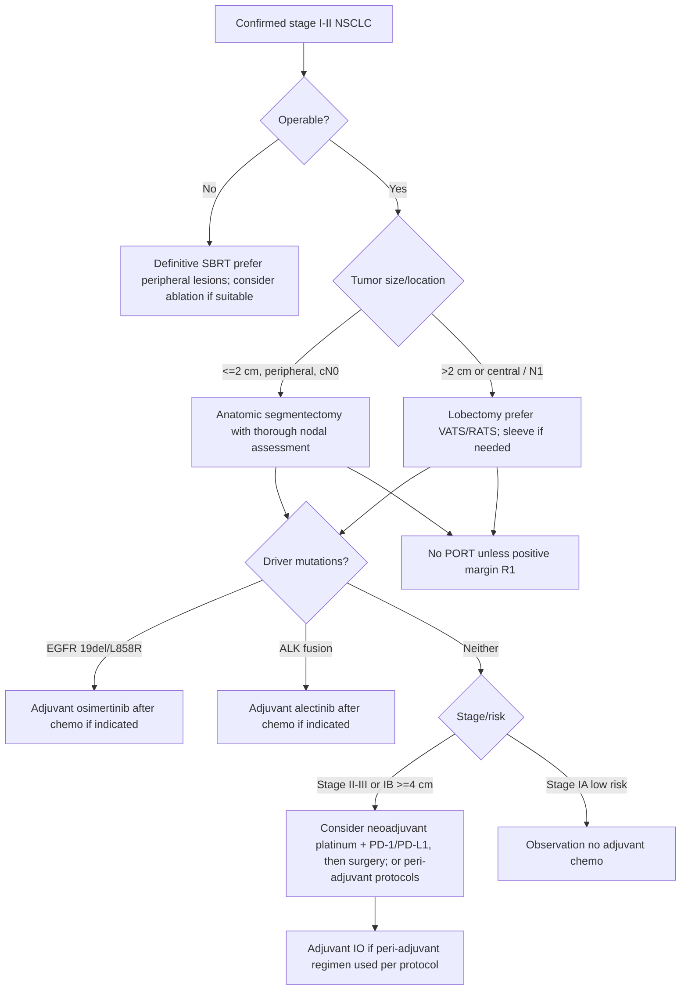
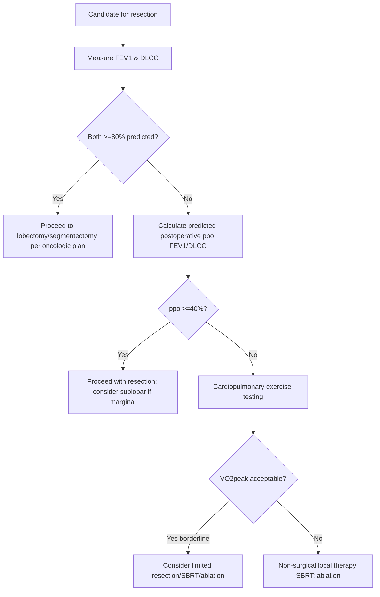

reatment Options for Early‑Stage Lung Cancer

Target audience: IP fellows and practicing pulmonologists

Exam Mapping & Scope

This chapter covers the contemporary management of resectable and medically inoperable stage I-II non-small cell lung cancer (NSCLC), aligned to AABIP board domains: (1) patient selection and pre‑operative evaluation; (2) surgical options (lobectomy, segmentectomy, wedge; minimally invasive approaches; nodal assessment); (3) stereotactic body radiation therapy (SBRT); (4) perioperative systemic therapy (neoadjuvant, adjuvant, peri‑adjuvant immunotherapy; adjuvant targeted therapy); (5) image‑guided ablation; (6) complications and surveillance.

Learning Objectives

By the end of this chapter, learners will be able to:

Select surgery, SBRT, or ablation for stage I-II NSCLC based on tumor and patient factors.

Apply physiologic algorithms (FEV₁/DLCO and predicted postoperative values) to determine operability and the need for additional testing.

Choose between lobectomy and sublobar resection for small peripheral tumors and describe nodal staging strategies.

Integrate perioperative immunotherapy and adjuvant targeted therapy in appropriate molecularly defined subgroups.

Anticipate, prevent, and manage key complications of surgery, SBRT, and thermal ablation.

Construct surveillance plans after definitive local therapy and recognize patterns of failure and salvage options.

High‑Yield One‑Pager (Pearls, Pitfalls, Traps)

Staging drives therapy. Stage I-II NSCLC is potentially curable; ensure accurate mediastinal assessment before definitive treatment.

Operability is two‑part: (1) oncologic resectability; (2) physiologic candidacy by FEV₁/DLCO and predicted postoperative values; borderline results trigger exercise testing.

Surgery is standard for operable patients. Lobectomy remains default; segmentectomy is acceptable for carefully selected &lt;=2 cm peripheral cT1N0 lesions with thorough nodal assessment.

More central tumors: consider sleeve resection to avoid pneumonectomy when feasible.

Nodal management: at least lobe‑specific systematic sampling; routine complete mediastinal dissection has not consistently improved OS when prior sampling is negative.

SBRT is preferred definitive therapy for medically inoperable peripheral stage I tumors; excellent local control; pneumonitis risk rises with central lesions.

PORT (postoperative radiation): not indicated after complete (R0) resection of stage I-II; indicated for positive margins (R1).

Perioperative immunotherapy: Neoadjuvant chemo‑IO improves event‑free survival and pathologic complete response (pCR); peri‑adjuvant (neo + adjuvant) strategies further improve EFS in resectable stage II-III patients without targetable drivers.

Adjuvant IO after chemo benefits resected stage II-IIIA (PD‑L1-enriched benefit varies by regimen).

Targeted adjuvant therapy: Osimertinib (EGFR 19del/L858R) and alectinib (ALK) improve DFS after resection.

Ablation (RFA/MWA/cryo): option for high‑risk or oligometastatic settings; cryo favored near critical structures; pneumothorax is common and manageable.

Elderly/frail patients: sublobar resection or SBRT are reasonable; decisions individualized.

Common traps: overtreating indolent ground‑glass lesions, under‑staging mediastinum, giving PORT after R0 stage I-II, and missing EGFR/ALK testing before committing to immunotherapy plans.

Core Concepts
Pathophysiology / Epidemiology

Early‑stage NSCLC comprises about one‑third of new NSCLC, largely adenocarcinoma and squamous subtypes. Five‑year survival declines with stage; accurate TNM staging (current IASLC/AJCC edition) is essential for selecting curative modalities.

Indications & Contraindications

Surgery: Operable cT1-2N0-1 disease; contraindications include prohibitive cardiopulmonary risk or diffuse metastatic disease.

SBRT: Medically inoperable or surgery‑declining patients with peripheral lesions; caution for central tumors.

Ablation: High surgical risk, prior high‑dose RT field, or oligometastatic/oligoprogressive settings when complete local control of all sites is feasible.

Perioperative systemic therapy:

Neoadjuvant chemo‑IO: Resectable stage II-III (and select IB &gt;=4 cm) without EGFR/ALK alterations.

Adjuvant IO: Resected stage II-IIIA (PD‑L1‑dependent benefit varies).

Adjuvant targeted: EGFR 19del/L858R (osimertinib), ALK (alectinib).

PORT: R1 resections; not for routine R0 stage I-II.

Pre‑procedure Evaluation (Imaging, Labs, Risk, Consent)

Imaging: Thin‑slice CT chest; PET‑CT for staging; consider brain MRI in &gt;=stage II.

Mediastinal evaluation: EBUS‑TBNA for suspicious nodes or tumors &gt;3 cm/central; surgical staging as needed.

Pulmonary physiology: Obtain FEV₁ and DLCO in all surgical candidates. If either &lt;80% predicted, calculate predicted postoperative (ppo) FEV₁/DLCO using segment counting or split‑function perfusion; borderline results prompt cardiopulmonary exercise testing (CPET).

Antithrombotics: Follow institutional bridging for neuraxial anesthesia and VATS; coordinate with cardiology for stents.

Consent: Include risks specific to chosen modality (air leak, atrial arrhythmia, pneumonitis, pneumothorax, BPF, hemoptysis).

Equipment & Setup

Surgery: VATS or RATS platforms with endoscopic staplers, energy devices; availability for sleeve resection; mediastinal nodal instruments.

SBRT: Immobilization devices, 4D‑CT simulation, image guidance (cone‑beam); motion management (breath‑hold, gating).

Ablation:

RFA: Single/cluster electrodes (2-5 cm ablation zones), temperature monitoring; saline infusion or cooled tips for larger lesions.

MWA: 900-2500 MHz antennas; allows larger, faster ablations; multiple antennas for &gt;=3 cm.

Cryoablation: Multiple cryoprobes spaced &lt;=2 cm, typical triple‑freeze cycles; clear ice‑ball visualization; general anesthesia recommended for central lesions to ensure airway control.

Step‑by‑Step Technique / Procedural Checklist

Lobectomy/Segmentectomy (VATS/RATS)

Confirm side, stage, and plan; ensure complete pre‑op nodal workup.

Port placement; adhesiolysis.

Fissure‑last or fissure‑first strategy per anatomy; isolate vein, artery, bronchus.

Parenchymal division with staplers; oncologic margins confirmed.

Nodal assessment: Hilar and mediastinal (lobe‑specific systematic); submit for pathology.

Air‑leak test; hemostasis; chest tube placement.

SBRT

Simulation (4D‑CT); define ITV/PTV with motion margins.

Dose/fractionation per site, size, and proximity to OARs; verify constraints.

Daily image guidance; manage cough and respiration.

Post‑therapy toxicities counseling (cough, fatigue, radiation pneumonitis).

Percutaneous Ablation

Planning CT, trajectory avoiding bullae and vessels; consent includes pneumothorax risk.

Analgesia: moderate sedation for peripheral lesions; general anesthesia for central/bleeding risk; consider double‑lumen ventilation for airway protection.

Device placement:

RFA/MWA: position electrode/antenna centrally first, then peripheral passes for coverage.

Cryo: position multiple probes; perform freeze‑thaw cycles; monitor ice‑ball margins (&gt;=5-10 mm beyond tumor).

Post‑ablation CT; track cautery if needed; observe for pneumothorax; plan chest tube if symptomatic or large.

Troubleshooting & Intra‑procedure Management

Dense hilar fibrosis (post‑neoadjuvant IO): Convert to thoracotomy early; obtain proximal control; be prepared for sleeve reconstruction.

Persistent air leak: Buttress staple lines; pleural tent; consider autologous blood patch post‑op.

SBRT motion: Escalate motion control (gating/abdominal compression); re‑plan if motion &gt;1 cm.

Ablation near critical structures: Prefer cryo; use intentional small pneumothorax/hydrodissection to displace OARs; watch for hemoptysis.

Post‑procedure Care & Follow‑up

Surgery: Early ambulation, pulmonary hygiene; remove chest tube when no air leak and acceptable drainage; pathology‑driven adjuvant decisions.

SBRT/Ablation: Short‑term imaging for pneumonitis or inflammatory change; serial CT at 3, 6, 12 months, then per surveillance schedule.

Surveillance (after curative therapy): History/physical and chest CT every 6 months for 2 years, then annually; counsel smoking cessation.

Complications (Prevention, Recognition, Management)

Surgery: Prolonged air leak, pneumonia, atrial arrhythmias, VTE; mitigate via enhanced recovery, pain control, early mobilization.

SBRT: Fatigue, dermatitis, esophagitis (central lesions), radiation pneumonitis—treat with corticosteroids and supportive care.

Ablation: Pneumothorax (frequent; drain if symptomatic/large), perilesional hemorrhage, bronchopleural fistula (lower with cryo than heat‑based), hemoptysis, rare systemic air embolism, pulmonary artery pseudoaneurysm (urgent IR/surgical management).

Special Populations

Severe COPD/poor reserve: Prefer SBRT or sublobar resection; ablation for select lesions.

Elderly/frail: Individualize; segmentectomy/SBRT often appropriate with comparable disease control for small peripherally located tumors.

Driver‑positive tumors (EGFR/ALK): Favor adjuvant targeted therapy after resection; perioperative immunotherapy is generally avoided in these subgroups.

Anticoagulation/antiplatelet therapy: Coordinate per procedure; manage bleeding risk for ablation and neuraxial anesthesia.

Evidence & Outcomes (Key Trials/Effects)

Surgery vs sublobar: Contemporary randomized data support segmentectomy equivalence to lobectomy for &lt;=2 cm peripheral cT1N0 lesions, with small increases in locoregional relapse but preserved lung function.

SBRT: Phase II/III data show ~90% local control for small peripheral tumors; improved quality of life versus conventional RT; pooled randomized data suggest comparable OS to surgery in selected operable patients but limited by small accrual.

Neoadjuvant chemo‑immunotherapy (CheckMate 816): Improved event‑free survival and pCR (~24% vs ~2%), without excess surgical morbidity; peri‑adjuvant strategies (KEYNOTE‑671, AEGEAN, CheckMate 77T) further increase EFS and pCR.

Adjuvant immunotherapy (IMpower010, PEARLS/KEYNOTE‑091): DFS benefit after platinum‑based chemotherapy; magnitude varies by PD‑L1 and regimen.

Adjuvant targeted therapy: Osimertinib (EGFR 19del/L858R) and alectinib (ALK) demonstrate substantial DFS benefits in resected stage IB-IIIA disease.

Diagnostic & Therapeutic Algorithms
Algorithm 1 — Resectable Early‑Stage NSCLC (Therapy Selection)

Parallel bullets (Algorithm 1)

Confirm stage with CT/PET; evaluate mediastinum.

If inoperable: SBRT is preferred; use ablation selectively.

Segmentectomy for carefully selected &lt;=2 cm peripheral cT1N0 after intraoperative nodal confirmation.

Lobectomy for larger/central tumors or when N1 found; sleeve rather than pneumonectomy when feasible.

Perioperative systemic therapy:

Neoadjuvant chemo‑IO for stage II-III (and some IB &gt;=4 cm) without EGFR/ALK.

Adjuvant IO after chemo for resected stage II-IIIA (PD‑L1‑dependent by regimen).

Targeted adjuvant in EGFR/ALK‑positive disease.

PORT reserved for positive margins.

Algorithm 2 — Physiologic Operability for Lung Resection

Parallel bullets (Algorithm 2)

Obtain FEV₁ & DLCO in all; if either &lt;80%, compute ppo (segment counting or perfusion).

ppo &gt;=40% generally acceptable; ppo &lt;40% triggers CPET.

Favor segmentectomy/SBRT/ablation when borderline; prioritize quality of life and pulmonary preservation.

Tables & Quick‑Reference Boxes

Table 1. Choosing the Surgical Approach in Early‑Stage NSCLC

| Clinical Setting                   | Preferred Procedure | Key Requirements                                                | Notes                                                                                                |
| ---------------------------------- | ------------------- | --------------------------------------------------------------- | ---------------------------------------------------------------------------------------------------- |
| &lt;=2 cm, peripheral, cT1N0       | Segmentectomy       | Frozen‑section confirmation of N0; lobe‑specific nodal sampling | Similar survival to lobectomy in modern RCTs; slightly higher loco‑regional relapse; preserves lung. |
| &gt;2 cm or central; N1 identified | Lobectomy           | Systematic lobe‑specific nodal assessment                       | Sleeve resection preferred over pneumonectomy when feasible.                                         |
| Frail/limited reserve              | Sublobar or SBRT    | Individualized; discuss trade‑offs                              | Comparable disease control for select small lesions with functional gains.                           |

Abbreviations: cT, clinical tumor; N, nodes; RCT, randomized controlled trial; SBRT, stereotactic body radiation therapy.

Table 2. Perioperative Systemic Therapy—Board‑Style Summary

| Strategy                                                                          | Eligible Stages                                                   | Backbone                                | Key Outcomes (directionality)                                                 |
| --------------------------------------------------------------------------------- | ----------------------------------------------------------------- | --------------------------------------- | ----------------------------------------------------------------------------- |
| Neoadjuvant chemo‑IO (e.g., nivolumab + platinum doublet)                         | Resectable IB (&gt;=4 cm)-IIIA (no EGFR/ALK)                      | 3-4 cycles platinum doublet + anti-PD‑1 | ↑ pCR (~five‑ to ten‑fold vs chemo alone); ↑ EFS; acceptable surgical safety. |
| Peri‑adjuvant regimens (e.g., pembrolizumab or durvalumab with neo + adjuvant IO) | Resectable stage II-III (no EGFR/ALK)                             | Neo chemo‑IO → surgery → 1 yr IO        | Further ↑ EFS vs neo alone; pCR ~17-25%.                                      |
| Adjuvant IO after chemo (e.g., atezolizumab; pembrolizumab)                       | Resected IB-IIIA (benefit enriched in II-IIIA; variable by PD‑L1) | 1 yr IO after standard chemo            | ↑ DFS in ITT or PD‑L1‑selected cohorts; OS maturing.                          |
| Adjuvant targeted (osimertinib; alectinib)                                        | Resected IB-IIIA EGFR 19del/L858R; ALK+                           | 2-3 yr TKI after surgery with chemo     | Marked ↑ DFS; CNS protection with EGFR‑TKI.                                   |

Abbreviations: IO, immunotherapy; EFS, event‑free survival; pCR, pathologic complete response; ITT, intention‑to‑treat; TKI, tyrosine kinase inhibitor.

Table 3. Surgery vs SBRT vs Ablation—At‑a‑Glance

| Feature         | Surgery                                            | SBRT                                                 | Ablation (RFA/MWA/Cryo)                                                      |
| --------------- | -------------------------------------------------- | ---------------------------------------------------- | ---------------------------------------------------------------------------- |
| Ideal candidate | Operable stage I-II                                | Medically inoperable peripheral stage I              | High‑risk patients, prior RT field, oligometastatic/oligoprogressive disease |
| Local control   | Excellent; depends on margins & nodal status       | ~90-95% for small peripheral tumors                  | Good for &lt;=3 cm; cryo favored near critical structures                    |
| Morbidity       | Procedural risks (air leak, pneumonia, arrhythmia) | Low acute; risk of pneumonitis/esophagitis (central) | Pneumothorax common; hemorrhage; BPF (lower with cryo)                       |
| Recovery        | Longer initial recovery; durable                   | Outpatient/short course (1-5 fractions)              | Outpatient; rapid recovery                                                   |
| Role in drivers | Enables path staging & tissue for molecular tests  | No                                                   | Can pair with biopsy at time of ablation                                     |

Abbreviations: RFA, radiofrequency ablation; MWA, microwave ablation; Cryo, cryoablation; BPF, bronchopleural fistula.

Table 4. Thermal Ablation—Technique Pearls

| Modality | Best Uses                        | Technical Tips                                                     | Caveats                                                  |
| -------- | -------------------------------- | ------------------------------------------------------------------ | -------------------------------------------------------- |
| RFA      | &lt;=3 cm lesions                | Central → peripheral overlapping ablations; cooled tips            | Heat‑sink near vessels can limit efficacy                |
| MWA      | 3-5 cm lesions; need larger zone | Multiple antennas; shorter time; less impacted by charring         | Greater collateral heat; device variability              |
| Cryo     | Lesions near airway/vessels      | Multiple probes &lt;=2 cm apart; triple‑freeze; visualize ice‑ball | Longer procedure; general anesthesia for central targets |

Abbreviations: RFA, radiofrequency ablation; MWA, microwave ablation.

Imaging & Figure Callouts (Placeholders)

Figure 1. Pre‑operative CT of a 1.6 cm peripheral RUL nodule with no nodal enlargement. Alt text: Axial CT showing small subpleural solid nodule suitable for segmentectomy or SBRT.

Figure 2. SBRT planning isodose lines for a peripheral lower‑lobe tumor. Alt text: 3D conformal dose distribution around ITV/PTV with lung sparing.

Figure 3. CT‑guided cryoablation—ice‑ball encapsulating a medial lower‑lobe lesion. Alt text: Low‑attenuation ice‑ball encompassing lesion with safe margins from bronchus intermedius.

Cases & Applied Learning

Case 1 (Next Best Step).
A 68‑year‑old with 35‑pack‑years has a 1.8 cm peripheral LLL adenocarcinoma (cT1bN0), FEV₁ 82%, DLCO 78%, PET‑negative mediastinum. EGFR/ALK negative.
A. SBRT
B. Wedge resection
C. Anatomic segmentectomy with lobe‑specific nodal sampling
D. Lobectomy
E. Neoadjuvant chemo‑IO then surgery
Answer: C. For &lt;=2 cm peripheral cT1N0 with adequate reserve, segmentectomy with rigorous nodal assessment offers oncologic equivalence to lobectomy while preserving lung. Neoadjuvant chemo‑IO is reserved for higher‑risk stages.

Case 2 (Troubleshooting).
During VATS right upper lobectomy after neoadjuvant chemo‑IO for cN1 disease, dense hilar fibrosis obscures the pulmonary artery.
A. Persist with VATS dissection
B. Convert to thoracotomy and obtain proximal PA control
C. Abort and give PORT
D. Proceed directly to pneumonectomy
E. Apply topical thrombin and continue
Answer: B. Early conversion with proximal control mitigates vascular risk in treatment‑related fibrosis; sleeve or standard lobectomy can still achieve R0.

Case 3 (Complication Recognition).
A 76‑year‑old medically inoperable patient receives SBRT to a peripheral RLL lesion. Four weeks later presents with dry cough, low‑grade fever, and new ground‑glass opacity within the high‑dose region.
A. Bacterial pneumonia—start antibiotics only
B. Radiation pneumonitis—start oral steroids and supportive care
C. Pulmonary embolism—anticoagulate
D. Heart failure—diurese
E. Disease progression—start systemic therapy
Answer: B. Timing and imaging confined to the irradiated field are classic for radiation pneumonitis.

Case 4 (Next Best Step).
A 62‑year‑old with resected pT2aN0 (3.5 cm) adenocarcinoma, R0 VATS lobectomy, PD‑L1 10%, EGFR exon 19 deletion. Completed 4 cycles cisplatin‑based chemotherapy.
A. Adjuvant pembrolizumab
B. Adjuvant atezolizumab
C. Observation only
D. Adjuvant osimertinib
E. PORT
Answer: D. Adjuvant osimertinib improves DFS in EGFR 19del/L858R resected disease. PORT is not indicated after R0 margins in stage II without other indications.

Question Bank (MCQs)

A 70‑year‑old with 1.2 cm peripheral cT1aN0 squamous lesion, FEV₁ 88%, DLCO 84%. Best definitive option?
A. SBRT
B. Wedge resection alone
C. Segmentectomy with nodal sampling
D. Lobectomy
E. Neoadjuvant chemo‑IO
Answer: C. Anatomic segmentectomy with nodal assessment is appropriate for &lt;=2 cm peripheral cN0 lesions; preserves function.

Key reason segmentectomy can match lobectomy in &lt;=2 cm peripheral tumors:
A. Less bleeding
B. Better tolerance of adjuvant therapy
C. Thorough anatomic resection plus rigorous nodal assessment
D. Reduced operative time
E. Lower recurrence in central tumors
Answer: C. Anatomic segmental planes and nodal evaluation maintain oncologic principles.

Most appropriate role for PORT after resected stage I-II NSCLC:
A. All pT2 tumors
B. Close margins
C. Positive microscopic margin (R1)
D. PD‑L1 &gt;=50%
E. Any N1 disease
Answer: C. PORT is generally reserved for R1 resections at this stage.

Physiology: In pre‑op assessment, FEV₁ 62% and DLCO 58%. Next step?
A. Proceed to lobectomy
B. Calculate ppo FEV₁/DLCO
C. CPET immediately
D. SBRT mandatory
E. PORT
Answer: B. When either FEV₁ or DLCO &lt;80%, calculate ppo to refine risk; CPET follows if ppo low.

SBRT vs conventional RT: A major advantage of SBRT in early‑stage NSCLC is:
A. Lower local control
B. More fractions
C. Less esophagitis and pneumonitis and improved quality of life in trials
D. Requires anesthesia
E. Mandatory chemotherapy
Answer: C. SBRT provides excellent control with fewer toxicity events vs conventional fractionation in suitable lesions.

Neoadjuvant chemo‑IO in resectable stage II-III increases:
A. Post‑op mortality
B. pCR and event‑free survival
C. Need for pneumonectomy
D. PORT use
E. EGFR mutation rates
Answer: B. Trials show higher pCR and improved EFS without excess surgical mortality.

Driver‑positive disease: After R0 resection of ALK+ stage II adenocarcinoma s/p adjuvant chemo, next step:
A. Adjuvant alectinib
B. Adjuvant pembrolizumab
C. Observation
D. PORT
E. Neoadjuvant nivolumab
Answer: A. Adjuvant ALK TKI improves DFS.

Ablation modality near bronchus intermedius:
A. RFA
B. MWA
C. Cryoablation
D. Laser ablation
E. Irreversible electroporation is always preferred
Answer: C. Cryo is favored near critical structures due to lower risk of BPF and precise ice‑ball control.

Troubleshooting intra‑op dense hilar scarring after neoadjuvant IO: most appropriate move is to:
A. Persist endoscopically to avoid bigger incision
B. Convert early for vascular control
C. Abort and give PORT
D. Use vessel loops and continue VATS
E. Proceed directly to pneumonectomy
Answer: B. Early conversion reduces vascular risk and permits safe resection.

SBRT toxicity timing: Radiation pneumonitis most commonly presents:
A. Within 24-48 h
B. 2-12 weeks post‑therapy
C. 2 years later
D. Only in central lesions
E. Only with chemotherapy
Answer: B. Subacute onset with field‑concordant imaging.

Next best step: 1.9 cm peripheral adenocarcinoma, cN0, poor surgical candidate (ppoFEV₁ 36%, ppoDLCO 34%).
A. Neoadjuvant chemo‑IO then lobectomy
B. SBRT
C. Wedge resection under epidural only
D. PORT
E. Observation
Answer: B. SBRT is preferred for medically inoperable peripheral stage I.

Which statement about segmentectomy is TRUE for &lt;=2 cm peripheral cT1N0?
A. Always inferior OS vs lobectomy
B. Improves OS but doubles local recurrence
C. Non‑inferior disease‑free survival, small increase in locoregional relapse, preserves function
D. Requires no nodal sampling
E. Only for GGO‑predominant lesions
Answer: C. Modern randomized data show equivalence with careful nodal assessment; function is better preserved.

(Composition: &gt;=2 “next best step” [1, 11], &gt;=2 troubleshooting [2, 9], balance across indications, contraindications, complications, sedation/oxygenation, and special populations.)

Controversies, Variability, and Evolving Evidence

Segmentectomy scope: While RCTs support segmentectomy for &lt;=2 cm peripheral lesions, locoregional relapses are modestly higher; meticulous nodal work and margins are critical.

SBRT vs surgery in operable patients: Pooled randomized data are limited; retrospective series favor surgery for cancer‑specific mortality, yet SBRT has lower early mortality—shared decision‑making is key.

Peri‑ vs adjuvant immunotherapy: Peri‑adjuvant regimens yield greater EFS gains than neoadjuvant alone, but optimal patient selection, PD‑L1 thresholds, and duration remain under study.

ctDNA and pathologic response as surrogates: Clearance and pCR correlate with EFS/OS, but are not yet universally used to omit or tailor adjuvant therapy.

Ablation role: Expanding in oligometastatic/oligoprogressive disease; comparative effectiveness vs SBRT continues to evolve.

Take‑Home Checklist

☐ Confirm stage and mediastinal status before definitive therapy.

☐ Measure FEV₁/DLCO for all surgical candidates; compute ppo if &lt;80%.

☐ For &lt;=2 cm peripheral cT1N0, consider segmentectomy with thorough nodal assessment.

☐ Use SBRT for medically inoperable peripheral stage I; mind central constraints.

☐ Do not give PORT after R0 stage I-II resection; do give for R1.

☐ Test for EGFR/ALK in resectable disease; integrate osimertinib/alectinib when indicated.

☐ Consider neoadjuvant chemo‑IO (and peri‑adjuvant platforms) for stage II-III without targetable drivers.

☐ Anticipate fibrosis with neoadjuvant IO; convert early for safe vascular control.

☐ Recognize SBRT pneumonitis; treat promptly with steroids.

☐ In ablation, plan for pneumothorax; use cryo near critical structures.

☐ Surveillance CT every 6 months × 2 years, then annually; reinforce smoking cessation.

Abbreviations & Glossary

ACCP - American College of Chest Physicians

BPF - Bronchopleural fistula

CPET - Cardiopulmonary exercise testing

DLCO - Diffusing capacity for carbon monoxide

EFS/DFS/OS - Event‑free, disease‑free, overall survival

EBUS‑TBNA - Endobronchial ultrasound-guided transbronchial needle aspiration

FEV₁ - Forced expiratory volume in 1 s

GGO - Ground‑glass opacity

IO - Immunotherapy

ITV/PTV - Internal/Planning target volume

MWA - Microwave ablation

pCR/MPR - Pathologic complete / major pathologic response

PORT - Postoperative radiation therapy

ppo - Predicted postoperative

RATS/VATS - Robotic/video‑assisted thoracoscopic surgery

RFA - Radiofrequency ablation

SBRT/SABR - Stereotactic body/ablative radiotherapy

TKI - Tyrosine kinase inhibitor

References (AMA style; drawn from primary documents’ bibliographies; listed by first citation)

Saji H, Okada M, Tsuboi M, et al. Segmentectomy versus lobectomy in small‑sized peripheral non‑small‑cell lung cancer (JCOG0802/WJOG4607L). Lancet. 2022;399:1607‑1617.

Altorki N, Wang X, Kozono D, et al. Lobar or Sublobar Resection for Peripheral Stage IA Non-Small‑Cell Lung Cancer. N Engl J Med. 2023;388:489‑498.

Darling GE, Allen MS, Decker PA, et al. Mediastinal lymph node sampling versus complete lymphadenectomy (ACOSOG Z0030). J Thorac Cardiovasc Surg. 2011;141:662‑670.

Ball D, Mai GT, Vinod S, et al. SABR versus standard radiotherapy in stage I NSCLC (CHISEL). Lancet Oncol. 2019;20:494‑503.

Nyman J, Hallqvist A, Lund JÅ, et al. SPACE—SBRT vs conventional RT in inoperable stage I NSCLC. Radiother Oncol. 2016;121:1‑8.

Chang JY, Senan S, Paul MA, et al. SABR versus lobectomy in operable stage I NSCLC: pooled randomized analysis. Lancet Oncol. 2015;16:630‑637.

Schneider BJ, Daly ME, Kennedy EB, et al. ASCO Endorsement of ASTRO SBRT guideline for early‑stage NSCLC. J Clin Oncol. 2018;36:710‑719.

Wang EH, Corso CD, Rutter CE, et al. PORT and survival in incompletely resected NSCLC. J Clin Oncol. 2015;33:2727‑2734.

Forde PM, Spicer J, Lu S, et al. Neoadjuvant Nivolumab plus Chemotherapy in Resectable NSCLC (CheckMate 816). N Engl J Med. 2022;386:1973‑1985.

KEYNOTE‑671 Investigators. Perioperative Pembrolizumab for Resectable NSCLC (KEYNOTE‑671). N Engl J Med. 2023.

AEGEAN Investigators. Perioperative Durvalumab for Resectable NSCLC (AEGEAN). N Engl J Med. 2023/2024.

IMpower010 Investigators. Adjuvant Atezolizumab after Resection and Chemotherapy in NSCLC. J Clin Oncol. 2021/2024 update.

PEARLS/KEYNOTE‑091 Investigators. Adjuvant Pembrolizumab after Resection. Lancet/J Clin Oncol. 2022-2023.

ADAURA Investigators. Osimertinib in Resected EGFR‑Mutated NSCLC. N Engl J Med. 2020/2023 update.

ALINA Investigators. Alectinib vs platinum‑based chemotherapy in ALK‑positive resected NSCLC. N Engl J Med. 2023.

Choi R, Liddell RP. Minimally Invasive Image‑Guided Ablation for Lung Cancer. In: Principles and Practice of Interventional Pulmonology. Springer; 2025.

Jeon H, Wang S, Song J, Gill H, Cheng H. Update 2025: Management of Non-Small‑Cell Lung Cancer. Lung. 2025;203:53‑xx.

Gillaspie EA. The evolving treatment for early‑stage lung cancer: Immunotherapy. Surgical Oncology Insight. 2025;2:100128.
