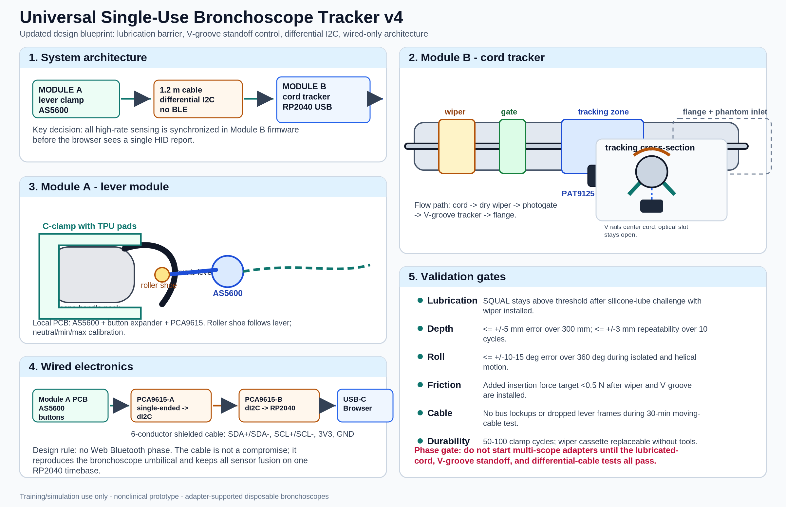

# Universal Single-Use Bronchoscope Tracker - Updated Engineering Plan and Design Blueprint v4

**Version:** v4  
**Date:** June 30, 2026  
**Status:** Prototype engineering plan for nonclinical simulation  
**Core decision:** adapter-supported, clip-on, wired, clamshell cord tracker with lubrication control and differential I2C.



## 0. What changed in v4

This version incorporates the new critical vulnerability review and makes those mitigations part of the baseline design rather than optional fixes.

| Area                        | Previous direction                                    | v4 decision                                                                                                 |
| --------------------------- | ----------------------------------------------------- | ----------------------------------------------------------------------------------------------------------- |
| Module B lubricant handling | Rely on SQUAL warning and cleaning                    | Add a replaceable proximal felt/foam wiper ring before the photogate and sensor.                            |
| Module B standoff           | Snug bore plus leaf spring                            | Use a diameter-specific V-groove tracking saddle around the optical aperture with a compliant opposing cap. |
| Module A cable              | Direct single-ended I2C over ~1.2 m, PCA9615 fallback | PCA9615 differential I2C is now the default wired architecture.                                             |
| Wireless lever module       | Possible Phase 4 BLE option                           | Removed from the roadmap. The system stays wired for latency, synchronization, and reliability.             |
| Universality claim          | Any disposable bronchoscope                           | Adapter-supported disposable bronchoscopes, validated model by model.                                       |
| Module B geometry           | Pass-through bore                                     | Split clamshell tracker with swappable insert cassette, wiper cassette, and flange.                         |

## 1. One-sentence concept

A two-module, clip-on, open-hardware training controller that lets a disposable bronchoscope act as a three-degree-of-freedom simulator input device without modifying the scope: Module A tracks thumb-lever flexion and Module B tracks insertion depth and roll at the cord.

## 2. Non-negotiable design rules

1. **Training-only use.** The device is for simulation, education, and bench validation only. It is not for patient care, diagnosis, navigation, bronchoscopy guidance, or clinical decision-making.
2. **No scope modification.** No adhesive, drilling, magnets attached to the scope, disassembly, or alteration of the real suction/working-channel controls.
3. **Adapter-supported compatibility.** v1 is validated on a small number of selected single-use bronchoscopes; additional scopes require published adapter profiles and repeat validation.
4. **Wired baseline.** The lever module connects to the cord tracker through a flexible cable using differential I2C. No BLE/Web Bluetooth path is included in the baseline product.
5. **Lubricant-tolerant optical zone.** Any optical cord-tracking design must include a replaceable proximal wiper and a SQUAL-based quality gate.
6. **Controlled standoff.** The cord must be mechanically centered over the optical aperture by a V-groove saddle and compliant cap, not merely by a loose bore.
7. **Browser-native runtime.** Runtime input is USB HID gamepad. Calibration/debugging uses CDC/Web Serial or a local CLI fallback.
8. **Objective phase gates.** No multi-scope expansion until optical tracking, standoff, friction, and cable stability pass bench tests.

## 3. Realistic development target

The realistic v1 target is not a fully universal kit. It is:

**A reliable adapter-supported bronchoscopy simulator controller, first validated on one disposable bronchoscope family, then expanded through parametric adapters.**

Recommended v1 scope target: the specific Ambu aScope 4 or aScope 5 size most available in your sim lab. After one working family is stable, add additional aScope sizes, then consider other disposable bronchoscope platforms.

## 4. System architecture

```
MODULE A - LEVER MODULE          1.2 m wired link             MODULE B - CORD TRACKER
C-clamp on handle neck     ->    differential I2C cable  ->   split clamshell tracker
AS5600 hinge encoder             PCA9615 on both ends         wiper + photogate + V-groove
roller shoe on thumb lever        shared RP2040 timebase       PAT9125/PMW sensor
buttons via GPIO expander         no BLE path                  USB HID + CDC serial
```

| Degree of freedom | Sensed by               | Location             | Principle                                              |
| ----------------- | ----------------------- | -------------------- | ------------------------------------------------------ |
| Tip flexion       | AS5600 magnetic encoder | Module A hinge       | Follower-arm angle maps to thumb-lever angle.          |
| Insertion depth   | Optical tracking sensor | Module B cord saddle | Optical Y counts after 2x2 calibration matrix.         |
| Roll              | Optical tracking sensor | Module B cord saddle | Optical X counts after 2x2 calibration matrix.         |
| Buttons           | Tactile switches        | Module A body        | Simulation controls; real suction button is untouched. |

All high-rate data are fused in Module B firmware and emitted as one synchronized USB HID report. This avoids browser-side timing mismatch between independent BLE and USB streams.

## 5. Module A - lever module blueprint

### 5.1 Mechanical design

Module A is a printed clamp that attaches to the bronchoscope handle neck without altering the scope. It carries its own hinge and follower arm. The follower arm touches the thumb lever through a small low-friction roller or rounded shoe.

**Baseline mechanical features:**

- Two-piece C-clamp with TPU or silicone pads.
- Captive M3 thumb screw or over-center latch.
- Hard datum surface so the clamp seats at the same location every session.
- Follower arm pivot on a steel or shoulder-screw axle.
- Light torsion spring to maintain contact with the lever.
- Roller shoe or polished rounded shoe with 1-2 mm compliance.
- Optional buttons on module body for simulator actions.
- Cable strain relief directed toward the scope umbilical/cord path.

### 5.2 Sensor design

The follower-arm hinge uses an AS5600 magnetic rotary sensor and a diametric magnet embedded in the follower hub. The AS5600 is retained because it is contactless, absolute, cheap, and mechanically forgiving for this lever-following problem.

**Calibration points:**

1. Neutral lever position.
2. Full up deflection.
3. Full down deflection.
4. Optional midpoint check to detect shoe slippage or clamp misplacement.

### 5.3 Module A electronics

Module A should no longer be a passive AS5600 hanging on a long single-ended I2C line. It should have a small local PCB:

| Subcomponent                | Purpose                                                            |
| --------------------------- | ------------------------------------------------------------------ |
| AS5600                      | Lever angle measurement.                                           |
| Diametric magnet            | Rotates with follower arm.                                         |
| PCA9615-A                   | Converts local single-ended I2C to differential I2C for the cable. |
| MCP23008/PCF8574 or similar | Reads optional buttons over the same local I2C segment.            |
| ESD/TVS protection          | Cable robustness.                                                  |
| JST-GH or locking connector | Strain-resistant detachable cable.                                 |

The local single-ended I2C segment inside Module A should be kept very short. The 1.2 m cable should carry the differential I2C pair set, power, and ground.

## 6. Module B - cord tracker blueprint

Module B is the critical module. v4 changes it from a simple pass-through bore into a split clamshell tracker with three controlled zones.

### 6.1 Zone layout

From proximal to distal:

1. **Wiper zone.** Replaceable slotted felt or high-density foam ring. It removes silicone lubricant, condensation, and phantom residue before the cord reaches the optical window.
2. **Zero/gate zone.** IR photogate or optical interrupter for tip passage/zero sanity check. Manual zero at the flange plane remains available.
3. **Tracking zone.** Diameter-specific insert cassette with a V-groove saddle around the optical window, compliant top cap, and optical sensor below.
4. **Mounting flange.** Standard interface to phantom inlet, manikin adapter, or desk stand.

### 6.2 Lubrication barrier

The wiper is now a baseline component.

**Design requirement:** the tracker must maintain adequate SQUAL after a realistic silicone-lubricant challenge. A software warning alone is insufficient.

**Recommended implementation:**

- A tool-free sliding cassette holding a replaceable C-shaped felt or foam ring.
- Slotted geometry so it can be replaced without threading over the distal tip.
- Ring ID approximately cord OD minus 0.1 to 0.2 mm for gentle contact, adjustable by material.
- Thickness 3-5 mm in the direction of travel.
- Spare wipers stored in the kit.
- Firmware counter reminding users to replace the wiper after a defined number of sessions or if SQUAL falls.

**Test materials:** polyester felt, high-density open-cell polyurethane foam, silicone-compatible foam, and microfiber pad. Select the material that balances residue removal with low added insertion force.

### 6.3 V-groove standoff control

The optical tracking zone should not rely on a round cord floating inside a cylindrical bore. The insert should use two polished rails forming a shallow V around the optical aperture. The cord sits in the V, while a compliant opposing cap supplies gentle downward force.

**Why this matters:**

- Centers the round cord over the optical aperture.
- Maintains focal distance despite lateral torque.
- Reduces wandering during simultaneous insertion and roll.
- Makes calibration more repeatable between sessions.

**Recommended geometry:**

| Parameter             | Starting value                                                                |
| --------------------- | ----------------------------------------------------------------------------- |
| Insert family         | One cassette per cord OD range.                                               |
| Cord radial clearance | Cord OD + 0.2 to 0.4 mm outside the tracking saddle.                          |
| V-groove angle        | 90-120 degrees, test both.                                                    |
| Optical slot width    | 1.5-2.5 mm, sensor dependent.                                                 |
| Compliant cap travel  | 0.5-1.5 mm.                                                                   |
| Added insertion force | Target <0.5 N after wiper + V-groove are installed.                           |
| Insert material       | PETG/ASA body; polished PTFE/POM or resin insert surface if friction is high. |

The V-groove should be interrupted around the optical aperture rather than forming an opaque floor. The sensor needs a clear view of the cord surface.

### 6.4 Clamshell and insert strategy

The clamshell design solves the distal-tip/cord-diameter mismatch. It also allows the wiper and V-groove insert to be changed without pushing the bronchoscope tip through a tight bore.

**Mechanical requirements:**

- Hinged or fully separable two-piece body.
- Captive latch or thumb screw.
- Swappable insert cassette for each cord diameter family.
- Swappable wiper cassette independent of the insert cassette.
- Hard stop defining the flange/zero plane.
- Cable exit and USB port protected from hand contact and phantom moisture.
- Drainage or removable cover so residue does not pool over the optical sensor.

## 7. Optical sensor strategy

The PAT9125 remains the preferred clean open-hardware candidate if it passes Phase 0. Its appeal is low cost, I2C/SPI support, and sufficient theoretical resolution. However, v4 treats optical tracking as environment-dependent rather than guaranteed.

### 7.1 Candidate paths

| Path                                       | When to use                                                  | Comment                                                    |
| ------------------------------------------ | ------------------------------------------------------------ | ---------------------------------------------------------- |
| PAT9125 single sensor                      | Default if SQUAL and accuracy pass wet/dry tests.            | Lowest cost and simplest open design.                      |
| PMW3360 or similar high-performance sensor | Use if PAT9125 fails on cord finish or speed.                | Better performance but more firmware/licensing complexity. |
| Dual optical sensors 90 degrees apart      | Use if single-sensor roll/depth cross-coupling remains high. | Adds cost and alignment burden.                            |
| Wheel encoder cassette                     | Use if optical tracking fails after lubrication mitigation.  | Less elegant, but robust and publishable as a fallback.    |

### 7.2 Optical health monitoring

Firmware should continuously track:

- SQUAL or equivalent surface-quality metric.
- Delta count saturation.
- Dropout frequency.
- Unexpected jumps.
- Correlation between commanded calibration motion and observed counts.

If surface quality drops below threshold, the simulator should visibly warn: **replace wiper, wipe cord, or switch insert.**

## 8. Electronics and signal integrity

### 8.1 Default wired architecture

Single-ended I2C over a moving 1.2 m cable is no longer acceptable as the baseline. The AS5600 and button expander communicate locally to PCA9615-A in Module A. The cable carries differential I2C to PCA9615-B in Module B, which connects to the RP2040.

```
AS5600 + buttons -> local I2C -> PCA9615-A -> differential cable -> PCA9615-B -> RP2040
```

**Cable recommendation:** 6-conductor shielded silicone cable:

| Conductors     | Function                                 |
| -------------- | ---------------------------------------- |
| Twisted pair 1 | SDA+ / SDA-                              |
| Twisted pair 2 | SCL+ / SCL-                              |
| Power          | 3.3 V or 5 V, selected by PCB design.    |
| Ground/shield  | Ground reference and shield termination. |

Use keyed locking connectors, strain relief, and a ferrite/ESD footprint on the Module B side.

### 8.2 Module B main PCB

| Component                             | Purpose                                                   |
| ------------------------------------- | --------------------------------------------------------- |
| RP2040/Pi Pico or custom RP2040 board | Sensor fusion, USB HID, CDC serial.                       |
| PCA9615-B                             | Differential I2C receiver/transceiver for Module A.       |
| PAT9125 or fallback optical sensor    | Cord motion tracking.                                     |
| IR photogate                          | Tip passage/zero sanity check.                            |
| Calibrate button                      | Local zero/calibration mode.                              |
| RGB LED                               | Status: tracking OK, low SQUAL, cable fault, calibration. |
| USB-C                                 | Power and data.                                           |
| Optional EEPROM                       | Stores hardware revision and calibration defaults.        |

### 8.3 Pin map draft

| RP2040 function | Net                    | Destination                            |
| --------------- | ---------------------- | -------------------------------------- |
| I2C0 SDA/SCL    | Lever bus              | PCA9615-B local side.                  |
| I2C1 or SPI0    | Optical bus            | PAT9125 or PMW3360.                    |
| GPIO interrupt  | Motion/SQUAL interrupt | Optical sensor interrupt if supported. |
| GPIO            | Photogate              | IR interrupter output.                 |
| GPIO            | Calibrate button       | Local button with debounce.            |
| PIO/USB         | HID/CDC                | Browser runtime and calibration.       |
| GPIO            | RGB LED                | Status feedback.                       |

## 9. Firmware design

### 9.1 Sensor loop

- Optical sensor read: 500-1000 Hz target.
- Lever sensor read: 250-500 Hz target over differential I2C.
- Fusion/report loop: 125-250 Hz HID report rate.
- CDC serial: raw counts, SQUAL, matrix values, diagnostics.

### 9.2 Calibration model

Do not assume optical X is pure roll and optical Y is pure insertion. Use a 2x2 matrix:

```
[ depth_mm ]   [ a  b ] [ dy_counts ]
[ roll_deg ] = [ c  d ] [ dx_counts ]
```

Calibration maneuvers:

1. Pure 100 mm insertion using ruler jig.
2. Pure 360 degree roll using roll jig.
3. Combined helical motion to check cross-coupling.
4. Lubricated-cord repeat after wiper pass.

### 9.3 HID report design

Gamepad axes are bounded. Continuous roll should not be sent as a single unbounded axis. Send:

| HID axis | Meaning                                          |
| -------- | ------------------------------------------------ |
| Axis 0   | Flexion, -1 to +1.                               |
| Axis 1   | Depth normalized to selected airway path length. |
| Axis 2   | sin(roll).                                       |
| Axis 3   | cos(roll).                                       |
| Buttons  | Simulator action buttons.                        |

CDC serial still sends raw accumulated roll for debugging.

### 9.4 Fault handling

- Low SQUAL: freeze optical accumulation only if dropouts exceed threshold; otherwise continue with warning.
- Cable fault: reinitialize lever I2C bus and log event.
- Stuck I2C bus: firmware attempts bus recovery, then requests reconnect if needed.
- Calibration mismatch: reject profile if helical validation exceeds error threshold.

## 10. Web app integration

Runtime remains USB HID/Gamepad. Calibration uses Web Serial on supported desktop browsers, with a CLI fallback for locked-down systems.

**v4 removes Web Bluetooth.** The wired lever cable is not a downside. It mimics a bronchoscope umbilical, avoids battery management, avoids browser BLE compatibility problems, and keeps all sensor fusion under one timestamped firmware loop.

Recommended routes/components:

| Component               | Purpose                                                               |
| ----------------------- | --------------------------------------------------------------------- |
| `ScopeInputProvider`    | Abstracts keyboard, gamepad, and hardware scope input.                |
| `/hardware` setup route | Connect, live bars, SQUAL display, profile selection, calibration.    |
| `useScopeInput()` hook  | Client-only input hook for simulation runtime.                        |
| Local profile store     | Saves insert ID, lever min/neutral/max, 2x2 matrix, SQUAL thresholds. |
| Optional cloud profile  | Later Supabase storage for classroom kits and competency dashboards.  |

## 11. Build phases and exit criteria

### Phase 0 - bench de-risking before real enclosure

**Goal:** determine whether optical tracking remains usable under realistic contamination and standoff conditions.

Tests:

- Dry cord tracking.
- Silicone-lubricated cord tracking.
- Phantom-residue tracking.
- Wiper material comparison.
- V-groove saddle comparison.
- Lateral torque/wandering test.
- Insertion + roll helical test.
- SQUAL/dropout logging.

Exit criteria:

| Metric                      | Pass threshold                                 |
| --------------------------- | ---------------------------------------------- |
| Depth error over 300 mm     | <= +/-5 mm.                                    |
| Depth repeatability         | <= +/-3 mm over 10 cycles.                     |
| Roll error over 360 degrees | <= +/-10-15 degrees.                           |
| Added insertion force       | Target <0.5 N.                                 |
| Dropout rate                | <1% of samples during realistic motion.        |
| Lubricated-cord performance | Passes after wiper with no catastrophic drift. |

### Phase 1 - Module B clamshell alpha

Build a split clamshell with replaceable wiper cassette, V-groove insert, optical sensor board, and RP2040. Use Web Serial first; HID comes later.

Exit: insertion and roll drive a debug visualizer after wet/dry cord tests.

### Phase 2 - wired Module A alpha

Build the lever clamp with AS5600, local button expander, and PCA9615-A. Validate the cable with continuous motion.

Exit: lever signal is stable during 30 minutes of moving-cable use with no bus lockups.

### Phase 3 - integrated HID prototype

Fuse Module A and Module B data into one HID gamepad report. Add the web setup route, calibration storage, and diagnostic UI.

Exit: all three DOFs drive the bronchoscopy simulator with perceived latency <30 ms.

### Phase 4 - robustness and classroom usability

Perform repeated attach/detach cycles, wiper replacement cycles, and fellow-facing usability sessions.

Exit: 50-100 attachment cycles, no structural failure, no clinically confusing modifications, setup under 2 minutes.

### Phase 5 - adapter expansion and publication package

Only after v1 passes validation, add additional scope adapters and prepare an open-hardware manuscript.

Exit: bench validation + face/content validity study + reproducible build files.

## 12. Validation plan

### 12.1 Bench validation

| Test                  | Method                            | Output                                            |
| --------------------- | --------------------------------- | ------------------------------------------------- |
| Linear depth          | 300 mm ruler/linear stage         | Error, repeatability, drift.                      |
| Roll                  | Rotary jig, 360/720 degrees       | Roll error and wrap behavior.                     |
| Helical motion        | Simultaneous insertion + roll     | Cross-coupling residual after matrix calibration. |
| Lubrication challenge | Silicone lube and phantom residue | SQUAL, error, dropout with/without wiper.         |
| Friction              | Spring scale or force gauge       | Added insertion force.                            |
| Cable integrity       | Moving-cable stress test          | Dropped frames, I2C recovery events.              |
| Attach/detach         | Repeated mounting cycles          | Calibration drift, mechanical wear.               |

### 12.2 Simulation validity

- Novices, fellows, and attending bronchoscopists complete named-segment navigation tasks.
- Metrics: time, path efficiency, collision rate, branch-selection accuracy, user-rated realism.
- Compare keyboard/mouse control vs scope-tracker control.
- Optional phantom/video companion mode later.

## 13. Risk register v4

| Risk                                                |                         Current likelihood | Mitigation now in baseline                                                       |
| --------------------------------------------------- | -----------------------------------------: | -------------------------------------------------------------------------------- |
| Lubricant/residue blocks optical tracking           |                                       High | Replaceable wiper before photogate/sensor; SQUAL gate; wet testing in Phase 0.   |
| Cord wanders away from focal plane                  |                                       High | V-groove saddle around aperture with compliant opposing cap.                     |
| Optical tracking unreliable on specific cord finish |                                Medium-high | Test PAT9125 and fallback sensor; wheel-encoder cassette branch.                 |
| I2C lever bus unstable over cable                   | Medium without extender; low with extender | PCA9615 default on both ends; moving-cable stress test.                          |
| BLE latency/sync problems                           |                                    Removed | No wireless phase.                                                               |
| Added friction changes scope feel                   |                                     Medium | Wiper material testing; V-groove polish/PTFE; force threshold.                   |
| Clamp fit varies across scopes                      |                                     Medium | Parametric adapter library and per-model validation.                             |
| Classroom durability                                |                                Medium-high | Heat-set inserts, captive fasteners, spare wipers, replaceable insert cassettes. |

## 14. Bill of materials - realistic v4 estimate

The v4 design is more robust but slightly more expensive than the early v2 estimate.

| Subassembly                            | Expected prototype cost | At-scale kit target |
| -------------------------------------- | ----------------------: | ------------------: |
| Module A mechanical parts              |                  $10-20 |               $5-10 |
| AS5600, magnet, button expander        |                    $5-8 |                $3-5 |
| Module A PCA9615/PCB/connectors        |                  $10-20 |               $5-10 |
| Differential cable and strain relief   |                   $8-15 |                $4-8 |
| Module B RP2040/USB/status electronics |                  $10-20 |               $6-12 |
| Optical sensor path                    |                   $8-20 |               $5-12 |
| Module B PCA9615/PCB/connectors        |                  $10-20 |               $5-10 |
| Photogate and wiper cassette materials |                   $5-15 |                $2-6 |
| Printed housings/inserts/hardware      |                  $15-30 |               $8-15 |
| **Total**                              |             **$81-168** |          **$43-88** |

Planning number: **$100-180 for early prototypes** and **$70-100 for a polished educational kit** after PCB consolidation and print optimization.

## 15. CAD and repo package

Recommended repository structure:

```
/hardware
  /cad
    module_a_lever_clamp.build123d.py
    module_b_clamshell_tracker.build123d.py
    insert_profiles.yaml
    flange_standard.step
  /stl
    module_a_base/
    module_a_shoes/
    module_b_body/
    v_groove_inserts/
    wiper_cassettes/
    desk_stand/
  /electronics
    module_a_pca9615_as5600/
    module_b_rp2040_tracker/
    wiring_diagrams/
    bom.csv
  /firmware
    platformio/
    drivers/pat9125/
    drivers/as5600/
    calibration/
    releases/uf2/
  /web
    hardware_setup_route/
    useScopeInput/
  /docs
    build_guide.md
    calibration_guide.md
    validation_protocol.md
    scope_profile_contribution_guide.md
```

## 16. Immediate next actions

1. Build a benchtop V-groove optical jig before printing a full enclosure.
2. Test wiper materials using dry, lubricated, and phantom-residue cord conditions.
3. Order two PCA9615 breakout boards or design the small Module A/B PCBs immediately.
4. Remove BLE tasks from the roadmap and issue list.
5. Define the first validated scope family and insert dimensions.
6. Create a validation spreadsheet before running tests so failures become design data rather than anecdotes.

## 17. Source notes

- User-supplied v2 engineering plan: `universal-scope-tracker-plan-v2(1).md`.
- ams OSRAM AS5600 product page: https://ams-osram.com/products/sensor-solutions/position-sensors/ams-as5600-position-sensor
- PixArt PAT9125EL public product/datasheet references: https://www.pixart.com/search/%26page%3D1%26keyword%3DPAT9125EL and https://www.epsglobal.com/Media-Library/EPSGlobal/Products/files/pixart/PAT9125EL-TKITPAT9125EL-TKMT.pdf
- NXP PCA9615 product page/datasheet: https://www.nxp.com/docs/en/data-sheet/PCA9615.pdf
- NXP I2C-bus specification/user manual: https://www.nxp.com/documents/user_manual/UM10204.pdf
- MDN Web Bluetooth API compatibility warning: https://developer.mozilla.org/en-US/docs/Web/API/Web_Bluetooth_API
- MDN Gamepad API: https://developer.mozilla.org/en-US/docs/Web/API/Gamepad_API
- MDN Web Serial API: https://developer.mozilla.org/en-US/docs/Web/API/Web_Serial_API
