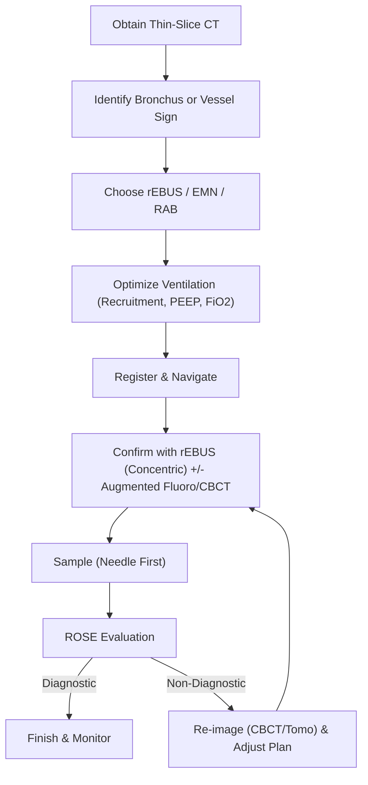
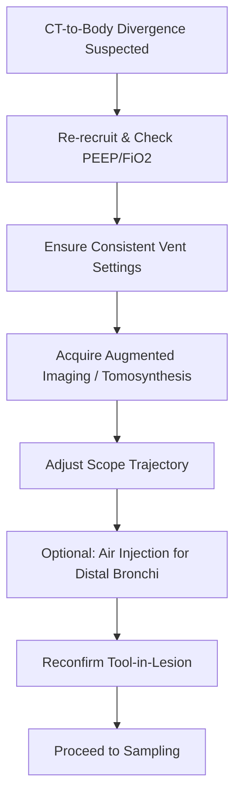

Advanced Peripheral Bronchoscopy: Radial Probe, Electromagnetic Navigation, and Robotic Bronchoscopy

This chapter covers diagnostic approaches to peripheral pulmonary lesions (PPLs) using radial endobronchial ultrasound (rEBUS), electromagnetic navigation (EMN), and robotic‑assisted bronchoscopy (RAB). It aligns with AABIP IP Board domains regarding peripheral bronchoscopy indications, imaging/navigation, anesthesia/ventilation strategies, complications, radiation safety, and evidence interpretation.

Learning Objectives

By the end of this chapter, learners will be able to:

Select among rEBUS, EMN, ultrathin bronchoscopy, and RAB for specific PPL presentations.
Plan navigation using thin‑slice CT, interpret the “bronchus sign” and “vessel sign,” and mitigate CT‑to‑body divergence (CTBD).
Execute stepwise registration, navigation, lesion confirmation, and sampling across platforms.
Interpret rEBUS patterns (concentric vs. eccentric) and adjust tools/trajectory accordingly.
Apply anesthesia and ventilator strategies that reduce atelectasis and improve tool‑in‑lesion confirmation.
Anticipate, prevent, and manage bleeding, pneumothorax, and radiation exposure.
Critically appraise yield data and definitions, identifying scenarios where adjunct imaging (augmented fluoroscopy, cone‑beam CT) adds value.

High‑Yield One‑Pager

Why bronchoscopy for PPLs? Lower pneumothorax risk compared to transthoracic routes and the ability to combine diagnosis with mediastinal staging in a single anesthetic event.
Pre‑planning wins cases: Use thin‑slice (&lt;1 mm) CT at near‑TLC; map the target’s airway generation; note the presence of a bronchus sign. If absent, follow the vessel sign (bronchovascular bundle).
CT‑to‑body divergence (CTBD) is the enemy: Expect greater divergence in lower lobes and under general anesthesia (GA). Use recruitment maneuvers, PEEP 8–12 cmH₂O (as tolerated), and avoid high FiO₂ when safe to minimize atelectasis.
Registration matters: Center the scope, avoid wall contact or buckling, confirm main carina alignment, and complete platform‑specific sequences before navigating.
rEBUS patterns predict success:
Concentric: Tool centered in lesion.
Eccentric: Tool adjacent to lesion.
Atelectasis: Watch for mimics (e.g., air bronchograms in collapsed tissue).
Adjunct imaging fixes misalignment: Augmented fluoroscopy/tomosynthesis or Cone-Beam CT (CBCT) can correct for CTBD and confirm tool‑in‑lesion.
Robotics extends reach and stability:
Monarch and Galaxy: EMN‑based; allow continuous vision during sampling.
Ion: Shape‑sensing; requires removal of the vision probe during sampling.
Ultrathin scopes go distal: ~3.0 mm OD / 1.7 mm channel scopes reach ~5th‑generation bronchi and accommodate rEBUS and mini‑tools.
Sampling strategy: Start with a needle (to create a tract if no bronchus sign exists), then add forceps/brush; consider cryobiopsy when larger architecture is required.
Complication profile: Pneumothorax rates with RAB are generally low. Bleeding is usually mild–moderate and managed with wedging, cold saline, topical epinephrine, tranexamic acid, or tamponade balloons.
Radiation safety: Adhere to ALARA. Use pulsed fluoro and collimation; increase distance from the X‑ray source; wear eye, thyroid, and torso protection.
Yield definitions vary widely: “Diagnostic yield” can appear inflated when liberal definitions or follow‑up outcomes are included. Always identify the trial’s specific definition.
Common exam traps: Misreading atelectasis on rEBUS as tumor; trusting the virtual path over live endoscopic anatomy; failing to re‑register after major ventilator or patient position changes.

Core Concepts

Pathophysiology / Epidemiology

Pulmonary nodules are common on chest CT (appearing in approximately one in five scans). Screening trials report high positive rates and demonstrated mortality benefits of CT screening, which drives an increase in incident and screen‑detected nodules—and the subsequent need for safe, accurate bronchoscopic diagnosis.

Indications & Contraindications

Indications: Diagnosis of solid/subsolid PPLs; integration with same‑session mediastinal staging; access to lesions beyond the reach of standard scopes; need to minimize pneumothorax risk relative to transthoracic biopsy; targeting for potential therapeutic interventions (e.g., ablation).

Contraindications: Generally relative rather than absolute (similar to standard bronchoscopy); severe hypoxemia (e.g., P/F &lt;70 or FiO₂ &gt;0.9); uncorrectable coagulopathy or thrombocytopenia (Plt &lt;20k); unstable CV status (shock, active ischemia, recent MI, severe PH); elevated ICP or acute asthma. Note: ENB is generally safe with CIEDs (minimal EMI risk).

Pre‑procedure Evaluation

CT planning: Thin‑slice (&lt;1 mm) inspiratory breath‑hold near TLC is essential for optimal airway segmentation and pathway generation. Identify the bronchus sign (airway leading directly to the lesion) or vessel sign (paired artery indicating a likely accompanying airway when the bronchus is not visible).

Mental map: Document sequential airway branches and lesion position, anticipating software inaccuracies and CTBD.

Room setup: Ensure a fluoroscopy‑compatible bed; position robotic tower, bronchoscopy tower, anesthesia machine, and C‑arm/CBCT; plan ROSE/specimen workflow. For EMN, clear metal from the field generator’s vicinity during registration.

Anesthesia/ventilation: GA with TIVA is preferred for guided peripheral procedures and robotics. Use recruitment maneuvers and PEEP 8–12 cmH₂O (hemodynamics permitting). Titrate FiO₂ to the minimum needed to maintain safe saturations to reduce absorption atelectasis. Lower tidal volume (Vt) with an increased respiratory rate helps minimize airway motion.

Equipment & Setup (Selected Sizes/Features)

rEBUS: ~1.4 mm probe; 360° imaging; operator must distinguish concentric vs. eccentric vs. atelectasis patterns.
Ultrathin bronchoscopy: ~3.0 mm OD with 1.7 mm channel; accommodates rEBUS and mini‑cryoprobe/needle; reaches more distal bronchi than thin scopes.
EMN platforms: Preplan pathway on thin‑slice CT; register with patient; use steerable catheters/guide sheaths. Modern systems integrate augmented fluoroscopy (e.g., tomosynthesis) to update lesion position intra‑operatively.
RAB platforms:
Monarch™: Telescoping sheath (6.0 mm OD) and inner scope (4.2 mm OD; 2.1 mm channel); continuous vision during sampling; EMN‑based hybrid tracking.
Ion™: 3.5 mm OD catheter with 2.0 mm channel; shape‑sensing; requires removal of vision probe for sampling; endoluminal compass for orientation.
Galaxy™: 4.0 mm single‑use scope with 2.1 mm channel; EMN‑based; integrated augmented fluoroscopy (TiLT) for real‑time CTBD correction.
Adjunct imaging:
Augmented fluoroscopy/tomosynthesis: Updates target location; supports “tool‑in‑lesion” confirmation.
CBCT (mobile or ceiling‑mounted) / O‑arm: Provides 3D intra‑op imaging; confirms tool–target relationship; dose similar to low‑dose CT per spin in many protocols.

Step‑by‑Step Technique / Procedural Checklist

Pre‑op planning: Review CT; mark target; choose a route favoring gradual branching; anticipate sharp turns and respiratory motion in the lower lobes.
Anesthesia & ventilation: Intubate with appropriately sized ETT (≥8.0 mm when possible for robotics). Apply recruitment; set PEEP 8–12 cmH₂O; minimize FiO₂ while maintaining safety.
Airway inspection & clearance: Use a conventional bronchoscope to suction secretions judiciously (avoid inducing atelectasis).
Registration: Perform platform‑specific registration (carina alignment, contralateral bronchus passes, lobar/segmental mapping).
Navigation: Advance under live endoscopic view; keep scope centered; avoid buckling or airway wall trauma; use preview‑path features (where available).
Lesion confirmation:
Assess rEBUS pattern (concentric &gt; eccentric) and depth; beware of atelectasis mimics (air bronchograms).
Use augmented fluoroscopy or CBCT to correct CTBD and confirm tool‑in‑lesion.
Sampling: Start with a needle (creates a tract when no bronchus sign is present), then forceps ± brush; consider cryobiopsy for architecture, especially in subsolid lesions. Use ROSE to guide passes (often 3–4 needle passes before switching tools).
Troubleshooting: If collapse blocks progress, inject small aliquots of air via the working channel to stent distal airways; re‑recruit and re‑register after major changes.
Hemostasis/readiness: Keep epinephrine, tranexamic acid, and tamponade balloons available; wedge the sheath in the most distal airway to confine any bleeding.
Post‑procedure: Return ventilator parameters to baseline; monitor for pneumothorax/bleeding; adhere to radiation‑safety doffing and dose recording.

Troubleshooting & Intra‑procedure Management

CTBD: Expect larger divergence in lower lobes. Re‑acquire tomosynthesis or CBCT; adjust scope trajectory; repeat recruitment; ensure consistent ventilator settings throughout imaging and sampling.
Atelectasis misreads on rEBUS: Look for hyperechoic air bronchograms and uniform patterns that suggest collapse rather than tumor.
Distal airway collapse: Use small air injections (e.g., ~20 mL) via the working channel to splint open airways; avoid saline if image quality for rEBUS/CBCT is critical.
Scope instability during sampling: For telescoping systems, “park” the sheath segmentally; advance the inner scope or tools over a visible guide.
EMN interference: Remove metal from the field; verify sensor integrity; consider re‑registration if the C‑arm or table position has changed substantially.

Complications (Prevention, Recognition, Management)

Bleeding: Wedge position; cold saline; topical epinephrine (0.1 mg/mL × 4 mL); tranexamic acid (250–500 mg); endoballoon tamponade when needed. Escalate to a therapeutic bronchoscope if necessary while preserving airway control.
Pneumothorax: Low incidence with RAB; wedge sheath distally; maintain PEEP prudently; consider small saline instillation at the end to reduce air leak risk.
Radiation: Follow ALARA; use pulsed fluoro and tight collimation; maximize distance from the source; wear protective aprons, thyroid shields, and lead glasses.

Special Populations

Lower lobe lesions / high BMI / long cases: Anticipate increased CTBD and atelectasis; consider lateral decubitus positioning (target side up) when mobile CT is used to mitigate dependent collapse.
Altered anatomy (post‑resection): Some systems allow partial registration limited to remaining lobes.
Emphysema with collapsible airways: Airway stenting with air injections and careful PEEP titration can facilitate distal navigation.
Subsolid/ground‑glass lesions: Often not visible on fluoro; rely on CBCT confirmation and consider cryobiopsy for histoarchitecture.

Evidence & Outcomes

rEBUS: Overall yield is ~70%, with higher yields for concentric versus eccentric views; robotic visualization may mitigate this gap in some series.
EMN: Large cohorts show improved yields when combined with rEBUS and augmented imaging. Modern EMN with tomosynthesis has achieved non‑inferior diagnostic yield to CT‑guided transthoracic biopsy in randomized data, with far lower pneumothorax rates.
RAB: Platforms demonstrate high navigational success with low complication rates; prospective and multicenter data show yields commonly in the mid‑70s to mid‑80s range when paired with rEBUS and/or 3D imaging.
Definitions matter: Strict vs. liberal yield definitions can shift reported yield by &gt;20 percentage points; recent consensus statements standardize reporting.

Diagnostic & Therapeutic Algorithms

Algorithm 1 — Workup of a Peripheral Pulmonary Lesion for Bronchoscopic Sampling

Algorithm 2 — CT‑to‑Body Divergence and Atelectasis Mitigation

Tables & Quick‑Reference Boxes

Table 1. Robotic and Navigation Platforms—At‑a‑Glance

| Feature                       | Monarch™                                         | Ion™                                  | Galaxy™                        |
| ----------------------------- | ------------------------------------------------- | -------------------------------------- | ------------------------------- |
| Guidance                      | EMN hybrid with optical cues                      | Shape‑sensing                          | EMN + integrated tomosynthesis  |
| Visualization during sampling | Continuous                                        | Vision probe removed for tools         | Continuous                      |
| Dimensions                    | Sheath 6.0 mm OD; scope 4.2 mm OD; 2.1 mm channel | Catheter 3.5 mm OD; 2.0 mm channel     | Scope 4.0 mm OD; 2.1 mm channel |
| Distal maneuvering            | Telescoping “leapfrog” over sheath                | Fine articulation; endoluminal compass | EMN + real‑time target updates  |
| Notes                         | Sheath parking reduces PTX/bleeding spill         | Not affected by EM interference        | Single‑cart, single‑use scope   |

Abbreviations: EMN, electromagnetic navigation; OD, outer diameter; PTX, pneumothorax.

Table 2. rEBUS Patterns and What To Do

| rEBUS pattern                              | Interpretation                       | Action                                                                |
| ------------------------------------------ | ------------------------------------ | --------------------------------------------------------------------- |
| Concentric (hypoechoic ring around probe)  | Tool centered within lesion          | Sample—highest yield                                                  |
| Eccentric (interface with partial contact) | Adjacent to lesion                   | Micro‑adjust trajectory; consider air injection; confirm with imaging |
| Homogeneous pattern with hyperechoic dots  | Atelectasis mimic (air bronchograms) | Recruit; adjust PEEP/FiO₂; avoid misclassification; re‑image          |

Table 3. Anesthesia & Ventilator Settings That Help Navigation

| Phase                | Practical Tip                                                                                                                                               |
| -------------------- | ----------------------------------------------------------------------------------------------------------------------------------------------------------- |
| Pre‑intubation       | Avoid prolonged 100% FiO₂ preoxygenation when safe; plan ETT size ≥8.0 mm for RAB tools                                                                     |
| After intubation     | Recruitment maneuver (e.g., pressure &gt; 20 cmH₂O for &gt; 20 s)                                                                                           |
| Maintenance          | PEEP 8–12 cmH₂O (hemodynamics permitting); low Vt with higher rate; minimize FiO₂ to maintain SpO₂ safely; keep parameters constant during imaging/sampling |
| Imaging              | Breath‑hold at target pressure during tomosynthesis/CBCT; avoid moving the C‑arm/table without re‑registration                                              |
| Hemostasis readiness | Have cold saline, epinephrine 0.1 mg/mL, tranexamic acid 250–500 mg, and tamponade balloon available                                                        |

Cases & Applied Learning

Case 1

A 64‑year‑old woman with a 14 mm RLL nodule and no bronchus sign is scheduled for RAB. Under GA, rEBUS shows no signal at the virtual target.

What’s the next best step?

Answer: C. Perform recruitment and PEEP optimization, then tomosynthesis to update target.

Rationale: CTBD and atelectasis are common in lower lobes under GA. Recruitment/PEEP and tomosynthesis can realign the target and confirm tool‑in‑lesion before sampling.

Case 2

A 53‑year‑old man with a 10 mm mixed GGO in RUL undergoes Ion‑based RAB. Lesion not seen on fluoro; rEBUS is equivocal.

Best way to confirm tool‑in‑lesion?

Answer: B. CBCT with breath‑hold and then cryobiopsy.

Rationale: Subsolid lesions are often fluoro‑invisible; CBCT provides 3D confirmation and supports cryobiopsy for architecture.

Case 3

During forceps biopsy of a peripheral lesion with Monarch, oozing obscures the field.

Immediate management?

Answer: B. Wedge the sheath distally, apply cold saline and suction; consider topical epinephrine.

Rationale: Wedging confines bleeding; topical agents and suction are first‑line.

Question Bank (MCQs)

Next best step (navigation). During EMN bronchoscopy, registration completes but live endoscopy shows misaligned virtual anatomy at subsegmental branches. Answer: C. Live visualization guides navigation; use preview‑path features and avoid buckling.
Trust the software and proceed
Re‑register only at the main carina
Reorient using the live bronchoscopic view and “preview path”; avoid wall contact
Increase FiO₂ to 1.0
Abort and reschedule
Troubleshooting (CTBD). While using RAB for a lower‑lobe lesion, rEBUS is negative despite “on‑target” navigation. Answer: B.
Add more suction
Perform recruitment, confirm PEEP, and acquire tomosynthesis/CBCT
Proceed to blind forceps biopsy
Switch to rigid bronchoscopy
Extubate and retry under moderate sedation
Indications. Which scenario most favors bronchoscopic over transthoracic biopsy? Answer: B. Bronchoscopy can diagnose and stage in one session.
14 mm pleural‑based posterior lesion in a normal lung
28 mm upper‑lobe lesion with bulky mediastinal nodes needing staging
8 mm deep lower‑lobe nodule in an emphysematous lung with bullae
Diffuse interstitial changes without discrete nodules
Large cavitary lesion adjacent to chest wall
rEBUS interpretation. Concentric rEBUS is obtained; what is the most appropriate immediate action? Answer: B.
Switch to cryobiopsy only
Proceed with needle, then forceps, maintaining alignment
Re‑register before sampling
Assume atelectasis and relocate
Inject saline to improve the image
Anesthesia/ventilation. To reduce atelectasis during RAB, the most evidence‑based approach is: Answer: B.
High Vt with low rate and FiO₂ 1.0
Recruitment maneuver and PEEP 8–12 cmH₂O with minimal FiO₂ needed
Zero PEEP and apneic periods
Nitrous oxide anesthesia
Prolonged preoxygenation at FiO₂ 1.0
Platform nuance. Which statement is correct? Answer: C.
Ion provides continuous endoscopic visualization during sampling
Monarch requires vision probe removal for sampling
Galaxy integrates augmented fluoroscopy to correct CTBD intra‑op
All platforms are self‑driving once registered
None allow rEBUS use
Bleeding control. Moderate bleeding after transbronchial sampling is best managed initially by: Answer: C.
Positive pressure only
Nebulized vasopressin
Wedge the sheath distally, cold saline, suction; consider topical epinephrine or tranexamic acid
Immediate chest tube placement
Trendelenburg positioning
Radiation safety. Which reduces operator dose most effectively? Answer: C.
Longer continuous fluoro runs
Standing closer to the X‑ray tube
Collimation, pulsed fluoro, and maximizing distance from the source
Removing the thyroid shield to improve comfort
Switching to analog image intensifier
Sampling sequence. With no bronchus sign, initial tool of choice often is: Answer: B.
Forceps biopsy
Needle to create a tract, then forceps/brush
Brush alone
BAL only
Cryobiopsy only
Special situation. Emphysematous patient with distal airway collapse on navigation—most helpful maneuver: Answer: B.
High‑flow suction
Small air injection via working channel to stent airway
Instill 20–30 mL saline to opacify lung
Eliminate PEEP
Immediate conversion to percutaneous biopsy
Yield definitions. Liberal yield definitions can: Answer: B.
Lower reported yields by excluding follow‑up outcomes
Raise reported yields by counting follow‑up as diagnostic
Have no effect on reported yields
Only apply to robotic studies
Only apply to ground‑glass nodules
Complication rates (RAB). Which is most accurate? Answer: C.
Pneumothorax is common (&gt;10%) in all RAB cohorts
Bleeding requiring thoracotomy is frequent
Pneumothorax rates are generally low; wedging and stable platforms may reduce risk
Radiation is negligible, so shielding is optional
RAB cannot be used with CBCT

Controversies, Variability, and Evolving Evidence

Does robotics improve yield over state‑of‑the‑art EMN? Comparative data suggest similar diagnostic yields when EMN is combined with tomosynthesis, though robotics may confer advantages in reach, stability, and tool control.
How much do adjunct imaging modalities improve outcomes? They reliably correct CTBD and confirm tool‑in‑lesion, but the incremental effect on diagnostic yield varies across studies and depends on definitions and case mix.
What is the optimal sampling toolset? Needles and forceps remain foundational; cryobiopsy is promising for subsolid lesions but adds cost and bleeding considerations.
Yield definitions: Without standardized definitions, headline numbers are not comparable; recent consensus aims to harmonize reporting across studies.

Take‑Home Checklist

[ ] Thin‑slice CT at near‑TLC; mark bronchus or vessel sign; build a mental map.
[ ] Choose rEBUS/EMN/RAB based on lesion size, location, access, and local resources.
[ ] GA with TIVA; recruitment and PEEP 8–12 cmH₂O; minimize FiO₂ safely.
[ ] Complete robust registration; center the scope; avoid wall contact/buckling.
[ ] Confirm lesion with rEBUS (seek concentric) and/or augmented fluoro/CBCT.
[ ] Start with needle in no‑bronchus‑sign cases; add forceps/brush; consider cryobiopsy.
[ ] Use ROSE to guide passes; re‑image if non‑diagnostic before abandoning.
[ ] Wedge sheath for hemostasis; have cold saline, epinephrine, TXA, and balloon ready.
[ ] Practice radiation discipline: pulsed fluoro, collimation, distance, shielding.
[ ] Document ventilator settings and keep them constant during imaging/sampling.
[ ] Understand how yield is defined in your reports and the trials you quote.
[ ] Plan room ergonomics and team roles before the patient enters the suite.

Abbreviations & Glossary

AABIP: American Association for Bronchology and Interventional Pulmonology
ALARA: As Low As Reasonably Achievable (radiation safety)
CBCT: Cone‑beam computed tomography
CTBD: CT‑to‑body divergence
EMN/ENB: Electromagnetic navigation bronchoscopy
GA: General anesthesia
GGO: Ground‑glass opacity
PEEP: Positive end‑expiratory pressure
PPL: Peripheral pulmonary lesion
RAB: Robotic‑assisted bronchoscopy
rEBUS: Radial endobronchial ultrasound
ROSE: Rapid on‑site evaluation
TIVA: Total intravenous anesthesia

References

Gould MK, Tang T, et al. Recent trends in the identification of incidental pulmonary nodules. Am J Respir Crit Care Med. 2015;192(10):1208‑1214.
National Lung Screening Trial Research Team; Church TR, Black WC, et al. Results of initial low‑dose computed tomographic screening for lung cancer. N Engl J Med. 2013;368(21):1980‑1991.
de Koning HJ, van der Aalst CM, et al. Reduced lung‑cancer mortality with volume CT screening in a randomized trial. N Engl J Med. 2020;382(6):503‑513.
Ali MS, Sethi J, et al. Computed tomography bronchus sign and the diagnostic yield of guided bronchoscopy for peripheral pulmonary lesions: a systematic review and meta‑analysis. Ann Am Thorac Soc. 2018;15(8):978‑987.
Ho E, Cho RJ, et al. The feasibility of using the “artery sign” for pre‑procedural planning in navigational bronchoscopy for parenchymal pulmonary lesion sampling. Diagnostics (Basel). 2022;12(12):3059.
Sagar AS, Sabath BF, et al. Incidence and location of atelectasis developed during bronchoscopy under general anesthesia: the I‑LOCATE trial. Chest. 2020;158(6):2658‑2666.
Salahuddin M, Sarkiss M, et al. Ventilatory strategy to prevent atelectasis during bronchoscopy under general anesthesia (VESPA). Chest. 2022;162(6):1393‑1401.
Akulian JA, Molena D, et al. A direct comparative study of bronchoscopic navigation planning platforms for peripheral lung navigation (ATLAS). J Bronchol Interv Pulmonol. 2022;29(3):171‑178.
Ali MS, Trick W, et al. Radial endobronchial ultrasound for the diagnosis of peripheral pulmonary lesions: a systematic review and meta‑analysis. Respirology. 2017;22(3):443‑453.
Steinfort DP, Khor YH, et al. Radial probe endobronchial ultrasound for the diagnosis of peripheral lung cancer: systematic review and meta‑analysis. Eur Respir J. 2011;37(4):902‑910.
Tanner NT, Yarmus L, et al. Standard bronchoscopy with fluoroscopy vs thin bronchoscopy and rEBUS for biopsy of pulmonary lesions: a multicenter randomized trial. Chest. 2018;154(5):1035‑1043.
Chen A, Pastis NJ Jr, et al. Robotic bronchoscopy for peripheral pulmonary lesions: the BENEFIT study. Chest. 2021;159(2):845‑852.
Murgu S, Chen AC, et al. A prospective, multicenter evaluation of safety and diagnostic outcomes with robotic‑assisted bronchoscopy (TARGET). Chest. 2025;166(4):A5268‑A5270.
Kalchiem‑Dekel O, Fuentes P, et al. Multiplanar 3D fluoroscopy redefines tool‑lesion relationship during robotic‑assisted bronchoscopy. Respirology. 2021;26(1):120‑123.
Pritchett MA. Prospective analysis of an endobronchial augmented fluoroscopic navigation system for PPLs. J Bronchol Interv Pulmonol. 2021;28(2):107‑115.
Dunn BK, Blaj M, et al. Tomosynthesis‑assisted visualization and intraprocedural positional correction with EMN. J Bronchol Interv Pulmonol. 2023;30(1):16‑23.
Reisenauer J, Duke JD, et al. Combining shape‑sensing robotic bronchoscopy with mobile 3D imaging to verify tool‑in‑lesion. Mayo Clin Proc Innov Qual Outcomes. 2022;6(3):177‑185.
Saghaie T, Williamson JP, et al. First‑in‑human use of a robotic EMN platform with integrated tomosynthesis (FRONTIER). Respirology. 2024;29(11):969‑975.
Lentz RJ, Frederick‑Dyer K, et al. Navigational bronchoscopy or transthoracic needle biopsy for lung nodules (VERITAS). N Engl J Med. 2025;392(21):2100‑2112.
Ost DE, Ernst A, et al. Diagnostic yield and complications of bronchoscopy for peripheral lung lesions (AQuIRE). Am J Respir Crit Care Med. 2016;193(1):68‑77.
Folch EE, Pritchett MA, et al. Electromagnetic navigation bronchoscopy for PPLs: NAVIGATE 1‑year results. J Thorac Oncol. 2019;14(3):445‑458.
Oki M, Saka H, et al. Ultrathin bronchoscopy with multimodal devices for PPLs: randomized trial. Am J Respir Crit Care Med. 2015;192:468‑476.
Oki M, Saka H, et al. Use of an ultrathin vs thin bronchoscope for PPLs: randomized trial. Chest. 2019;156:954‑964.
Oberg CL, Lau RP, et al. Robotic‑assisted cryobiopsy for PPLs. Lung. 2022;200(6):737‑745.
Kops SEP, Heus P, Korevaar DA, et al. Diagnostic yield and safety of navigation bronchoscopy: systematic review and meta‑analysis. Lung Cancer. 2023;180:107196.
Nadig TR, Thomas N, et al. Guided bronchoscopy for pulmonary lesions: updated meta‑analysis. Chest. 2023;163(6):1589‑1598.
Pyarali FF, Hakami‑Majd N, et al. Robotic‑assisted navigation bronchoscopy: meta‑analysis of yield and complications. J Bronchol Interv Pulmonol. 2024;31(1):70‑81.
Vachani A, Maldonado F, et al. Alternative approaches to diagnostic yield calculation in bronchoscopy. Chest. 2022;161(5):1426‑1428.
Gonzalez AV, Silvestri GA, et al. Advanced diagnostic bronchoscopy outcomes for PPLs: research statement on yield and study design. Am J Respir Crit Care Med. 2024;209(6):634‑646.
