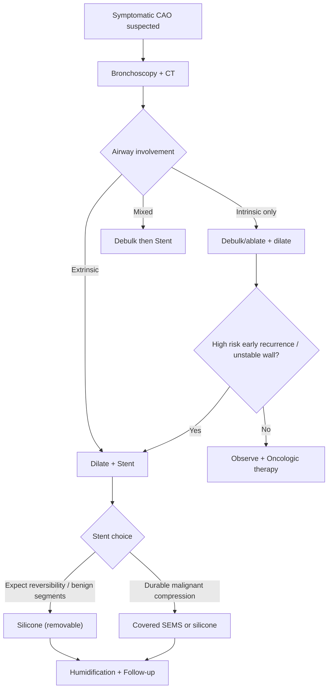
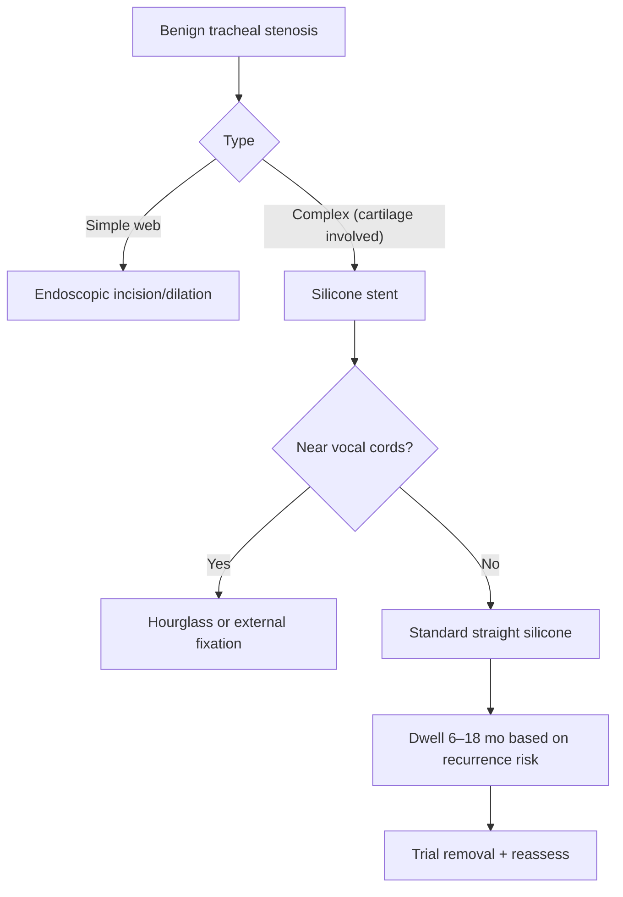
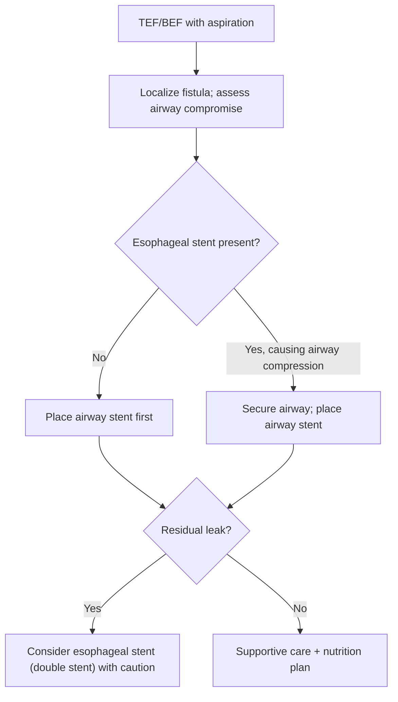

Airway Stents

Exam Mapping & Scope

This chapter covers device selection, indications/contraindications, sizing and deployment, complication prevention/management, and special scenarios (post-transplant anastomotic disease, tracheobronchomalacia, and aerodigestive fistulas). The emphasis is on practical, exam-relevant decisions for malignant and non-malignant central airway obstruction (CAO), including contemporary options (customized/3D-printed and bioabsorbable stents).

Learning Objectives

By the end of this chapter, learners should be able to:

Classify CAO as intrinsic, extrinsic, or mixed and choose an appropriate bronchoscopic/stent strategy.
Select the right stent type (silicone vs. covered self-expanding metallic vs. newer options) for malignant and benign disease.
Size, load, deploy, and remove silicone stents using rigid bronchoscopy; apply key measurements (diameter, length, margins).
Anticipate, prevent, and manage early/late complications (migration, granulation, mucus impaction, infection).
Manage special populations: Post-intubation/tracheostomy stenosis, transplant anastomotic disease, tracheobronchomalacia, and aerodigestive fistulas.
Interpret the current evidence (e.g., randomized data for stenting in malignancy; regulatory cautions for benign disease) and evolving technologies (3D-printed, bioabsorbable, drug-eluting devices).

High-Yield One-Pager (Pearls, Pitfalls, Exam Traps)

Classify the obstruction: Intrinsic (endoluminal), extrinsic (compression), or mixed. Debulk intrinsic, stent extrinsic/mixed; reassess need after oncologic therapy.
Silicone is king in benign disease: Removable, customizable, safer long-term profile; avoid uncovered or partially covered metallic stents in benign disease.
Sizing rules that show up on exams: Extend ~5 mm beyond both ends of the lesion. Typical diameters: trachea 14–16 mm; mainstem 12–13 mm; bronchus intermedius 10–11 mm. Slightly oversize when no rigid anchor is present (e.g., malacia, fistula).
Deployment: Rigid bronchoscopy under general anesthesia is standard for silicone; measure length endoscopically; dilate before deployment; complete expansion with balloon or rigid instruments if needed.
Migration risk: Rises with under-sizing or post-therapy tumor involution; consider hourglass stents or external fixation when necessary; Y or Oki stents reduce migration at the carina/primary right carina.
Mucus impaction kills: Prevent with humidification and saline nebulization; ensure airway toilet plans post-op; early bronchoscopic follow-up.
Granulation at edges: Minimize shear (good fit, gentle landing zones), treat with mechanical/thermal tools; exchange stent if recurrent.
TEF or BEF: Airway stent first when double stenting is needed; beware pressure necrosis when both airway and esophageal stents are present.
Tracheobronchomalacia: Use silicone stent as a trial to predict benefit before external surgical stabilization; long-term permanent stenting for malacia is fraught with problems.
Transplant anastomosis: Removable stents preferred; bifurcated silicone often needed when disease is close to secondary carinae.
SPOC RCT takeaway: Therapeutic bronchoscopy improves dyspnea; the stent arm reduces repeat bronchoscopies and sustains symptom relief longer.
3D-printed/bioresorbable: Promising for complex anatomy or temporary support, but not yet the default; choose standard devices for urgent palliation.
Cost note: Silicone stents are substantially less expensive (on the order of 1.5–2× less than auto-expanding metal devices).
Annual reassessment: Plan annual evaluation and replacement for silicone stents if the ongoing indication persists.
Exam trap: Do not place a stent as the first move in a chemo-naïve, purely intrinsic malignancy if you can debulk and expect a quick response to systemic therapy—use a stent only when clinically necessary.
Another trap: Pushing a silicone stent distally to reposition risks perforation—reposition proximally with rigid forceps instead.

Core Concepts

Pathophysiology / Epidemiology (Brief, Exam-Practical)

Central airways (trachea, mainstem bronchi, bronchus intermedius) fail from: (1) intrinsic tumor/scar narrowing; (2) extrinsic compression by masses/adenopathy; or (3) mixed disease. Additional structural failure includes malacia/polychondritis and anastomotic ischemia after transplantation. Fistulas (tracheoesophageal or bronchoesophageal; post-resection bronchopleural) create contamination/aspiration risk and often require sealing plus airway scaffolding.

Indications & Contraindications

Indications (High-yield five):

Counteract extrinsic compression from tumor/adenopathy.
Stabilize patency after debulking of endoluminal cancer.
Treat benign strictures (e.g., post-intubation/tracheostomy, post-transplant anastomotic).
Stabilize malacia/polychondritis (often as a temporary trial).
Seal fistulas (tracheoesophageal, bronchoesophageal; post-resection stump dehiscence).

Contraindications (Relative/Strategic):

Intraluminal tumor: Ablate/debulk first; stent only if needed.
Benign disease: Use removable stents; avoid uncovered/partially covered metallic devices owing to fracture/ingrowth and difficult removal.
Nonfunctioning distal lung: If extensive necrosis/cavitation is present, re-expansion by stenting is unlikely to help.
Severe physiologic frailty: May preclude benefit except for palliation of intractable dyspnea.

Pre-procedure Evaluation (Imaging, Labs, Risk, Consent)

CT: Thin slices; lung windows; measure minimal/normal diameters and lesion length; identify carina/secondary carina relationship.
Bronchoscopic assessment: (Flexible followed by rigid if intervening) classify obstruction; obtain tactile feel of rigidity; measure lesion length endoscopically.
Plan margins: ~5 mm beyond proximal and distal disease.
Device selection: Based on indication, anatomy, expected reversibility (malignancy on therapy vs. fixed benign), and removability needs.
Optimization: Anticoagulation plan; airway clearance strategy; consent to include possible need for thermal/mechanical debulking, tracheostomy, or emergent airway maneuvers.

Equipment & Setup (Practical Details)

Rigid bronchoscope: Under general anesthesia for silicone stents (standard of care).
Dilation tools: Rigid barrel dilation; balloons as needed.
Loading/Delivery: Dedicated applicator for silicone; flexible or rigid techniques for covered SEMS; fluoroscopy as adjunct.

Stent options (non-exhaustive):

Silicone: Straight, hourglass, Y (including Oki/right carina variants); radiopaque markers; customizable fenestrations.
Covered SEMS (nitinol): Straight/Y; easier deployment; consider removability limits.
Specialty: Customized (3D-printed) silicone; bioabsorbable (polydioxanone) where temporary support is desired.

Step-by-Step Technique / Procedural Checklist

Airway control: Rigid scope; oxygenation strategy coordinated with anesthesia.
Debulk/dilate: Remove intraluminal tumor; dilate stenosis with rigid barrel or balloon.
Size: Confirm length/diameter intraoperatively; target 14–16 mm (trachea), 12–13 mm (mainstem), 10–11 mm (bronchus intermedius); slightly oversize for malacia/fistulas to reduce migration.
Load: Stent into the applicator; advance distal to lesion; deploy.
Position and expand: Pull proximally into place with rigid forceps; complete expansion using balloon/rigid tube or forceps if incompletely opened. Avoid forceful distal pushing.
Ventilation strategy: Fenestrate silicone (on table) for lobar orifices when needed (e.g., RUL with Y stents) or add distal limbs (Borgne technique).
Post-deployment check: Assess airway clearance, leak sealing (if fistula), and hemostasis.
Removal technique (when indicated): Grasp proximal edge, rotate 360°, tuck 2–3 mm into the rigid bevel, and withdraw en bloc to protect larynx/vocal cords.

Troubleshooting & Intra-procedure Management

Incomplete opening: Balloon dilate or use rigid instruments to seat/expand.
Migration at deployment: Reassess fit; choose hourglass or increased diameter; consider Y-configuration for carinal disease; external fixation in select subglottic settings.
Fistula not fully sealed: Look for residual side leak; upsize or add sealing rings/adjacent coverage; consider combined esophageal stenting (airway first).
Difficult anatomy (angulated/branched): Consider customized/3D-printed silicone; trial fit on a model when available (elective cases).

Post-procedure Care & Follow-up

Humidification and saline nebulization two to three times daily to reduce mucus impaction.
Early follow-up bronchoscopy if heavy secretions or high-risk edges; otherwise protocolized reassessment.
Annual reassessment and replacement for silicone stents if indication persists; earlier if complications.
Microbiologic surveillance is reasonable when colonization is suspected; remove/replace stents impacted with infected secretions.

Complications (Prevention, Recognition, Management)

Migration (~10% range): Most often from under-sizing or post-therapy tumor shrinkage; manage by rigid extraction and refitting; hourglass design or fixation reduces risk.
Granulation (~8%): At edges; treat with mechanical/thermal tools; exchange if recurrent.
Mucus impaction (~3–4%): Can be life-threatening; emphasize humidification, airway clearance, early bronchoscopy for de-obstruction.
Bacterial colonization: Consider stent exchange if associated with refractory secretions.
Metallic-specific: Risk of fracture/ingrowth (especially uncovered/partial coverage) and difficult removal—avoid these in benign disease.

Special Populations

Post-intubation/post-tracheostomy tracheal stenosis (PITTS):

Simple web: Often no stent; dilate or incise.
Complex cartilaginous: Silicone preferred; migration risk increases near vocal cords; hourglass or fixation helpful. Longer dwell (up to ~18 months) associates with higher long-term patency after removal than shorter dwell.

Lung transplant anastomotic disease:

Ischemia/scar common; removable stents favored; anticipate mucus, scarring, colonization; silicone Y often necessary when disease abuts secondary carinae; many patients can be decannulated from stents after healing.

Tracheobronchomalacia:

Reserve stents as temporary trials for symptom prediction before surgical external stabilization; straight silicone is prone to migration in flexible dyskinetic airways—size carefully.

Aerodigestive fistulas:

Malignant TEF/BEF: Airway stent first; esophageal stent next if needed; beware pressure necrosis in double stenting.
Post-pneumonectomy/lobectomy stump fistula: Surgery preferred; silicone stent is a temporizing/alternative option in nonsurgical candidates.

Evidence & Outcomes (Selected)

Therapeutic bronchoscopy for malignant CAO: Improves dyspnea; stents prolong symptom control and reduce re-interventions in randomized and cohort data.
Covered nitinol SEMS: Easier to deploy but carry different removal/ingrowth profiles than silicone; uncovered/partially covered devices are discouraged in benign disease.
Customized/3D-printed silicone: Fits complex anatomy well with symptomatic/functional gains, but still shows mucus/migration in a meaningful minority.
Bioabsorbable polydioxanone stents: Provide temporary scaffolding with promising early results; ongoing studies evaluate durability and ideal degradation profiles.

Diagnostic & Therapeutic Algorithms

Algorithm 1 — Malignant Central Airway Obstruction (CAO)

Companion Notes:

Confirm CAO, define intrinsic/extrinsic/mixed.
Intrinsic → debulk first; add stent if recurrence risk or wall instability.
Extrinsic/mixed → dilate then stent.
Stent choice: Silicone if removability desired/benign segments; covered SEMS or silicone in durable malignant compression.
Post-procedure: Humidification, airway clearance plan, early surveillance.

Algorithm 2 — Benign Tracheal Stenosis (PITTS)

Companion Notes:

Simple web → incise/dilate; usually no stent.
Complex stenosis → silicone; consider hourglass/fixation near cords.
Plan longer dwell (up to ~18 months) when safe; trial removal with close follow-up.

Algorithm 3 — Aerodigestive Fistula (TEF/BEF)

Companion Notes:

Secure airway; airway stent before esophageal when double stenting is needed.
Avoid excess pressure between stents; reassess aspiration, pneumonia control, and nutrition route.

Tables & Quick-Reference Boxes

Table 1. Choosing a Stent: Features at a Glance

| Feature        | Silicone                                            | Covered SEMS (nitinol)                                 | Uncovered/Partially Covered SEMS            |
| -------------- | --------------------------------------------------- | ------------------------------------------------------ | ------------------------------------------- |
| Deployability  | Requires rigid bronchoscopy; general anesthesia     | Easier deployment; flexible or rigid                   | Easier to deploy                            |
| Removability   | Excellent; customizable                             | Variable; usually removable but more challenging       | Problematic; embed/ingrowth                 |
| Best use cases | Benign disease; reversible malignant CAO; carinal Y | Malignant CAO, especially when quick deployment needed | Avoid in benign (fracture/ingrowth)         |
| Common risks   | Migration, mucus, granulation                       | Mucus, granulation, fracture with time                 | Tumor ingrowth, fracture, difficult removal |
| Cost           | Lower (often ~1.5–2× less than metal)               | Higher                                                 | Variable                                    |

Abbreviations: SEMS—self-expanding metallic stent; CAO—central airway obstruction.

Table 2. Practical Sizing & Margins (Silicone Stents)

| Segment              | Typical diameter (outer) | Notes                                           |
| -------------------- | ------------------------ | ----------------------------------------------- |
| Trachea              | 14–16 mm                 | Extend ~5 mm beyond both lesion ends            |
| Mainstem bronchus    | 12–13 mm                 | Consider Y/Oki for carinal/right carina disease |
| Bronchus intermedius | 10–11 mm                 |                                                 |
| Fistula/malacia      | Slight oversize          | Improves seal and reduces migration             |

Abbreviations: Oki—primary right carina-adapted bifurcated silicone stent.

Table 3. Complications & How to Handle Them

| Complication            | Prevention                                        | Management                                                  |
| ----------------------- | ------------------------------------------------- | ----------------------------------------------------------- |
| Migration (≈10%)        | Correct sizing; hourglass/Y; fixation when needed | Rigid extraction; upsize or change design                   |
| Granulation (≈8%)       | Smooth landing zones; avoid excessive motion      | Mechanical/thermal debulking; stent exchange                |
| Mucus impaction (≈3–4%) | Humidification; saline nebulization; early toilet | Bronchoscopic clearance; stent removal/exchange if infected |
| Bacterial colonization  | Humidification; minimize mucus stasis             | Treat infection; consider exchange if persistent            |

Table 4. Indications—Device Strategy Snapshot

| Indication                      | Preferred approach                                             |
| ------------------------------- | -------------------------------------------------------------- |
| Extrinsic malignant compression | Dilate + stent (silicone or covered SEMS)                      |
| Mixed malignant CAO             | Debulk then stent                                              |
| Simple post-intubation web      | Endoscopic incision/dilation (no stent)                        |
| Complex benign/tracheal         | Silicone (consider hourglass/fixation near cords)              |
| Transplant anastomosis          | Removable stent; often bifurcated silicone                     |
| TEF/BEF                         | Airway stent first; consider esophageal stent next             |
| Tracheobronchomalacia           | Trial silicone; proceed to surgical stabilization if responder |

Abbreviations: TEF—tracheoesophageal fistula; BEF—bronchoesophageal fistula.

Imaging & Figure Callouts

Figure A. Tracheal tumor causing near-critical stenosis before and after silicone stent placement. Alt text: Endoscopic view of nearly occlusive tracheal mass, followed by restored lumen with a visible silicone stent.

Figure B. Hourglass silicone stent bridging a short, high-grade subglottic stenosis. Alt text: Endoscopic image showing a waist at the lesion with wider ends anchoring above and below.

Figure C. Bifurcated Y silicone stent across the main carina preserving lobar ventilation via fenestration. Alt text: Trifurcated stent limbs visible in trachea and main bronchi with a small fenestration for RUL.

Cases & Applied Learning

Case 1

A 68-year-old with squamous cell lung cancer has 80% obstruction of the left main bronchus from a friable endoluminal mass. No extrinsic compression. Best next step?

A. Covered SEMS now B. Rigid bronchoscopy with debulking; consider stent only if needed C. External beam radiation first D. Silicone stent now E. Esophageal stent

Answer: B. Purely intrinsic disease is debulked first; place a stent only if high recurrence risk or unstable wall after debulking.

Case 2

A 54-year-old with TEF after chemoradiation has an esophageal stent placed yesterday and now has worsening stridor. Next step?

A. Remove esophageal stent B. Airway stent placement now C. Tracheostomy only D. Keep NPO and observe E. Silicone stent in esophagus

Answer: B. Secure the airway with an airway stent first; esophageal stenting alone can compress the airway.

Case 3

A 42-year-old with complex post-intubation tracheal stenosis 1 cm below the cords. Which device decreases migration risk?

A. Uncovered nitinol stent B. Covered SEMS C. Hourglass silicone stent D. Straight silicone stent undersized by 1 mm E. No stent

Answer: C. Hourglass silicone provides anchoring near the cords, reducing migration in short, high-grade tracheal lesions.

Question Bank (MCQs)

Next best step—malignant CAO (mixed): After debulking a mixed lesion in the bronchus intermedius, residual extrinsic compression persists. A. Observe B. Covered SEMS or silicone stent C. Radiation only D. Tracheostomy E. Jet ventilation therapy Answer: B. Mixed disease typically requires debulking plus stenting.
Procedural troubleshooting: A newly placed tracheal silicone stent fails to fully expand proximally. A. Push distally hard until it opens B. Remove and abandon stenting C. Balloon dilate or use rigid barrel/forceps to complete expansion D. Place an esophageal stent E. Start radiation Answer: C. Complete expansion with balloon or rigid instruments; avoid forceful distal pushing.
Indications: Which patient is least likely to benefit from airway stenting? A. Extrinsic compression by nodal conglomerate B. TEF with aspiration C. Complex post-intubation tracheal stenosis D. Large cavitary distal lung with absent ventilation E. Post-transplant anastomotic stenosis Answer: D. Nonfunctioning distal lung is a poor target for re-expansion.
Contraindicated choice in benign disease: A. Straight silicone B. Hourglass silicone C. Covered SEMS D. Uncovered/partially covered SEMS E. Bifurcated silicone Y Answer: D. Avoid uncovered/partially covered SEMS in benign disease due to ingrowth/fracture and difficult removal.
Sizing rule (exam classic): Standard margin beyond each end of the lesion when placing a silicone stent is approximately: A. 1 mm B. 3 mm C. 5 mm D. 10 mm E. No margin is necessary Answer: C. Extend about 5 mm proximally and distally.
Sedation/oxygenation & technique: For silicone stent deployment the recommended setup is: A. Flexible bronchoscopy with conscious sedation B. Rigid bronchoscopy under general anesthesia C. Fluoroscopy alone D. High-flow nasal oxygen and no bronchoscopy E. LMA and flexible bronchoscopy only Answer: B. Silicone stents are deployed with rigid bronchoscopy under GA.
Preventing migration near vocal cords (PITTS): A. Undersize by 1–2 mm B. Use hourglass design or external fixation C. Choose uncovered metal stent D. Use straight silicone regardless of fit E. Avoid dilation Answer: B. Hourglass or fixation reduces migration in short, proximal tracheal stenosis.
Complication prevention: The single most effective daily measure to reduce mucus impaction is: A. Prophylactic antibiotics B. Nebulized saline and humidification C. Routine steroid inhalers D. Anticholinergic nebulizers E. Chest physiotherapy alone Answer: B. Humidification and saline help prevent impaction.
Transplant anastomotic stenosis: Best initial device strategy: A. Uncovered SEMS for epithelialization B. Removable silicone (often bifurcated near secondary carinae) C. No stent—balloon only D. Permanent covered SEMS E. Immediate tracheobronchoplasty Answer: B. Removable silicone, frequently bifurcated, is preferred.
Tracheobronchomalacia management: A. Permanent stenting is standard of care B. Use a temporary silicone stent trial; if symptomatic improvement, consider surgical stabilization C. Uncovered SEMS for dynamic collapse D. Esophageal stent for airway stabilization E. Avoid bronchoscopy Answer: B. Stent trial predicts benefit before surgery.
Fistula sequencing: In planned double stenting for malignant TEF, the recommended order is: A. Esophagus first B. Airway first C. Either order D. Neither—avoid double stenting E. Tracheostomy before either Answer: B. Airway stent first, then esophagus if needed.
Procedural troubleshooting—recurrent migration post-therapy shrinkage: A. Observe only B. External fixation always C. Replace with larger or hourglass silicone; consider Y if near carina D. Switch to uncovered SEMS E. Add an esophageal stent Answer: C. Upsize/change design; Y reduces migration near carina.

Controversies, Variability, and Evolving Evidence

Stent in chemo-naïve malignancy: Some centers defer unless airway instability persists after debulking; randomized data show symptom gains and fewer re-interventions with stenting, but overall survival benefit remains uncertain.
Covered SEMS vs. silicone in malignant CAO: Easier deployment vs. removability/customization trade-offs; institutional experience matters.
Benign disease: Strong preference for removable silicone; warnings persist against uncovered or partially covered metal devices.
3D-printed/custom silicone: Excellent fit for complex geometry yet nontrivial rates of mucus/migration remain; logistics/regulatory pathways can delay urgent care—temporary standard stent often used while customized device is built.
Bioabsorbable: Attractive for temporary scaffolding (including post-transplant), but optimal degradation kinetics and re-stenosis risk require further study.
Drug-eluting: Promising for reducing granulation or delivering local antineoplastic therapy; clinical proofs are early.

Take-Home Checklist

Classify CAO (intrinsic/extrinsic/mixed) and treat intrinsic with debulking first.
Plan margins ~5 mm beyond lesion; size trachea 14–16 mm; mainstem 12–13 mm; BI 10–11 mm.
Rigid bronchoscopy under GA for silicone; dilate before deployment.
For benign disease and likely reversibility, choose removable silicone; avoid uncovered/partial SEMS.
Consider hourglass/Y/Oki designs for subglottic/carina/right carina disease; oversize in malacia/fistula.
Prevent mucus: Humidification + saline nebulization; arrange early bronchoscopic follow-up.
Recognize and treat complications promptly (migration, granulation, mucus).
For TEF/BEF, airway stent first; double stenting with caution.
In TBM, use stent trial to predict benefit before surgery.
In transplant disease, favor removable silicone, often bifurcated.
Annual reassessment/replacement of silicone if still indicated.

Abbreviations & Glossary

AOF/TEF/BEF: Airway-/Tracheo-/Broncho-esophageal fistula
BI: Bronchus intermedius
CAO: Central airway obstruction
CPAP: Continuous positive airway pressure (adjunct for malacia when stent not used)
DES: Drug-eluting stent
PITTS: Post-intubation or post-tracheostomy tracheal stenosis
SEMS: Self-expanding metallic stent
TBM: Tracheobronchomalacia
Y/Oki stent: Bifurcated silicone stents (Oki variant for primary right carina)

References

Dumon JF. A dedicated tracheobronchial stent. Chest. 1990;97:328-332.
Freitag L. Airway stents. Eur Respir Mon. 2010;48:190-217.
Cavaliere S, Venuta F, Foccoli P, Toninelli C, La Face B. Endoscopic treatment of malignant airway obstruction in 2008 patients. Chest. 1996;110:536-542.
Chaddha U, Agrawal A, Kurman J, et al. World Association for Bronchology and Interventional Pulmonology (WABIP) guidelines on airway stenting for malignant central airway obstruction. Respirology. 2024;29:563-573.
Dutau H, Di Palma F, Thibout Y, et al. Impact of silicone stent placement in symptomatic airway obstruction due to non-small cell lung cancer: the SPOC Trial. Respiration. 2020;99:344-352.
Ernst A, Majid A, Feller-Kopman D, et al. Airway stabilization with silicone stents for treating adult tracheobronchomalacia: a prospective observational study. Chest. 2007;132:609-616.
Murgu SD, Colt HG. Complications of silicone stent insertion in patients with expiratory central airway collapse. Ann Thorac Surg. 2007;84:1870-1877.
U.S. Food and Drug Administration. Public Health Notification: complications from metallic tracheal stents in patients with benign airway disorders. 2005.
Breitenbücher A, Chhajed PN, Brutsche MH, et al. Long-term follow-up and survival after Ultraflex stent insertion in complex malignant airway stenoses. Respiration. 2008;75:443-449.
Dutau H, Cavailles A, Sakr L, et al. Silicone stent placement for anastomotic airway complications in lung transplant recipients: short- and long-term outcomes. J Heart Lung Transplant. 2010;29:658-664.
Martinod E, Dutau H, Guibert N. Management of airway complications after lung transplantation: is there an ideal stent? J Thorac Dis. 2022;14:3111-3115.
Guinde J, Bismuth J, Laroumagne S, et al. Bifurcated silicone stents for anastomotic complications in lung transplantation: ten years’ experience. Respiration. 2022;101:675-682.
Sawal N, Pennington KM, Petrossian R, et al. Custom silicone Y-stents for anastomotic stenosis in lung transplant recipients. Respir Med. 2024;8(231):107737.
Watanabe S, Shimokawa S, Yotsumoto G, et al. Use of a Dumon stent for the treatment of a bronchopleural fistula. Ann Thorac Surg. 2001;72:276-278.
Wang Q, Chen Y, Xu Y, et al. Palliation of malignant esophageal stent esophagorespiratory fistula with rigid bronchoscope and Y silicone trachea stent: experience with seven patients. J Thorac Dis. 2024;29(16):948-959.
Guibert N, Didier A, Moreno B, et al. Treatment of complex airway stenoses using patient-specific 3D engineered stents: a proof-of-concept study. Thorax. 2019;74(8):810-813.
Freitag L, Gördes M, Zarogoulidis P, et al. Towards individualized tracheobronchial stents: technical, practical and legal considerations. Respiration. 2017;94:442-456.
Stehlik L, Guha D, Anandakumar S, Taskova A, Vasakova MK. Biodegradable tracheal stents: our ten-year experience with adult patients. BMC Pulm Med. 2024;24(1):238.
Lischke R, Pozniak J, Vondrys D, Elliott MJ. Novel biodegradable stents in the treatment of bronchial stenosis after lung transplantation. Eur J Cardiothorac Surg. 2011;40:619-624.
Chao YK, Liu KS, Wang YC, Huang YL, Liu SJ. Biodegradable cisplatin-eluting tracheal stent for malignant airway obstruction: in vivo and in vitro studies. Chest. 2013;144(1):193-199.
Xu J, Ong HX, Traini D, Williamson J, Byrom M, Gomes Dos Reis L, et al. Paclitaxel-eluting silicone airway stent for preventing granulation tissue growth and lung cancer relapse. Expert Opin Drug Deliv. 2020;17(11):1631-1645.
Paunović N, Bao Y, Coulter FB, et al. Digital light 3D printing of customized bioresorbable airway stents with elastomeric properties. Sci Adv. 2021;7(6):eabe9499.
Dutau H, Breen D, Bugalho A, et al. Current practice of airway stenting in adults in Europe: EABIP survey. Respiration. 2018;95:44-54.
Noppen M, Pierard D, Meysman M, et al. Bacterial colonization of central airways after stenting. Am J Respir Crit Care Med. 1999;160:672-677.
Oki M, Saka H. New dedicated bifurcated silicone stent placement for stenosis around the primary right carina. Chest. 2013;144:450-455.
