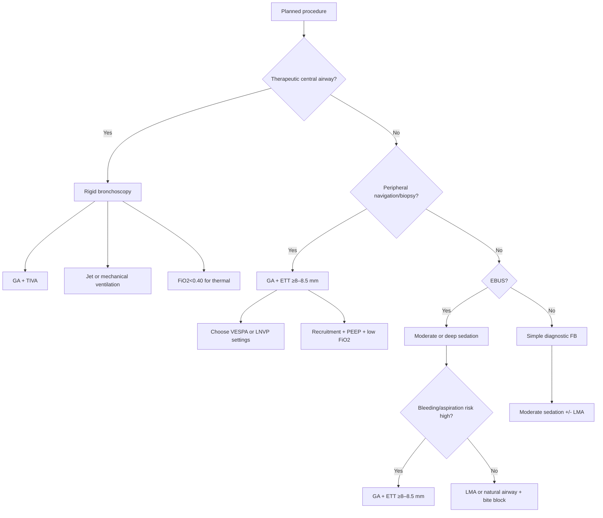
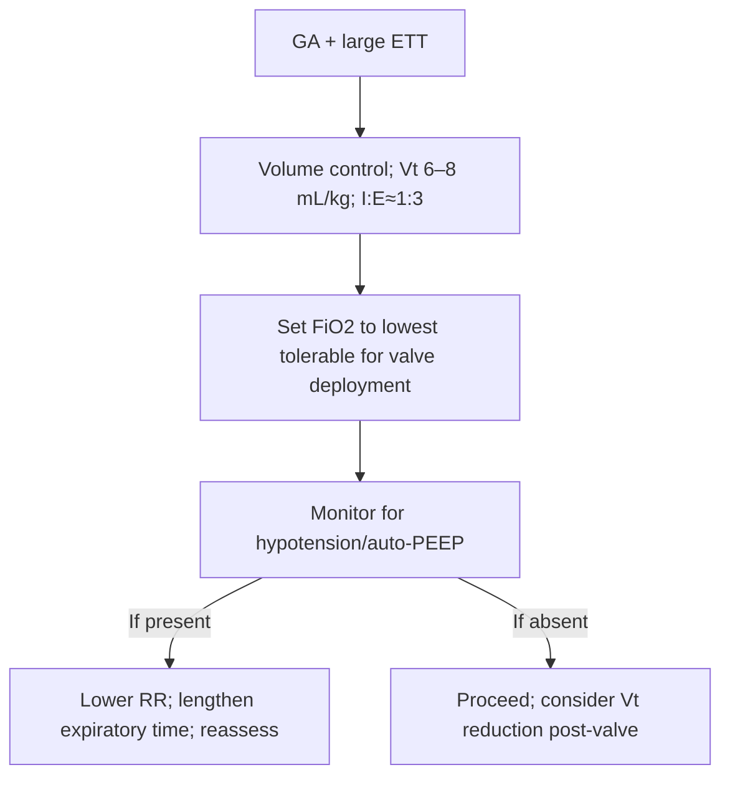

Anesthesia for IP


Exam Mapping & Scope

This chapter covers anesthetic and airway strategies for interventional pulmonology (IP) procedures with emphasis on endobronchial ultrasound (EBUS), peripheral bronchoscopy (including robotic platforms), rigid bronchoscopy for central airway obstruction, and bronchoscopic lung volume reduction (BLVR). Domains include sedation strategy and monitoring, airway device selection, ventilatory approaches to minimize atelectasis, oxygen management during thermal and non‑thermal therapies, mediastinal mass considerations, pleuroscopy/MAC anesthesia, and complication prevention and rescue.

Learning Objectives

Choose an anesthetic plan and airway device tailored to EBUS, peripheral navigation/biopsy, therapeutic rigid bronchoscopy, and BLVR.

Apply ventilatory strategies (PEEP, FiO₂ titration, recruitment maneuvers) that reduce atelectasis and improve peripheral bronchoscopy performance.

Integrate oxygen safety rules for thermal ablation and newer modalities and mitigate pneumothorax risk during BLVR.

Anticipate and manage challenges in mediastinal mass, severe COPD/hyperinflation, and high aspiration risk.

Execute crisis responses for hypoxemia, air‑trapping, airway fire risk, and massive hemoptysis.

High‑Yield One‑Pager

Sedation continuum is defined by responsiveness, not drug choice. Use MOAA/S, RASS, or Ramsay to target depth.

Topical lidocaine reduces cough and sedation requirements; avoid benzocaine/tetracaine (methemoglobinemia risk).

Midazolam (preferred benzodiazepine) + fentanyl provides synergistic sedation/analgesia when moderate sedation is appropriate.

Routine anticholinergics (atropine/glycopyrrolate) are not helpful for secretions or lung function in bronchoscopy.

Airway device selection matters:

LMA—excellent access to upper trachea, but less secure if bleeding/aspiration risk.

ETT—most secure and best for high bleeding risk; use ≥8–8.5 mm ID for EBUS to preserve ventilation.

Rigid bronchoscope—therapeutic workhorse for central obstruction and bleeding control.

EBUS sedation: Moderate or deep sedation are acceptable; no universal mandate for artificial airway.

Atelectasis is common under GA and degrades peripheral yield. Risk rises with time and BMI; prevention is testable.

Two validated strategies to reduce intraprocedural atelectasis:

VESPA: ETT, immediate recruitment, PEEP 8–10 cmH₂O, FiO₂ &lt;100%.

LNVP: ETT, post‑intubation recruitment, higher PEEP targets (up to 15–20 cmH₂O by lobe), tidal volumes 10–12 mL/kg IBW, brief breath‑holds for imaging.

Thermal modalities (laser/electrocautery/APC): keep FiO₂ &lt;0.40 to prevent airway fire.

Spray cryotherapy: Disconnect to allow gas egress; preoxygenate before each spray; watch for barotrauma/gas embolism.

BLVR: Most centers use GA with ETT; use low tidal volumes, long expiratory times, and lowest tolerable FiO₂ during valve deployment to lower pneumothorax risk.

Mediastinal mass: Positive‑pressure ventilation with neuromuscular blockade can be safe; avoid hyperinflation by prolonging expiration.

Massive hemoptysis algorithm: Bleeding side down → isolate lung (large ETT + blocker or DLT) → rigid bronchoscopy for stabilization → definitive therapy (e.g., embolization).

Core Concepts
Pathophysiology / Epidemiology

Atelectasis under GA develops quickly, especially in dependent segments; it blurs targets, causes CT‑to‑body divergence, and reduces navigation accuracy. In a prospective cohort, most patients had dependent segment atelectasis within ~30 minutes of induction; higher BMI and longer time increased risk.

COPD/hyperinflation complicates BLVR and central airway procedures: incomplete exhalation increases auto‑PEEP, causes hypotension, and raises barotrauma risk.

Mediastinal mass can compress airway and vascular structures; dynamic changes during ventilation require vigilant planning and titration.

Indications & Contraindications

Moderate sedation—simple diagnostic bronchoscopy and selected EBUS in stable patients without high aspiration/bleeding risk.

Deep sedation/GA—advanced peripheral navigation (including robotic), therapeutic debulking/stenting, rigid bronchoscopy, BLVR, high bleeding risk, challenging airway, or prolonged procedures.

Relative contraindications to LMA: high aspiration risk, anticipated major bleeding, or need to access subglottic/proximal tracheal pathology securely.

Pre‑procedure Evaluation

Airway & aspiration risk: NPO optimization; identify reflux, gastroparesis, or full stomach risk.

Review chest CT carefully for EBUS and central lesions: ETT can obscure upper tracheal targets and high mediastinal stations; transoral without an artificial airway requires a bite block.

Sedation targets: Choose and document MOAA/S or RASS target.

Adjuncts: Topical lidocaine to airway; avoid benzocaine/tetracaine.

Mediastinal mass: Assess airway caliber and hemodynamic risk; plan rescue (rigid scope, ECMO readiness depending on center).

Equipment & Setup

Airway devices:

LMA (second generation preferred) for advanced diagnostic work with good tracheal access.

ETT: ≥8–8.5 mm ID when using EBUS scopes to maintain a ventilation lumen; ≥8.5–9.0 mm improves margin for gas exchange.

Rigid bronchoscope: enables simultaneous ventilation and passage of rigid tools; essential for silicone stent deployment and bleeding control.

Ventilation: Modern anesthesia ventilators; jet ventilator available for rigid bronchoscopy.

Thermal/cryotherapy safety: Oxygen blender at the field; suction; saline; airway fire plan.

Step‑by‑Step Technique / Procedural Checklist

Team brief: procedure goals, expected depth of sedation, airway device, ventilation plan, and fire/bleeding contingency.

Sedation plan:

Moderate—midazolam + fentanyl; titrate to scale.

Deep/GA—TIVA favored (stable depth despite suction/open circuits); use neuromuscular blockade when motion‑free field is essential.

Airway device placement: based on procedure and bleeding/aspiration risk.

Ventilation setup:

Peripheral bronchoscopy: choose VESPA or LNVP‑style settings (see algorithms).

Rigid bronchoscopy: set jet or mechanical ventilation and leak mitigation (packing, caps).

Oxygen policy:

Thermal ablation: FiO₂ &lt;0.40 during energy delivery.

BLVR: use lowest tolerable FiO₂ during valve deployment.

Intra‑procedure: minimize wedging; monitor for rising airway pressures; repeat recruitment if circuit is opened (where protocolized).

Extubation & recovery: treat cough (topical lidocaine, short‑acting opioids as needed); monitor for pneumothorax or hypoventilation.

Troubleshooting & Intra‑procedure Management

Hypoxemia during peripheral bronchoscopy: confirm FiO₂/PEEP, perform recruitment maneuver, suction plugs, avoid over‑wedging, consider repositioning.

Hypotension during high PEEP strategies (LNVP): reduce PEEP to improve venous return; exclude pneumothorax or pneumomediastinum; give fluids/vasopressors as needed.

Bronchospasm: volatile bronchodilator (brief sevoflurane run) or bronchodilator via the bronchoscope; deepen anesthesia.

Airway fire prevention: FiO₂ &lt;0.40, communication before energy activation, pause oxygen briefly if needed.

Air‑trapping in central obstruction: lengthen expiratory time (I:E 1:3 or longer), consider brief disconnection, suction distal to lesion to deflate trapped gas.

Spray cryotherapy: disconnect ventilator (cuff down or LMA/rigid port open) for gas egress; resume oxygenation between cycles.

Massive hemoptysis: bleeding‑side‑down position; secure and isolate airway (large ETT + blocker or DLT); move to rigid bronchoscopy; plan definitive hemostasis (e.g., embolization).

Post‑procedure Care & Follow‑up

Peripheral/BLVR: Observe for pneumothorax (especially after BLVR), hypoventilation, delayed desaturation.

Thermal therapy: reassess for delayed airway edema or secretions; ensure safe FiO₂ in PACU if re‑instrumentation likely.

High‑PEEP cases: continue hemodynamic surveillance until PEEP normalized.

Complications (Prevention, Recognition, Management)

Atelectasis: Prevent with PEEP and recruitment; minimize FiO₂; shorten time under GA before navigation.

Pneumothorax/pneumomediastinum: More likely with high PEEP or aggressive breath‑holds; treat promptly with decompression when indicated.

Airway fire: Strict FiO₂ control during thermal energy.

Bleeding: Prepare topical agents, tamponade with rigid scope, isolate lung if massive; escalate to IR/surgery.

Hypercapnia/air‑trapping: Adjust I:E, reduce rate, suction beyond lesion.

Aspiration: Mitigate with NPO, semi‑upright induction, rapid sequence when indicated, gastric suction via SGA with drain channel.

Special Populations

Mediastinal mass: GA with neuromuscular blockade and positive pressure can widen airway; key is to prevent hyperinflation—use low rates and prolonged exhalation. Have rigid bronchoscope available; discuss rescue options (including ECMO in select centers).

Severe COPD/BLVR candidates: Favor low tidal volumes (≈6–8 mL/kg), long expiratory times (I:E ≈1:3), and volume‑controlled ventilation; anticipate hypoxemia during collateral ventilation assessment.

Obesity: Higher PEEP may be needed to prevent airway closure; watch for hemodynamic effects.

Evidence & Outcomes (Key Data You Should Know)

EBUS sedation: Both moderate and deep sedation are acceptable; no universal airway mandate.

Atelectasis incidence under GA: High in dependent segments within ~30–40 minutes; risk increases with BMI and time.

VESPA (Randomized): ETT with immediate recruitment + PEEP 8–10 + FiO₂ &lt;100% markedly reduces atelectasis vs LMA with 100% FiO₂ and 0 PEEP, without increasing complications.

LNVP (Retrospective/Series): ETT, recruitment, higher PEEP (10–20 cmH₂O by lobe), Vt 10–12 mL/kg IBW, and imaging breath‑holds reduce dependent and lobar atelectasis; hemodynamic vigilance needed (vasopressor use was common in a larger series).

BLVR anesthesia patterns: GA with ETT predominates; low Vt and long expiratory times are typical. Lower FiO₂ during valve deployment was associated with lower pneumothorax rates and delayed onset when it occurred.

Diagnostic & Therapeutic Algorithms
Algorithm 1 — Choosing the Airway & Anesthetic Plan for Advanced Bronchoscopy



Bulleted parallel algorithm

Central therapeutic work (debulking/thermal/stent): rigid bronchoscopy; GA (TIVA); jet or mechanical ventilation; keep FiO₂ &lt;0.40 for thermal.

Peripheral navigation/biopsy: GA; ETT ≥8–8.5 mm; adopt VESPA or LNVP; recruitment and PEEP; FiO₂ as low as tolerable.

EBUS: moderate or deep sedation acceptable; select LMA/natural airway for upper tracheal access if low risk; choose ETT when aspiration/bleeding risk is high or when stability is essential.

Simple flexible bronchoscopy: moderate sedation, topical lidocaine, consider LMA for comfort and access.

Algorithm 2 — Ventilation to Minimize Atelectasis in Peripheral Bronchoscopy
```mermaid
flowchart TD
A[Induction & ETT placement] --> B[Immediate recruitment]
B --> C{Strategy}
C -- VESPA --> D[PEEP 8–10; Vt 6–8 mL/kg IBW; FiO2 &lt;100%]
C -- LNVP --> E[PEEP 10–15 (upper/mid), 15–20 (lower); Vt 10–12 mL/kg IBW]
E --> F[Breath-holds with APL≈PEEP for imaging]
D --> G{Hemodynamics stable?}
E --> G
G -- No --> H[Lower PEEP; fluids; vasopressors; rule out PTX/PM]
G -- Yes --> I[Proceed to navigation/biopsy]
I --> J[Re-recruit if circuit opened or cuff deflated]
J --> K[Minimize wedging; suction plugs]
```


Bulleted parallel algorithm

After ETT, perform recruitment.

VESPA option: Vt 6–8 mL/kg IBW; PEEP 8–10; titrate FiO₂ below 1.0.

LNVP option: Vt 10–12 mL/kg IBW; PEEP 10–15 cmH₂O (upper/middle) and 15–20 (lower); brief imaging breath‑holds with APL ≈ PEEP.

If hypotension occurs: reduce PEEP; give fluids/vasopressors; exclude pneumothorax/pneumomediastinum.

During procedure: minimize scope wedging; suction selectively; re‑recruit after any disconnection.

(Optional) Algorithm 3 — BLVR Oxygen & Ventilation


Tables & Quick‑Reference Boxes
Table 1. Sedation Continuum & What You Must Provide

| Depth | Responsiveness | Ventilation | Airway | Cardiovascular |
| --- | --- | --- | --- | --- |
| Minimal | Normal response to verbal | Unaffected | Unaffected | Unaffected |
| Moderate | Purposeful response to verbal/tactile | Adequate | No intervention | Usually maintained |
| Deep | Purposeful response to painful | May be inadequate | Intervention may be needed | Usually maintained |
| General anesthesia | Unarousable | Frequently inadequate | Intervention often required | May be impaired |
| Abbreviations: None. |  |  |  |  |
Table 2. Airway Device Selection in Bronchoscopy

| Device | Advantages | Limitations | Typical Uses |
| --- | --- | --- | --- |
| Natural airway (bite block) | No extra equipment; quick | Limited sedation depth; no control if bleeding | Brief diagnostic scopes |
| LMA (2nd gen) | GA possible; adjustable ventilation; excellent access to upper trachea | Aspiration risk; less secure in major bleeding | EBUS, foreign body removal, BLVR (select centers) |
| ETT (≥8–8.5 mm) | Most secure; full ventilator control; better for bleeding | Limited access to proximal trachea; tube may obstruct upper stations | Therapeutic bronchoscopy; EBUS when risk is high |
| Rigid bronchoscope | Airway stabilization, tamponade; deploy silicone stents; pass large instruments | Requires expertise; unique ventilation setup | Central airway obstruction, massive hemoptysis |
| Abbreviations: BLVR—bronchoscopic lung volume reduction; EBUS—endobronchial ultrasound; GA—general anesthesia; LMA—laryngeal mask airway; ETT—endotracheal tube. |  |  |  |
Table 3. Ventilation Protocols to Reduce Atelectasis

| Protocol | Airway | Vt (mL/kg IBW) | PEEP (cmH₂O) | FiO₂ | Recruitment | Notes |
| --- | --- | --- | --- | --- | --- | --- |
| Conventional | Often LMA | Variable | 0–5 | Often 1.0 | None/variable | Higher atelectasis; target obscuration more frequent |
| VESPA | ETT | 6–8 | 8–10 | &lt;100% | Immediate post‑intubation | Major reduction in uni/bilateral atelectasis without extra complications |
| LNVP | ETT | 10–12 | 10–15 (upper/middle); 15–20 (lower) | Lowest tolerable | Four post‑intubation maneuvers; breath‑holds | Lower atelectasis; hemodynamic vigilance (vasopressor use not uncommon) |
| Abbreviations: IBW—ideal body weight; LMA—laryngeal mask airway; ETT—endotracheal tube; PEEP—positive end‑expiratory pressure; Vt—tidal volume. |  |  |  |  |  |  |
Imaging & Figure Callouts (Placeholders)

Figure 1. Dependent Atelectasis Patterns on Radial EBUS. Alt text: Four representative radial EBUS frames illustrating normal lung versus concentric patterns consistent with atelectasis.

Figure 2. Intraprocedural Atelectasis Obscuring a Lower Lobe Target. Alt text: Pre‑procedure CT shows a peripheral nodule; intraprocedural imaging demonstrates new dependent collapse obscuring the lesion.

Figure 3. Rigid Bronchoscope Ventilation Ports. Alt text: Photograph of proximal rigid bronchoscope with jet and circuit adapters.

Cases & Applied Learning

Case 1. A 68‑year‑old with a 15‑mm RLL nodule undergoes robotic bronchoscopy under GA. Thirty minutes in, the nodule is no longer visible on imaging; BMI is 36. Which single change best restores visibility?
A. Increase FiO₂ to 1.0
B. Add PEEP to 10 cmH₂O and perform a recruitment maneuver
C. Increase Vt to 15 mL/kg
D. Switch to an LMA
E. Stop paralysis
Answer: B. Dependent atelectasis is common under GA, especially with higher BMI and longer time. Recruitment and adequate PEEP improve aeration and target visualization.

Case 2. A 60‑year‑old with central airway obstruction requires thermal debulking. During activation, a brief flame appears at the tip. The next best step?
A. Increase FiO₂ to 1.0
B. Continue energy to finish quickly
C. Stop gas flow and suction; ensure FiO₂ &lt;0.40 before resuming
D. Instill epinephrine solution
E. Abort the case
Answer: C. Airway fire prevention requires FiO₂ restriction. Stop energy, ensure low inspired oxygen, and re‑establish a safe field before resuming.

Question Bank (MCQs)

A patient is scheduled for diagnostic bronchoscopy with moderate sedation. What defines the sedation level?
A. Use of propofol
B. Use of midazolam and fentanyl together
C. Patient responsiveness to stimuli
D. End‑tidal CO₂ value
E. Location of care (OR vs suite)
Answer: C. Sedation levels are defined by patient responsiveness (e.g., MOAA/S, RASS), not the specific drugs.

For EBUS‑TBNA targeting upper mediastinal stations, which airway approach most preserves access?
A. 7.0‑mm ETT
B. 8.5‑mm ETT
C. LMA
D. Double‑lumen tube
E. 6.0‑mm nasal ETT
Answer: C. An LMA allows superior access to proximal trachea and upper stations; small ETTs impede scope mobility and ventilation.

During peripheral bronchoscopy under GA, what factor most strongly correlates with atelectasis development?
A. Age
B. History of smoking
C. BMI and time since induction
D. Prior lobectomy
E. Gender
Answer: C. Higher BMI and longer intraoperative time are associated with increased odds of atelectasis.

In VESPA‑style ventilation, the most appropriate immediate step after intubation is:
A. Set PEEP to 0 to avoid hypotension
B. Recruitment maneuver followed by PEEP 8–10 cmH₂O
C. Switch to LMA
D. Increase FiO₂ to 1.0 for the entire case
E. Set I:E to 1:1
Answer: B. VESPA uses immediate recruitment, moderate PEEP, and FiO₂ titration (&lt;100%).

In LNVP, which PEEP target is most appropriate for a right lower lobe lesion?
A. 0–5 cmH₂O
B. 5–8 cmH₂O
C. 8–10 cmH₂O
D. 15–20 cmH₂O
E. 20–25 cmH₂O
Answer: D. Lower lobe targets receive higher PEEP (15–20 cmH₂O) to counter dependence.

You plan thermal ablation for central airway tumor. Which oxygen target is safest during energy delivery?
A. FiO₂ 1.0
B. FiO₂ 0.8
C. FiO₂ 0.6
D. FiO₂ ≤0.40
E. Room air is unsafe and should be avoided
Answer: D. Keep FiO₂ ≤0.40 to reduce airway fire risk during thermal therapy.

For BLVR with endobronchial valves, which intraoperative adjustment is associated with lower post‑procedure pneumothorax rates?
A. High FiO₂ during deployment
B. Lowest tolerable FiO₂ during deployment
C. Tidal volumes >10 mL/kg
D. Elimination of PEEP
E. High respiratory rates
Answer: B. Lower FiO₂ during valve deployment correlates with reduced pneumothorax incidence and delayed onset when it occurs.

In rigid bronchoscopy with jet ventilation, which parameter adjustment helps avoid air‑trapping in a ball‑valve lesion?
A. Increase inspiratory time percentage
B. Increase frequency to 600/min without other changes
C. Decrease inspiratory time and allow longer expiration
D. Switch to 100% humidification
E. Increase driving pressure
Answer: C. Shorter inspiratory time and longer expiration facilitate egress through a narrowed airway, reducing hyperinflation.

A patient with a large anterior mediastinal mass is anesthetized for rigid bronchoscopy. Which strategy best mitigates hemodynamic collapse from hyperinflation?
A. High respiratory rate, short expiratory time
B. Maintain spontaneous breathing at all costs
C. Positive‑pressure ventilation with prolonged expiration and low rate
D. Use only volatile anesthetics
E. Avoid neuromuscular blockade
Answer: C. Positive pressure can widen the airway; avoid hyperinflation by prolonging expiration and lowering rates; NMB is acceptable.

During peripheral navigation with LNVP settings, the patient becomes hypotensive. Best next step?
A. Increase PEEP to 20 cmH₂O
B. Decrease PEEP and assess for pneumothorax/pneumomediastinum
C. Increase FiO₂ to 1.0 for the remainder of the case
D. Administer esmolol
E. Increase tidal volume
Answer: B. Lower PEEP to improve venous return; rule out barotrauma; support hemodynamics as needed.

In EBUS using an 8.0‑mm ETT, ventilation becomes inadequate when the EBUS scope is inserted. Most practical preventive measure?
A. Use a 7.0‑mm ETT to reduce friction
B. Use LMA instead
C. Use ≥8.5–9.0‑mm ETT to preserve a larger ventilation lumen
D. Switch to awake fiberoptic intubation
E. Add atropine
Answer: C. The large scope occupies much of the tube; larger ETT preserves cross‑sectional area for gas exchange.

Massive hemoptysis during flexible bronchoscopy—first two steps?
A. Trendelenburg and remove scope
B. Bleeding‑side‑up and positive pressure
C. Bleeding‑side‑down and isolate the airway (large ETT + blocker or DLT)
D. Immediate epinephrine nebulization only
E. Proceed to chest CT
Answer: C. Positioning prevents flooding of the healthy lung; isolate the airway and transition to rigid bronchoscopy as needed.

Controversies, Variability, and Evolving Evidence

EBUS sedation: Practices vary from moderate to deep sedation to GA; both moderate and deep sedation are acceptable approaches, and no single airway device is mandated.

Atelectasis prevention strategies (VESPA vs LNVP): Both reduce atelectasis; LNVP employs higher PEEP and larger tidal volumes with potential hemodynamic trade‑offs; VESPA uses lower Vt with moderate PEEP. Choice depends on local expertise, imaging workflow, and hemodynamic tolerance.

Mediastinal mass: Traditional avoidance of neuromuscular blockade is being challenged; carefully managed positive pressure with prolonged exhalation can be safe and effective.

Sedation agents in pleuroscopy and bronchoscopy: Remimazolam and dexmedetomidine are promising but adoption and logistics vary by institution.

Emerging therapies (pulsed electrical field ablation, microwave ablation): Early IP applications are expanding; oxygen management principles (reduce FiO₂ during energy delivery) remain important.

Take‑Home Checklist

Define the target sedation depth with an objective scale and choose drugs accordingly.

Topical lidocaine for cough suppression; avoid benzocaine/tetracaine.

Match airway device to procedure and risk (LMA for access; ETT for security; rigid for therapy).

For peripheral bronchoscopy, plan recruitment + PEEP and low FiO₂ strategy to prevent atelectasis.

Use ≥8–8.5 mm ETT for EBUS; consider LMA for proximal tracheal access.

During thermal therapy, keep FiO₂ ≤0.40 and communicate before energy activation.

For BLVR, use low Vt, long expiratory times, and lowest tolerable FiO₂ during valve deployment.

In mediastinal mass, positive pressure with prolonged exhalation and NMB can be safe; prepare rigid scope and rescue pathways.

Watch for hemodynamic effects of high PEEP strategies; lower PEEP and evaluate for barotrauma if hypotension occurs.

For massive hemoptysis, bleeding‑side‑down, isolate lung, rigid bronchoscopy, and coordinate definitive therapy.

Abbreviations & Glossary

APL: Adjustable pressure‑limiting valve

APC: Argon plasma coagulation

BLVR: Bronchoscopic lung volume reduction

CBCT: Cone‑beam computed tomography

DLT: Double‑lumen tube

EBUS: Endobronchial ultrasound

ETT: Endotracheal tube

FiO₂: Fraction of inspired oxygen

GA: General anesthesia

IBW: Ideal body weight

IP: Interventional pulmonology

LMA: Laryngeal mask airway

LNVP: Lung navigation ventilation protocol

MOAA/S: Modified Observer’s Assessment of Alertness/Sedation

PEEP: Positive end‑expiratory pressure

PEF: Pulsed electrical field

PM: Pneumomediastinum

PTX: Pneumothorax

RASS: Richmond Agitation‑Sedation Scale

rEBUS: Radial endobronchial ultrasound

TIVA: Total intravenous anesthesia

Vt: Tidal volume

VESPA: Ventilatory strategy to prevent atelectasis

References (AMA style)

Wahidi MM, Jain P, Jantz M, et al. American College of Chest Physicians consensus statement on the use of topical anesthesia, analgesia, and sedation during flexible bronchoscopy in adult patients. Chest. 2011;140(5):1342‑1350.

Wahidi MM, Herth F, Yasufuku K, et al. Technical aspects of endobronchial ultrasound‑guided transbronchial needle aspiration. Chest. 2016;149(3):816‑835.

Sagar AS, Sabath BF, Eapen GA, et al. Incidence and location of atelectasis developed during bronchoscopy under general anesthesia: the I‑LOCATE trial. Chest. 2020;158(6):2658‑2666.

Salahuddin M, Sarkiss M, Sagar AS, et al. Ventilatory strategy to prevent atelectasis during bronchoscopy under general anesthesia (VESPA). Chest. 2022;162(6):1393‑1401.

Bhadra K, Setser RM, Condra W, Pritchett MA. Lung navigation ventilation protocol to optimize biopsy of peripheral lung lesions. J Bronchology Interv Pulmonol. 2022;29(1):7‑17.

Bhadra K, Baleeiro C, Patel S, et al. High tidal volume, high positive end‑expiratory pressure and apneic breath‑hold strategies (Lung Navigation Ventilation Protocol): results in 100 patients. J Bronchology Interv Pulmonol. 2024;31:105‑116.

Khan A, Bashour SI, Casal RF. Preventing atelectasis during bronchoscopy under general anesthesia. J Thorac Dis. 2023;15(6):3443‑3452.

Roodenburg SA, Barends CRM, Krenz G, et al. Safety and considerations of the anaesthetic management during bronchoscopic lung volume reduction treatments. Respiration. 2023;102:55‑63.

Lentz RJ, Low S‑W, Saettele T, et al. Association between inspired oxygen fraction and pneumothorax after endobronchial valve placement for emphysema. Ann Am Thorac Soc. 2023;20(6).

Sarkiss M, Eapen GA. Airway management for central airway and transbronchial lung procedures. Curr Anesthesiol Rep. 2022;12:390‑397.

Sikachi RR, Mishra KL, Anders M. Anesthetic considerations in interventional pulmonology. Curr Opin Pulm Med. 2024;30:99‑106.

Putz L, Mayné A, Dincq AS. Jet ventilation during rigid bronchoscopy in adults: a focused review. Biomed Res Int. 2016;2016:4234861.

Mahajan AK, Patel PP, Garg R, Manley C, Ibrahim O, Mehta AC. Safety of laser and thermal therapy during rigid bronchoscopy using manual hand jet ventilation. Surg Technol Int. 2021;39:103‑106.