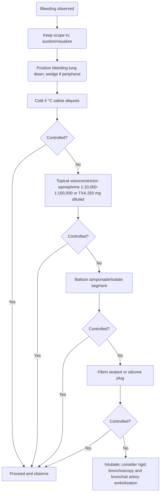
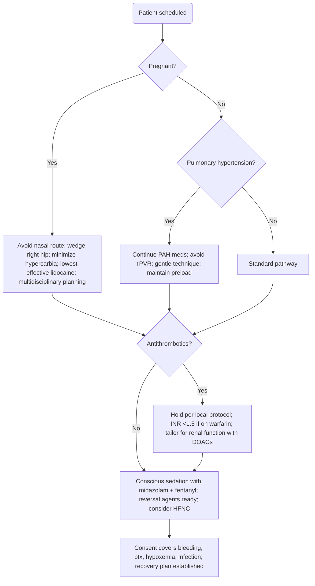

Bronchoscopy in High‑Risk Patients and Complications in Bronchoscopy

Target audience: Interventional pulmonology fellows and practicing pulmonologists
Delivery mode: Publication‑Ready Clean (no inline citations or source‑file mentions)

Exam Mapping & Scope

Mapped domains include: peri‑procedural risk assessment, sedation and monitoring, special populations (pregnancy and pulmonary hypertension), and recognition/management of bronchoscopy complications (bleeding, hypoxemia, arrhythmias, pneumothorax, fever/infection, bronchospasm).

Learning Objectives

Differentiate minor versus major bronchoscopy complications and quote realistic event rates for board questions.

Stratify bleeding risk by patient, procedure, hemostasis, and tissue factors; apply practical antithrombotic hold/restart windows.

Execute a stepwise algorithm for intra‑procedural bleeding control and know when to escalate to rigid bronchoscopy or embolization.

Prevent, detect, and treat hypoxemia, laryngospasm/bronchospasm, sedation‑related events, pneumothorax, and post‑bronchoscopy fever/infection.

Adapt practice for pregnancy and pulmonary hypertension (PH), including airway, hemodynamic, and medication considerations.

High‑Yield One‑Pager

Numbers to know

Overall complication rate ~1% across large bronchoscopy cohorts; mortality ~0.02%.

Bleeding overall ≈0.3-5%; “severe” bleeding is rare (~0.3%).

Pneumothorax risk ~0.1-0.8% overall; up to ~11% after forceps transbronchial lung biopsy (TBLB) and ~5% with interstitial lung disease (ILD) cryobiopsy.

Post‑bronchoscopy fever (PBF) after BAL: ~5-16%, usually a sterile cytokine response.

Pearls & pitfalls

Classify bleeding by the intervention required, not estimated volume.

Antithrombotics: Aspirin can usually be continued; clopidogrel increases bleeding risk for biopsies. EBUS‑TBNA under clopidogrel has not consistently shown excess bleeding.

Bleeding sequence: Keep the scope in; suction/visualize; lateralize bleeding lung down; cold saline; topical vasoconstrictor (epinephrine or tranexamic acid); balloon blockade; sealants/plugs; secure airway early; escalate to rigid bronchoscopy/embolization when indicated.

Hypoxemia mitigation: Continuous SpO₂; oxygen if SpO₂ falls >4% for >1 min or <90%. High‑flow nasal cannula (HFNC) reduces desaturation events during sedated bronchoscopy.

Sedation (conscious/moderate by bronchoscopists): midazolam 1-2 mg IV then 0.5-1 mg; fentanyl 25-50 µg IV titrated. Reversal: flumazenil 0.2 mg then 0.1 mg/min to 1 mg; naloxone start 0.04 mg, repeat q2-5 min (up to ~0.01 mg/kg).

Pregnancy: anticipate difficult airway; avoid the nasal route; wedge the right hip (left uterine displacement); minimize hypercarbia; lowest effective lidocaine dose; multidisciplinary planning.

Pulmonary hypertension: TBLB bleeding risk is not clearly increased, but hypoxemia and prolonged mechanical ventilation are more likely; avoid triggers of increased PVR (hypoxemia, hypercarbia, pain/anxiety) and maintain preload.

Core Concepts
Pathophysiology & Epidemiology

Complications range from minor (epistaxis, fever, mild arrhythmias, limited bleeding) to major (pneumonia, significant pneumothorax, respiratory failure, life‑threatening hemorrhage). Hypoxemia arises from airway caliber reduction by the scope, ventilation-perfusion mismatch with topical anesthetic/saline/BAL, transient atelectasis, and bronchoconstriction. Arrhythmias are usually benign and related to hypoxemia, vagal tone, or stimulant drugs; major tachyarrhythmias are uncommon.

In pregnancy, mucosal edema, glandular hyperplasia, and increased reflux elevate aspiration and airway difficulty risks. Hemodynamic adaptations (increased blood volume and cardiac output) and IVC compression later in gestation predispose to supine hypotension. In PH, decompensation is driven by increased PVR due to hypoxemia, hypercarbia, pain/anxiety, or reduced preload from induction vasodilation/blood loss.

Indications & Contraindications

Age alone is not a contraindication. Bronchoscopy is permissible in pregnancy and PH when benefits outweigh risks and appropriate safeguards are in place. In PH, available data do not show a consistent increase in TBLB bleeding, but oxygenation and ventilatory risks are higher. In pregnancy, decisions should be multidisciplinary and tailored to urgency, alternatives, and airway strategy.

Pre‑Procedure Evaluation

Bleeding risk stratification

Patient factors: lung cancer, transplant, immunosuppression; controversial/variable risk with PH.

Procedure factors: TBLB and cryobiopsy carry higher bleeding risk than EBUS/BAL/brushings.

Hemostasis factors: uremia, liver disease, antithrombotics; coagulation tests alone are poor predictors.

Tissue factors: carcinoid, renal/thyroid metastases, amyloid, anthracosis, and bronchial Dieulafoy lesions are highly vascular.

Pragmatic laboratory thresholds

BAL typically acceptable with platelets >=20 × 10³/µL.

Endobronchial/TBLB generally acceptable with platelets >=50 × 10³/µL.

Antithrombotics (typical diagnostic bronchoscopy windows)

Warfarin: stop ~5 d (goal INR <1.5 day‑of), restart same evening if safe.

DOACs: hold ~24-48 h; extend for renal dysfunction (especially dabigatran).

Clopidogrel: hold ~5-7 d for biopsies; EBUS‑TBNA may be performed in select scenarios.

Aspirin: usually continued.

LMWH/fondaparinux: shorter holds (see Table 2).

Pregnancy planning

Avoid the nasal route; NPO and aspiration precautions; wedge the right hip or consider a semi‑upright position; lowest effective lidocaine dose; discuss fetal monitoring and emergency plans.

PH planning

Continue PAH therapies (e.g., sildenafil, inhaled prostacyclin analogs). Avoid hypoxemia/hypercarbia, pain/anxiety, and abrupt preload reduction. Favor gentle technique with adequate topical anesthesia.

Equipment & Setup

Large‑channel bronchoscope; robust suction; cold saline; topical vasoconstrictors (epinephrine, tranexamic acid); vasopressin analogs where appropriate; balloon blockers; fibrin sealant or silicone plugs; thermal tools (APC, laser, monopolar electrocautery) for select bleeding scenarios.

Monitoring: continuous SpO₂ and ECG during and after the procedure; consider HFNC for high‑risk desaturation.

Step‑by‑Step Technique / Procedural Checklist

Team brief: indication, alternatives, anticoagulant plan, airway strategy, and backup (rigid, ICU, BAE).

Sedation: midazolam + fentanyl titration; avoid large boluses. If using propofol, anesthesia support is recommended. Reversal agents drawn up.

Oxygenation: start supplemental O₂ in high‑risk patients; HFNC for those prone to desaturation.

Pregnancy: avoid nasal route; wedge right hip; minimize hypercarbia; plan for aspiration risk and difficult airway.

PH: continue PAH meds; avoid maneuvers that increase PVR; maintain preload; ensure gentle instrumentation.

Troubleshooting & Intra‑Procedure Management

Bleeding: Keep the scope in; suction for visibility; position bleeding lung down; instill cold 4 °C saline aliquots; apply topical epinephrine (typical diluted range 1:10,000-1:100,000; many operators keep cumulative endobronchial epinephrine <=~0.6 mg) or tranexamic acid (e.g., 250 mg diluted, 1-3 aliquots). Escalate to balloon tamponade, fibrin sealant/silicone plugs, and rigid bronchoscopy/BAE as needed.

Hypoxemia: Increase FiO₂; pause instillations; suction secretions/blood; HFNC or NIV if needed.

Arrhythmias: Usually benign; treat triggers (hypoxemia, pain). Maintain ECG monitoring.

Laryngospasm: Prevent with adequate topical lidocaine before passing the cords; treat with oxygenation, jaw thrust, positive pressure; deepen anesthesia if necessary.

Sedation mishaps: Keep flumazenil and naloxone immediately available; recognize fentanyl‑induced chest‑wall rigidity and support ventilation while reversing.

Post‑Procedure Care & Follow‑Up

Monitor in a staffed recovery area for 2-4 hours: SpO₂ (return to baseline), chest pain/desaturation (consider pneumothorax), temperature (self‑limited fever common after BAL), airway patency/bronchospasm, and level of consciousness. Keep NPO until cough reflex returns (~2 h). Symptomatic pneumothorax warrants imaging (CXR or lung ultrasound). Small (<20%) pneumothoraces can often be observed; larger or unstable cases require drainage.

Complications: Prevention, Recognition, Management

Bleeding: Highest risk with vascular tumors and TBLB/cryobiopsy. Prophylactic epinephrine prior to TBLB in select transplant populations reduces severe bleeding. Consider rigid bronchoscopy first in centrally vascular endobronchial tumors; thermal modalities can assist hemostasis.

Pneumothorax: Avoid bilateral same‑session TBLB; prefer alligator over cup forceps in sarcoidosis; fluoroscopy improves localization yield but doesn’t clearly reduce pneumothorax risk. Routine immediate CXR isn’t required; observe >=2 h due to possible delayed onset.

Infection/PBF: PBF is common after BAL and typically sterile. Prophylactic antibiotics do not reduce PBF. Procalcitonin can help distinguish bacterial infection from PBF. True bacteremia occurs in a minority; typical organisms include staphylococci and streptococci.

Bronchospasm: The most common life‑threatening airway event in older surveys. Routine pre‑procedure bronchodilators (short‑acting β‑agonists) have not shown clear benefit in COPD/asthma; optimize baseline disease control instead.

Special Populations

Pregnancy

Expect difficult airway and increased aspiration risk; avoid the nasal route; wedge the right hip for left uterine displacement; minimize hypercarbia; lowest effective lidocaine dose.

Use of topical endobronchial epinephrine is theoretical concern for uterine blood‑flow reduction—try safer measures first and weigh risk-benefit if considering its use.

Thermal tools have not been studied in pregnancy but may be used when necessary for life‑threatening airway obstruction; ensure appropriate dispersive electrode placement and obstetric input.

Multidisciplinary coordination (IP, anesthesia, obstetrics, referring team) is essential, including airway plan, personnel, and emergency contingencies.

Pulmonary Hypertension

No consistent increase in TBLB bleeding risk; however, higher risk of peri‑procedural hypoxemia and prolonged mechanical ventilation.

Avoid PH decompensation by preventing hypoxemia/hypercarbia, treating pain/anxiety, minimizing airway trauma, and maintaining preload. Continue PAH therapies unless specific contraindications exist.

Evidence & Outcomes

Bleeding classification schemes based on interventions provide reliable triggers for escalation. HFNC reduces hypoxemia episodes during bronchoscopy. In PH, bleeding risk from TBLB is not clearly elevated, but oxygenation/ventilation complications are more common and should shape peri‑procedural planning.

Diagnostic & Therapeutic Algorithms
A. Intra‑Procedural Bleeding Control (Flexible Bronchoscopy)

Parallel quick steps: Don’t remove the scope → suction + lateralize → cold saline → topical vasoconstrictor → balloon blockade → sealant/plug → secure airway → rigid/BAE.

B. Pre‑Bronchoscopy Triage in High‑Risk Patients

Tables & Quick‑Reference Boxes
Table 1. Intervention‑Based Bleeding Severity

| Category | Operational definition |
| --- | --- |
| No bleeding | Blood traces that are self‑limited; no continuous suction needed |
| Mild | Requires continuous suction; self‑limited |
| Moderate | Requires wedge, cold saline, and/or topical vasoconstrictor to stop |
| Severe | Requires balloon blocker and/or sealant/plug; resuscitation, transfusion or ICU |

Abbreviations: ICU, intensive care unit.

Table 2. Peri‑Bronchoscopy Antithrombotic Management (Typical Windows)

| Drug | Stop before | Restart after |
| --- | --- | --- |
| Unfractionated heparin | 6 h | 4-12 h |
| LMWH | 12 h | 4-12 h |
| Fondaparinux | 36-42 h | 4-12 h |
| Aspirin | Do not stop | — |
| Clopidogrel | 5-7 d | 5-7 d |
| Ticagrelor | 5 d | 4-12 h |
| Prasugrel | 7-10 d | 4-12 h |
| Warfarin | 5 d (goal INR <1.5) | 4-12 h |
| Dabigatran | 2-3 d (longer if renal dysfunction) | 4-12 h |
| Rivaroxaban/Apixaban/Edoxaban | 1-2 d | 4-12 h |

Abbreviations: INR, international normalized ratio; LMWH, low‑molecular‑weight heparin.

Table 3. Sedation & Reversal: Quick Doses

| Agent | Typical starting dose/titration | Key caveats |
| --- | --- | --- |
| Midazolam | 1-2 mg IV, then 0.5-1 mg titration (<=5 mg if <70 y; <=2 mg if >=70 y) | Prepare 1 mg/mL to avoid overdose; flumazenil 0.2 mg then 0.1 mg/min to 1 mg (watch re‑sedation) |
| Fentanyl | 25-50 µg IV, titrate | Watch for bradycardia/hypotension; rare chest‑wall rigidity → naloxone starting 0.04 mg and ventilatory support |
| Propofol | Per anesthesiologist | Narrow window; risk of apnea/hypotension; institutional policies apply |

Abbreviations: IV, intravenous.

Table 4. Post‑Procedure Monitoring (First 2-4 Hours)

| Domain | What to watch | Suggests | Action |
| --- | --- | --- | --- |
| SpO₂ | Return to baseline | Persistent desaturation | Evaluate for bronchospasm, retained secretions, or pneumothorax |
| Chest pain | New/worsening | Possible pneumothorax | CXR or lung ultrasound |
| Temperature | Transient low‑grade fever | PBF | Antipyretics; reassess if persistent/systemic features |
| Swallow | Cough reflex absent (~2 h) | Aspiration risk | Keep NPO until reflex returns |
| Consciousness | Delayed awakening (e.g., COPD/OSA) | Hypercapnia | Consider NIV or intubation |
| Respiratory pattern | Tachypnea/wheeze/use of accessory muscles | Bronchospasm | Bronchodilators, systemic steroids, oxygen; escalate as needed |

Abbreviations: CXR, chest radiograph; PBF, post‑bronchoscopy fever; NIV, noninvasive ventilation; OSA, obstructive sleep apnea.

Imaging & Figure Callouts (Placeholders)

Figure A. Physiologic changes of pregnancy relevant to bronchoscopy (airway edema, increased reflux risk, IVC compression).

Figure B. Forest plot illustrating no clear increase in TBLB bleeding with PH.

Cases & Applied Learning

Case 1 - PH and ILD Workup
A 62‑year‑old with scleroderma‑ILD and mean PAP 40 mmHg is referred for BAL/TBLB for new ground‑glass opacities. Which statement best reflects risk?
Answer: PH increases the risk of peri‑procedural hypoxemia and prolonged ventilation; bleeding risk with TBLB is not clearly increased.
Teaching point: Optimize oxygenation/ventilation, avoid triggers of increased PVR, and coordinate with anesthesia.

Case 2 - EBUS in Pregnancy
A 29‑year‑old at 22 weeks with suspected mediastinal involvement from breast cancer is scheduled for EBUS. What are the key priorities?
Answer: Anticipate difficult airway; avoid nasal route; wedge the right hip for left uterine displacement; minimize hypercarbia; coordinate with anesthesia and obstetrics.
Teaching point: Two‑patient physiology; focus on airway protection and hemodynamic stability.

Case 3 - Post‑TBLB Dyspnea
Two hours post‑TBLB, a patient reports pleuritic chest pain and desaturates to 89%.
Answer: Evaluate for pneumothorax with CXR or lung ultrasound; small pneumothoraces may be observed, larger/unstable require drainage.
Teaching point: Routine post‑TBLB CXR is unnecessary in asymptomatic patients, but delayed pneumothorax can occur.

Question Bank (12 MCQs)

1. During TBLB, brisk bleeding obscures the view. After suction and lateralizing the patient, the next best step is:
A. Remove the scope and sit the patient up
B. Instill room‑temperature saline
C. Instill cold 4 °C saline aliquots
D. Proceed directly to fibrin glue
E. Place a double‑lumen tube
Correct: C. Cold saline is first‑line after suction/positioning, before topical vasoconstrictors and mechanical tamponade.

2. Which antithrombotic can generally be continued for diagnostic bronchoscopy including TBLB?
A. Warfarin
B. Apixaban
C. Aspirin
D. Clopidogrel
E. Fondaparinux
Correct: C. Aspirin is usually continued; clopidogrel and anticoagulants require holds for biopsies.

3. A patient on warfarin is scheduled for EBUS‑TBNA with low thrombotic risk. Optimal plan?
A. Continue warfarin
B. Stop ~5 days before; day‑of INR <1.5; restart evening after
C. Stop 24 h before
D. Bridge all patients with LMWH
E. Delay until INR <1.0
Correct: B. Standard approach for low‑risk patients.

4. Which statement about PH and bronchoscopy is most accurate?
A. Absolute contraindication to TBLB
B. No clear increase in TBLB bleeding, but higher hypoxemia risk
C. PH always causes massive hemoptysis
D. Bronchoscopy must be under general anesthesia
E. Routine ICU post‑op is mandatory
Correct: B.

5. During bronchoscopy under midazolam/fentanyl, the patient develops chest‑wall rigidity with hypoventilation. Best immediate action?
A. Succinylcholine IV
B. Naloxone (start 0.04 mg) and ventilatory support
C. Flumazenil 0.2 mg
D. Propofol bolus
E. Atropine 0.5 mg
Correct: B.

6. A patient develops fever to 38.4 °C four hours after BAL but looks well. Which lab best helps distinguish PBF from bacterial infection?
A. CRP
B. ESR
C. WBC
D. Procalcitonin
E. LDH
Correct: D.

7. Which maneuver reduces laryngospasm risk when passing the cords?
A. Deep inhalational anesthesia
B. Adequate topical lidocaine before cord passage
C. Routine paralytic use
D. Avoid oxygen supplementation
E. Nasal route
Correct: B.

8. A 30‑week pregnant patient with subglottic stenosis becomes hypotensive at induction. What preventive strategy should have been in place?
A. Large IV epinephrine bolus ready
B. Right‑hip wedge (left uterine displacement) and preload optimization
C. Head‑down tilt
D. Nitroglycerin infusion
E. Routine nasal intubation
Correct: B.

9. Post‑TBLB, the patient has mild pleuritic pain and stable vitals. Next step?
A. Routine immediate CXR for all patients
B. Admit for 24 h observation
C. Observe >=2 h; image only if symptomatic/worsening
D. CT chest
E. Discharge immediately
Correct: C.

10. Which oxygen strategy reduces desaturation events during sedated bronchoscopy?
A. Simple nasal cannula
B. Non‑rebreather mask
C. NIV for all patients
D. High‑flow nasal cannula
E. Room air
Correct: D.

11. Maximum recommended topical lidocaine dose during bronchoscopy is:
A. 2 mg/kg
B. 4 mg/kg
C. 6 mg/kg
D. 10 mg/kg
E. No maximum
Correct: B.

12. Which statement about prophylactic antibiotics for PBF is correct?
A. Should be given to all BAL patients
B. Only in transplant recipients
C. Do not reduce PBF and are not routinely recommended
D. Mandatory if CRP is elevated pre‑procedure
E. Necessary if BAL volume >200 mL
Correct: C.

Controversies & Evolving Evidence

PH and bleeding risk: Earlier opinions labeled PH a relative/absolute contraindication to TBLB; newer analyses do not show a clear bleeding increase, but they do show higher rates of hypoxemia and prolonged ventilation.

Routine bronchodilator premedication: Trials in COPD/asthma show no clear benefit for routine pre‑procedure short‑acting β‑agonists; practice varies—optimize baseline control instead.

Fluoroscopy: Improves localization and diagnostic yield in focal disease but has not clearly reduced pneumothorax rates; use is center‑specific.

Sedation ownership: Conscious/moderate sedation by pulmonologists versus propofol by anesthesia varies by institution; propofol’s narrow therapeutic margin favors anesthesia involvement in many centers.

Topical epinephrine in pregnancy: Consider safer measures first; if used, employ the lowest effective dose with multidisciplinary input.

Take‑Home Checklist

Communicate real‑world risks (overall complications ~1%, mortality ~0.02%) during consent.

Prepare for bleeding: cold saline, vasoconstrictor, balloon blocker, sealants, rigid backup.

Apply antithrombotic holds pragmatically; aspirin is usually continued; verify INR for warfarin.

Use HFNC in desaturation‑prone patients; treat hypoxemia immediately.

Keep reversal agents (flumazenil, naloxone) drawn up; recognize chest‑wall rigidity.

Suspect pneumothorax if new chest pain/desaturation post‑TBLB; observe >=2 h; image if symptomatic.

Distinguish PBF from infection; procalcitonin can help; prophylactic antibiotics are not routine.

Pregnancy: avoid nasal route, wedge right hip, minimize hypercarbia, lowest effective lidocaine, multidisciplinary team.

PH: continue PAH meds; avoid increased PVR; anticipate hypoxemia risk more than bleeding.

Abbreviations & Glossary

APC (argon plasma coagulation); BAE (bronchial artery embolization); BAL (bronchoalveolar lavage); EBUS‑TBNA (endobronchial ultrasound‑guided transbronchial needle aspiration); HFNC (high‑flow nasal cannula); ILD (interstitial lung disease); INR (international normalized ratio); LMWH (low‑molecular‑weight heparin); NIV (noninvasive ventilation); PAH/PH (pulmonary arterial hypertension/pulmonary hypertension); PBF (post‑bronchoscopy fever); PVR (pulmonary vascular resistance); RSI (rapid sequence induction); TBLB (transbronchial lung biopsy); TBCB (transbronchial cryobiopsy).

References (from references used in the primary documents)

(Compiled solely from references cited within the primary documents; details limited to what those documents reported.)

Facciolongo N, Patelli M, Gasparini S, et al. Incidence of complications in bronchoscopy: multicentre prospective study of 20,986 bronchoscopies. Monaldi Arch Chest Dis. 2009;71(1):8‑14.

Du Rand IA, Blaikley J, Booton R, et al. British Thoracic Society guideline for diagnostic flexible bronchoscopy in adults. Thorax. 2013;68:i1‑i44.

Muthu V, Ram B, Sehgal IS, et al. Major complications during 9,979 flexible bronchoscopies under local anesthesia. Lung India. 2022;39(4):384‑387.

Bernasconi M, Koegelenberg CFN, Koutsokera A, et al. Iatrogenic bleeding during flexible bronchoscopy: risk factors, prophylaxis and management. ERJ Open Res. 2017;3(2):00084‑2016.

Gil HI, Ko RE, Lee K, et al. Effects of antithrombotic treatment on bleeding complications of EBUS‑TBNA. Medicina (Kaunas). 2021;57(2):142.

Meena N, Abouzgheib W, Patolia S, et al. EBUS‑TBNA and EUS‑FNA: risk assessment for patients receiving clopidogrel. J Bronchology Interv Pulmonol. 2016;23(4):303‑307.

Márquez‑Martín E, Vergara DG, Martín‑Juan J, et al. Endobronchial tranexamic acid for controlling pulmonary bleeding: a pilot study. J Bronchology Interv Pulmonol. 2010;17(2):122‑125.

Khoo KL, Lee P, Mehta AC. Endobronchial epinephrine: confusion is in the air. Am J Respir Crit Care Med. 2013;187(10):1137‑1138.

Tüller C, Tüller D, Tamm M, Brutsche MH. Hemodynamic effects of endobronchial ornipressin vs terlipressin. Respiration. 2004;71(4):397‑401.

Kalchiem‑Dekel O, Tran BC, Glick DR, et al. Prophylactic epinephrine attenuates severe bleeding in lung transplantation patients undergoing TBLB (PROPHET). J Heart Lung Transplant. 2023;42(9):1205‑1213.

Radchenko C, Alraiyes AH, Shojaee S. Systematic approach to massive hemoptysis. J Thorac Dis. 2017;9:S1069‑S1086.

Roy A, Khanna P, Chowdhury SR, et al. HFNC vs other devices during bronchoscopy under sedation: systematic review and meta‑analyses. Indian J Crit Care Med. 2022;26(10):1131‑1140.

Pirozyński M, Śliwiński P, Zieliński J. Effect of different BAL volumes on oxygen saturation. Eur Respir J. 1988;1(10):943‑947.

van Zwam JP, Kapteijns EF, Lahey S, Smit HJ. Bronchoscopy in supine or sitting position: randomized prospective analysis. J Bronchology Interv Pulmonol. 2010;17(1):29‑32.

Jones AM, O’Driscoll R. Do all patients require supplemental oxygen during flexible bronchoscopy? Chest. 2001;119(6):1906‑1909.

Dreher M, Ekkernkamp E, Storre JH, et al. Sedation during flexible bronchoscopy in respiratory failure: midazolam vs midazolam+alfentanil. Respiration. 2010;79(4):307‑314.

Williamson BH, Nolan PJ, Tribe AE, Thompson PJ. Flumazenil in bronchoscopic procedures: a placebo‑controlled study. Br J Clin Pharmacol. 1997;43(1):77‑83.

Çoruh B, Tonelli MR, Park DR. Fentanyl‑induced chest wall rigidity. Chest. 2013;143(4):1145‑1146.

Rosal NR, Thelmo FL Jr, Tzarnas S, et al. Wooden chest syndrome: fentanyl‑induced chest wall rigidity. J Investig Med High Impact Case Rep. 2021;9:23247096211034036.

Izbicki G, Shitrit D, Yarmolovsky A, et al. Is routine chest radiography after TBLB necessary? Prospective study of 350 cases. Chest. 2006;129(6):1561‑1564.

Sehgal IS, Bal A, Dhooria S, et al. Cup vs alligator forceps for TBLB in sarcoidosis: randomized trial. Chest. 2016;149(6):1584‑1586.

Lachowicz JA, Smallwood NE, Prasad JD, et al. Procedural and sampling techniques for TBCB in ILD: systematic review. Eur Respir Rev. 2024;33(173):240035.

DeMasi S, Parker MS, Joyce M, et al. Thoracic point‑of‑care ultrasound for clinically significant traumatic pneumothorax. Acad Emerg Med. 2023;30(6):653‑661.

Park JS, Lee CH, Yim JJ, et al. Antibiotic prophylaxis and PBF: randomized controlled study. Int J Tuberc Lung Dis. 2011;15(4):528‑535.

Um SW, Choi CM, Lee CT, et al. Clinical characteristics and risk factors of PBF: prospective analysis. Chest. 2004;125(3):945‑952.

Yigla M, Oren I, Bentur L, et al. Incidence of bacteremia after fiberoptic bronchoscopy. Eur Respir J. 1999;14(4):789‑791.

Sharif‑Kashani B, Shahabi P, Behzadnia N, et al. Incidence of fever and bacteremia after flexible bronchoscopy: prospective study. Acta Med Iran. 2010;48(6):385‑388.

Hackner K, Riegler W, Handzhiev S, et al. Procalcitonin enables early diagnosis of post‑interventional bacterial infection. BMC Pulm Med. 2017;17(1):156.

Suratt PM, Smiddy JF, Gruber B. Deaths and complications associated with fiberoptic bronchoscopy. Chest. 1976;69(6):747‑751.

Stolz D, Pollak V, Chhajed PN, et al. Bronchodilators for bronchoscopy in COPD: randomized, placebo‑controlled trial. Chest. 2007;131(3):765‑772.

Humbert M, Robinson DS, Assoufi B, et al. Safety of fibreoptic bronchoscopy in asthmatic and control subjects. Thorax. 1996;51(7):664‑669.

Wahidi MM, Rocha AT, Hollingsworth JW, et al. Bronchoscopy in pulmonary hypertension: physician survey on perceived risk. Respiration. 2005;72:285‑295.

Ali J, et al. Bronchoscopy in pulmonary hypertension: meta‑analysis. Ann Am Thorac Soc. 20(6):898‑905. (Partial metadata as presented in the source slides.)

Bahhady I, Ernst A. Bronchoscopy in pregnancy. Chest. 2004;126. (Metadata limited as presented.)

Morgan R, Ernst A. Bronchoscopy during pregnancy. Clin Chest Med. 2011;32. (Metadata limited as presented.)

Tang SJ, et al. ERCP in pregnancy: safety of sphincterotomy. Gastrointest Endosc. 2009;69. (Presented to inform electro‑cautery considerations.)

Price LC, et al. Peri‑operative management of pulmonary hypertension. Br J Anaesth. 2021;126(4):774‑790.

Broker T, et al. Anaesthesia for pulmonary hypertension. Ann Transl Med. 2019;7(15):355.

