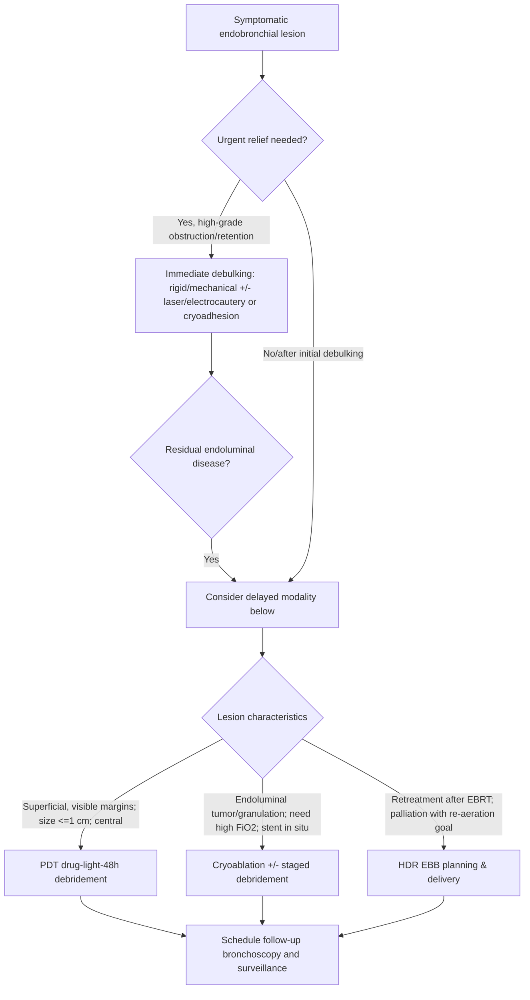
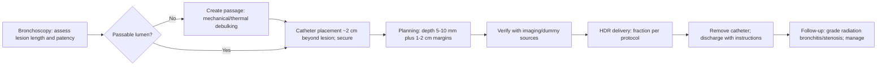

Delayed Ablative Therapies

Exam Mapping & Scope

This chapter covers delayed ablative modalities used in interventional pulmonology: photodynamic therapy (PDT), cryotherapy (delayed cryoablation and immediate cryoadhesion/cryodebridement), and endobronchial brachytherapy (EBB). Emphasis is on indications, contraindications, technique, troubleshooting, complication management, and evidence that is commonly tested on certification and recertification exams.

Learning Objectives

After completing this chapter, learners should be able to:

Select between PDT, cryotherapy, and EBB based on tumor morphology, urgency of relief, and prior therapies.

Outline pre-procedure evaluation and patient counseling unique to each modality (e.g., phototoxicity with PDT).

Execute a stepwise technique for PDT (drug-light-debridement), cryoablation/cryoadhesion, and EBB catheter placement and planning.

Anticipate, prevent, and manage complications such as slough-related obstruction after PDT, radiation bronchitis after EBB, and bleeding/airway edema after cryotherapy.

Apply evidence (complete response rates, functional outcomes, survival signals) to clinical decision-making and patient counseling.

High-Yield One-Pager

PDT = drug + light + debridement. Porfimer sodium 2 mg/kg IV, light activation ~48 h later (630 nm), then repeat bronchoscopy 48 h after light to clear slough. Re-illumination can be done within a week of drug injection.

Depth matters. PDT penetrates ~4-6 mm--best for purely endoluminal, superficial disease (e.g., CIS, early central SCC).

Photosensitivity is real. Skin phototoxicity can persist 6-8 weeks; meticulous light precautions are mandatory.

Schedule smart. Avoid initiating PDT on days that make the 48-hour debridement logistically difficult.

Cryotherapy has two faces. Cryoablation (freeze-thaw cycles) produces delayed necrosis; cryoadhesion/cryodebridement allows immediate en bloc removal of tumor, clots, or mucus.

Cryo is oxygen-friendly. Safe in high-FiO2 environments and around stents; no risk of airway fire.

Cryo technique pearls. 30-s freeze / passive thaw cycles, overlapping applications ~5 mm apart; if the probe sticks where it shouldn't, stop freezing and wait for thaw.

EBB = localized internal radiotherapy. HDR regimens are typically delivered outpatient in brief fractions; avoid if major vessel involvement, fistula, or complete occlusion without prior recanalization.

EBB planning is geometry. Catheter tip sits ~2 cm distal to the lesion; margins usually 1-2 cm proximal and distal; depth prescriptions depend on airway diameter.

When obstruction is tight: PDT (delayed effect) and cryoablation are not for emergent relief; favor immediate debulking (rigid/mechanical, laser/electrocautery, or cryoadhesion) then consider a delayed modality.

EBB for special scenarios. Good option after prior EBRT when retreatment is needed, and for re-expansion in lobar atelectasis due to endoluminal tumor.

Evidence snapshot--PDT (curative intent). For centrally located lesions &lt;1 cm, complete response (CR) rates approach ~90% with meaningful long-term disease control in selected patients.

Evidence snapshot--Cryo. Large series show improvement in cough, dyspnea, hemoptysis and quality of life; cryo before radiation may improve local control and survival in unresectable NSCLC.

Evidence snapshot--EBB. Consistently palliates dyspnea, cough, hemoptysis, and re-aerates lung; comparative trials suggest symptom gains and selected survival benefit when integrated appropriately.

Exam trap: confusing cryoadhesion (immediate extraction) with cryoablation (delayed slough). Know which you're being asked about.

Core Concepts
Pathophysiology / Epidemiology

Central airway obstruction from primary lung cancer or endobronchial metastases leads to dyspnea, cough, hemoptysis, post-obstructive infection, and hypoxemia. Superficial central lesions (CIS/early SCC) are rare but highly amenable to surface-directed therapies like PDT or EBB when surgery is not feasible. Benign granulation tissue (post-transplant, tracheostomy, stents) is particularly cryosensitive.

Indications & Contraindications

PDT
Indications:

Curative intent for microinvasive/early central NSCLC when margins are visible and lesion length small (best &lt;=1 cm).

Palliation of malignant endobronchial obstruction in selected patients (not for emergent relief).
Contraindications/Cautions:

Porphyria; severe acute distress needing immediate airway relief; tumor eroding a major vessel; pre-existing tracheo/broncho-esophageal fistula. Exercise caution post-radiation (higher hemoptysis risk).

Cryotherapy
Indications:

Delayed cryoablation for endoluminal tumor control or granulation tissue.

Immediate cryoadhesion for tumor fragments, mucus plugs, or blood clots; foreign body extraction (organic/high-water content).
Contraindications/Cautions:

Correct coagulopathy/hold clopidogrel and anticoagulants when ablating; avoid ablative use when urgent immediate ventilation is required (unless using cryoadhesion).

EBB
Indications:

Symptomatic malignant endobronchial lesions; early-stage disease in non-surgical candidates; retreatment after prior EBRT; selected cases with lobar collapse.
Contraindications:

Inability to undergo bronchoscopy; significant endobronchial ulceration; fistula; major vascular involvement; complete occlusion without prior passage creation.

Pre-procedure Evaluation

Imaging & staging: Define lesion extent and depth; consider EBUS for staging and vascular adjacency for EBB planning.

Antithrombotics: Hold anticoagulants/antiplatelets for ablative cryo; aspirin may be continued for biopsy/cryoadhesion.

PDT counseling: Photosensitivity precautions start immediately after drug infusion and persist weeks; plan light avoidance and protective clothing/eyewear.

Airway strategy: Plan general anesthesia vs deep sedation; consider rigid bronchoscopy when high-grade obstruction demands active airway control.

Equipment & Setup

PDT: Diode laser (630 nm for porfimer), cylindrical diffuser fibers (rigid ~1.7 mm or flexible ~1.07 mm), bronchoscope, eye protection.

Cryo: Console with CO2 (commonly) or N2O; flexible probes (1.1-2.4 mm) or rigid cryoprobe; foot-pedal activation; large-channel bronchoscope; saline basin for thaw; assistants for en bloc extraction.

EBB: Polyethylene afterloading catheters; remote HDR afterloader (Ir-192); fluoroscopy/CT verification; dose-planning system; secure fixation.

Step-by-Step Technique / Procedural Checklist

PDT (porfimer sodium protocol)

Drug: Porfimer sodium 2 mg/kg IV over 3-5 min. Begin photoprotection immediately.

Light (~40-50 h later): Flexible bronchoscopy; select diffuser length to match lesion; deliver 200 J/cm at 630 nm (commonly 400 mW/cm for ~500 s). Maintain fiber position despite "whiteout" on the screen during activation.

Debridement (~48 h after light): Repeat bronchoscopy to remove necrotic slough; consider re-illumination at this session if residual tumor bleeds on contact (drug remains active up to ~5 days).

Cryotherapy

Cryoablation (delayed): Place probe on target; freeze ~30 s then allow passive thaw; repeat 3 cycles per site; move ~5 mm between applications with slight overlap to cover the lesion. Plan follow-up bronchoscopy in 5-10 days to clear slough.

Cryoadhesion/cryodebridement (immediate): Freeze tissue/clot/plug for a few seconds until adherent, then remove en bloc with the bronchoscope; thaw specimen off probe in saline. Secure the endotracheal tube during extraction to avoid inadvertent extubation; if the probe sticks to normal tissue or ETT, stop freezing and wait for thaw.

Endobronchial Brachytherapy (HDR)

Assessment & scoring: Document site/length/degree of obstruction; ensure passable lumen (use adjunct debulking first if needed).

Catheter placement: Under bronchoscopy (often transnasal), advance catheter beyond the lesion by ~2 cm; mark and secure; verify with imaging.

Planning: Dummy source radiography/CT; prescribe to a fixed distance (commonly 10 mm) or airway-diameter-adjusted depth; include 1-2 cm proximal/distal margins.

Delivery: Outpatient HDR fractions via afterloader; remove catheter post-dose and provide instructions for red-flag symptoms.

Troubleshooting & Intra-procedure Management

PDT: Use adequate sedation to maintain immobility; anticipate screen "whiteout" during activation and rely on physical stabilization of fiber; have slough-clearance tools (forceps, suction, cryoprobe) ready for the 48-h debridement.

Cryo: Keep the scope tip slightly proximal (~4 mm) to avoid inadvertent freezing of the scope; for bleeding, use suction, iced saline, topical epinephrine, or adjunct APC if needed.

EBB: Never force a catheter; if resistance, reassess; verify final catheter position and depth before treatment; consider multiple catheters for circumferential lesions.

Post-procedure Care & Follow-up

PDT: Strict light precautions for 6-8 weeks; urgent return if dyspnea/fever/hemoptysis. Surveillance bronchoscopy at 1-3 months to document local control.

Cryo: Expect transient cough and secretions; arrange 5-10-day follow-up bronchoscopy after ablation.

EBB: Monitor for radiation bronchitis/stenosis; grade severity and treat per severity (debridement, dilation, stenting as indicated).

Complications (Prevention, Recognition, Management)

PDT:

Photosensitivity dermatitis--education and protective measures; persists weeks.

Slough-related obstruction--routine 48-h debridement.

Bronchial stenosis--avoid overlap with normal mucosa; treat with dilation/stent if needed.

Hemoptysis--avoid when lesion abuts a major vessel; higher risk after prior radiation.

Cryotherapy:

Edema/secretions--post-procedure suctioning; consider short steroid course (practice varies).

Bleeding--usually mild; manage as above.

Perforation--rare (cartilage relatively cryoresistant).

Spray cryo--ensure venting to prevent barotrauma/desaturation.

EBB:

Radiation bronchitis/stenosis--grade and treat with debridement/dilation/stents.

Ulceration/necrosis, fistula, massive hemoptysis--avoid in ulcerated lesions and when major vessels are involved; meticulous planning.

Special Populations

High oxygen requirement: Cryotherapy safely performed at high FiO2; thermal modalities risk airway fire.

Airway stents: Cryo is advantageous for tumor ingrowth or granulation around stents.

Post-transplant / granulation tissue: Highly responsive to cryo.

Prior thoracic radiation: Weigh hemoptysis risk with PDT; EBB often used as retreatment for endoluminal disease.

Evidence & Outcomes (Selected)

PDT (curative intent): In centrally located lesions, CR rates exceed 90% when lesion size is &lt;1 cm with visible margins; 5-year survival near 58% reported in small &lt;1 cm cohorts, acknowledging competing risks in frail populations.

PDT (palliation): Performance status and spirometry (FEV1, FVC) improve following therapy in series of advanced disease; re-aeration and symptom relief (dyspnea, cough, hemoptysis) are common.

Cryotherapy: Large series and prospective cohorts show symptom improvement and airway patency restoration; immediate cryo-recanalization is effective in acute obstruction; combination with external radiation improved local control (65% vs 35%) and median survival (397 vs 144 days) in unresectable NSCLC.

EBB: Symptom improvement rates ~70-90% across domains (dyspnea, cough, hemoptysis, re-aeration); survival benefit reported when used after incomplete response to EBRT/chemotherapy; HDR favored over LDR for convenience and catheter stability.

Diagnostic & Therapeutic Algorithms
Algorithm 1: Selecting a Delayed Ablative Modality in Endobronchial Tumor

Parallel steps (bulleted):

Triage urgency -> if emergent, perform immediate recanalization; then reassess for delayed therapy.

For small superficial central lesions with visible margins -> PDT.

For cryosensitive tissue or when high FiO2 is needed -> Cryotherapy (ablation or adhesion).

For retreatment/palliation after prior EBRT, or atelectatic lobes due to endoluminal disease -> EBB (HDR).

Algorithm 2: Endobronchial Brachytherapy Workflow (HDR)

Parallel steps (bulleted):

Ensure a catheter can pass; if not, debulk in a prior session.

Set depth (often 10 mm) or airway-based prescription; include 1-2 cm proximal/distal margins.

Deliver HDR per regimen (e.g., 7.5 Gy x3 weekly, or 10 Gy x2, as sole palliation; reduced fractions when combined with EBRT).

Follow for radiation bronchitis/stenosis and treat per grade.

Tables & Quick-Reference Boxes
Table 1. Delayed Ablative Modality Comparison
Attribute PDT Cryotherapy Endobronchial Brachytherapy (HDR)
Mechanism Photosensitizer + light -> ROS, vascular thrombosis -> apoptosis/necrosis Freeze-thaw cytotoxicity; cryoadhesion for extraction Internal radiation from Ir-192 via afterloaded catheter
Onset Delayed (requires 48-h debridement) Ablation: delayed; Adhesion: immediate Variable; symptomatic relief over days-weeks
Depth/Target ~4-6 mm; superficial endoluminal lesions Endoluminal tissue; granulation; clots/mucus Endoluminal lesions within ~5-10 mm of source
Best Use CIS/early central SCC; selected palliation Cryosensitive tissue; high-FiO2 settings; stent ingrowth; clot/mucus Palliation, retreatment post-EBRT; atelectasis due to intraluminal tumor
Key Contraindications Porphyria; fistula; major vessel erosion; emergent high-grade obstruction Uncorrected coagulopathy for ablation Fistula; major vascular involvement; complete occlusion without prior passage
Setting Bronchoscopy suite; outpatient Bronchoscopy suite; flexible or rigid Radiation oncology suite with afterloader
Abbreviations: CIS, carcinoma in situ; EBRT, external beam radiation therapy; FiO2, fraction of inspired oxygen.
Table 2. Practical Doses, Devices, and Scheduling
Modality Dose/Device Scheduling Essentials
PDT (porfimer) Porfimer sodium 2 mg/kg IV; red light 630 nm via cylindrical diffuser; 200 J/cm commonly used Light activation ~48 h post-drug; repeat bronchoscopy 48 h post-light for slough removal; re-illumination possible within 5-7 days post-drug
Cryoablation Flexible probe 1.1-2.4 mm; CO2 or N2O; 30-s freeze/passive thaw x ~3 cycles per site; overlap ~5 mm Follow-up bronchoscopy 5-10 days later to clear necrosis
Cryoadhesion Short freeze for adhesion; en bloc removal with scope Immediate airway clearance; thaw specimen in saline
EBB (HDR) Ir-192; prescription 5-10 mm from catheter; 1-2 cm proximal/distal margins Example HDR regimens (at 1 cm): palliation 7.5 Gy x3 weekly, or 10 Gy x2, or 6 Gy x4; with EBRT: 7.5 Gy x2, 5 Gy x3, or 4 Gy x4
Abbreviations: CO2, carbon dioxide; N2O, nitrous oxide; HDR, high-dose-rate.
Table 3. Complications--Prevention and Management
Complication Modality Prevention/Management
Photosensitivity dermatitis PDT Strict light precautions for 6-8 weeks
Slough-related obstruction PDT, Cryoablation Scheduled debridement (48 h for PDT; 5-10 d for cryo)
Hemoptysis (severe) PDT, EBB Avoid if lesion abuts major vessel; higher risk post-EBRT; urgent hemostasis protocols
Radiation bronchitis/stenosis EBB Dose planning; grade and manage with debridement/dilation/stent
Airway edema/secretions Cryo Anticipate; suction; consider short steroids (practice-based)
Barotrauma/desaturation Spray cryo Ensure venting; large airway access; apnea bursts only
Abbreviations: EBRT, external beam radiation therapy.
Imaging & Figure Callouts (Placeholders)

Figure 1. Cylindrical diffuser delivering red light during PDT activation. Alt text: Bronchoscopic view of diffuser fiber emitting uniform 360 degrees illumination within airway lumen.

Figure 2. Cryoprobe attached to an organized clot during cryoadhesion. Alt text: Flexible probe tip with adherent clot being withdrawn en bloc through the scope.

Figure 3. HDR brachytherapy catheter positioned distal to an endobronchial lesion. Alt text: Endobronchial view of catheter exiting beyond tumor with external fixation in place.

Cases & Applied Learning

Case 1 -- The 1-cm plaque
A 67-year-old with severe COPD has a 0.8 cm flat, leukoplakic lesion at the right main bronchus; biopsy confirms CIS; margins are fully visualized. Best next step?
A. External beam radiation alone
B. PDT with porfimer-based protocol
C. EBB HDR
D. Argon plasma coagulation
E. Observation
Answer: B. Small, superficial, central lesions with visible margins are ideal for PDT with drug-light-debridement sequencing and high CR rates. EBB and EBRT are options but offer no advantage here; observation risks progression.

Case 2 -- Hypoxemic obstruction with secretions
A hypoxemic ICU patient has near-occlusive blood clot and mucus in the left mainstem following biopsy. Best immediate bronchoscopic intervention?
A. PDT now
B. Cryoablation (freeze-thaw cycles)
C. Cryoadhesion with en bloc extraction
D. EBB catheter placement
E. Delay for CT planning
Answer: C. Cryoadhesion provides immediate removal of clots/mucus with high success; PDT and EBB are delayed strategies; cryoablation's benefit is delayed slough.

Case 3 -- Prior EBRT, recurrent hemoptysis
A 72-year-old with squamous NSCLC and prior full-dose EBRT presents with endoluminal recurrence causing hemoptysis and partial lobar collapse. Next step after creating a passable lumen?
A. Repeat EBRT to full dose
B. PDT without debridement
C. HDR EBB with careful planning
D. Surgery
E. Observation
Answer: C. EBB is appropriate for symptomatic endoluminal recurrence after prior EBRT and is associated with high rates of symptom palliation and reaeration; careful planning avoids vessels/ulceration.

Question Bank (MCQs)

A 58-year-old with CIS at the left main bronchus (0.7 cm) declines surgery. Best definitive bronchoscopic option?
A. Nd:YAG laser alone
B. PDT with porfimer protocol
C. EBB alone
D. Electrocautery plus stent
E. Observation
Answer: B. Small central CIS with visible margins has high CR with PDT.

During PDT activation, the screen becomes "white-out." The most critical action is to:
A. Increase light power to shorten time
B. Advance diffuser deeper into tumor
C. Maintain diffuser position and patient immobility
D. Abort and reschedule
E. Switch to blue light
Answer: C. Stabilize the diffuser during activation to ensure dose accuracy despite visual "whiteout."

Which statement about PDT safety is TRUE?
A. Photosensitivity resolves within 48 hours
B. Severe hemoptysis risk is highest in superficial lesions
C. Bronchial stenosis is unheard of after PDT
D. Photosensitivity precautions are needed for weeks after drug administration
E. PDT is preferred when tumor abuts a major mediastinal vessel
Answer: D. Skin phototoxicity may last 6-8 weeks; avoid major vessels.

A 70-year-old on clopidogrel has friable endoluminal tumor scheduled for cryoablation. Best peri-procedural plan?
A. Proceed; bleeding risk is negligible
B. Hold clopidogrel per institutional protocol before ablative cryo
C. Switch to warfarin
D. Use spray cryo to reduce bleeding
E. Add systemic antifibrinolytic
Answer: B. Correct coagulopathy/hold antiplatelets for ablative cryo.

Cryo advantage over thermal debulking that is frequently tested:
A. Greater risk of airway fire
B. Requires subambient oxygen
C. Safer around airway stents and high FiO2
D. Faster onset than laser
E. Less effective for granulation tissue
Answer: C. Cryo is fire-safe and stent-friendly.

Immediate removal of a large organized clot obstructing the right mainstem is best achieved by:
A. Forceps extraction
B. Balloon extraction
C. Cryoadhesion with en bloc removal
D. PDT
E. EBB
Answer: C. Cryoadhesion offers strong adherence to high-water content material for en bloc extraction.

For HDR EBB used as sole palliation, an accepted fractionation (prescribed at ~1 cm) is:
A. 1 Gy x30 daily
B. 7.5 Gy x3 weekly
C. 20 Gy single fraction
D. 2 Gy x30
E. 60 Gy in 30 fractions
Answer: B. Common HDR palliation regimens include 7.5 Gy x3 (or 10 Gy x2; 6 Gy x4).

Key catheter position parameter in EBB planning is:
A. Tip just proximal to lesion
B. Tip ~2 cm distal to the lesion
C. Tip within pleural space
D. Tip in esophagus
E. No distance matters
Answer: B. Place catheter ~2 cm beyond distal lesion margin and secure.

After cryoablation of an endobronchial tumor, the most appropriate follow-up is:
A. Repeat bronchoscopy in 48 h
B. Repeat bronchoscopy in 5-10 days
C. Annual surveillance only
D. Immediate EBB
E. PET-CT the next day
Answer: B. Slough peaks days after ablation; plan debridement at 5-10 days.

Which of the following is a recognized advantage of HDR over LDR EBB?
A. Lower symptomatic responses
B. Shorter treatment time and less catheter dislodgment
C. No need for radiation planning
D. Safer for patients with fistulas
E. Unlimited dose per fraction
Answer: B. HDR shortens treatment, reduces hospitalization and dislodgment risk.

PDT dose delivery most closely aligns with which parameter?
A. Fluence prescribed per catheter dwell
B. Joule per centimeter of diffuser length
C. Gray per airway segment
D. Kelvin per second
E. Lumen per watt
Answer: B. PDT uses J/cm of diffuser length (e.g., 200 J/cm).

A patient with ulcerated endobronchial tumor abutting a pulmonary artery is referred for EBB. Best next step is to:
A. Proceed with EBB; ulceration is irrelevant
B. Proceed with PDT
C. Reassess modality--vascular/ulcerative involvement increases risk of necrosis/hemorrhage with EBB
D. Add anticoagulation
E. Continue observation
Answer: C. EBB is contraindicated with major vascular involvement and significant ulceration.

Controversies, Variability, and Evolving Evidence

Newer photosensitizers (e.g., chlorins, bacteriochlorins) and dosimetry refinements aim to reduce phototoxicity and extend tissue penetration; regulatory approvals vary by region.

PDT in the peripheral lung via navigational platforms is investigational with early safety/feasibility data but remains off-protocol for routine care.

Cryotherapy spans delayed ablation and immediate recanalization; older texts emphasize delay, while modern cryoadhesion enables rapid relief--understand both for exams and practice.

Professional guidance suggests HDR or PDR with optimization over LDR for EBB; selection and fractionation are individualized and center-specific.

Take-Home Checklist

Confirm lesion phenotype (superficial vs bulky; endoluminal vs mixed) and urgency before choosing a modality.

For PDT, schedule drug -> light (~48 h) -> mandatory 48-h debridement; plan logistics in advance.

Counsel phototoxicity precautions for several weeks after PDT drug infusion.

Use cryoablation for delayed cytoreduction; cryoadhesion for immediate clot/mucus/tumor extraction.

Anticipate post-cryo 5-10-day debridement; arrange follow-up bronchoscopy.

For EBB, ensure a passable lumen, place catheter ~2 cm beyond lesion, and prescribe to 5-10 mm depth with 1-2 cm margins.

Grade and treat radiation bronchitis/stenosis after EBB; plan for re-interventions if needed.

Avoid EBB/PDT when tumor abuts major vessels or fistulae are present.

Prefer cryo in high-FiO2 settings or near stents.

Document performance status and functional metrics pre/post to quantify benefit and guide next steps.

Abbreviations & Glossary

APC: Argon plasma coagulation

CIS: Carcinoma in situ

CR: Complete response

EBB: Endobronchial brachytherapy

EBRT: External beam radiation therapy

FiO2: Fraction of inspired oxygen

HDR/LDR/PDR: High/Low/Pulsed dose rate

HPD: Hematoporphyrin derivative

Ir-192: Iridium-192 radioactive source

NSCLC: Non-small cell lung cancer

PDT: Photodynamic therapy

ROS: Reactive oxygen species

SCC: Squamous cell carcinoma

References (AMA style; drawn from primary documents' bibliographies)

Hayata Y, Kato H, Konaka C, et al. Hematoporphyrin derivative and laser photoradiation in the treatment of lung cancer. Chest. 1982;81(3):269-277.

McCaughan JS Jr, Williams TE. Photodynamic therapy for endobronchial malignant disease: a prospective fourteen-year study. J Thorac Cardiovasc Surg. 1997;114(6):940-946.

Kato H, Usuda J, Okunaka T, et al. Basic and clinical research on photodynamic therapy at Tokyo Medical University Hospital. Lasers Surg Med. 2006;38(5):371-375.

Moghissi K, Dixon K, Stringer M, et al. The place of bronchoscopic photodynamic therapy in advanced unresectable lung cancer: experience of 100 cases. Eur J Cardiothorac Surg. 1999;15(1):1-6.

Chaddha U, Hogarth DK, Murgu S. Bronchoscopic ablative therapies for malignant central airway obstruction and peripheral lung tumors. Ann Am Thorac Soc. 2019;16(10):1220-1229.

Lee P, Kupeli E, Mehta AC. Therapeutic bronchoscopy in lung cancer: laser therapy, electrocautery, brachytherapy, stents, and photodynamic therapy. Clin Chest Med. 2002;23(1):241-256.

Dougherty TJ, Gomer CJ, Henderson BW, et al. Photodynamic therapy. J Natl Cancer Inst. 1998;90(12):889-905.

Edell E, Cortese DA. Photodynamic therapy in early superficial squamous cell carcinoma as an alternative to surgical resection. Chest. 1992;102(5):1319-1322.

Furukawa K, Kato H, Konaka C, et al. Locally recurrent central-type early-stage lung cancer &lt;1.0 cm in diameter after complete remission by photodynamic therapy. Chest. 2005;128(5):3269-3275.

Mathur PN, Wolf KM, Busk MF, et al. Fiberoptic bronchoscopic cryotherapy in the management of tracheobronchial obstruction. Chest. 1996;110(3):718-723.

Walsh D, Maiwand M, Nath A, et al. Bronchoscopic cryotherapy for advanced bronchial carcinoma. Thorax. 1990;45(7):509-513.

Vergnon JM, Schmitt T, Alamartine E, et al. Initial combined cryotherapy and irradiation for unresectable non-small-cell lung cancer: preliminary results. Chest. 1992;102(5):1436-1440.

Stewart A, Parashar B, Patel M, et al. ABS consensus guidelines for thoracic brachytherapy for lung cancer. Brachytherapy. 2016;15(1):1-11.

Kelly JF, Delclos ME, Morice RC, et al. High-dose-rate endobronchial brachytherapy effectively palliates symptoms due to airway tumors: the 10-year MD Anderson experience. Int J Radiat Oncol Biol Phys. 2000;48:697-702.

Celebioglu B, Gurkan OU, Erdogan S, et al. High-dose rate endobronchial brachytherapy effectively palliates symptoms due to inoperable lung cancer. Jpn J Clin Oncol. 2002;32(11):443-448.

Hennequin C, Bleichner O, Tredaniel J, et al. Long-term results of endobronchial brachytherapy: a curative treatment? Int J Radiat Oncol Biol Phys. 2007;67:425-430.

Diaz-Jimenez JP, Martinez-Ballarin JE, Llunell A, et al. Efficacy and safety of photodynamic therapy versus Nd-YAG laser resection in NSCLC with airway obstruction. Eur Respir J. 1999;14(4):800-805.

Lam S, Grafton C, Coy P, et al. Combined photodynamic therapy and radiotherapy versus radiotherapy alone in inoperable obstructive NSCLC. Proc SPIE. 1991;1616:20-28.

Reddy C, Michaud G, Majid A, et al. Photodynamic therapy in endobronchial metastases from renal cell carcinoma. J Bronchology Interv Pulmonol. 2009;16(4):245-249.
