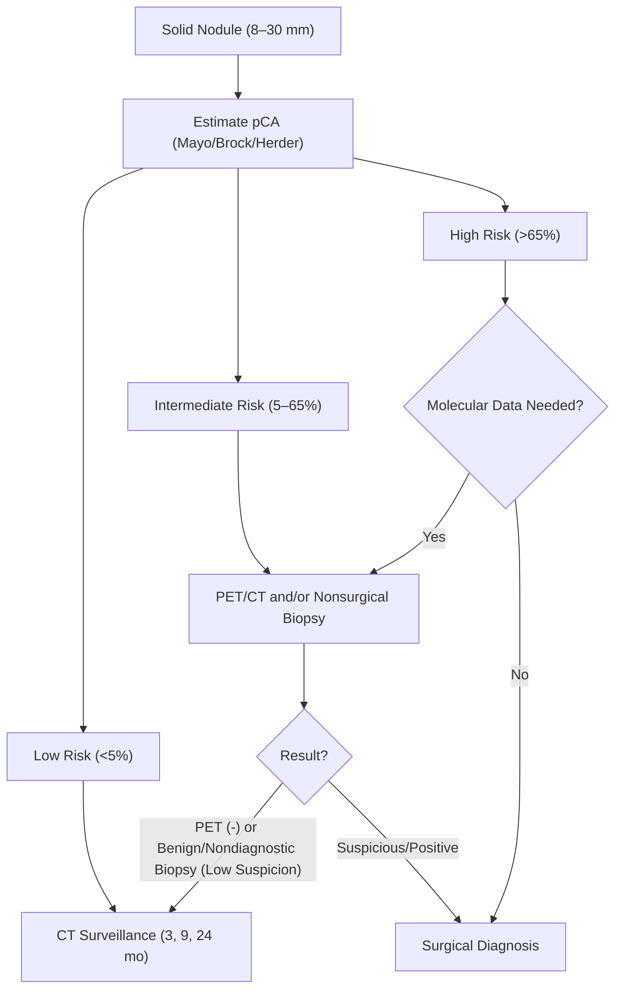
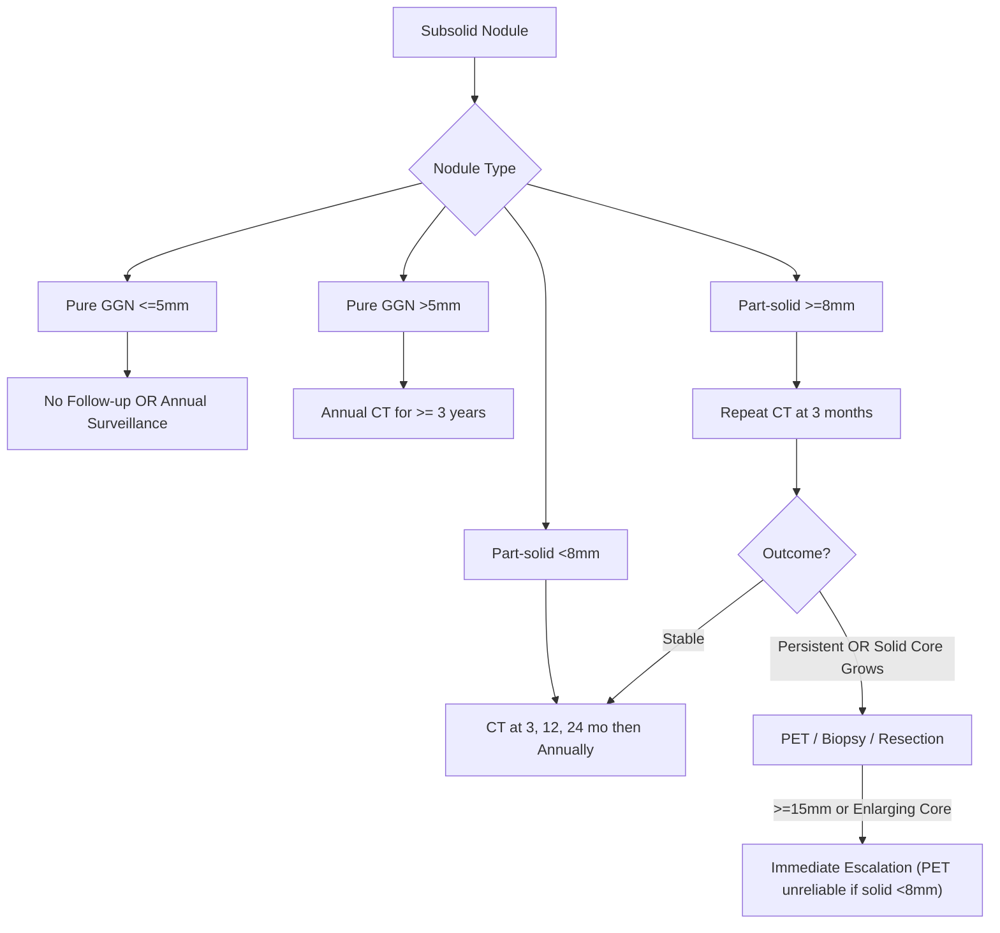

Diagnostic Approach to Pulmonary Nodules

Exam Mapping & Scope

This chapter maps to the incidental and screen‑detected pulmonary nodule domain for interventional pulmonology. Core competencies include:

Malignancy risk prediction: Mayo, Herder, Brock, TREAT 2.0.
Guideline‑directed follow‑up: Fleischner (incidental), ACCP, BTS, and Lung‑RADS (screening).
Imaging: PET/CT interpretation and biomarker integration.
Procedure selection: Bronchoscopic (conventional, navigational, robotic) versus transthoracic (TTNB).
Technique: Anesthesia/ventilation strategies to reduce atelectasis, intra‑procedural imaging (cone‑beam CT), complication mitigation, and outcome interpretation.

Learning Objectives

Apply validated malignancy risk models to stratify solitary and multiple pulmonary nodules and select an evidence‑based pathway.
Distinguish management of solid versus subsolid nodules using guideline frameworks for incidental and screen‑detected findings.
Interpret PET/CT for nodules, recognizing common causes of false positives and false negatives.
Choose a tissue acquisition modality that maximizes diagnostic yield and minimizes complications, utilizing strategies to mitigate CT‑to‑body divergence.
Optimize bronchoscopic sampling (tool sequence and yield factors) and troubleshoot nondiagnostic results.
Incorporate noninvasive biomarkers appropriately to reduce unnecessary procedures in intermediate‑risk nodules.

High‑Yield One‑Pager

Pick the right risk model: Mayo (incidentals), Herder (incidentals + PET), Brock (screening), TREAT 2.0 (specialty/high‑risk clinics). Match the model to the population prevalence.

Risk thresholds (ACCP): Low &lt;5%; Intermediate 5–65%; High &gt;65%. Management hinges on these cut points.

Fleischner (incidentals—solid):
&lt;6 mm: Often no follow‑up (low risk).
6–8 mm: CT at 6–12 months (± additional scan at 18–24 months if high risk).
&gt;8 mm: Consider CT at ~3 months, PET/CT, or tissue sampling.
Subsolid nodules (ACCP/Fleischner):
Pure GGN ≤5 mm: No follow‑up or annual surveillance.
Pure GGN &gt;5 mm: Annual CT for ≥3 years (some extend to 5 years).
Part‑solid &lt;8 mm: CT at 3, 12, 24 months, then annually.
Part‑solid ≥8 mm or enlarging solid core: PET/biopsy/resection.
≥15 mm: Escalate to PET/biopsy/resection.
Lung‑RADS (Screening):
Category 3: 6‑month LDCT.
Category 4A: 3‑month LDCT (PET if solid ≥8 mm).
Category 4B/4X: Diagnostic CT ± PET ± tissue sampling.

Imaging predictors of malignancy: Larger size; part‑solid &gt; solid &gt; pure GGN; spiculation; upper‑lobe location; pleural retraction; vascular convergence; pseudocavitation.

Benign clues: Central/laminated/popcorn calcification.

Growth kinetics: Typical cancer volume‑doubling time (VDT) is ~100–400 days. Very rapid (&lt;30–40 days) or very slow (&gt;400 days) is often benign. Note: ~26% diameter increase ≈ volume doubling.

PET/CT in nodules: SUV ≥2–2.5 is concerning. Sensitivity is generally high; specificity is limited. False negatives: &lt;8 mm lesions, subsolids, carcinoid, indolent adenocarcinoma. False positives: Infection/inflammation.

Biomarkers (Intermediate risk): Plasma proteomic “rule‑out” classifier (high sensitivity/NPV); bronchial genomic classifier supports surveillance after a nondiagnostic bronchoscopy.

Bronchoscopy yields: Conventional tools: BAL ~20%, brush ~38%, forceps ~43%, TBNA ~47%. Guided: rEBUS ~57%; EMN alone ~39%; EMN+rEBUS ~47%; large prospective navigation study ~73% at 12 months.

Robotic bronchoscopy: Contemporary series often report ~80–94% yield with low pneumothorax rates. Randomized/cluster trials show noninferior diagnostic performance versus TTNB/advanced EMN with fewer pneumothoraces.

TTNB vs Bronchoscopy: TTNB has high yield but pneumothorax rates of ~15–25%. Navigational/robotic bronchoscopy offers competitive accuracy with substantially lower pneumothorax risk.

Anesthesia/Ventilation: Atelectasis under GA is common and lowers yield. A strategy of recruitment maneuvers, PEEP 8–10 cm H₂O, and FiO₂ down‑titration reduces atelectasis.

Core Concepts

Pathophysiology / Epidemiology

Indeterminate pulmonary nodules (IPNs) are increasingly detected due to widespread chest CT and lung cancer screening. The clinical challenge is maximizing timely cancer diagnosis while avoiding unnecessary invasive testing and associated harms in benign disease.

Indications & Contraindications

Observation vs. Diagnostic Action:

Low risk (&lt;5%): CT surveillance.
Intermediate (5–65%): PET/CT and/or nonsurgical biopsy.
High (&gt;65%): Surgical diagnosis; nonsurgical biopsy if molecular results will influence neoadjuvant/adjuvant therapy.

Modality Selection:

Bronchoscopy: Favored for lesions with airway proximity/bronchus sign, central to mid‑peripheral location, or when nodal staging is needed in the same setting.
TTNB: Favored for small, pleural‑adjacent targets or poor airway access.
Electromagnetic Navigation (EMN) Caveats: Electromagnetic interference and CT‑to‑body divergence reduce accuracy; atelectasis and ventilation changes are key drivers of divergence.

Pre‑procedure Evaluation

Risk stratification: Use Mayo/Herder/Brock/TREAT 2.0 as appropriate to estimate pretest probability (pCA) and align with ACCP/BTS thresholds.
Imaging review: Assess nodule size, density (solid vs. subsolid), spiculation, upper‑lobe location, calcification pattern, multiplicity, and prior imaging for growth/VDT.
PET/CT: Best for intermediate‑risk nodules ≥8 mm and staging; anticipate false positives and false negatives.
Biomarkers: In intermediate‑risk populations, a validated plasma proteomic classifier can reduce benign procedures. After a nondiagnostic bronchoscopy, a negative bronchial genomic classifier supports conservative follow‑up.
Consent/Labs/Comorbidities: Standard bronchoscopy/TTNB labs; weigh anticoagulation, cardiopulmonary reserve, and patient values.

Equipment & Setup

Bronchoscopic Platforms: Conventional flexible bronchoscopy ± fluoroscopy, rEBUS (catheter‑based ultrasound), EMN bronchoscopy, and robotic bronchoscopy (commercial platforms vary in scope diameter/working channel and visualization).

Intra‑procedural Imaging: Mobile/fixed cone‑beam CT (CBCT) for 3D tool‑in‑lesion (TIL) confirmation.

Sampling Tools: Needle (highest sensitivity for malignancy), Forceps (best for benign disease), Brush. Strategy: Combining tools increases yield; aim for ≥6 biopsies.

Anesthesia & Ventilation: Minimize anesthesia duration. Use recruitment maneuvers, PEEP 8–10 cm H₂O, and controlled FiO₂ to mitigate atelectasis.

Step‑by‑Step Technique / Procedural Checklist

Plan: Review thin‑slice CT; select airway route; confirm bronchus sign; anticipate CT‑to‑body divergence (on the order of ~10 mm in upper lobes and ~20 mm in lower lobes).
Navigate: Use EMN/robotic guidance as indicated; confirm target with rEBUS (concentric view preferred).
Stabilize & Image: Use CBCT when available to confirm TIL and correct for divergence; CBCT can convert many non‑TIL scenarios to TIL and reduce needle‑to‑center distance.
Sample: Sequence: Needle → Forceps → Brush. Obtain ≥6 biopsies. Consider adjuncts per local protocol; use ROSE if available to reduce nondiagnostic sampling.
Reassess: If rEBUS is eccentric or negative, or if ROSE is nondiagnostic, re‑image and re‑target; adjust ventilation if atelectasis is present.
Integrate Biomarkers: After nondiagnostic tissue sampling in intermediate risk, consider biomarker testing before repeating invasive diagnostics.

Troubleshooting & Intra‑procedure Management

Negative or eccentric rEBUS view: Re‑orient, adjust catheter depth, or re‑plan with CBCT. Yield is lower with eccentric views, small size (&lt;20 mm), absence of bronchus sign, and lower‑lobe location.
Atelectasis under GA: Use recruitment maneuvers + PEEP 8–10 cm H₂O and down‑titrate FiO₂. Atelectasis accrues with longer anesthesia, higher BMI, and basilar targeting.
Electromagnetic interference: Identify and mitigate metal sources that can disturb EMN fields.
CT‑to‑body divergence: Minimize time from planning CT to sampling; use intra‑procedural imaging to adjust trajectory.

Post‑procedure Care & Follow‑up

Immediate: Monitor for bleeding or pneumothorax; post‑procedure chest radiography per institutional protocol (bronchoscopic pneumothorax rates are much lower than TTNB).

Downstream: Integrate pathology, PET/CT (for staging when malignancy confirmed), and biomarker results in multidisciplinary decision‑making. Resume surveillance when benign and stable per guideline intervals.

Complications (Prevention, Recognition, Management)

TTNB: Pneumothorax ~15–25% (some require chest tube). Weigh benefits versus bronchoscopy when airway-contiguous.

Bronchoscopy: Generally low pneumothorax rates (often ≤2–4% with guided/robotic techniques); bleeding usually minor and controllable. CBCT adds radiation exposure but improves targeting accuracy.

Comparative Trials: Navigational bronchoscopy demonstrates diagnostic performance noninferior to TTNB with markedly fewer pneumothoraces; robotic plus CBCT is noninferior to advanced EMN in cluster randomization.

Special Populations

Screen‑detected nodules: Use Lung‑RADS for categorization and Brock for risk estimation; escalate per category.
Fibrotic lung disease/IPF: Malignancy risk is higher; PET/CT interpretation may be less specific; tissue diagnosis is often needed earlier.
Anticoagulation/Pregnancy/ICU: Follow institutional pathways; choose the least invasive modality that answers the clinical question.

Evidence & Outcomes

Conventional tools vary by target and histology; combining tools and obtaining ≥6 cores improves yield. Adjunct guidance like rEBUS outperforms EMN alone; a large multicenter navigation study showed ~73% diagnostic yield at 12 months. Robotic platforms report high yields (often ≥80–90%) with low pneumothorax rates. Meta‑analysis shows that despite technological advances, pooled yields across guided bronchoscopy hover around ~69% over two decades; case selection, imaging, and ventilation strategies drive incremental gains.

Diagnostic & Therapeutic Algorithms

Algorithm 1 — Solid Pulmonary Nodule (8–30 mm) Management

Solid Nodule Management:

Low (&lt;5%): CT surveillance at 3–6, 9–12, 18–24 months; stop if stable at 2 years.
Intermediate (5–65%): PET/CT and/or nonsurgical biopsy (bronchoscopic or TTNB).
If PET negative and pCA &lt;30–40% OR if biopsy is benign/nondiagnostic with low risk: Continue surveillance.
High (&gt;65%): Surgical diagnosis. Exception: Consider nonsurgical biopsy first if molecular data may alter neoadjuvant/adjuvant therapy.
Staging: Stage with PET/CT once cancer is established.

Algorithm 2 — Subsolid Nodules

Subsolid Nodule Management:

Pure GGN ≤5 mm: Often no follow‑up or annual surveillance.
Pure GGN &gt;5 mm: Annual CT for ≥3 years (some extend to 5 years).
Part‑solid &lt;8 mm: CT at 3, 12, 24 months, then annually.
Part‑solid ≥8 mm: Repeat CT at 3 months. If persistent or solid component grows: Proceed to PET/biopsy/resection.
≥15 mm or enlarging solid core: Escalate to PET/biopsy/resection. (Note: PET is unreliable if the solid component is &lt;8 mm).

Tables & Quick‑Reference Boxes

Table 1. Clinical and Imaging Predictors of Malignancy

| Feature         | Higher Risk                                                             | Notes                                                   |
| --------------- | ----------------------------------------------------------------------- | ------------------------------------------------------- |
| Size            | Increases with diameter                                                 | &gt;2 cm confers higher risk                            |
| Morphology      | Part‑solid &gt; solid &gt; pure GGN                                     | Subsolids often indolent but risk rises with solid core |
| Spiculation     | Higher than smooth margins                                              | Odds ratio ~2.2–2.5 in cohort data                      |
| Location        | Upper lobe &gt; lower lobe                                              | —                                                       |
| Multiplicity    | 1–4 nodules higher than single                                          | Risk may decrease when &gt;5 (population dependent)     |
| Emphysema/IPF   | Increased risk                                                          | —                                                       |
| Growth          | VDT ~100–400 days typical for cancer                                    | ~26% diameter increase ≈ volume doubling                |
| Calcification   | Eccentric/punctate → suspicious                                         | Central/laminated/popcorn → benign                      |
| Ancillary signs | Pleural retraction, vascular convergence, pseudocavitation → suspicious | —                                                       |

Table 2. Guideline‑Directed Follow‑up (Selected)

| Scenario                    | Recommendation                                                                                                                                                                                  |
| --------------------------- | ----------------------------------------------------------------------------------------------------------------------------------------------------------------------------------------------- |
| Fleischner (solid &lt;6 mm) | Low risk: often no follow‑up. High risk: consider 12‑mo CT.                                                                                                                                     |
| Solid 6–8 mm                | CT at 6–12 mo (± second at 18–24 mo if high risk).                                                                                                                                              |
| Solid &gt;8 mm              | Short‑interval CT (~3 mo), PET/CT, or tissue sampling.                                                                                                                                          |
| Subsolid (ACCP)             | Pure GGN ≤5 mm: no follow‑up or annual x ≥3 y. &gt;5 mm: annual x ≥3 y. Part‑solid &lt;8 mm: 3, 12, 24 mo then annually. ≥8 mm or enlarging solid core: PET/biopsy/resection. ≥15 mm: escalate. |

Table 3. Diagnostic Performance & Complications (Representative Data)

| Modality                       | Diagnostic Performance                        | Key Complications               |
| ------------------------------ | --------------------------------------------- | ------------------------------- |
| CT‑guided TTNB                 | Yield often ~85–90%                           | Pneumothorax ~15–25%            |
| Conventional Bronch (registry) | BAL ~19%, brush ~38%, forceps ~43%, TBNA ~47% | Low pneumothorax                |
| rEBUS alone                    | ~57% yield                                    | —                               |
| EMN alone                      | ~39% yield                                    | —                               |
| EMN + rEBUS                    | ~47% yield                                    | —                               |
| EMN (NAVIGATE)                 | ~73% yield at 12 mo                           | Low pneumothorax                |
| Robotic Bronchoscopy           | ~80–94% yield                                 | Pneumothorax usually ≤~4%       |
| EMN vs TTNB (Randomized)       | Noninferior diagnostic accuracy               | Pneumothorax far lower with EMN |

Quick Box — PET/CT Interpretation

Thresholds: Don’t rely on a single SUV cutoff; report uptake pattern and clinical context.

Accuracy: Sensitivity is high overall but decreases for small (&lt;1 cm) or indolent lesions; specificity drops in granulomatous/inflammatory settings.

False Positives: Infection, granulomatous disease, sarcoid, post‑therapy changes.

False Negatives: Small size, carcinoid, mucinous/indolent adenocarcinoma, pure GGNs (AIS/MIA).

Cases & Applied Learning

Case 1

A 70‑year‑old woman with a new incidental 9 mm RUL solid nodule and 40 pack‑years is asymptomatic. Best next step?

A. No follow‑up B. CT in 3 months C. CT in 6 months D. CT in 12 months E. PET/CT only

Answer: B. For incidentally detected solid nodules &gt;8 mm, an acceptable pathway includes short‑interval CT (~3 mo), PET/CT, or tissue sampling. Short‑interval CT is a common first step to assess stability before escalation.

Case 2

Which scenario is most consistent with a benign process?

A. 20 mm spiculated upper‑lobe nodule B. 17 mm nodule with strong FDG uptake and fibrosis C. 35 mm mass with VDT ~40 days D. 22 mm nodule with eccentric calcification in a smoker E. 14 mm solid nodule with pleural retraction

Answer: C. Very rapid growth (VDT &lt;30–40 days) often points to infection/inflammation; typical malignant VDTs cluster around 100–400 days.

Case 3

A 16 mm LLL nodule has an eccentric rEBUS view and no bronchus sign during bronchoscopy. What should you do?

A. Proceed with sampling—yield will be high B. Abort and schedule TTNB C. Re‑orient, adjust position, and/or use CBCT to achieve TIL before sampling D. Switch to BAL only E. Increase FiO₂ to 100% and continue

Answer: C. Eccentric view, lower‑lobe location, and absent bronchus sign predict lower yield; reposition to confirm TIL (Tool-in-Lesion), and correct any atelectasis/divergence before sampling.

Question Bank (MCQs)

1. Next best step (screen‑detected): A 72‑year‑old active smoker has a new 7 mm nodule reported on a coronary calcium CT.

A. Schedule PET/CT
B. Low‑dose screening CT (LDCT)
C. CT‑guided biopsy
D. Repeat CT in 12 months
E. Bronchoscopic biopsy

2. Calcification pattern: Which suggests benign disease?

A. Eccentric
B. Punctate
C. Central or laminated
D. Amorphous
E. Peripheral rim

3. Intra‑procedure troubleshooting: During robotic bronchoscopy, rEBUS is negative and CBCT shows basilar atelectasis. What now?

A. Increase FiO₂ to 100%
B. Recruitment + PEEP 8–10 cm H₂O and down‑titrate FiO₂, then re‑image
C. Abort and schedule TTNB
D. Continue sampling blindly
E. Give furosemide

4. Indications: An intermediate‑risk (pCA ~25%) 12 mm RUL nodule abuts a segmental airway with a bronchus sign. Best initial diagnostic approach?

A. Immediate surgical resection
B. Bronchoscopy with rEBUS/EMN ± CBCT
C. Empiric antibiotics and no follow‑up
D. TTNB regardless of airway proximity
E. SBRT without tissue

5. PET pitfalls: Which scenario most risks a false‑negative PET?

A. 2.5 cm spiculated solid nodule
B. 1.0 cm typical carcinoid
C. Active pneumonia
D. Sarcoidosis
E. Radiation pneumonitis

6. Tool selection for benign disease: Suspected granulomatous infection in a 20 mm peripheral nodule. Which strategy yields the most specific diagnosis?

A. Needle alone
B. Forceps biopsies (≥6) ± ancillary sampling
C. Brush only
D. BAL only
E. Repeat CT rather than sampling

7. Next best step (subsolid): A persistent 18 mm part‑solid nodule has a growing 7 mm solid core.

A. Annual CT only
B. PET/CT not helpful—observe
C. PET/CT and proceed to biopsy or resection
D. Ignore growth if overall size is stable
E. Immediate SBRT without tissue

8. Yield factors: Which constellation predicts the lowest bronchoscopic diagnostic yield?

A. Concentric rEBUS view; upper‑lobe location
B. Eccentric rEBUS view; lower‑lobe location; no bronchus sign
C. Concentric rEBUS view; lower lobe
D. Eccentric rEBUS view; upper lobe
E. Concentric rEBUS view; bronchus sign present

9. Comparative safety: In randomized/cluster trials, the complication most reduced with navigational/robotic bronchoscopy versus TTNB is:

A. Hemoptysis
B. Pneumothorax requiring chest tube
C. Post‑procedure fever
D. Air embolism
E. Hypoxemia

10. High‑risk management: A fit patient has a spiculated 2.6 cm upper‑lobe nodule (pCA ~75%). Best first step?

A. Serial CT only
B. PET/CT solely to decide benign vs malignant
C. Surgical diagnosis; consider nonsurgical biopsy if molecular data will alter therapy
D. Empiric SBRT
E. Antibiotics and re‑imaging in 6 weeks

11. Screening framework: A 6 mm solid nodule on LDCT is categorized as:

A. Lung‑RADS 1
B. Lung‑RADS 2
C. Lung‑RADS 3
D. Lung‑RADS 4A
E. Lung‑RADS 4X

12. Intra‑procedural imaging value: The key benefit of CBCT during bronchoscopic biopsy is:

A. Replaces PET/CT in staging
B. Converts many non‑TIL situations to TIL and reduces needle‑to‑center distance
C. Eliminates the need for rEBUS
D. Lowers bleeding risk directly
E. Shortens anesthesia time automatically

Controversies, Variability, and Evolving Evidence

PET performance varies with local granulomatous disease prevalence; reliance on a single SUV threshold is unreliable.
Subsolid surveillance intervals differ by guideline (≥3 years vs 5 years for some pure GGNs).
Guided bronchoscopy yields have been relatively stable overall despite new tech; operator selection, ventilation, and intra‑procedural imaging are major levers for improvement.
Robotics vs TTNB/EMN: Noninferiority and safety advantages are demonstrated, but long‑term data on molecular adequacy and time‑to‑therapy are still accruing.
Cryobiopsy for nodules (1.1 mm probe): Not FDA‑approved; limited data—insufficient to endorse or refute routine use.

Take‑Home Checklist

Identify the clinical context (incidental vs screening) and choose the appropriate risk model.
Apply ACCP/Fleischner/Lung‑RADS thresholds to decide surveillance versus diagnostic action.
Order PET/CT selectively (≥8 mm, intermediate risk); anticipate false‑positive and false‑negative scenarios.
Use biomarkers to down‑classify intermediate‑risk nodules and reduce procedures in benign disease.
For bronchoscopy: seek a bronchus sign, target a concentric rEBUS view, and obtain ≥6 biopsies using multiple tools.
Mitigate atelectasis (recruitment, PEEP 8–10 cm H₂O, lower FiO₂), especially for basilar targets, higher BMI, and longer cases.
Use CBCT when available to confirm TIL and correct CT‑to‑body divergence.
Match biopsy modality to lesion: pleural‑adjacent favors TTNB; airway‑contiguous or need for nodal staging favors bronchoscopy.
After a nondiagnostic result, reassess pCA and imaging; don’t repeat low‑yield procedures without changing the plan.

Abbreviations & Glossary

ACS: American Cancer Society
CTDIvol: Volume CT dose index (mGy)
CTLS: CT lung screening
GGN: Ground‑glass nodule (non‑solid)
ILC/ILD: Interstitial lung disease
LDCT: Low‑dose computed tomography
MDT: Multidisciplinary team
NCCN: National Comprehensive Cancer Network
NLST/NELSON: Landmark LDCT screening trials
PET/CT: Positron emission tomography with CT
PLCOm2012: Prostate, Lung, Colorectal, and Ovarian screening trial risk model (2012)
QALY: Quality‑adjusted life‑year
USPSTF: U.S. Preventive Services Task Force

References

Aberle DR, Adams AM, Berg CD, et al. Reduced lung‑cancer mortality with low‑dose computed tomographic screening. N Engl J Med. 2011;365:395‑409.
de Koning HJ, van der Aalst CM, de Jong PA, et al. Reduced lung‑cancer mortality with volume CT screening in a randomized trial. N Engl J Med. 2020;382:503‑513.
Krist AH, Davidson KW, Mangione CM, et al. Screening for Lung Cancer: US Preventive Services Task Force Recommendation Statement. JAMA. 2021;325:962‑970.
Wood DE, Kazerooni EA, Baum SL, et al. NCCN Guidelines® Insights: Lung Cancer Screening (current version). J Natl Compr Canc Netw. 2022–2025.
Wolf AMD, Shih Y‑CT, Fontham ETH, et al. Screening for lung cancer: 2023 guideline update from the American Cancer Society. CA Cancer J Clin. 2024;74:50‑81.
Mazzone PJ, Silvestri GA, Patel S, et al. Screening for Lung Cancer: CHEST Guideline and Expert Panel Report. Chest. 2021;160:e427‑e494.
Christensen J, Prosper AE, Wu CC, et al. ACR Lung‑RADS v2022: Assessment Categories and Management Recommendations. J Am Coll Radiol. 2024;21:473‑486.
Black WC, Gareen IF, Soneji SS, et al. Cost‑effectiveness of CT screening in the National Lung Screening Trial. N Engl J Med. 2014;371:1793‑1802.
Larke FJ, Kruger RL, Cagnon CH, et al. Estimated radiation dose associated with LDCT of NLST participants. AJR Am J Roentgenol. 2011;197:1165‑1169.
Pinsky PF, Gierada DS, Black W, et al. Performance of Lung‑RADS in the National Lung Screening Trial: a retrospective assessment. Ann Intern Med. 2015;162:485‑491.
Silvestri GA, Goldman L, Tanner NT, et al. Outcomes from more than 1 million people screened for lung cancer with low‑dose CT. Chest. 2023;164:241‑251.
McKee BJ, Regis SM, McKee AB, et al. Performance of ACR Lung‑RADS in a clinical CT lung screening program. J Am Coll Radiol. 2016;13:R25‑R29.
Kinsinger LS, Anderson C, Kim J, et al. Implementation of Lung Cancer Screening in the Veterans Health Administration. JAMA Intern Med. 2017;177:399‑406.
Rampinelli C, De Marco P, Origgi D, et al. Exposure to low‑dose CT for screening and risk‑benefit analysis. BMJ. 2017;356:j347.
Tammemägi MC, Katki HA, Hocking WG, et al. Selection criteria for lung‑cancer screening. N Engl J Med. 2013;368:728‑736.
Katki HA, Kovalchik SA, Berg CD, et al. Development and Validation of Risk Models to Select Ever‑Smokers for CT Lung Cancer Screening. JAMA. 2016;315:2300‑2311.
Robbins HA, Berg CD, Cheung LC, et al. Comparative performance of lung cancer risk models in the United Kingdom. Br J Cancer. 2021;124:2026‑2034.
Raghu G, Remy‑Jardin M, Myers JL, et al. Idiopathic pulmonary fibrosis and progressive pulmonary fibrosis in adults: clinical practice guideline. Am J Respir Crit Care Med. 2022;205:e18‑e47.
Mazzone PJ, Bach PB, Carey J, et al. Clinical validation of a cfDNA fragmentome assay for early detection of lung cancer. Cancer Discov. 2024;14:2224‑2238.
Geppert J, Kothari J, Karia R, et al. AI for nodule and cancer detection in CT lung cancer screening: systematic review. Thorax. 2024;79:1040‑1049.
