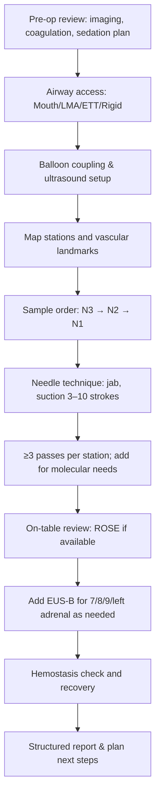

Lung Cancer Staging and Linear EBUS

Target audience: IP fellows and practicing pulmonologists

Exam Mapping & Scope

This chapter integrates the 9th edition TNM stage classification with practical, exam‑relevant application of linear endobronchial ultrasound (EBUS) for mediastinal staging. It emphasizes imaging triage (CT, PET/CT, brain MRI when appropriate), nodal maps and boundaries, indications for invasive staging, systematic vs targeted EBUS strategies, sample acquisition/processing, complication recognition, and post‑test decision‑making (including when—if ever—to confirm a negative EBUS with mediastinoscopy).

Learning Objectives

By the end of this chapter, the reader will be able to:

Apply 9th edition TNM updates—N2a vs N2b and M1c1 vs M1c2—to clinical staging decisions.

Identify which mediastinal/hilar nodal stations are accessible by EBUS vs EUS‑B and recognize high‑risk anatomic boundaries.

Select patients for invasive mediastinal staging and choose between systematic and targeted EBUS strategies.

Execute a stepwise, contamination‑minimizing EBUS‑TBNA workflow, including sampling order (N3→N2→N1) and adequate passes.

Optimize sedation/oxygenation and troubleshoot poor windows, calcified or necrotic nodes, and bleeding.

Interpret negative invasive staging in context and plan when additional mediastinoscopy changes management.

High‑Yield One‑Pager (Pearls, Pitfalls, Traps)

TNM‑9 essentials: N2 subdivides into single‑station (N2a) vs multistation (N2b); M1c subdivides into single‑organ (M1c1) vs multi‑organ (M1c2). Several T/N combinations shift stage groups (notably T1N2aM0 → Stage IIB).

Measure the solid/invasive component for T size; lepidic/ground‑glass portions do not count toward T size; STAS does not change T.

Node map boundaries matter: e.g., lower rim of the azygos distinguishes 4R from 10R; the superior rim of the aortic arch separates 2L from 4L. Mislabeling can upstage or downstage.

Imaging triage: PET/CT outperforms CT for mediastinal nodes but has false positives; no PET/CT for small brain mets—use brain MRI when clinically indicated.

Who needs invasive staging? Discrete mediastinal adenopathy, PET‑avid mediastinal nodes; “intermediate risk” scenarios include central tumors, tumors >3 cm, or cN1—despite normal CT/PET mediastinum.

EBUS vs surgery: Endoscopic needle staging (EBUS/EUS‑B) has high sensitivity/specificity and is the preferred first test; combining EBUS+EUS increases yield.

Systematic > targeted (often): A systematic approach (sampling ≥3 stations, typically 4R, 4L, 7) detects additional N2/N3 disease compared with “hit‑and‑run.”

Sampling order is an exam favorite: Always from N3 → N2 → N1 to avoid contamination.

Adequacy: ≥3 passes per target is a common adequacy benchmark; consider additional passes for molecular testing or when ROSE is unavailable.

Stations 5–6 caveat: Rarely accessible by EBUS; consider EUS‑B or surgical approaches when these are critical.

Complications are uncommon: Major events are rare; pneumothorax is unusual but can occur near pleura (e.g., right paratracheal close to pleural reflection).

Negative EBUS—then what? Confirmatory mediastinoscopy after a high‑quality, systematic negative EBUS yields limited incremental benefit in many settings; consider patient selection and institutional protocols.

Sedation: Moderate and deep sedation both acceptable; deep sedation may reduce intraprocedural instability in some cohorts; HFNC can mitigate desaturation under moderate sedation.

Special situations: Limited utility of EBUS‑TBNA for classic Hodgkin lymphoma; cryobiopsy or surgical tissue may be needed.

Report like a surgeon: Specify stations sampled, needle gauge, passes, use of ROSE, and any limitations (calcification, necrosis, vascular proximity).

Core Concepts
Pathophysiology / Epidemiology (brief)

Nodal spread follows predictable drainage from lobar to mediastinal stations, with prognosis tied not just to presence of nodal disease but also distribution (single vs multistation) and extent (ipsilateral vs contralateral). TNM‑9 formalizes this clinically observed gradient by splitting N2 and M1c.

Indications & Contraindications

Indications for invasive mediastinal staging (needle-based preferred first test):

Discrete mediastinal lymph node enlargement (short axis >1 cm) and/or FDG‑avid mediastinal nodes with no distant metastases.

“Intermediate risk” with radiographically normal mediastinum but high‑risk primary: central tumor, tumor >3 cm, or suspected N1 on imaging.

Select PET‑negative primaries (low SUV) where occult N2/N3 risk remains.

When invasive staging is generally not indicated:

Peripheral tumor &lt;3 cm with avid primary and no suspicious nodes on CT/PET.

EBUS/EUS‑B station selection:

EBUS reaches most stations except 5–6 (aortopulmonary and para‑aortic).

EUS‑B adds excellent access to stations 8–9 and augments access to 4L, 7; left adrenal is often assessable during the same session if clinically relevant.

Contraindications and precautions:

Uncontrolled coagulopathy or high bleeding risk; temporarily pause therapeutic anticoagulation when safe.

For EUS‑B, esophageal varices/severe dysphagia increase risk.

Pre‑procedure Evaluation

Imaging: Chest CT (thin sections); PET/CT to screen for distant disease and prioritize stations; consider brain MRI case‑by‑case (e.g., neurologic symptoms or when curative therapy is planned).

Labs and meds: Review platelet count/coagulation and antithrombotics with plan for holding/resumption per local protocol.

Airway & anesthesia plan: Moderate sedation vs deep sedation/GA. GA facilitates stability, suppresses cough, and allows repeated scope exchanges (ETT ≥8.0, LMA, or rigid support). For moderate sedation, HFNC reduces desaturation versus low‑flow.

Consent: Document potential benefits (minimally invasive staging, molecular adequacy) and rare but serious risks (significant bleeding, pneumothorax, mediastinitis).

Equipment & Setup

Scope: Linear (curvilinear) echo‑bronchoscope with ~7.5‑MHz transducer; outer diameter ≈6.3–6.6 mm. Balloon sheath for coupling (inflate with saline).

Needles: 19G, 21G, 22G, 25G; typical excursion depth ~5–40 mm with adjustable safety lock.

Ancillaries: Doppler, suction, syringes for vacuum (or capillary technique), ROSE when available, media for cell block/core, HFNC or ventilatory support per sedation plan.

Layout and safety: Sterile field, bite block/mouthpiece, crash‑cart readiness, and ultrasound machine positioned so operator can simultaneously see endoscopic and US views.

Step‑by‑Step Technique / Procedural Checklist

Airway access (mouth/LMA/ETT/rigid) and topicalization per plan; couple balloon for ultrasound contact.

Survey airway; align on CT/PET roadmap; confirm vascular landmarks on US (e.g., SVC and azygos for 4R; left PA and aortic arch for 4L).

Systematic evaluation and sampling order: contralateral mediastinal (N3) → ipsilateral mediastinal (N2) → hilar (N1).

Targeting & safety: Activate Doppler to avoid vessels; respect pleura near right paratracheal/azygos region; differentiate esophagus posteriorly at 7.

Needle handling (jab method): Lock body, advance sheath to visual field, release lock, quick jab into node under real‑time US, stylet manipulation, apply suction, 3–10 to‑and‑fro motions, release suction, retract and recover sample.

Passes: Perform ≥3 passes per station for cytology; add more if molecular testing anticipated or ROSE inadequate.

Sample processing: Prepare smears + cell block (or clot core) for histology and ancillary studies; label by station.

Combine with EUS‑B (same session) if posterior/inferior stations or left adrenal are indicated.

Completion: Rinse scope, reinflate balloon as needed, confirm hemostasis, and perform brief airway inspection.

Troubleshooting & Intra‑procedure Management

Poor contact: Refill balloon, adjust flexion, change patient neck position, or use small scope tip deflections to optimize the window.

Calcified or fibrotic nodes: Use a stiffer needle (e.g., 19–21G) and multiple redirections within node; consider additional passes for cell block.

Necrotic nodes: Sample the viable peripheral rim on US; Doppler to avoid feeding vessels.

Bleeding: Most events are minor; apply suction, cold saline; if persistent, withdraw and reassess coagulation status; consider tamponade with the scope/balloon.

Cough/movement: Deepen sedation or convert to GA; LMA/ETT often improves precision and throughput.

Station identification errors: Re‑interrogate landmarks (azygos arch = inferior 4R border; superior LPA = inferior 4L border; esophagus posterior at 7); misclassification can change N category.

Post‑procedure Care & Follow‑up

Monitor 1–2 hours for hypoxemia or bleeding.

Resume antithrombotics per protocol; give return precautions (fever, chest pain, hemoptysis).

Reporting essentials: Clinical context, imaging summary, stations evaluated and sampled, gauge and passes, ROSE result (if used), immediate complications/limitations, and next steps (e.g., need for additional staging at stations 5–6).

Complications (prevention, recognition, management)

Overall risk is low. Reported major adverse events are rare (well under 2% in most series). Minor complications include cough, transient hypoxemia, and mild bleeding.

Pneumothorax: Uncommon (reported well under 1%); risk increases when pleura is close (e.g., high right paratracheal). Always keep pleura in view while sampling.

Infectious: Mediastinitis is rare; sterile technique and avoiding traversing contaminated fields reduce risk; consider antibiotic prophylaxis selectively (e.g., cystic lesions, high‑risk hosts).

Sedation‑related: Hypoventilation, hypotension, arrhythmia—optimize preoxygenation; HFNC reduces desaturation in moderate sedation; deep sedation/GA can reduce intra‑procedure instability in some cohorts.

Special Populations

cN0 by imaging but “intermediate risk”: Central tumors, >3 cm, or cN1—systematic EBUS/EUS‑B is appropriate; occult N2/N3 disease is not rare.

Left upper lobe tumors with suspicious aortopulmonary window nodes: Consider EUS‑B or surgical access to stations 5–6.

Lymphoma: Classic Hodgkin lymphoma can be challenging by TBNA; consider adjunctive cryobiopsy or alternate approach for architecture.

Radiation planning: Pre‑treatment EBUS/EUS‑B improves target delineation when nodal status is uncertain.

Antithrombotics/pregnancy/ICU: Individualize with anesthesia support; prioritize oxygenation and fetal considerations where applicable; invasive staging remains feasible with GA and controlled ventilation.

Evidence & Outcomes (selected)

Imaging performance: PET/CT mediastinal nodal sensitivity/specificity commonly reported around ~77–85%/86–90%; CT alone often ~55–61%/79–81%. PET/CT can be false‑positive (inflammation/infection) and false‑negative in low‑FDG histologies; brain MRI outperforms PET/CT for small brain mets.

Endoscopic needle staging: EBUS‑TBNA shows high sensitivity (~90%) and near‑perfect specificity in experienced hands; combining EBUS+EUS modestly increases staging sensitivity (into the low‑ to mid‑90% range).

Systematic vs targeted: Systematic endosonographic staging (sampling ≥3 stations) detects additional N2/N3 disease compared with targeted “suspicious‑only” approaches.

After a negative, high‑quality EBUS: Routine confirmatory mediastinoscopy adds little for many patients and may delay therapy and increase morbidity; reserve for select high‑risk scenarios or discordant cases after multidisciplinary review.

Diagnostic & Therapeutic Algorithms
Algorithm 1 — NSCLC Imaging → Invasive Mediastinal Staging
```mermaid
flowchart TD
A[Suspected/Proven NSCLC] --> B[Contrast CT chest/abdomen]
B --> C[FDG PET/CT]
C -->|Distant mets present| D[Stage IV workup/therapy]
C -->|No distant mets| E{Mediastinal risk?}
E -->|Discrete LN on CT and/or PET-avid| F[Invasive staging (EBUS ± EUS-B)]
E -->|Central tumor, >3 cm, or cN1 with normal mediastinum| F
E -->|Peripheral &lt;3 cm, no suspicious LN| G[Direct to local therapy if otherwise operable]
F --> H[Systematic sampling (N3→N2→N1; ≥3 passes/station)]
H --> I{Any N2/N3 proven?}
I -->|Yes| J[Stage III—multidisciplinary plan (surgery select N2a vs nonsurgical)]
I -->|No| K[Proceed to planned local therapy]
K --> L{High suspicion persists?}
L -->|Yes| M[Selective confirmatory mediastinoscopy]
L -->|No| N[Proceed with surgery/RT]
```


Bulleted companion algorithm

Perform CT and PET/CT first; add brain MRI selectively (e.g., curative intent with neurologic symptoms or high risk).

Invasive staging indicated for radiographic mediastinal disease and for “intermediate‑risk” primaries (central, >3 cm, cN1).

Use systematic EBUS±EUS‑B; sample N3→N2→N1; aim for ≥3 passes per node.

Negative results with persistent risk: consider confirmatory mediastinoscopy selectively.

Algorithm 2 — Linear EBUS‑TBNA Procedural Workflow



Bulleted companion checklist

Confirm station boundaries (e.g., azygos = inferior 4R; superior LPA = inferior 4L).

Use Doppler before puncture; avoid pleura near high right paratracheal.

Redirect within node to avoid necrotic core; rim sampling often better.

Document stations sampled, gauge/passes, and any limitations.

Tables & Quick‑Reference Boxes
Table 1. TNM‑9 High‑Yield Updates

| Item | Key Point | Practical Impact |
| --- | --- | --- |
| N2 subcategories | N2a: single ipsilateral mediastinal/subcarinal station; N2b: multiple stations | Multistation N2 confers worse prognosis; influences surgical candidacy and adjuvant decisions |
| M1c subcategories | M1c1: multiple mets in one organ system; M1c2: multiple organ systems | Clarifies metastatic burden; supports MDT planning |
| Stage groups | Several T/N combos reassigned (e.g., T1N2aM0 → IIB) | Avoid “legacy bias” from 8th edition when counseling/treating |
| T coding reminders | Size = solid/invasive component; lepidic not counted | Prevent T overestimation |
| VPI, STAS | VPI upstages (T2 when small); STAS recorded but does not change T | Don’t count STAS toward T size |

Abbreviations: MDT, multidisciplinary team; mets, metastases; VPI, visceral pleural invasion; STAS, spread through air spaces.

Table 2. Node Stations: Access & Landmarks (EBUS vs EUS‑B)

| Station | Typical Access | Landmark Tips (US) | Notes |
| --- | --- | --- | --- |
| 2R/2L | EBUS (±EUS‑B) | 2R: right carotid/subclavian; 2L: above aortic arch | Defining borders on US is challenging; use aortic arch level for 2L then rotate |
| 4R | EBUS | SVC and azygos; lower rim of azygos = inferior 4R | Azygos distinguishes 4R vs 10R; pleura is close—avoid pneumothorax |
| 4L | EBUS (±EUS‑B) | “Mickey Mouse” (aorta‑PA‑node); superior LPA = inferior 4L | EUS‑B can help difficult angles |
| 5–6 | Usually EUS‑B or surgery | Aortopulmonary window/para‑aortic | Often not reachable by EBUS |
| 7 | EBUS or EUS‑B | Subcarinal; esophagus posterior | Approach via either main bronchus wall |
| 8–9 | EUS‑B only | Paraesophageal/pulmonary ligament | Not accessible by EBUS |
| 10–11 | EBUS | 10R: inferior to azygos; 10L: above LPA; 11 between lobar bronchi | Hilar/interlobar nodes |

Abbreviations: SVC, superior vena cava; PA, pulmonary artery; US, ultrasound; LPA, left pulmonary artery.

Table 3. EBUS‑TBNA Quick Protocol

| Domain | Best Practice |
| --- | --- |
| Strategy | Systematic evaluation; sample ≥3 stations (commonly 4R, 4L, 7) in N3→N2→N1 order |
| Passes | ≥3 passes per node; more if molecular testing is needed or ROSE is unavailable |
| Needle | 19/21/22/25G; stiffer needles aid calcified nodes; 25G sometimes advantageous for tight angles |
| Sedation | Moderate or deep sedation acceptable; GA improves stability; HFNC lowers desaturation risk in moderate sedation |
| Safety | Doppler vessel check; keep pleura in view at high right paratracheal; avoid necrotic centers; maintain sterile technique |
| Report | Stations sampled, gauge/passes, adequacy/ROSE, complications, and limitations |

Abbreviations: GA, general anesthesia; HFNC, high‑flow nasal cannula; ROSE, rapid on‑site evaluation.

Table 4. Imaging for Staging—Strengths & Caveats

| Modality | Advantages | Limitations |
| --- | --- | --- |
| PET/CT | High sensitivity for distant disease and mediastinal nodes | Poor for small brain mets; false positives with infection/inflammation; less effective in low‑FDG cancers |
| MRI (brain; chest for apex) | Best for CNS mets; excellent soft‑tissue contrast for Pancoast invasion | Availability, contraindications, longer exam, patient cooperation |
| CT (contrast) | Baseline anatomic map; surgical planning | Inferior to PET/CT for nodal metastases; underestimates invasion in some scenarios |

Abbreviations: CNS, central nervous system; FDG, fluorodeoxyglucose.

Imaging & Figure Callouts (Placeholders)

Figure A. Linear EBUS view of 4R with SVC and azygos arch. Alt text: “Ultrasound image showing 4R node bordered by SVC and azygos vein.”

Figure B. Linear EBUS view of 4L demonstrating the aorta–PA–node “Mickey Mouse” window. Alt text: “Ultrasound image at the aortopulmonary level highlighting 4L node.”

Figure C. Subcarinal (7) node on EBUS with posterior esophagus. Alt text: “Subcarinal node with esophagus seen posteriorly.”

Figure D. Paraesophageal (8) node via EUS‑B. Alt text: “EUS‑B visualization of station 8 adjacent to esophageal wall.”

Cases & Applied Learning

Case 1 (Next best step).
A 5‑cm left lower lobe NSCLC is PET‑avid; mild uptake in 4L, 7, and 11R; no distant metastases.
A. Proceed directly to lobectomy
B. Start sampling at 11R
C. Start sampling at 4L
D. PET alone is adequate
E. Routine mediastinoscopy first
Answer: B. Start at N3 first (contralateral hilar 11R), then N2 (4L/7), then N1. EBUS‑TBNA is the preferred initial modality; PET alone is insufficient to finalize mediastinal staging.

Case 2 (Access planning).
A left upper lobe tumor with suspected aortopulmonary window involvement on PET/CT.
A. EBUS of 5–6
B. EUS‑B or surgical approach to 5–6
C. Skip staging and operate
D. Sample only 7
E. Target adrenal first
Answer: B. Stations 5–6 are rarely accessible by EBUS; EUS‑B or a surgical approach is indicated when these stations drive management.

Case 3 (Negative EBUS).
A patient with central T2 tumor and cN0 by CT/PET undergoes systematic EBUS/EUS‑B (≥3 stations, adequate passes) that is negative.
A. Always proceed to confirmatory mediastinoscopy
B. Proceed with resection/RT per plan
C. Treat as N2b
D. Repeat EBUS immediately
E. Start chemotherapy
Answer: B. High‑quality negative endosonography often obviates routine confirmatory mediastinoscopy; consider confirmation selectively (discordance/high residual risk).

Question Bank (MCQs)

1. A 3.5‑cm central RUL mass with normal mediastinum on CT/PET. Best next step for mediastinal evaluation?
A. PET/CT repeat in 3 months
B. EBUS‑TBNA (systematic)
C. Direct to lobectomy
D. Chest MRI
E. Bone scan
Answer: B. Central tumors >3 cm are “intermediate risk” despite normal imaging and warrant invasive mediastinal staging.

2. During EBUS of 4R, which landmark best defines the inferior border of 4R and helps distinguish it from 10R?
A. Left pulmonary artery
B. Aortic arch
C. Azygos vein (lower rim)
D. Right atrium
E. Carina
Answer: C. The lower rim of the azygos marks the inferior border of 4R; below this is 10R.

3. In TNM‑9, which change is correct?
A. M1a subdivided into M1a1/M1a2
B. N2 subdivided into N2a (single station) and N2b (multistation)
C. T categories now count lepidic component
D. STAS increases T category
E. VPI no longer affects T
Answer: B. N2 is now split into N2a and N2b; lepidic isn’t counted in T size; STAS does not change T; VPI retains impact.

4. Which station is not typically reachable with linear EBUS and often requires EUS‑B or surgery?
A. 4L
B. 7
C. 10L
D. 5
E. 11R
Answer: D. Station 5 (aortopulmonary window) is rarely accessible with EBUS.

5. Preferred sampling order during lung cancer staging by EBUS?
A. N1 → N2 → N3
B. N2 → N3 → N1
C. N3 → N2 → N1
D. Any order is acceptable
E. N2 only
Answer: C. Sample N3 → N2 → N1 to avoid contamination/upstaging.

6. Which is true regarding sedation for EBUS‑TBNA?
A. Deep sedation is contraindicated
B. Moderate and deep sedation are acceptable; deep sedation may reduce intraprocedural instability
C. Only general anesthesia yields diagnostic samples
D. HFNC worsens desaturation under moderate sedation
E. ROSE is mandatory under deep sedation
Answer: B. Both strategies are acceptable; deep sedation/GA can stabilize the procedure; HFNC decreases desaturation risk during moderate sedation.

7. A posterior subcarinal node is difficult to visualize by EBUS. Best complementary strategy?
A. Higher suction only
B. Switch to EUS‑B for posterior view
C. Reduce balloon coupling
D. Sample N1 first
E. Abort procedure
Answer: B. EUS‑B often improves visualization and access to posterior subcarinal nodes.

8. Adequacy strategy when ROSE is unavailable and molecular tests are anticipated:
A. One pass per node is sufficient
B. Two passes per node with no cell block
C. ≥3 passes per node and ensure cell block/clot core
D. Forego nodal sampling; biopsy primary only
E. Use 25G only
Answer: C. Multiple passes plus cell block optimize yield for histology and molecular profiling.

9. Which scenario most strongly supports systematic rather than targeted staging?
A. Multiple bulky PET‑avid mediastinal nodes in a poor surgical candidate
B. Small peripheral tumor &lt;3 cm with negative mediastinum
C. Central tumor with otherwise normal mediastinum
D. Isolated adrenal metastasis on PET/CT
E. Post‑neoadjuvant restaging for known multistation N2
Answer: C. “Intermediate‑risk” (e.g., central tumor) benefits from systematic staging to detect occult N2/N3.

10. Most appropriate management after a high‑quality negative systematic EBUS/EUS‑B for a patient with initially PET‑avid 4R and 7 nodes?
A. Treat as N2b
B. Immediate mediastinoscopy for all
C. Proceed with planned local therapy; consider confirmation only if discordance persists
D. Start induction chemo by default
E. Repeat EBUS next week
Answer: C. Routine confirmatory mediastinoscopy is not mandatory; individualize based on residual risk and MDT discussion.

11. Which statement about PET/CT is correct?
A. It reliably detects small brain metastases
B. It is superior to CT for nodal staging but can be false‑positive with inflammation
C. It outperforms MRI for Pancoast tumor invasion
D. It is ideal for low‑FDG tumors
E. A negative PET/CT rules out mediastinal disease definitively
Answer: B. PET/CT has better nodal performance than CT but limited brain sensitivity and false positives.

12. During 4R sampling, you encounter a hyperechoic center with anechoic peripheral vessels. Best next step?
A. Sample the hyperechoic center only
B. Use Doppler and redirect to viable rim, avoiding vessels
C. Increase suction and continue
D. Abort staging
E. Switch immediately to mediastinoscopy
Answer: B. Avoid vascular structures; necrotic centers are low yield—sample viable peripheral rim.

Controversies, Variability, and Evolving Evidence

Confirmatory mediastinoscopy after negative endosonography: modern trials and meta‑analyses show small incremental detection (particularly single‑station N2) with trade‑offs in delay and morbidity; practices vary by center and risk tolerance.

“Single‑station N2” vs “zone” definitions across guidelines can differ, complicating resectability discussions; TNM‑9’s N2a/N2b recognizes prognostic separation but clinical thresholds remain multidisciplinary.

Sedation strategy: Evidence supports both moderate and deep sedation; institutional expertise, anesthesia availability, and patient comorbidities drive choice.

Adjunctive tissue acquisition: EBUS‑guided mediastinal cryobiopsy is emerging for situations where TBNA is insufficient, especially for diseases that need architecture or broader molecular profiling.

Take‑Home Checklist

Know TNM‑9: N2a vs N2b; M1c1 vs M1c2; T counts solid/invasive size.

Triage with CT + PET/CT; consider brain MRI selectively.

Invasive staging for radiographic mediastinal disease and “intermediate‑risk” primaries.

Prefer systematic EBUS±EUS‑B; N3 → N2 → N1; ≥3 passes per station.

Recognize landmarks (azygos for 4R/10R; aortic arch/LPA for 4L).

Avoid vessels with Doppler; respect pleura at high right paratracheal.

Combine EUS‑B for stations 7 (posterior), 8–9, and left adrenal.

Document a structured report with stations, passes, adequacy, and limitations.

Negative EBUS does not always require mediastinoscopy—decide case‑by‑case.

Plan for molecular adequacy (cell block/clot core).

Anticipate and manage rare complications promptly.

Abbreviations & Glossary

ACCP: American College of Chest Physicians

EUS‑B: Esophageal use of the EBUS scope

FDG: Fluorodeoxyglucose

GA: General anesthesia

HFNC: High‑flow nasal cannula

IASLC: International Association for the Study of Lung Cancer

N2a/N2b: Single‑ vs multistation ipsilateral mediastinal disease (TNM‑9)

M1c1/M1c2: Multiple lesions in one organ system vs multiple organ systems (TNM‑9)

PET/CT: Positron emission tomography/computed tomography

ROSE: Rapid on‑site cytologic evaluation

STAS: Spread through air spaces

TBNA: Transbronchial needle aspiration

VPI: Visceral pleural invasion

References (AMA Style; from provided materials only)

Detterbeck FC, Woodard GA, Bader AS, et al. The proposed ninth edition TNM classification of lung cancer. Chest. 2024;166(4):882‑895.

Rami‑Porta R, Nishimura K, Giroux D, et al. IASLC Lung Cancer Staging Project: proposals for revision of the TNM stage groups in the forthcoming ninth edition. J Thorac Oncol. 2024;19(7):1007‑1027.

Huang J, Osarogiagbon RU, Giroux DJ, et al. Proposals for revision of the N descriptors in the forthcoming ninth edition. J Thorac Oncol. 2024;19(5):766‑785.

Fong KM, Rosenthal A, Giroux DJ, et al. Proposals for revision of the M descriptors in the forthcoming ninth edition. J Thorac Oncol. 2024;19(5):786‑802.

Silvestri GA, Gonzalez AV, Jantz MA, et al. Methods for staging non‑small cell lung cancer: ACCP evidence‑based guideline (3rd ed). Chest. 2013.

De Leyn P, Dooms C, Kuzdzal J, et al. Revised ESTS guidelines for preoperative lymph node staging for NSCLC. Eur J Cardiothorac Surg. 2014.

Darling GE, Allen MS, Decker PA, et al. PET‑CT compared with invasive mediastinal staging in NSCLC: results of mediastinal staging in the ELPET trial. J Thorac Oncol. 2011.

Yasufuku K, Nakajima T, Motoori K, et al. Comparison of EBUS, PET, and CT for lymph node staging of lung cancer. Chest. 2006.

Mehta AC, Wang KP. Endobronchial ultrasound‑guided transbronchial needle aspiration: procedural technique (reference framework used in EBUS curricula). Chest. 2013.

Bousema JE, et al. MEDIASTrial: confirmatory mediastinoscopy vs no mediastinoscopy after negative endosonography. Lancet/Multicenter RCT (as cited in provided materials).

Hylton DA, Turner S, Kidane B, et al. The Canada Lymph Node Score during EBUS. J Thorac Cardiovasc Surg. 2020.

Irfan M, Ahmed M, Breen D. High‑flow nasal cannula oxygenation in EBUS bronchoscopy: randomized controlled trial. J Bronchology Interv Pulmonol. 2021.

Yarmus LB, Akulian JA, Gilbert C, et al. Moderate vs deep sedation for EBUS‑TBNA. Ann Am Thorac Soc. 2013.

Krajnik I, Pavić TM, Knežević L, et al. Lung cancer staging in the ninth TNM edition: imaging pitfalls and pearls. Diagnostics. 2025;15:908.