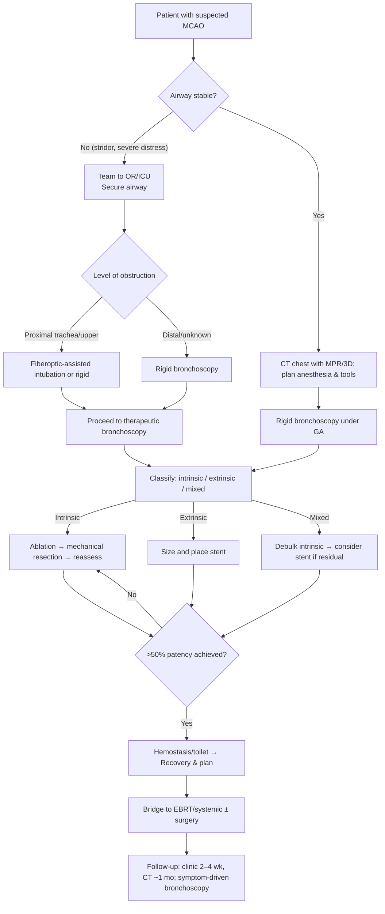
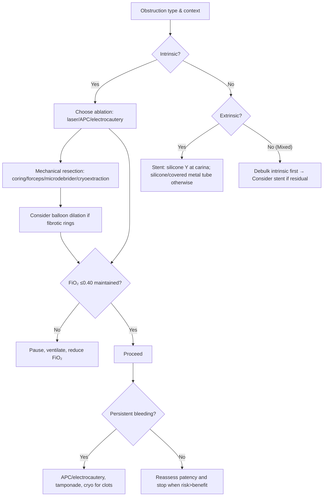

Management of Malignant Central Airway Obstruction

Target audience: IP fellows and practicing pulmonologists

Exam Mapping & Scope

This chapter covers the diagnosis and bronchoscopic management of malignant central airway obstruction (MCAO)—defined as ≥50% narrowing of the trachea, mainstem bronchi, bronchus intermedius, or lobar bronchi. It maps to AABIP/AATS/ACCP domains on therapeutic bronchoscopy (rigid/flexible), ablative modalities (thermal and non‑thermal), airway stenting, sedation and ventilation strategies, complication prevention/management, peri‑procedural decision‑making, and multidisciplinary integration with radiation, systemic therapy, and surgery.

Learning Objectives

By the end of this chapter, readers will be able to:

Recognize clinical and imaging features that mandate urgent vs. expedited intervention for MCAO.

Classify obstruction as intrinsic, extrinsic, or mixed and choose first‑line bronchoscopic modalities accordingly.

Plan safe anesthesia and ventilation (including FiO₂ targets) and set up equipment for rigid bronchoscopy–based multimodality therapy.

Execute a stepwise debulking–hemostasis–recanalization sequence and decide when to stent.

Anticipate, prevent, and manage intra‑ and post‑procedural complications, including airway fire, bleeding, migration, and infection.

Integrate bronchoscopic therapy with external beam radiation, systemic therapy, and surgery while mitigating combined‑modality risk.

Apply evidence on outcomes, including technical success, quality of life, and survival, to patient selection and counseling.

High‑Yield One‑Pager (Pearls, Pitfalls, and Exam Traps)

Definition matters: MCAO is ≥50% luminal compromise; symptoms often appear only beyond this threshold.

Urgency cues: Stridor implies a critically narrowed tracheal lumen; treat as time‑sensitive airway emergency.

Classify first: Intrinsic (endoluminal), extrinsic (compression), or mixed—this classification determines modality selection.

Best initial platform: Rigid bronchoscopy (general anesthesia) is preferred for most therapeutic cases; it provides airway control, suction, and instrument throughput.

FiO₂ discipline: Keep FiO₂ ≤0.40 for thermal tools to reduce airway fire risk.

Ablation–resection cycle: Coagulate (laser/APC/electrocautery) → mechanically remove (forceps, microdebrider, coring, cryo‑extraction) → reassess → repeat until patency.

Stent selection: Use stents for extrinsic compression or mixed disease with residual narrowing after debulking. Silicone Y‑stent for carinal disease; covered metal/hybrid or silicone tube for mainstem/BI.

When not to intervene: Distal lung nonviable, no patent distal airway, or obstruction &lt;50% without symptoms and high likelihood of rapid systemic/radiation response.

Anesthesia nuance: For controlled therapeutic bronchoscopy, general anesthesia with neuromuscular blockade reduces complications. For tenuous upper‑tracheal obstruction during airway establishment, avoid paralytics until the airway is secured.

Complication risk factors: Urgent/emergent procedures, ASA >3, recurrent therapeutic bronchoscopies, and moderate sedation.

Delayed‑effect tools: Photodynamic therapy (PDT) and brachytherapy have roles in select cases; expect delayed benefits and specific toxicities.

Post‑stent care: Routine mucociliary clearance regimen (e.g., nebulized hypertonic saline) and symptom‑driven bronchoscopy or CT‑based surveillance.

Outcomes to quote: Technical success ≈90% in experienced hands; dyspnea and quality‑of‑life improve in a substantial proportion; early successful recanalization facilitates ventilator weaning and definitive oncologic therapy.

Radiation with stents: Combined therapy can be effective but increases risk of airway necrosis/fistula; plan and dose thoughtfully and remove stents promptly when tumor regresses.

Pitfall: Treating pure extrinsic compression with ablative energy—risks wall injury without restoring lumen; stent is the primary solution.

Core Concepts
Pathophysiology & Epidemiology

MCAO arises from tumor within the lumen (endobronchial), compression from adjacent structures (extrinsic), or a mixed pattern where tumor both compresses and invades the airway wall. Contemporary cohorts estimate MCAO in roughly the mid‑teens percentage of lung cancer cases, with older series reporting up to one‑third. Shifts toward peripheral adenocarcinoma and screening may contribute to changing prevalence. Intrinsic endobronchial disease often confers more favorable bronchoscopic outcomes than extrinsic or mixed patterns.

Indications & Contraindications

Indications

Symptomatic obstruction ≥50% in central airways (dyspnea, stridor, post‑obstructive pneumonia, hemoptysis).

Bridge to definitive therapy (radiation/systemic therapy/surgery).

Ventilator dependence due to obstructing lesions, when recanalization allows extubation.

Relative Contraindications / Low‑yield situations

No patent distal airway or nonviable distal lung.

Isolated lobar/segmental disease with minimal physiologic impact (less likely to improve dyspnea/QOL).

Uncorrected coagulopathy or instability not correctable in procedural setting.

When rapid, high‑likelihood response to oncologic therapy renders bronchoscopy unnecessary—close monitoring still required.

Pre‑procedure Evaluation

Clinical triage: Identify airway emergencies (severe stridor, impending arrest).

Imaging: Chest CT with multiplanar/3‑D reconstruction to define level, length, and pattern of obstruction; look for distal airway patency and vascular proximity.

Functional testing: Flow–volume loops may show fixed/variable obstruction but are neither necessary nor safe in severe distress.

Airway & anesthesia assessment: Mouth opening, dentition, Mallampati, neck mobility, thyromental distance; plan rigid bronchoscopy and ventilation mode; consider ECMO backup in extreme bilateral/main tracheal compromise.

Laboratory & consent: Hemostasis evaluation (INR/PTT, platelets), type/screen, shared decision‑making around palliative vs. bridge intent and anticipated course.

Equipment & Setup

Platform: Rigid bronchoscope with high‑flow suction, rigid forceps, dilators; large‑channel therapeutic flexible bronchoscope adjunct.

Thermal tools: Laser (Nd:YAG/YAP), APC, electrocautery; initial power ranges typically 20–40 W for electrosurgery and 40–60 W for APC (pulse 2–5 s, non‑contact).

Non‑thermal tools: Microdebrider, balloon dilators (30–60‑s inflations), cryoprobes (extraction and delayed ablation), spray cryotherapy (special ventilation considerations).

Stents: Silicone (including Y) and fully covered metal/hybrid tubes; choose size/shape to span lesion with ≥5–10 mm margins when feasible.

Safety: FiO₂ ≤0.40 for thermal energy; avoid energy delivery near combustible materials; follow “laser safety” and “fire triad” protocols.

Step‑by‑Step Technique / Procedural Checklist

Secure the airway (rigid bronchoscopy preferred under general anesthesia).

Survey and classify the lesion (intrinsic/extrinsic/mixed), confirm distal airway patency, and anticipate hemodynamic/ventilatory challenges.

Ablation–resection cycle for intrinsic or mixed disease:

Coagulate (laser/APC/electrocautery) while maintaining FiO₂ discipline.

Mechanically remove tissue (rigid coring, microdebrider, forceps, cryo‑extraction).

Reassess; repeat until >50% patency (or more if safe and beneficial).

Dilation for fibrotic rings or tight stenosis (balloon or serial rigid dilators).

Stent for extrinsic compression or residual narrowing after debulking (select silicone Y at the carina; silicone/covered metal tube for mainstem/BI).

Hemostasis & toilet (suction, tamponade with rigid barrel; consider adjunct APC/electrocautery for oozing).

Stop at the right time—once goals are met (often >50% patency) and marginal risk outweighs marginal benefit.

Document residual disease, distal patency, stent dimensions/position, and a follow‑up plan.

Troubleshooting & Intra‑procedure Management

Bleeding: Pre‑coagulate before mechanical resection; tamponade with rigid barrel; apply APC/electrocautery; cryo for clot extraction.

Hypoxemia/hypercapnia: Pause energy; increase ventilation; consider jet vs. volume‑cycled ventilation based on team experience; briefly remove instruments to ventilate.

Airway fire prevention: FiO₂ ≤0.40; suction plume; avoid contact of energized probes with ETT/scope; coordinate energy delivery with anesthesia.

Can’t see distally: Use ultra‑thin or guidewire with balloon to delineate distal lumen before stent sizing.

Difficult pass/angle: Switch tools (microdebrider, flexible through rigid), reposition patient, or downsize rigid scope.

Post‑procedure Care & Follow‑up

Immediate: Observe for bleeding, airway edema, pneumothorax; humidification and bronchial hygiene.

Stent regimen: Airway clearance (e.g., nebulized hypertonic saline) and education on infection symptoms.

Surveillance: Clinic visit within 2–4 weeks; CT chest at ~1 month reasonable. Bronchoscopy targeted to symptoms or imaging concerns rather than routine in all cases. Remove stents promptly when tumor regresses to reduce necrosis/fistula risk with subsequent radiation.

Complications (Prevention, Recognition, Management)

Immediate: Hypoxemia, hypercapnia, bleeding, pneumothorax, airway fire, perforation, air embolism (rare).

Late (especially with stents): Granulation tissue, mucus plugging, migration, infection, erosion/fistula (higher with radiation).

Risk reduction: Favor general anesthesia with neuromuscular blockade for therapeutic cases; avoid urgent “salvage” scenarios via early referral; use covered rather than uncovered metal stents in malignancy; maintain strict FiO₂ control; dose‑plan radiation carefully when stents are present.

Special Populations

Mechanically ventilated patients: Therapeutic bronchoscopy frequently permits extubation within 48 hours after successful recanalization.

Impending complete airway collapse (proximal trachea/bilateral mainstem): Consider ECMO as a bridge for safe induction and intervention.

Carcinoid/adenoid cystic: Debulking relieves obstruction; pursue surgical resection when feasible; bronchoscopic therapy can be definitive for select typical carcinoids unfit for surgery.

Cardiac devices: Laser does not interfere; electrosurgery/APC require device precautions.

Anticoagulation: Optimize hemostasis; individualized risk‑benefit for bridging/holding therapy.

Evidence & Outcomes

Technical success (post‑procedure patency >50%): ≈90% in experienced centers.

Symptom/QOL: Clinically meaningful dyspnea improvement in ~half and QOL improvement in a substantial proportion; spirometry gains are common in selected cohorts.

Survival: Successful recanalization is associated with improved survival and quality‑adjusted life expectancy; early intervention correlates with better outcomes.

Ventilator weaning: High extubation success shortly after recanalization in respiratory failure from MCAO.

Complications: Serious events are uncommon; risks increase with urgent cases, higher ASA class, repeated procedures, and moderate sedation.

Diagnostic & Therapeutic Algorithms
Algorithm A — Urgent Triage and Initial Management

Parallel bullet algorithm

Assess stability → secure airway if unstable (avoid paralytics until airway secured for proximal lesions).

Obtain CT; plan GA with rigid bronchoscopy and ventilation strategy.

Classify obstruction at bronchoscopy: intrinsic vs extrinsic vs mixed.

Intrinsic: thermal coagulation → mechanical removal (repeat cycles) until >50% patency.

Extrinsic: stent as primary therapy.

Mixed: debulk then stent if residual extrinsic compromise.

Ensure hemostasis, airway toilet; define bridge to oncologic therapy; follow‑up with structured surveillance.

Algorithm B — Modality Selection & Procedural Safety

Parallel bullet algorithm

Intrinsic: pick a thermal energy modality you know well, then mechanically remove devitalized tissue; repeat.

Fibrotic stenoses: add balloon dilation or serial rigid dilators.

Extrinsic: stent (prefer covered in malignancy); ensure adequate margins and accurate deployment.

Mixed: debulk, then stent only if needed.

Safety overlays: FiO₂ ≤0.40; coordinated energy delivery; bleeding control plan; stop once goals met.

Tables & Quick‑Reference Boxes
Table 1. Obstruction Pattern and First‑Line Interventions

| Pattern | Typical Findings | First‑Line Approach | Alternatives/Adjuncts | Key Caveat |
| --- | --- | --- | --- | --- |
| Intrinsic (endoluminal) | Polypoid/fungating tumor; visible distal lumen | Thermal coagulation (laser/APC/electrocautery) → mechanical resection (rigid coring, microdebrider, forceps, cryo‑extraction) | Balloon dilation for fibrotic rings; delayed‑effect therapies (PDT) | Maintain FiO₂ ≤0.40 during thermal ablation |
| Extrinsic (compression) | Normal mucosa; airway narrowed by external mass | Airway stent (silicone Y at carina; silicone/covered metal tube for mainstem/BI) | Radiation/systemic therapy; occasional dilation as bridge | Ablative energy alone will not sustain patency |
| Mixed | Endoluminal with wall distortion/compression | Debulk intrinsic component → stent if residual extrinsic narrowing | Combine with radiation/systemic therapy | Avoid premature stent if treatment‑naïve and likely to respond |
| Abbreviations: APC, argon plasma coagulation; BI, bronchus intermedius; PDT, photodynamic therapy. |  |  |  |  |
Table 2. Thermal vs Non‑thermal Modalities—Essentials at a Glance

| Modality | Depth/Effect | Typical Settings/Notes | Advantages | Complications/Limitations |
| --- | --- | --- | --- | --- |
| Laser (Nd:YAG/YAP) | Coagulation + vaporization; deeper penetration (Nd:YAG) | Contact vs non‑contact; obey laser safety; FiO₂ ≤0.40 | Rapid debulking, strong hemostasis; effective in central lesions | Fire risk, perforation, air embolism (rare) |
| APC | Superficial (≈1–3 mm); non‑contact | ~40–60 W; 2–5 s pulses; useful for hemostasis & broad surfaces | Low cost, rapid, great for oozing & diffuse lesions | Fire risk, perforation if excessive energy; less effective for bulky cores |
| Electrocautery | Contact coagulation/vaporization | ~20–40 W; snares/knife/probes; device precautions with pacers/ICDs | Accessible, versatile | Device interference; requires direct contact |
| Microdebrider | Non‑thermal mechanical shaving with suction | Used through rigid scope | Fast tissue removal with good visualization; no FiO₂ limits | Operator learning curve; bleeding control often still needed |
| Balloon dilation | Radial expansion | 30–60 s inflations; may require radial cuts | Rapid lumen gain; bridge to stent | Tears, pneumomediastinum/pneumothorax |
| Cryo (extraction) | Immediate tissue adhesion/removal | Repeat freeze‑pull cycles | Useful for friable tumors/clots; no fire risk | Bleeding; slower than thermal for large bulk |
| Cryo (spray/delayed) | Delayed necrosis | Ventilation planning critical | Treats broad surfaces; avoids heat | Air trapping risk; delayed slough/edema |
| PDT (delayed) | Photosensitizer + light (delayed effect) | Photosensitivity precautions | Decreases regrowth; reaches distal bronchi | Delayed obstruction from slough; edema; photosensitivity |
| Abbreviations: FiO₂, fraction of inspired oxygen; ICD, implantable cardioverter‑defibrillator; PDT, photodynamic therapy. |  |  |  |  |
Table 3. Anesthesia & Ventilation—Practical Choices

| Decision Point | Preferred Choice | When to Choose | Other Options | Notes |
| --- | --- | --- | --- | --- |
| Sedation depth | General anesthesia with neuromuscular blockade | Most therapeutic cases; reduces complications and re‑interventions | Deep sedation (select centers) | Pre‑intubation proximal obstruction: avoid paralytics until airway secured |
| Airway device | Rigid bronchoscope | Bulky/proximal lesions; need for large‑bore suction & stenting | ETT or LMA as bridge | Keep rigid setup within arm’s reach even if starting flexible |
| Ventilation | Volume‑cycled or jet ventilation | Either acceptable; team experience drives choice | ECMO (bridge) | Maintain FiO₂ ≤0.40 for thermal tools; watch CO₂ with volume‑cycled ventilation |
| Abbreviations: ETT, endotracheal tube; LMA, laryngeal mask airway; ECMO, extracorporeal membrane oxygenation. |  |  |  |  |
Imaging & Figure Callouts (Placeholders)

Figure 1. Schematic of intrinsic, extrinsic, and mixed MCAO patterns. Alt‑text: Three panels depict endoluminal tumor, extrinsic compression, and mixed invasion across the airway wall.

Figure 2. Ablation–resection cycle with rigid coring. Alt‑text: Sequential frames show coagulation, mechanical removal, and tamponade with the rigid barrel.

Figure 3. Examples of stent selection (silicone Y at carina, covered tube in mainstem/BI). Alt‑text: Diagrammatic comparison of deployment techniques and profiles.

Cases & Applied Learning

Case 1
A 64‑year‑old with squamous NSCLC presents with audible stridor and dyspnea at rest. CT shows a bulky proximal tracheal mass with a slit‑like lumen; distal trachea is patent.
Question: Best immediate approach?
A. Awake fiberoptic intubation followed by rigid bronchoscopy under GA
B. Immediate PDT
C. APC via flexible bronchoscope under moderate sedation
D. Start chemoradiation urgently without bronchoscopy
E. Place a covered metal stent via flexible bronchoscope alone
Answer: A. Secure the airway with a technique that maintains spontaneous respirations initially; then proceed to rigid bronchoscopy for definitive multimodality therapy.

Case 2
A 58‑year‑old with metastatic renal cell carcinoma and severe dyspnea has CT showing severe compression of the left main bronchus by a mediastinal mass; bronchoscopy reveals normal mucosa, no intraluminal tumor.
Question: Best bronchoscopic strategy?
A. Electrocautery snare of the “lesion”
B. Covered airway stent spanning the compressed segment
C. Balloon dilation alone
D. Spray cryotherapy
E. Laser vaporization
Answer: B. This is pure extrinsic compression—stent is the first‑line solution.

Case 3
A 72‑year‑old with MCAO is intubated for hypoxemic respiratory failure due to an obstructing endobronchial mass in the bronchus intermedius with distal atelectasis &lt;4 weeks’ duration.
Question: Most likely short‑term outcome after successful therapeutic bronchoscopy?
A. Persistent ventilator dependence for a week or more
B. Immediate need for radiation before any extubation attempt
C. Extubation within 48 hours is likely
D. No change in spirometry
E. High risk of airway fire precludes thermal ablation
Answer: C. Successful recanalization commonly permits early extubation in this setting.

Question Bank (MCQs)

A 70‑year‑old with MCAO has wheeze and CT showing a polypoid mass in the distal trachea with a visible distal lumen. What is the next best step?
A. Start EBRT and reassess in 2 weeks
B. Flexible bronchoscopy with moderate sedation and APC at FiO₂ 0.80
C. Rigid bronchoscopy under GA with laser/APC coagulation followed by mechanical debulking
D. PDT as sole therapy
E. Place uncovered metal stent
Answer: C. Immediate‑effect bronchoscopy using rigid platform and ablation–resection cycle is appropriate; avoid high FiO₂ with thermal tools.

During APC, the oximeter shows SpO₂ 95% on FiO₂ 0.60. What is the best immediate action?
A. Continue APC since saturation is adequate
B. Increase FiO₂ to 1.0 for safety
C. Pause energy, reduce FiO₂ to ≤0.40, then resume
D. Convert to PDT
E. Switch to spray cryotherapy immediately
Answer: C. Thermal energy should be delivered with FiO₂ ≤0.40 to reduce fire risk.

Which scenario most strongly favors initial stenting rather than ablation?
A. Friable exophytic tumor in the carina
B. Circumferential tracheal web with fibrosis
C. Smooth luminal narrowing from mediastinal lymphoma compressing left main bronchus
D. Obstructing carcinoid with distal pneumonitis
E. Endobronchial tumor with obvious distal lumen
Answer: C. Pure extrinsic compression calls for stent as first‑line therapy.

A patient with mixed MCAO undergoes debulking but residual narrowing persists from external mass effect. The patient is treatment‑naïve with high likelihood of rapid response to chemoradiation. What is the most prudent choice?
A. Place a permanent stent now
B. Observe without a plan
C. Short‑term observation after debulking; defer stent if respiratory reserve allows
D. Deliver brachytherapy immediately
E. Proceed to PDT and stent
Answer: C. In a likely responder, stent deferral is reasonable if post‑debulking patency and reserve are adequate.

Which combination best reduces complications of therapeutic bronchoscopy?
A. Moderate sedation and flexible bronchoscopy
B. General anesthesia with neuromuscular blockade and rigid platform
C. Jet ventilation with FiO₂ 0.80
D. Avoiding suction during laser
E. Brachytherapy before any debulking
Answer: B. GA with neuromuscular blockade and rigid bronchoscopy is associated with fewer complications.

Most appropriate hemostatic choice for diffuse oozing after mechanical debulking?
A. Increase FiO₂ to 1.0 and continue laser
B. APC in short bursts, low‑to‑moderate power, with suction
C. Uncovered metal stent
D. Balloon dilation
E. Spray cryotherapy immediately
Answer: B. APC is excellent for broad oozing surfaces; keep FiO₂ ≤0.40.

Which statement about PDT in MCAO is correct?
A. It has an immediate effect equivalent to laser
B. It often requires light exposure within 48–72 h after photosensitizer
C. It has no risk for photosensitivity
D. It precludes subsequent external beam radiation
E. It cannot be used in lobar bronchi
Answer: B. PDT is a delayed‑effect therapy with photosensitizer followed by timed illumination.

A covered metal stent is placed across the right main bronchus. The highest‑yield preventive strategy against mucus plugging is:
A. Routine systemic steroids
B. Routine antibiotics indefinitely
C. Twice‑daily nebulized airway clearance regimen and patient education
D. Avoidance of bronchodilators
E. Immediate radiation to fix the stent in place
Answer: C. Mucociliary clearance measures are standard.

Which is a recognized risk factor for bronchoscopic complications in MCAO?
A. ASA class I–II
B. Elective scheduling
C. Moderate sedation rather than GA
D. Use of covered stents
E. Performing the procedure with a rigid bronchoscope
Answer: C. Moderate sedation and urgent/emergent settings increase risk.

A lobar obstruction has persisted >4 weeks with complete lobar collapse. What outcome is least likely after recanalization?
A. Dramatic dyspnea relief
B. Improved spirometry
C. Radiographic re‑expansion
D. Reduced post‑obstructive infections
E. Facilitation of systemic therapy delivery
Answer: A. Long‑standing lobar collapse may limit physiologic benefit even with technical success.

Which statement about combining EBRT with airway stents is most accurate?
A. It is contraindicated
B. It is safe and complication‑free
C. It can be performed but requires careful planning due to risks (e.g., necrosis/fistula), and stents should be removed when feasible after response
D. It mandates uncovered metal stents
E. It eliminates need for bronchoscopic surveillance
Answer: C. Combined therapy is possible but higher risk; plan dosimetry carefully and remove stents when safe.

During rigid bronchoscopy for tracheal tumor, you cannot visualize the distal lumen. Best next step:
A. Increase laser power to penetrate blindly
B. Advance blindly with the rigid barrel
C. Use guidewire/balloon or smaller scope to identify distal airway before proceeding
D. Place a stent blindly
E. Abort the procedure immediately
Answer: C. Define the distal airway safely before further therapy.

Controversies, Variability, and Evolving Evidence

Sedation strategy: Although awake techniques are essential for initial airway security in proximal obstruction, therapeutic bronchoscopy generally favors GA with neuromuscular blockade; practice patterns vary by center.

Delayed‑effect modalities: Use of PDT and brachytherapy is center‑specific; evidence supports selective use, acknowledging delayed effects and toxicities.

To stent or not to stent after debulking: In endobronchial disease responsive to systemic/radiation therapy, some defer stenting to avoid late complications; others stent to prolong symptom relief—patient context drives decisions.

Surveillance bronchoscopy: Routine vs. symptom‑driven follow‑up remains debated; CT can augment noninvasive surveillance.

Radiation with stents: Teams differ in thresholds for concurrent use; careful multidisciplinary planning is mandatory.

Take‑Home Checklist

Confirm MCAO (≥50% narrowing) and triage urgency.

Plan rigid bronchoscopy under GA; outline ventilation strategy and FiO₂ limits.

Classify obstruction; match modality: ablation–resection for intrinsic, stent for extrinsic, both for mixed.

Enforce the ablation–resection cycle with meticulous hemostasis and airway fire prevention.

Size stents accurately; prefer covered designs for malignancy; silicone Y for carina.

Stop when goals are met and risk outweighs benefit.

Begin airway clearance regimen if stented; educate on infection signs.

Coordinate with oncology and radiation; revisit stent necessity after tumor response.

Schedule early clinic follow‑up (2–4 weeks); use CT at ~1 month; scope for symptoms or imaging concerns.

Document outcomes (patency, symptoms/QOL) to guide re‑intervention timing.

Abbreviations & Glossary

MCAO: Malignant central airway obstruction.

APC: Argon plasma coagulation—non‑contact thermal coagulation using ionized argon.

Nd:YAG/YAP: Laser types used for airway ablation; Nd:YAG has deeper penetration; YAP higher water absorption with shallower depth.

PDT: Photodynamic therapy—photosensitizer plus timed light exposure; delayed effect.

EBBT: Endobronchial brachytherapy—short‑distance radiation via intraluminal catheter.

Rigid coring: Mechanical debulking using beveled rigid barrel with rotation and tamponade.

Microdebrider: Rotating cutting device with suction for mechanical tumor shaving.

BI: Bronchus intermedius.

FiO₂: Fraction of inspired oxygen; keep ≤0.40 during thermal ablation.

ECMO: Extracorporeal membrane oxygenation; bridge for high‑risk airway control.

ASA class: American Society of Anesthesiologists physical status—a perioperative risk marker.

QOL: Quality of life; symptom burden and function metrics improved by successful therapy.

Covered stent: Stent with membrane lining to reduce tumor ingrowth; preferred in malignancy.

Hypertonic saline: Nebulized airway clearance therapy to reduce post‑stent plugging.

References (AMA Style; from source bibliographies)

Mahmood K, Frazer‑Green L, Gonzalez AV, et al. Management of central airway obstruction: an American College of Chest Physicians Clinical Practice Guideline. Chest. 2024;167(1):283‑295.

Ernst A, Feller‑Kopman D, Becker HD, Mehta AC. Central airway obstruction. Am J Respir Crit Care Med. 2004;169(12):1278‑1297.

Ost DE, Ernst A, Grosu HB, et al. Therapeutic bronchoscopy for malignant central airway obstruction: success rates and impact on dyspnea and quality of life. Chest. 2015;147(5):1282‑1298.

Ost DE, Ernst A, Grosu HB, et al. Complications following therapeutic bronchoscopy for malignant central airway obstruction: results of the AQuIRE Registry. Chest. 2015;148(2):450‑471.

Ong P, Grosu HB, Debiane L, et al. Long‑term quality‑adjusted survival following therapeutic bronchoscopy for malignant central airway obstruction. Thorax. 2019;74(2):141‑156.

Oki M, Saka H, Hori K. Airway stenting in patients requiring intubation due to malignant airway stenosis: a 10‑year experience. J Thorac Dis. 2017;9(9):3154‑3160.

Khemasuwan D, Mehta AC, Wang KP. Past, present, and future of endobronchial laser photoresection. J Thorac Dis. 2015;7(Suppl 4):S380‑S388.

Dumon JF, Reboud E, Garbe L, et al. Treatment of tracheobronchial lesions by laser photoresection. Chest. 1982;81:278‑284.

Morice RC, Ece T, Ece F, Keus L. Endobronchial argon plasma coagulation for treatment of hemoptysis and neoplastic airway obstruction. Chest. 2001;119(3):781‑787.

Casal RF, Iribarren J, Eapen G, et al. Safety and effectiveness of microdebrider bronchoscopy for the management of central airway obstruction. Respirology. 2013;18:1011‑1015.

Hetzel M, Hetzel J, Schumann C, et al. Cryorecanalization: a new approach for the immediate management of acute airway obstruction. J Thorac Cardiovasc Surg. 2004;127:1427‑1431.

Moore RF, Lile DJ, Abbas AE. Current status of spray cryotherapy for airway disease. J Thorac Dis. 2017;9(Suppl 2):S122‑S129.

Rodrigues G, Videtic GM, Sur R, et al. Palliative thoracic radiotherapy in lung cancer: an American Society for Radiation Oncology evidence‑based clinical practice guideline. Pract Radiat Oncol. 2011;1:60‑71.

Stewart A, Parashar B, Patel M, et al. American Brachytherapy Society consensus guidelines for thoracic brachytherapy for lung cancer. Brachytherapy. 2016;15:1‑11.

Rochet N, Hauswald H, Schmaus M, et al. Safety and efficacy of thoracic external beam radiotherapy after airway stenting in malignant airway obstruction. Int J Radiat Oncol Biol Phys. 2012;83(1):e129‑e135.

Dutau H, Di Palma F, Thibout Y, et al. Impact of silicone stent placement in symptomatic airway obstruction due to non‑small cell lung cancer – the SPOC trial. Respiration. 2020;99(4):344‑352.

Chaddha U, Agrawal A, Kurman J, et al. WABIP guidelines on airway stenting for malignant central airway obstruction. Respirology. 2024;29(7):563‑573.

Dialani V, Ernst A, Sun M, et al. MDCT detection of airway stent complications: comparison with bronchoscopy. AJR Am J Roentgenol. 2008;191(5):1576‑1580.

Matsuo T, Colt HG. Evidence against routine scheduling of surveillance bronchoscopy after stent insertion. Chest. 2000;118(5):1455‑1459.

Cavaliere S, Venuta F, Foccoli P, et al. Endoscopic treatment of malignant airway obstructions in 2,008 patients. Chest. 1996;110:1536‑1542.

Breitenbucher A, Chhajed PN, Brutsche MH, Mordasini C, Schilter D, Tamm M. Long‑term follow‑up and survival after Ultraflex stent insertion in the management of complex malignant airway stenoses. Respiration. 2008;75(4):443‑449.

Wahidi MM, Unroe MA, Adlakha N, Beyea M, Shofer SL. The use of electrocautery as the primary ablation modality for malignant and benign airway obstruction. J Thorac Oncol. 2011;6(9):1516‑1520.