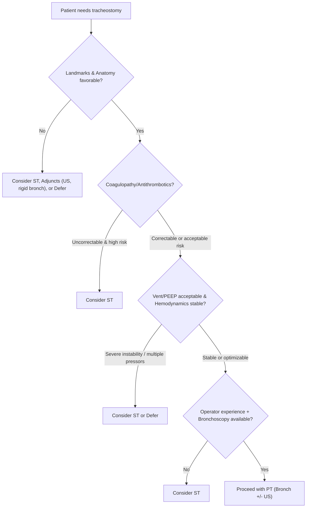
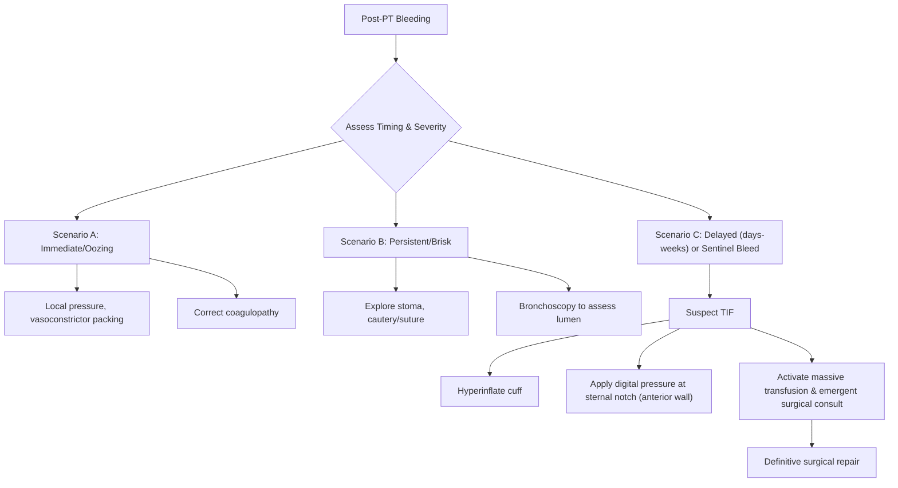
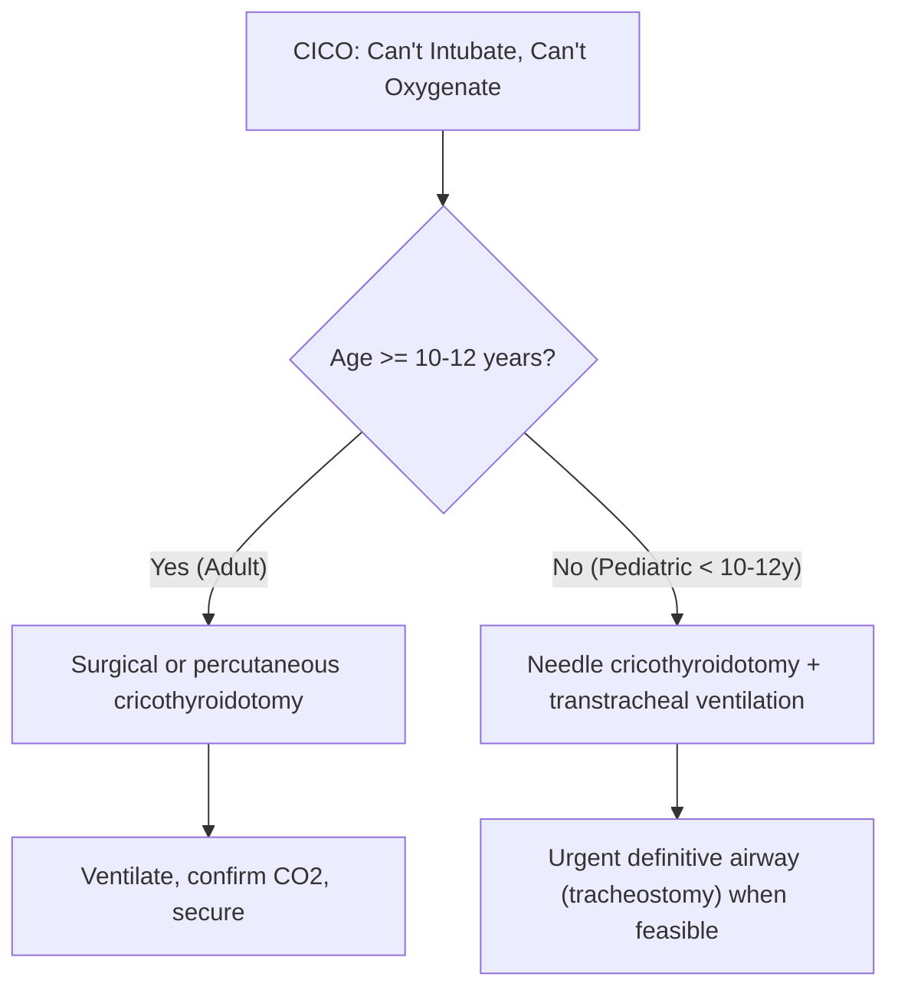

Percutaneous Tracheostomy and Cricothyroidotomy

Exam Mapping & Scope

This chapter covers indications, contraindications, patient selection, pre-procedure evaluation, technique, troubleshooting, complications, and post-procedure care for percutaneous dilational tracheostomy (PDT/PT) and cricothyroidotomy. Emphasis is placed on bedside decision-making in the ICU, device options and steps, guidance modalities (bronchoscopy and ultrasound), anticoagulation/antiplatelet management, special populations (obesity, high ventilatory support, coagulopathy, ECMO/COVID), and emergency “can’t intubate, can’t oxygenate” (CICO) rescue with needle, surgical, or percutaneous cricothyroidotomy.

Learning Objectives

Distinguish PT vs. surgical tracheostomy (ST) regarding setting, outcomes, and complication profiles, and select the best approach for a given ICU patient.
Perform a structured pre-procedure evaluation (anatomy, coagulopathy, ventilatory support, hemodynamics) and plan guidance (bronchoscopy ± ultrasound).
Execute a step-by-step PT with bronchoscopic confirmation, and manage common intra-procedure issues (posterior wall contact, loss of airway, bleeding).
Recognize, prevent, and treat early and late complications of tracheostomy, including tracheo-innominate fistula (TIF) and tracheal stenosis.
Choose and perform the appropriate cricothyroidotomy technique for CICO; know age-specific considerations and when to convert to tracheostomy.
Apply evidence on timing of tracheostomy, sedation/weaning implications, and decannulation workflows.

High-Yield One-Pager

PT vs. ST: Overall complication rates are similar. PT has lower wound infection rates, shorter procedure times, and lower costs. Bleeding risk is generally comparable.
Guidance: Bronchoscopic guidance improves first-pass success and reduces complications. Ultrasound adds value for anatomy/vascular mapping and may reduce major bleeding.
Puncture site: Midline between the 1st–2nd or 2nd–3rd tracheal rings under bronchoscopy; keep the endotracheal tube (ETT) just below the cricoid during puncture.
Coagulopathy: Aim for INR &lt;1.5 and platelets &gt;50 × 10⁹/L (transfuse if needed). If able, hold clopidogrel ≥5 days; PT can still be done with antiplatelet/anticoagulants in select settings with informed consent.
Ventilator settings: PT is feasible even with higher PEEP; coordinate ETT retraction and minimize disconnections to preserve PEEP.
Obesity: Not a contraindication in expert hands; anticipate a deeper trachea and consider extra-long tracheostomy tubes (XLT).
Early complications: Subcutaneous emphysema (~1.4%), pneumothorax (~0.8%), bleeding, malposition. Manage with bronchoscopy, tube exchange over a guide, and hemostasis.
Late complications: Tracheal stenosis (clinically significant 3–12%), tracheomalacia, tracheo-innominate fistula (TIF &lt;1%—a surgical emergency).
Aspiration: Risk does not fall immediately post-trach; cuff inflation does not prevent micro-aspiration.
Weaning benefits: Tracheostomy reduces work of breathing and airway resistance; it may shorten ICU stay and decrease sedation needs.
Timing: Evidence is mixed. Some analyses show no outcome difference; others favor earlier tracheostomy for more ventilator-free days and shorter ICU stays—individualize based on patient trajectory.
CICO rescue: The adult default is surgical or percutaneous cricothyroidotomy. In children &lt;10–12y, prefer needle cricothyroidotomy with transtracheal ventilation.
Decannulation: Proceed after ventilator liberation with strong cough and secretion clearance: downsize → speaking valve → cap 48–72h → remove. Scope if intolerance occurs.

Core Concepts

Pathophysiology / Epidemiology

Tracheostomy decreases upper airway dead space and resistance, lowering the work of breathing. Many patients tolerate reduced sedation and more aggressive weaning trials post-procedure. These physiologic benefits, alongside improved comfort and communication potential, underpin its role in prolonged ventilation.

Indications & Contraindications

Indications (PT ≈ ST): Bypass upper airway obstruction; anticipated prolonged ventilation; secretion management/aspiration reduction (supportive but not immediate).

Contraindications (contextual):

PT: True absolute contraindications are limited—safety depends on an experienced operator and appropriate technique. Many “relative” risks can be managed with preparation (e.g., obesity, high PEEP, prior trach, coagulopathy).
Practical red flags: Active infection at the site, unfavorable anatomy with unidentifiable landmarks, severe hemodynamic instability—consider deferral or ST.
Cricothyroidotomy: Primary CICO rescue in adults. Avoid surgical cricothyroidotomy in children &lt;~10y—use needle technique with transtracheal ventilation. Elective cricothyroidotomy is selective and generally avoided after prolonged intubation or with laryngeal pathology due to subglottic injury risk.

Pre-procedure Evaluation

Airway/Anatomy: Palpate laryngeal landmarks; anticipate depth. Consider ultrasound to locate the thyroid isthmus, anterior jugular veins, and pre-tracheal vessels, and to measure skin-to-trachea distance.

Ventilation/Hemodynamics: Note FiO₂/PEEP and hypotension/vasopressors. PT can be performed at higher PEEP with caution; avoid in patients requiring multiple/high-dose pressors.

Coagulation/Medications: Target INR &lt;1.5 and platelets &gt;50 × 10⁹/L.

Hold heparin infusion ~3h pre and resume ~2h post.
Hold SC heparin/enoxaparin 12h (BID) or 24h (daily).
Hold clopidogrel ≥5 days if feasible (3–5 days for dual therapy). PT has been performed safely on antiplatelet/anticoagulants with higher minor bleeding but low major bleeding rates.

Consent/Team: Clarify goals and alternatives. Coordinate operator, bronchoscopist, RT, nurse, and bronch tech. Complete safety checklist and maintain a sterile field.

Equipment & Setup

Common kits include Ciaglia Blue Rhino (single tapered dilator), Griggs (GWDF) forceps dilatation, PercuTwist, and Blue Dolphin balloon.
Prepare appropriately sized standard and extra-long tubes.
Select a bronchoscope compatible with the ETT inner diameter.
Infiltrate local anesthetic (e.g., lidocaine with epinephrine).

Step-by-Step Technique / Procedural Checklist

Position: Supine, shoulder roll, neck extended as tolerated; prep/drape.
Airway Control: Sedate/analgesia/paralysis as needed; suction airway. Withdraw ETT cuff under bronchoscopy to just below the cricoid; reinflate cuff.
Incision: 1–1.5 cm vertical midline skin incision; blunt dissect to pre-tracheal fascia; identify tracheal rings.
Needle Puncture: Midline between 1st–2nd or 2nd–3rd rings under bronchoscopy; guidewire into trachea directed caudally.
Dilatation: Perform serial/single dilatation (e.g., punch dilator → single tapered dilator with sheath) or forceps dilation (Griggs).
Insertion: Insert trach tube over dilator/sheath; advance into lumen.
Confirmation: Bronchoscopically confirm lumen and carina; keep distal tip ≥~1 inch above carina.
Secure: Ventilate and confirm with ventilator tidal volume and capnography; secure with ties/sutures.

Troubleshooting & Intra-procedure Management

Posterior wall contact/false tract: Keep wire midline, caudad, and always under vision. If resistance or desaturation occurs, re-scope and re-establish ETT ventilation before reattempting.
Loss of airway in deep neck/obesity: Use an extra-long tube. Consider an airway exchange catheter and bronchoscopy for difficult re-entries.
Bleeding: Apply local pressure/vasoconstrictor packing. If persistent, explore stoma. For sentinel hemorrhage or brisk bleeding days–weeks later, suspect TIF—hyperinflate cuff, apply digital anterior wall pressure, and consult surgery emergently.
High PEEP dependence: Coordinate brief ETT withdrawal with minimal circuit breaks. Consider a “PEEP-dependency trial” if uncertain.

Post-procedure Care & Follow-up

Humidification, suctioning, inner cannula care, cuff pressure monitoring, and securement checks.

Decannulation: Proceed after ventilator liberation, strong cough, manageable secretions: downsize → speaking valve → cap 48–72h → remove. Perform bronchoscopic assessment if capping failure occurs.

Complications (Prevention, Recognition, Management)

Early (hours–days)

Bleeding, subcutaneous emphysema (~1.4%), pneumothorax (~0.8%), malposition/obstruction (especially with posterior wall apposition).

Prevention: Midline puncture, bronchoscopy, appropriate tube length.
Treatment: Hemostasis, bronchoscopy, reposition/exchange.

Late (weeks–months)

Tracheal stenosis (clinically significant 3–12%), tracheomalacia (cuff-related), TIF (&lt;1%), TEF (rare), stomal infection.

Prevention: Correct ring level (between 1–3), cuff pressure control, and hygiene.
Treatment: TIF is a surgical emergency.

Special Populations

Obesity: Evidence supports safety with skilled operators. Anticipate higher malposition risk; choose XLT tubes when skin-to-trachea distance is increased.
High ventilatory support/ARDS: PT is feasible with higher PEEP; there is no consistent oxygenation deterioration when performed carefully.
Coagulopathy/antithrombotics: PT has been performed safely with elevated bleeding risk but low major hemorrhage. Follow periprocedural hold/transfusion strategies. ECMO series report low major bleeding when heparin is paused.
COVID-19: PT adopted widely with closed-circuit modifications, associated with faster weaning and shorter ICU stay in series.
Cricothyroidotomy—pediatrics: Use needle cricothyroidotomy (&lt;~10–12y); avoid surgical techniques given small CT membrane and risk of laryngeal injury.

Evidence & Outcomes

PT vs ST: Meta-analyses show similar overall complication rates, fewer wound infections, shorter procedural time, and lower cost with PT. Bleeding risk is comparable; tracheal stenosis risk is similar long-term.
Timing of tracheostomy: Mixed data—some RCT meta-analyses show no major outcome differences. More recent analyses favor earlier trach for ventilator-free days, shorter ICU stay, and less sedation. Timing should be individualized.
Bronchoscopy vs Ultrasound: Bronchoscopy improves accuracy and reduces complications. Ultrasound helps identify safe entry and may reduce major bleeding. Randomized data suggest similar overall complication rates between bronchoscopy-guided and ultrasound-guided approaches in experienced hands.

Diagnostic & Therapeutic Algorithms

Algorithm 1 — Choosing PT vs. ST (or Deferral)

Algorithm 2 — Bleeding After PT (including TIF)

Algorithm 3 — CICO: Emergency Surgical Airway

Tables & Quick-Reference Boxes

Table 1. PT vs. ST: What’s Better, What’s Equivalent

| Dimension                              | PT vs ST                       |
| -------------------------------------- | ------------------------------ |
| Overall complications                  | Similar                        |
| Wound infection                        | Lower with PT                  |
| Procedure time                         | Shorter with PT                |
| Cost                                   | Lower with PT                  |
| Bleeding                               | Comparable                     |
| Tracheal stenosis (long-term)          | Similar                        |
| Risk of posterior/anterior wall injury | Variable (technique-dependent) |

Table 2. PDT Contraindications—Practical View

| Category                 | Examples / Notes                                                                                                                                                                                                  |
| ------------------------ | ----------------------------------------------------------------------------------------------------------------------------------------------------------------------------------------------------------------- |
| Absolute (pragmatic)     | No experienced operator; inability to identify landmarks safely                                                                                                                                                   |
| Often managed (relative) | Obesity (use XLT, US mapping); high PEEP (optimize and coordinate); prior trach (use scar tract); coagulopathy (optimize INR/platelets); antiplatelets/anticoagulants (hold if able; proceed with caution if not) |
| Avoid/Defer              | Active infection at site; severe hemodynamic instability requiring multiple/high-dose pressors                                                                                                                    |

Table 3. Anticoagulation & Antiplatelet Playbook (PT)

| Medication/Status     | Suggested peri-PT approach                                                                                                                     |
| --------------------- | ---------------------------------------------------------------------------------------------------------------------------------------------- |
| INR / Platelets       | Aim INR &lt;1.5, platelets &gt;50 × 10⁹/L (transfuse if needed)                                                                                |
| Heparin infusion      | Hold ≈3h pre, resume ≈2h post                                                                                                                  |
| SC heparin/enoxaparin | Hold 12h (BID dosing) or 24h (daily dosing)                                                                                                    |
| Clopidogrel / DAPT    | Prefer ≥5 days hold if feasible (3–5 days for dual therapy); PT can be performed on therapy with informed consent and bleeding-mitigation plan |
| ECMO                  | Brief heparin interruption; major bleeding reported low (~1–2%); minor bleeding more common                                                    |

Table 4. Tracheostomy Complications—Timing & Signals

| Timing              | Complications                                                                                       |
| ------------------- | --------------------------------------------------------------------------------------------------- |
| Early (hours–days)  | Bleeding; subcutaneous emphysema (~1.4%); pneumothorax (~0.8%); malposition/false tract             |
| Late (weeks–months) | Tracheal stenosis (3–12% clinically significant); tracheomalacia; TIF &lt;1%; TEF; stomal infection |

Cases & Applied Learning

Case 1

A 55-year-old with COPD is intubated (day 11). PEEP 8, FiO₂ 0.4. Platelets 58 × 10⁹/L, INR 1.4. On clopidogrel for a stent placed 18 months ago. Neck anatomy palpable. Best approach?

A. Proceed with ST in OR for lower bleeding risk B. Proceed with PT now under bronchoscopy, transfuse platelets C. Defer trach; extubate then re-intubate as needed D. PT now without bronchoscopy

Answer: B. Anatomy and physiology are favorable; correct coagulopathy (platelets &gt;50) and proceed with PT under bronchoscopy. Clopidogrel is ideally held ≥5 days but can proceed with precautions if non-deferrable. Wound infection and time/cost favor PT.

Case 2

A 62-year-old with ARDS on PEEP 14 requires tracheostomy for prolonged ventilation. Hemodynamically stable on low-dose vasopressor. Next step?

A. Defer until PEEP ≤8 B. PT feasible with careful ventilator strategy and bronchoscopy C. Must do ST because of high PEEP D. Extubate to HFNC and avoid trach

Answer: B. PT is feasible at higher PEEP with meticulous ETT manipulation and circuit management; there is no consistent oxygenation decline when performed carefully.

Case 3

A 70-year-old day 21 post-PT has a small “sentinel” bleed from the stoma that stops spontaneously. Immediate action?

A. Schedule tube change tomorrow B. Hyperinflate cuff and apply digital pressure; activate surgical pathway C. Start antibiotics only D. Deflate cuff to relieve pressure on mucosa

Answer: B. Treat as TIF until proven otherwise—cuff hyperinflation and anterior wall digital pressure are temporizing measures pending emergent surgical control.

Question Bank (MCQs)

1. A 60‑year‑old on day 7 of ventilation (FiO₂ 0.5, PEEP 5) fails SBT (RSBI 130). What is the next best step? A. Schedule ST now to reduce wound infection B. Switch to SIMV to accelerate weaning C. Schedule early trach solely to reduce mortality D. Continue ICU care with daily SBT and reassess trach need Answer: D. Early trach timing remains individualized; daily SBT with optimization is appropriate at day 7; evidence for mortality benefit is mixed.

2. Which statement is most accurate? A. PT has higher overall complication rates than ST B. PT reduces wound infection and procedure time vs ST C. ST consistently has lower bleeding than PT D. PT is more expensive than ST Answer: B. Meta‑analyses show lower wound infection, shorter time, and lower cost with PT; overall complications and bleeding are similar.

3. Regarding clopidogrel and PT, the best statement is: A. Must be stopped ≥3 days B. Must be stopped ≥10 days C. Prefer ≥5 days hold if feasible; PT can proceed with precautions if not D. No need to consider antiplatelets Answer: C. Aim for ≥5 days when possible; real‑world series show PT can proceed with informed consent and bleeding mitigation.

4. For PT, a reasonable pre‑procedure target is: A. INR ≤2.0 and platelets ≥20 × 10⁹/L B. INR &lt;1.5 and platelets &gt;50 × 10⁹/L C. INR &lt;1.0 only D. Platelets &gt;100 × 10⁹/L mandatory Answer: B. These pragmatic thresholds balance safety with feasibility.

5. Which is true about bronchoscopic guidance? A. Increases posterior wall injuries B. Decreases first‑pass success vs landmark technique C. Helps confirm midline ring interspace and reduces complications D. Contraindicated in obesity Answer: C. Bronchoscopy confirms entry site and guidewire direction; trials show improved success and fewer complications.

6. The strongest utility of ultrasound in PT is to: A. Visualize the posterior tracheal wall B. Map anterior vessels and measure skin‑to‑trachea depth C. Replace bronchoscopy in all cases D. Reduce total procedure time consistently Answer: B. US maps vascular structures and depth; posterior wall is not seen; duration benefits are inconsistent.

7. During PT on PEEP 16 and FiO₂ 0.6, oxygen saturation falls when the ETT cuff is deflated and retracted for puncture. Next best step? A. Continue retracting—this is expected B. Disconnect from ventilator and bag through the stoma C. Re‑inflate the ETT cuff, re‑advance to re‑establish ventilation, then reattempt with minimal circuit breaks under bronchoscopy D. Convert immediately to ST Answer: C. Prioritize oxygenation; resecure the airway, then proceed with careful circuit management and bronchoscopy.

8. In morbid obesity, a key preventive measure is: A. Choose a smaller standard‑length tube B. Avoid bronchoscopy C. Use extra‑long trach tubes and consider US mapping D. Always choose ST Answer: C. Greater skin‑to‑trachea distance predisposes to malposition; XLT reduces cuff leak and malposition.

9. Which statement is true after tracheostomy? A. Aspiration risk immediately disappears B. Cuff inflation prevents micro‑aspiration C. Aspiration risk may decrease only after several weeks D. VAP risk is eliminated Answer: C. Aspiration risk may diminish later; cuff inflation does not prevent micro‑aspiration.

10. While dilating, the team suspects posterior wall tenting. Best action? A. Advance quickly to minimize mucosal contact B. Remove wire and blindly re‑pass C. Re‑establish ETT ventilation, re‑scope, and reattempt with correct angle D. Convert immediately to ST in the OR Answer: C. Safety priority is to re‑secure ventilation and reorient the attempt under direct vision.

11. During CICO in a 7‑year‑old, best initial invasive airway is: A. Surgical cricothyroidotomy B. Percutaneous cricothyroidotomy C. Needle cricothyroidotomy with transtracheal ventilation D. Emergency tracheostomy by non‑surgeon Answer: C. The pediatric CT membrane is small; surgical techniques risk laryngeal injury—needle technique is preferred.

12. A day‑28 post‑trach ICU patient has sudden pulsatile bleeding from stoma. First move? A. Deflate cuff to inspect B. Hyperinflate cuff and compress anteriorly; activate surgical pathway C. Replace the trach tube with smaller size D. Observe; likely granulation Answer: B. Treat as TIF—life‑saving temporization while mobilizing definitive surgical control.

Take-Home Checklist

Confirm indication, anatomy, team, plan (bronchoscopy ± US).
Optimize INR/platelets; coordinate anticoagulant holds as feasible.
Pre-brief ventilator strategy; minimize circuit breaks; plan ETT retraction under vision.
Puncture midline between rings; keep wire caudad under bronchoscopy.
Choose tube length (XLT for deep trachea).
Confirm lumen and carina bronchoscopically after placement; verify ventilation.
Secure device and set up humidification/suction; monitor cuff pressure.
Watch for early bleeding/air-leak; have a bleeding algorithm ready.
Educate bedside staff on TIF signs and immediate response.
Start a structured decannulation pathway once ventilator goals are met.

Abbreviations & Glossary

PT/PDT: Percutaneous (dilational) tracheostomy
ST: Surgical tracheostomy
CICO: Can’t intubate, can’t oxygenate
CT membrane: Cricothyroid membrane
ETT: Endotracheal tube
XLT: Extra-long tracheostomy tube
VAP: Ventilator-associated pneumonia
TIF: Tracheo-innominate fistula
TEF: Tracheoesophageal fistula
ECMO: Extracorporeal membrane oxygenation
RSBI: Rapid shallow breathing index

References

Delaney A, Bagshaw SM, Nalos M. Percutaneous dilatational tracheostomy versus surgical tracheostomy in critically ill patients: a systematic review and meta-analysis. Crit Care. 2006;10(2):R55.
Higgins KM, Punthakee X. Meta-analysis comparison of open versus percutaneous tracheostomy. Laryngoscope. 2007;117(3):447-454.
Johnson-Obaseki S, et al. Laryngoscope. 2016;126:2459-67.
Ghattas C, Alsunaid S, Pickering EM, Holden VK. J Thorac Dis. 2021.
Diehl JL, El Atrous S, Touchard D, Lemaire F, Brochard L. Changes in the work of breathing induced by tracheotomy in ventilator-dependent patients. Am J Respir Crit Care Med. 1999;159(2):383-388.
Law AC. Benefits of tracheostomy. Ann Am Thorac Soc. 2022;19(3):424-432.
Beiderlinden M, Groeben H, Peters J. Safety of PDT in patients ventilated with high PEEP. Intensive Care Med. 2003;29(6):944-948.
Shah S, Morgan P. PDT during high-frequency oscillatory ventilation. Crit Care Med. 2002;30(8):1762-1764.
Roy CF, Silver JA, Turkdogan S, et al. PDT in obesity: systematic review and meta-analysis. JAMA Otolaryngol Head Neck Surg. 2023;149(4):334-343.
Majid A, et al. Rigid bronchoscopy-guided PDT: pilot study. Ann Am Thorac Soc. 2014;11(5):789-794.
Douketis JD, Spyropoulos AC, Murad MH, et al. Perioperative management of antithrombotic therapy. Chest. 2022;162(5):e207-e243.
Huang Y-H, Tseng C-H, Chan M-C, et al. Antiplatelets/anticoagulants increased bleeding risk in bedside PDT. J Formos Med Assoc. 2020;119(7):1193-1200.
Braune S, Kienast S, Hadem J, et al. PDT on extracorporeal lung support. Intensive Care Med. 2013;39(10):1792-1799.
Deppe AC, Kuhn E, Scherner M, et al. Coagulation disorders do not increase PDT bleeding risk. Thorac Cardiovasc Surg. 2013;61:234-239.
Abouzgheib W, Meena N, Jagtap P, et al. PDT in patients receiving antiplatelet therapy: is it safe? J Bronchology Interv Pulmonol. 2013;20(4):322-325.
Lüsebrink E, Stark K, Bertlich M, et al. PDT safety on dual antiplatelet therapy/anticoagulation. Crit Care Explor. 2019;1(10):e0050.
Lamb CR, Desai NR, Angel L, et al. Use of tracheostomy during COVID-19: Expert Panel Report. Chest. 2020;158(4):1499-1514.
Rudas M, Seppelt I, Herkes R, et al. Ultrasound- vs landmark-guided puncture in PDT: RCT. Crit Care. 2014;18(5):514.
Gobatto ALN, Besen BAMP, Tierno PFGMM, et al. Ultrasound-guided vs bronchoscopy-guided PDT: noninferiority RCT (TRACHUS). Intensive Care Med. 2016;42(3):342-351.
Simon M, Metschke M, Braune SA, et al. Death after PDT: systematic review. Crit Care. 2013;17(5):R258.
Goldenberg D, Ari EG, Golz A, et al. Tracheotomy complications: 1,130 cases. Otolaryngol Head Neck Surg. 2000;123(4):495-500.
Mitchell RB, Hussey HM, Setzen G, et al. Clinical consensus statement: tracheostomy care. Otolaryngol Head Neck Surg. 2013;148(1):6-20.
Epstein SK. Late complications of tracheostomy. Respir Care. 2005;50(4):542-549.
Reed MF, Mathisen DJ. Tracheoesophageal fistula. Chest Surg Clin. 2003;13(2):271-289.
Wen D, et al. Ultrasound-guided vs landmark-guided PDT: systematic review/meta-analysis. BMC Anesthesiol. 2025;25(1):211.
Esteban A, et al. International study; median time to trach 11 days. Am J Respir Crit Care Med. 2000;161(5):1450-1458.
Hosokawa K, et al. Early vs late trach meta-analysis. Crit Care. 2015;19:424.
Mehta AB, et al. Early trach and outcomes. Crit Care Med. 2016;44(8):1506-1514.
McGrath BA, et al. Tracheostomy window framework. Lancet Respir Med. 2020;8(7):717-725.
Chorath K, et al. JAMA Otolaryngol Head Neck Surg. 2021.
Merola R, et al. Life (Basel). 2024.
Shen G, Yin H, Cao Y, et al. Fiberoptic bronchoscopy-guided vs standard PDT: RCT. Ir J Med Sci. 2019;188(2):675-681.
Lim CK. Tracheostomy effects on mechanics. PLoS One. 2015;10(9):e0138294.
Leder SB. Aspiration and cuff inflation. Chest. 2002;122(5):1721.
Gadkaree SK. Risk with PDT without bronchoscopy. JAMA Otolaryngol Head Neck Surg. 2016.
American Society of Anesthesiologists Task Force. Difficult airway guidelines. Anesthesiology. 2003;98(5):1269-1277.
Brofeldt BT, Panacek EA, Richards JR. Rapid four-step cricothyroidotomy. Acad Emerg Med. 1996;3(11):1060-1063.
Schober P, Hegemann MC, Schwarte LA, et al. Emergency cricothyroidotomy—comparative cadaver study. Resuscitation. 2009;80(2):204-209.
