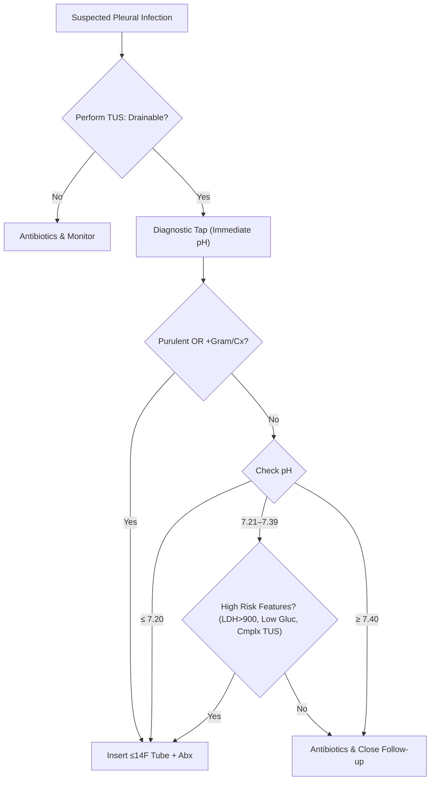
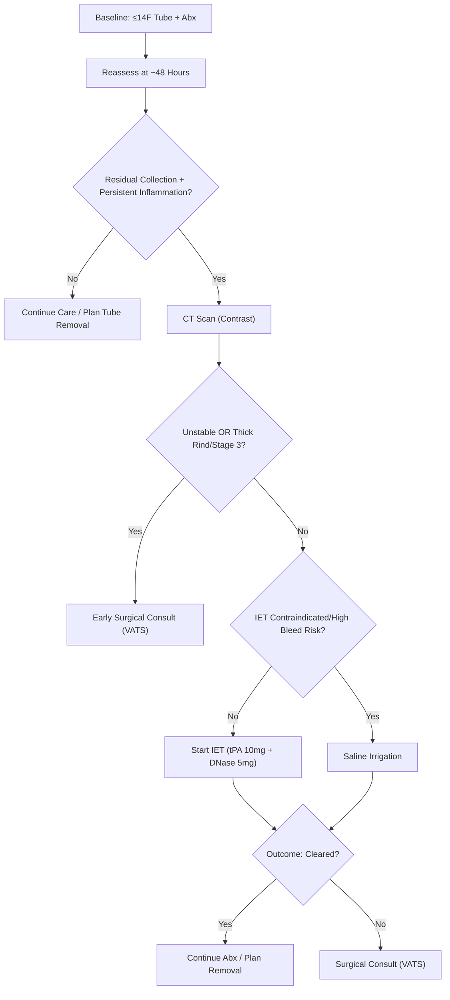

Pleural Infections

Exam Mapping & Scope

This chapter covers the evaluation and management of pleural space infections across the spectrum from complicated parapneumonic effusions to empyema. It emphasizes risk stratification (RAPID), chest tube selection, intrapleural enzyme therapy, saline irrigation, surgical escalation, and special populations. Guidance reflects contemporary society statements and pragmatic pathways tested in trials summarized in the provided materials.

Learning Objectives

Distinguish simple vs. complicated parapneumonic effusion and empyema using ultrasound, CT features, and pleural fluid chemistry.
Apply a stepwise, time-bounded pathway for source control (tube drainage → intrapleural therapy or irrigation → surgery) with reassessment at ~48 hours.
Choose appropriate drain size and placement strategy, and implement best-practice intrapleural tissue plasminogen activator (tPA) and DNase dosing—including dose reduction when bleeding risk is high.
Initiate empiric, setting-appropriate antibiotics and transition to targeted therapy; understand when shorter antibiotic durations may be reasonable.
Use the RAPID score to communicate risk, guide intensity of care, and anticipate outcomes.
Recognize when early surgical consultation is indicated and tailor management for trauma, tuberculosis, fungal infection, and transplant recipients.

High-Yield One-Pager

Terminology: "Pleural infection" encompasses complicated parapneumonic effusion (CPPE) and empyema; management principles are aligned.
Epidemiology: Incidence and hospitalizations have increased; older adults bear a disproportionate rise and higher mortality.
Don’t delay: Progression from "simple" to "complicated" can occur rapidly—act decisively.
Imaging: Thoracic ultrasound (TUS) reliably identifies septations/loculations and guides safe access; CT helps delineate anatomy and demonstrates the "split pleura" sign.
Chemistry that matters: pH ≤7.20 (obtained correctly) → place a chest tube if safe. If pH 7.21–7.39, integrate LDH (&gt;900 IU/L), glucose (≤4 mmol/L ≈ 72 mg/dL), and imaging to decide. Purulence, positive Gram stain/culture, or glucose &lt;60 mg/dL also strengthen the case for drainage.
Drain choice: Small-bore (≤14F) tubes are preferred (less pain, similar efficacy). Flush regularly to maintain patency.
Reassess at ~48 h: If persistent collection plus systemic inflammation → escalate (CT, intrapleural therapy, or surgery).
Intrapleural enzyme therapy (IET): Use tPA 10 mg + DNase 5 mg twice daily for up to 3 days; clamp ~1 hour each dose. Consider tPA 5 mg with standard DNase in high bleeding risk. Avoid fibrinolytic monotherapy.
Anticoagulation: Hold if possible before IET; if not feasible, use reduced-dose tPA with DNase or consider saline irrigation.
Saline irrigation: 250 mL normal saline TID for 3 days can reduce radiographic burden and surgical referral when IET/surgery are contraindicated.
When to call surgery early: Unstable/septic patients, organized stage 3 with thick rind/non-expandable lung, or failure after an adequate IET course. Prefer VATS over open thoracotomy when feasible.
Antibiotics: Start promptly; cover Gram-positives and anaerobes in community-acquired cases; add Gram-negatives (± Pseudomonas) in hospital-acquired cases. Tailor to culture and clinical progress.
RAPID score: Predicts 90-day mortality and helps goal-setting and escalation planning.
Common traps: Misinterpreting pH due to sampling errors; relying on chest X-ray alone; waiting for cultures before draining; placing a large-bore tube by default; using streptokinase or DNase monotherapy.

Core Concepts

Pathophysiology / Epidemiology

Pleural infection arises when an exudative effusion becomes infected, typically with neutrophil-predominant fluid. Routes include contiguous pneumonia, transdiaphragmatic spread from abdominal infection, mediastinal extension, hematogenous seeding, and direct inoculation (surgery, trauma). Anaerobes are frequent—consider dental disease and aspiration risks. Incidence has climbed over the past decade, with male predominance and higher mortality in older adults; pleural infection is resource-intensive (length of stay commonly 12–15 days or more).

Indications & Contraindications

Drainage is indicated for: purulent fluid; positive Gram stain/culture; pH ≤7.20; or intermediate pH with high-risk features (LDH &gt;900 IU/L, glucose ≤4 mmol/L [72 mg/dL] or &lt;60 mg/dL, complex ultrasound, large effusion, pleural enhancement). Avoid delays; bedside pH testing during the same procedure enables immediate conversion from diagnostic tap to small-bore tube. Upfront VATS is not generally first-line in stable adults, but early surgical consultation is warranted for instability, organized stage 3 disease, or tube failure.

Pre-procedure Evaluation

Imaging: TUS to confirm and map pockets and septations; CT (venous "pleural" phase) to define anatomy, detect split-pleura sign, and plan access/escalation when needed.
Labs: CBC, renal function (RAPID), coagulation profile if IET/surgery anticipated.
Pleural sampling: Correct technique for pH (heparin-free ABG syringe, no lidocaine contamination, air expelled, timely analysis).
Consent: Discuss staged pathway (tube → IET/irrigation → surgery) and potential complications (bleeding with IET, air leak after decortication).

Equipment & Setup

Drain: Image-guided ≤14F pigtail catheter preferred; place to suction and flush regularly to prevent occlusion.
Adjuncts: Three-way stopcock, sterile normal saline for flushes, securement sutures/dressing to prevent dislodgement.
IET: tPA and DNase available at bedside with clamps; plan for 1-hour dwell.

Step-by-Step Technique / Procedural Checklist

Confirm target with TUS; mark safe window.
Asepsis & anesthesia; small skin nick; Seldinger placement of ≤14F tube into largest or most septated pocket.
Secure & connect to drainage; flush with saline to maintain patency.
Send fluid for pH (immediate), glucose, protein/LDH (±Light’s criteria), Gram stain/culture (include blood culture bottles), and cytology.
Start antibiotics promptly (see Table 2).
Assess at ~48 h: If residual collection plus systemic inflammation (e.g., &lt;50% CRP fall or persistent SIRS), obtain CT and escalate (IET/irrigation or surgery).
IET regimen (typical): tPA 10 mg then DNase 5 mg, both twice daily for up to 3 days, clamp ~1 hour after each instillation; consider tPA 5 mg + DNase 5 mg when bleeding risk is high. Avoid monotherapy.

Poor drainage: Confirm tube position with TUS/CT; flush; consider additional catheter into separate locule; if still inadequate, proceed to IET or irrigation depending on bleeding risk.
Bleeding suspicion during IET: Don’t confuse pink drainage with true bleed—check pleural fluid hematocrit; pause/adjust dosing if needed.
Unstable patient post-tube: Early surgical consultation; many will benefit from timely VATS for debridement/decortication.

Post-procedure Care & Follow-up

Antibiotics: Start empirically, tailor as cultures return; transition IV→PO when clinically improving and inflammatory markers fall; typical total duration ≈ 4 weeks after adequate source control, though shorter courses are under study.

Monitoring: Daily clinical exam, drain output, inflammatory markers; imaging to assess clearance.

Discharge planning: Ensure clinical response before tube removal; arrange follow-up at 2–4 weeks and again at 8–12 weeks for radiographic resolution and to detect recurrence.

Complications (Prevention, Recognition, Management)

IET-related pain/bleeding: Pain impacts ~15%; pleural bleeding ~3–5%—most managed with transfusion alone. Mitigate by dose reduction (tPA 5 mg) when anticoagulation cannot be safely paused; avoid in systemic coagulopathy.
Tube issues: Dislodgement (securement), blockage (regular flushes), infection at insertion site (asepsis).
Surgical complications: Prolonged air leak, atrial fibrillation, residual space; risk rises with longer symptom duration and advanced stage.

Special Populations

Trauma/retained hemothorax: Higher risk for empyema; management includes redrainage, IET (non-streptokinase options), and early VATS when indicated.
Tuberculous empyema (stage 3): Thick pleural rind limits drug penetration; optimal care often requires decortication plus anti-TB therapy; VATS feasible in selected cases, with longer operative time and blood loss than pyogenic disease.
Fungal empyema: Rare but severe (higher ICU needs and mortality); requires antifungals with good pleural penetration and often surgical source control.
Lung transplant: Early, aggressive drainage; IET used sparingly due to anastomosis concerns; surgery less aggressive with tolerance for residual spaces; indwelling tunneled catheter may help gradual expansion.
High bleeding risk / mandatory anticoagulation: Prefer reduced-dose tPA with DNase, or use saline irrigation if lytics contraindicated; consider early VATS if operative risk acceptable.

Evidence & Outcomes

Key points include: equivalence of small vs. larger tubes for major outcomes but less pain with ≤14F; IET (tPA+DNase) improves radiographic clearance and reduces surgery and length of stay compared with standard care; pleural irrigation reduces radiographic burden and surgical referral in pilot data; VATS is preferred to open thoracotomy when surgery is needed; upfront VATS as initial drainage lacks robust evidence in stable adults; feasibility work comparing early VATS to IET shows equipoise, with definitive trials ongoing.

Diagnostic & Therapeutic Algorithms

Algorithm 1 — Initial Evaluation and Drainage Decision

Algorithm 2 — Escalation After Tube Placement

Tables & Quick-Reference Boxes

Table 1. Spectrum of Pleural Infection—Defining Features

| Feature        | Simple Parapneumonic   | Complicated Parapneumonic (CPPE)                            | Empyema                                  |
| -------------- | ---------------------- | ----------------------------------------------------------- | ---------------------------------------- |
| Ultrasound/CT  | Anechoic, free-flowing | Septations, loculations, pleural thickening (±split pleura) | As CPPE; often thick rind                |
| Pleural pH     | &gt;7.20               | ≤7.20 or 7.21–7.39 with high-risk features                  | Variable; often ≤7.20                    |
| Glucose        | &gt;60 mg/dL           | ≤60 mg/dL (or ≤4 mmol/L)                                    | Often low                                |
| Microbiology   | Negative               | Negative or positive                                        | Purulent and/or +Gram/culture            |
| Typical Action | Antibiotics alone      | Tube drainage (≤14F) ± IET                                  | Tube drainage ± IET; surgical evaluation |

Table 2. Empiric Antibiotic Approach

| Setting                            | Organisms to Cover                               | Example Empiric Options                                                                                | Step-down & Notes                                                        |
| ---------------------------------- | ------------------------------------------------ | ------------------------------------------------------------------------------------------------------ | ------------------------------------------------------------------------ |
| Community-acquired                 | Gram-positive aerobes + anaerobes                | Amoxicillin-clavulanate ± metronidazole/clindamycin; (Penicillin allergy: clindamycin ± cephalosporin) | Continue anaerobic coverage even if cultures negative; tailor to results |
| Hospital-acquired / Post-procedure | G+, G- (± Pseudomonas), anaerobes; consider MRSA | Piperacillin-tazobactam, cefepime + metronidazole, or carbapenem + vancomycin/linezolid                | Early de-escalation if monomicrobial streptococcal disease and improving |

Table 3. Intrapleural Enzyme Therapy (IET) at a Glance

| Element         | Practical Points                                                                       |
| --------------- | -------------------------------------------------------------------------------------- |
| Standard Dosing | tPA 10 mg + DNase 5 mg, BID for up to 3 days (max 6 doses); clamp ~1 hour each dose    |
| Reduced Dose    | Consider tPA 5 mg + DNase 5 mg with high bleeding risk or unavoidable anticoagulation  |
| Sequencing      | Concurrent administration is acceptable; avoid monotherapy (tPA-only or DNase-only)    |
| Anticoagulation | Hold if possible; if not, use reduced tPA and close monitoring                         |
| Failure         | If significant residual collection persists after a complete course, refer for surgery |

Table 4. RAPID Score (Predicts 90-day Mortality)

| Component            | 0 Points     | 1 Point          | 2 Points |
| -------------------- | ------------ | ---------------- | -------- |
| Renal (urea, mmol/L) | &lt;5        | 5–8              | &gt;8    |
| Age (years)          | &lt;50       | 50–70            | &gt;70   |
| Purulence of fluid   | Purulent (0) | Non-purulent (1) | —        |
| Infection source     | Community    | Hospital         | —        |
| Albumin (g/L)        | ≥27          | &lt;27           | —        |

Risk categories: 0–2 low, 3–4 moderate, 5–7 high

Cases & Applied Learning

Case 1 — Early decision-making

A 66-year-old with right-sided pneumonia has fever and pleuritic pain. TUS: moderate effusion; anechoic. Diagnostic tap performed with immediate pH measurement shows pH 7.18.

Best answer: Insert a ≤14F chest tube during the same session and start antibiotics.

Explanation: pH ≤7.20 is a high-risk biochemical feature mandating drainage when safe to do so. Immediate pH testing enables conversion from tap to tube and avoids delay.

Case 2 — 48-hour checkpoint

A 58-year-old with a 12F pigtail for CPPE shows persistent fever, CRP down by only 20%, and CT reveals sizeable residual locule.

Best answer: Start tPA 10 mg + DNase 5 mg BID for up to 3 days (consider tPA 5 mg if bleeding risk) and reassess.

Explanation: At ~48 h, residual collection plus inadequate inflammatory improvement triggers escalation. IET is preferred in fibrinopurulent disease; proceed to surgery if IET fails or stage 3 features dominate.

Case 3 — Anticoagulation constraint

A 72-year-old on therapeutic anticoagulation for acute VTE cannot pause treatment. Residual CPPE persists despite tube drainage.

Best answer: Reduced-dose tPA 5 mg + DNase 5 mg with careful monitoring, or saline irrigation if bleeding risk is unacceptable.

Explanation: Dose reduction mitigates bleeding risk when anticoagulation cannot be interrupted; irrigation is an alternative where IET is contraindicated.

Question Bank (MCQs)

1. Which statement is accurate regarding pleural infections?

2. A patient with right-sided pneumonia has an anechoic effusion. Immediate pleural fluid pH is 7.18. Next best step?

3. After 48 h of tube drainage, CT shows a sizeable residual collection and CRP has fallen by only 20%. Patient is stable. Best next step?

4. A patient on non-interrupible anticoagulation has a residual empyema after tube placement. Which regimen is acceptable?

5. During IET, drainage turns pink but the patient is stable. Best action?

6. Best empiric regimen for hospital-acquired pleural infection with MRSA and Pseudomonas risk?

7. Which statement about chest tubes in pleural infection is correct?

8. Which finding most strongly favors early surgical referral?

9. TB empyema truths include:

10. Lung transplant recipient with early pleural space infection—most appropriate principle?

11. Regarding imaging, which is correct?

12. Which IET practice is evidence-consistent?

Controversies, Variability, and Evolving Evidence

Upfront VATS vs initial tube drainage/IET: Evidence is limited by small trials and retrospective bias; consensus favors small-bore tube first in stable adults, with early surgery for unstable patients or organized disease. Feasibility trials comparing early VATS with IET suggest equipoise; definitive studies are ongoing.
Antibiotic duration: Traditional ~4-week courses are common; emerging trials suggest shorter durations may be reasonable after adequate source control, but evidence remains underpowered.
Pleural irrigation: Pilot data support radiographic improvement and fewer surgical referrals, but mortality benefit is unproven and larger trials are needed.
Medical thoracoscopy: Early data show shorter post-procedure stays vs IET in small RCTs; larger studies are required before routine adoption.

Take-Home Checklist

[ ] Confirm effusion with TUS; plan the safest access point.
[ ] Measure pH immediately at first tap; convert to tube if pH ≤7.20 or if purulent/+Gram stain/+culture.
[ ] Use ≤14F image-guided tubes; flush regularly.
[ ] Start appropriate empiric antibiotics without waiting for cultures; tailor promptly.
[ ] Reassess at ~48 h using clinical status, inflammatory markers, and CT if needed.
[ ] In stable stage 2 disease with residual collection, use tPA 10 mg + DNase 5 mg BID (consider tPA 5 mg if bleeding risk).
[ ] If IET contraindicated, consider saline irrigation.
[ ] Call surgery early for unstable patients, organized stage 3/rind, or IET failure; VATS preferred when possible.
[ ] Apply RAPID score at baseline to frame risk and intensity of care.
[ ] Plan follow-up at 2–4 weeks and 8–12 weeks; focus on clinical recovery over complete radiographic resolution alone.

Abbreviations & Glossary

CPPE: Complicated parapneumonic effusion.
DNase: Dornase alfa administered intrapleurally with tPA.
IET: Intrapleural enzyme therapy (tPA + DNase).
IPC: Indwelling pleural catheter.
LDH: Lactate dehydrogenase.
RAPID: Renal (urea), Age, Purulence, Infection source, Dietary (albumin) score.
TUS: Thoracic ultrasound.
VATS: Video-assisted thoracoscopic surgery.

References

Roberts ME, Rahman NM, Maskell NA, et al. British Thoracic Society guideline for pleural disease. Thorax. 2023;78(Suppl 3):s1-s42.
Mummadi SR, Stoller JK, Lopez R, Kailasam K, Gillespie CT, Hahn PY. Epidemiology of adult pleural disease in the United States. Chest. 2021;160(4):1534-1551.
Arnold DT, Hamilton FW, Morris TT, et al. Epidemiology of pleural empyema in English hospitals and the impact of influenza. Eur Respir J. 2021;57(6):2003546.
Rahman NM, Kahan BC, Miller RF, et al. A clinical score (RAPID) to identify those at risk for poor outcome at presentation in patients with pleural infection. Chest. 2014;145(4):848-855.
Maskell NA, Davies CWH, Nunn AJ, et al. U.K. controlled trial of intrapleural streptokinase for pleural infection. N Engl J Med. 2005;352(9):865-874.
Rahman NM, Maskell NA, West A, et al. Intrapleural use of tissue plasminogen activator and DNase in pleural infection. N Engl J Med. 2011;365(6):518-526.
Chaddha U, Agrawal A, Davidoff F, et al. Use of fibrinolytics and deoxyribonuclease in adult patients with pleural empyema: a consensus statement. Lancet Respir Med. 2021.
Akulian J, Bedawi EO, Abbas H, et al. Bleeding risk with combination intrapleural fibrinolytic and enzyme therapy in pleural infection. Chest. 2022;162(6):1384-1392.
Hooper CE, Edey AJ, Wallis A, et al. Pleural irrigation trial (PIT): a randomized controlled pilot of pleural irrigation with normal saline versus standard care in pleural infection. Eur Respir J. 2015;46(2):456-463.
Bedawi EO, Stavroulias D, Hedley E, et al. Early video-assisted thoracoscopic surgery or intrapleural enzyme therapy in pleural infection: a feasibility randomized controlled trial (MIST-3). Am J Respir Crit Care Med. 2023;208(12):1305-1315.
Pan H, He J, Shen J, et al. Video-assisted thoracoscopic decortication versus open thoracotomy decortication for empyema: a meta-analysis. J Thorac Dis. 2017;9(7):2006-2014.
Shen KR, Bribriesco A, Crabtree T, et al. The American Association for Thoracic Surgery consensus guidelines for the management of empyema. J Thorac Cardiovasc Surg. 2017;153(6):e129-e146.
Menzies SM, Rahman NM, Wrightson JM, et al. Blood culture bottle culture of pleural fluid in pleural infection. Thorax. 2011;66(8):658-662.
Heffner JE, Klein JS, Hampson C. Diagnostic utility and clinical application of imaging for pleural space infections. Chest. 2010;137(2):467-479.
Kheir F, Thakore S, Mehta H, et al. Intrapleural fibrinolytic therapy versus early medical thoracoscopy for treatment of pleural infection: randomized controlled trial. Ann Am Thorac Soc. 2020;17(8):958-964.
Bedawi EO, Ricciardi S, Hassan M, et al. ERS/ESTS statement on the management of pleural infection in adults. Eur Respir J. 2023;61(2):2201062.
