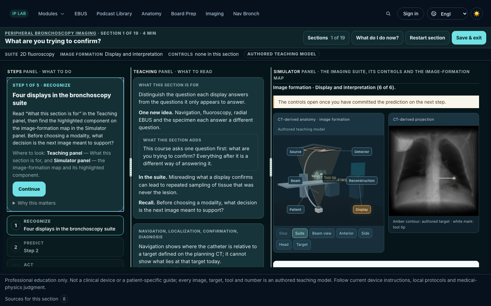
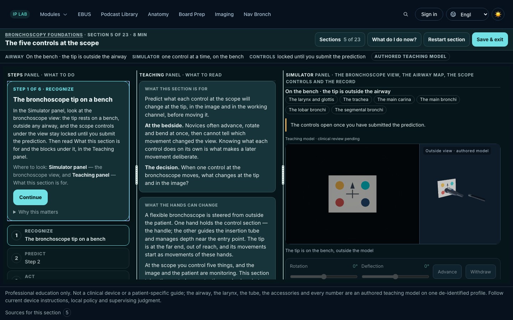
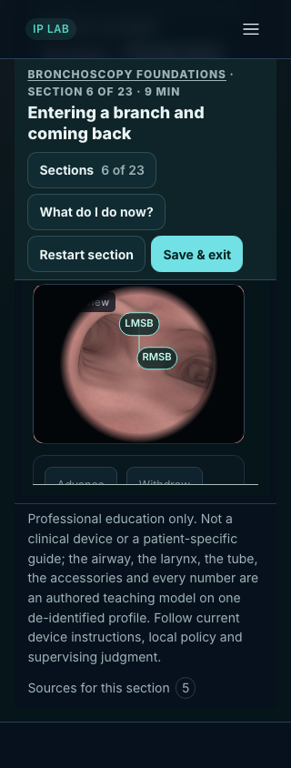
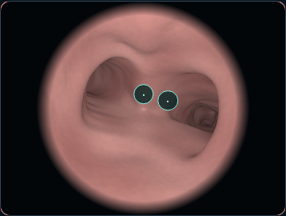
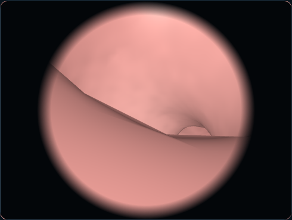
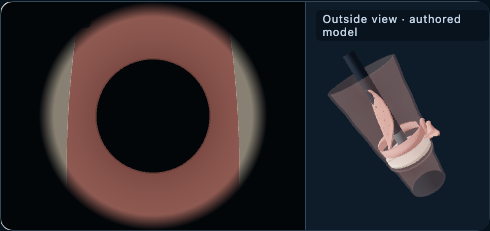
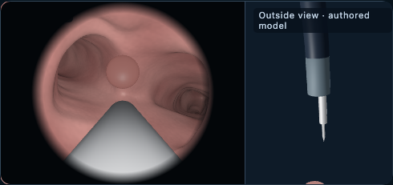

# Inspected core-build captures

These are technical review images of an unlisted module. They do not record clinical or rights approval. See [validation](../validation.md) for the commands, automated evidence and remaining limitations.

## Shared workbench and target

The actual imaging reference and foundations bench use the same 1440×900 viewport.

## Compact view

The 320 px lesson view retains readable captions with leader lines to their optical attachment points.

## Scene states

The full survey uses the real loaded lumen, declared inspections and a return to RB6.

The larynx is an authored model with scripted fold states. Its unresolved source-inlet junction remains documented; this capture is not evidence of anatomical fidelity.

The exposed needle and generic practice target are authored teaching geometry, not a clinical finding or manufacturer specification.

[Scene results](scene-results.json) report all seven modes and 13 grouped checks. [Admin optical comparisons](admin-optical-comparison.json) distinguish exact optical matches from whole-page differences outside the optical crops.
