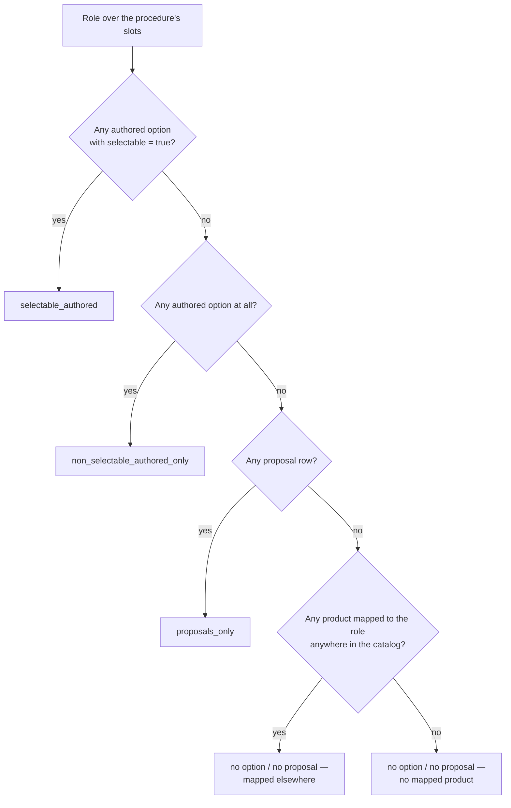

# Data-readiness report — EBUS_TBNA, THERAPEUTIC_BRONCH, CHEST_TUBE

Phase D0 discovery document (2026-08-08) — describes current repository state and proposals; no
production feature exists; all recommendations await physician-owner decisions recorded in
[decision-log.md](./decision-log.md).

This report is the data-readiness analysis for the Device and Procedure Intelligence Platform
discovery. It interprets the deterministic audit artifact
[data-readiness-audit.json](./data-readiness-audit.json) for the three exemplar procedures and
draws cross-procedure conclusions about the three candidate pillars. Companion documents:
[relationship-taxonomy.md](./relationship-taxonomy.md) (the eight relationship concepts) and
[vertical-slice-spec.md](./vertical-slice-spec.md) (the proposed Phase D1 slice). This audit
reports data readiness only; it never claims products are clinically equivalent or substitutable.

---

## 1. Method

### 1.1 What the audit computes

`scripts/ip-device-intelligence/audit-data-readiness.ts` reads the authored seed
(`data/ip-preference-cards/seed/**`) and generated catalog
(`data/ip-preference-cards/generated/**`) read-only and emits
`docs/ip-device-intelligence/data-readiness-audit.json`, a content-addressed snapshot
(workbook sha256 `fb25b24e…`, catalog release id `8ece7648…`, no timestamps) containing:

- a **global block** whose counts must equal the published `ip-cards:validate-data` numbers
  (1,532 products / 135 roles / 15 procedures / 233 slots / 2,073 authored options /
  813 proposals / 1,622 product-role links / 942 selectable+visible options), and
- a **per-procedure block** for each of the three exemplars covering: slot requiredness,
  role-coverage ladder, dependency rules and modifiers, compatibility rules by verification
  grade, server-side equipment sets, local (formulary) availability, source verification over
  authored-option products, dimension-metadata gaps, and a needs-review-before-public rollup.

### 1.2 Exact semantics

The artifact's `semantics` block is the authoritative definition of every number in this report.
Quoted verbatim from `data-readiness-audit.json`:

```json
{
  "determinism": "No timestamps; provenance is content-addressed (workbook sha256 + catalog release id); every array stable-sorted; split-object keys sorted alphabetically.",
  "slots.requiredness": "Count of procedure-slots rows by requiredness; 'conditional' is reported as 'contingency'.",
  "slots.withAllowCustom": "Slots with allow_custom === true.",
  "slots.rescueSectionSlotCount": "Slots whose section string equals 'Rescue'.",
  "slots.rescueModulesReachable": "Rescue modules appended by the procedure's allowed modifier codes; the only such action in the resolver seed (src/features/preference-cards/seed/operational.ts) is HIGH_BLEED_RISK -> MAJOR_AIRWAY_BLEEDING. Release bundles pin one shared rescue-module set (definition-set-rescue-modules) for all procedures.",
  "roleCoverage.ladder": "Per distinct role over the procedure slots, first matching state wins: >=1 authored slot-product-options row with selectable true; else >=1 authored row (all non-selectable); else >=1 proposal row for the role slots; else no option and no proposal (split by whether any product-roles row maps a product to the role anywhere in the catalog).",
  "roleCoverage.rolesCoveredByDemoStandIns": "Roles whose role_code appears in seed/demo-stand-ins.json (a cross-cutting overlay count, independent of the ladder state).",
  "roleCoverage.slotRollup": "The same ladder applied per slot instead of per role.",
  "dependencies.slotsWithDependencyRule": "Slots whose dependency_rule is non-null and non-empty after trimming.",
  "dependencies.allowedModifiers": "allowedModifierCodes from generated/procedure-compositions.json; environmentOrLocation is true when the code starts with 'ENV_' or the generated modifier-definitions.json entry has groupCode 'location'.",
  "compatibility.resolvedRulesTouchingProcedure": "compatibility-raw.json rules where resolved_source_id or resolved_target_id is in the procedure's role-code set or in the set of product_ids mapped to those roles via product-roles.json.",
  "compatibility.unresolvedTextualRoleMatches": "Rules with both resolved ids null where any procedure role_code appears as a case-sensitive substring of source_product_or_role or target_product_or_role.",
  "equipmentSets": "Constant 0 server-side; equipment sets exist only in browser localStorage (ip-preference-cards:equipment-sets:v1).",
  "localAvailability": "hospital-formulary-staging.json rows whose semicolon-delimited role_codes intersect the procedure's roles; local fields checked: local_description, local_item_number, local_notes, local_uom, par_level, storage_location.",
  "sourceVerification": "Computed over the distinct product_ids appearing in the procedure authored slot-product-options rows (selectable or not); GUDID confirmation = product_id present in gudid-confirmations.json confirmations.",
  "dimensionGaps": "Distinct authored-option products where ALL of diameter_mm, french_size, gauge, length_mm, working_length_cm, min_working_channel_mm, delivery_system_od_mm, size_display are null or empty strings.",
  "needsReviewBeforePublic": "Proposal rows for the procedure_code; candidate-grade rules from the union of resolved and unresolved-textual compatibility matches; draft-governance product-family versions with >=1 member product mapped (via product-roles.json) to the procedure roles; plus the procedure draft status itself.",
  "global": "Whole-catalog counts; they must equal the published ip-cards:validate-data numbers.",
  "noEquivalenceClaims": "This audit reports data readiness only; it never claims products are clinically equivalent or substitutable."
}
```

The role-coverage ladder classifies each role into exactly one state, first match wins:



In all three exemplars every slot carries a distinct role (distinct roles == slot count), so the
per-role ladder and the per-slot rollup are numerically identical; each table below is reported
once.

### 1.3 Reproduction

```
npm run ip-intel:audit        # runs: tsx scripts/ip-device-intelligence/audit-data-readiness.ts
```

The artifact is byte-stable across reruns (no timestamps; stable sorts). A jest suite
(`scripts/ip-device-intelligence/__tests__/audit-data-readiness.test.ts`) pins the headline
counts, verifies ladder/rollup partition sums, recomputes the audit twice for determinism, and
byte-compares the committed artifact against a fresh computation as a drift detector.

### 1.4 Charter rule: the data was not modified

Phase D0 is documentation and deterministic audit tooling only. **No catalog data was created,
edited, or deleted to improve these results.** The audit reads `data/ip-preference-cards/**`
strictly read-only; every count below describes the repository as found on branch
`claude/device-intelligence-discovery` (at parity with `origin/main`, workbook sha
`fb25b24e…`). Gaps are reported as gaps.

---

## 2. EBUS_TBNA — EBUS-TBNA / EBUS-FNB

Status: `Draft - clinician/pathology review required` (template version 0.3).

### 2.1 Slots and requiredness

| Metric                                 | Value                                                   |
| -------------------------------------- | ------------------------------------------------------- |
| Total slots                            | 15                                                      |
| Required                               | 7                                                       |
| Contingency (conditional)              | 4                                                       |
| Optional                               | 4                                                       |
| Slots with `allow_custom`              | 15 (all)                                                |
| Rescue-section slots                   | 0                                                       |
| Rescue modules reachable via modifiers | `MAJOR_AIRWAY_BLEEDING` (via allowed `HIGH_BLEED_RISK`) |

### 2.2 Role-coverage ladder (15 distinct roles)

| Ladder state                                        | Roles | Which roles                                                                                                                                                                                       |
| --------------------------------------------------- | ----- | ------------------------------------------------------------------------------------------------------------------------------------------------------------------------------------------------- |
| Selectable authored option                          | 11    | EBUS_BALLOON, EBUS_MINIFORCEPS, EBUS_NEEDLE_ADAPTER, EBUS_NEEDLE_FNA, EBUS_NEEDLE_FNB, EBUS_SCOPE, SPECIMEN_TRAP, ULTRASOUND_CABLE, ULTRASOUND_PROCESSOR, VACUUM_LOCKING_SYRINGE, VIDEO_PROCESSOR |
| Non-selectable authored only                        | 0     | —                                                                                                                                                                                                 |
| Proposals only                                      | 2     | FLUOROSCOPY_C_ARM, GENERIC_SUCTION                                                                                                                                                                |
| No option, no proposal — mapped elsewhere           | 0     | —                                                                                                                                                                                                 |
| No option, no proposal — no mapped product anywhere | 2     | GENERIC_SPECIMEN, RADIATION_PROTECTION                                                                                                                                                            |
| Demo stand-in overlay (cross-cutting)               | 3     | GENERIC_SPECIMEN, GENERIC_SUCTION, VIDEO_PROCESSOR                                                                                                                                                |

The seven required slots — including the linear EBUS scope, deliberately first in requirement
order — are all in the selectable state. The gaps sit in the imaging/support periphery
(fluoroscopy C-arm, radiation protection) and the generic hospital-local roles (specimen,
suction), which today lean on demo stand-ins from `data/ip-preference-cards/seed/demo-stand-ins.json`.

### 2.3 Room and capability dependencies

- 7 of 15 slots carry a dependency rule (e.g., `EBUS_NEEDLE_FNB` — "Histology/core biopsy
  desired"; `FLUOROSCOPY_C_ARM` and `RADIATION_PROTECTION` — "Fluoroscopy planned").
- 13 allowed modifier codes, of which 4 are environment/location:
  `AIRBORNE_ISOLATION`, `ENV_BRONCH_SUITE`, `ENV_ICU_BEDSIDE`, `ENV_OR`.
- Specimen-pathway modifiers (`ROSE`, `SPEC_FLOW`, `SPEC_MICRO`, `SPEC_MOLECULAR`) encode the
  pathology-facing capability axis that drives the golden scenario (ebus-rose-molecular).

### 2.4 Compatibility relationships

| Bucket                                | Count | By verification grade             |
| ------------------------------------- | ----- | --------------------------------- |
| Resolved rules touching the procedure | 12    | 10 verified_source, **2 unknown** |
| Unresolved-textual role matches       | 0     | —                                 |

The two unknown-grade rules (among `CMP-…` ids) are compatibility statements whose grade was
never assigned; they should not surface publicly until graded (see §2.8 and §6).

### 2.5 Equipment sets and local availability

| Metric                              | Value                                                                                                                         |
| ----------------------------------- | ----------------------------------------------------------------------------------------------------------------------------- |
| Server-side equipment sets          | 0 — equipment sets exist only in browser localStorage (`ip-preference-cards:equipment-sets:v1`); no server-side entity exists |
| Formulary rows intersecting roles   | 60 (of the 1,221-row empty scaffold)                                                                                          |
| `hospital_carries` true             | 0                                                                                                                             |
| `preferred` true                    | 0                                                                                                                             |
| Rows with any local field populated | **1**                                                                                                                         |

The single populated row is the only populated local field in the entire repository:
`PRD-0D6E4DB711` (Olympus ViziShot 2 FLEX EBUS FNA/FNB needle, catalog `NA-U403SX-4019`) with
`local_notes` = "Do not procure; historical traceability only." — a provenance/traceability
note, not availability data. Effective local-availability coverage is zero, as expected for an
empty scaffold.

### 2.6 Source verification (61 distinct authored-option products)

| Metric                      | Value       | Share |
| --------------------------- | ----------- | ----- |
| verified_source             | 51          | 84%   |
| candidate                   | 9           | 15%   |
| unknown                     | 1           | 2%    |
| prototype_visible           | 43          | 70%   |
| hidden                      | 18          | 30%   |
| With ≥1 product-sources row | **61 / 61** | 100%  |
| GUDID-confirmed             | 16          | 26%   |

### 2.7 Dimension/configuration-metadata gaps

20 of 61 authored-option products (33%) have all eight dimension fields empty (product ids
enumerated in the artifact). Some are capital equipment for which single-device dimensions may
be genuinely inapplicable; the audit does not distinguish (see §6).

### 2.8 Needs clinical review before public display

- 12 unreviewed proposals scoped to this procedure.
- 0 candidate-grade compatibility rules; however, the 2 **unknown-grade** resolved rules fall
  outside this counter's definition and equally need grading before public display.
- 0 draft product-family versions touching its roles.
- The procedure itself: `Draft - clinician/pathology review required`.

---

## 3. THERAPEUTIC_BRONCH — Therapeutic flexible bronchoscopy

Status: `Draft - clinician review required` (template version 0.3).

### 3.1 Slots and requiredness

| Metric                                 | Value                                                   |
| -------------------------------------- | ------------------------------------------------------- |
| Total slots                            | 29                                                      |
| Required                               | 3                                                       |
| Contingency (conditional)              | 21                                                      |
| Optional                               | 5                                                       |
| Slots with `allow_custom`              | 29 (all)                                                |
| Rescue-section slots                   | 0                                                       |
| Rescue modules reachable via modifiers | `MAJOR_AIRWAY_BLEEDING` (via allowed `HIGH_BLEED_RISK`) |

The 3/21/5 profile is the inverse of EBUS: this is a contingency-driven procedure whose
readiness question is dominated by conditional pathways (dilation, stenting, thermal energy,
cryotherapy, laser, retrieval), not by a required core.

### 3.2 Role-coverage ladder (29 distinct roles)

| Ladder state                                        | Roles | Which roles                                                                                                                                                                                                                                                                                                    |
| --------------------------------------------------- | ----- | -------------------------------------------------------------------------------------------------------------------------------------------------------------------------------------------------------------------------------------------------------------------------------------------------------------- |
| Selectable authored option                          | 14    | AIRWAY_BALLOON_DILATOR, AIRWAY_STENT_SEMS_COVERED, AIRWAY_STENT_SEMS_UNCOVERED, AIRWAY_STENT_SIZING_DEVICE, BAL_KIT, BIOPSY_FORCEPS_FLEX, BITE_BLOCK, ENDOSCOPE_CLEANING_BRUSH, FLEX_SCOPE_THERAPEUTIC, FOREIGN_BODY_BASKET, FOREIGN_BODY_FORCEPS_FLEX, INFLATION_DEVICE, PULMONARY_GUIDEWIRE, VIDEO_PROCESSOR |
| Non-selectable authored only                        | 5     | APC_GAS_ACCESSORY, APC_PROBE_FLEX, CRYOPROBE_FLEX, CRYO_SYSTEM_ACCESSORY, ENERGY_CABLE_ADAPTER                                                                                                                                                                                                                 |
| Proposals only                                      | 7     | ENERGY_PLATFORM, FLUOROSCOPY_C_ARM, GENERIC_SUCTION, LASER_CONSOLE, LASER_FIBER, LASER_SAFETY_EQUIPMENT, TOMOSYNTHESIS_NAVIGATION_SYSTEM                                                                                                                                                                       |
| No option, no proposal — mapped elsewhere           | 0     | —                                                                                                                                                                                                                                                                                                              |
| No option, no proposal — no mapped product anywhere | 3     | GENERIC_SPECIMEN, LASER_RESISTANT_ETT, RADIATION_PROTECTION                                                                                                                                                                                                                                                    |
| Demo stand-in overlay (cross-cutting)               | 7     | APC_GAS_ACCESSORY, APC_PROBE_FLEX, ENERGY_CABLE_ADAPTER, ENERGY_PLATFORM, GENERIC_SPECIMEN, GENERIC_SUCTION, VIDEO_PROCESSOR                                                                                                                                                                                   |

Fewer than half the roles (14/29, 48%) have a selectable authored option. Notably, the entire
reviewed laser/imaging slot round (LASER_CONSOLE, LASER_FIBER, LASER_SAFETY_EQUIPMENT,
FLUOROSCOPY_C_ARM, TOMOSYNTHESIS_NAVIGATION_SYSTEM) sits at proposals-only: the **slots** were
clinician-reviewed into the template, but the **product options** for them have not passed
review. LASER_RESISTANT_ETT and RADIATION_PROTECTION from the same round have no product mapped
anywhere in the 1,532-product catalog.

### 3.3 Room and capability dependencies

- 21 of 29 slots carry a dependency rule — the densest dependency network of the three
  exemplars ("Laser planned" ×3, "APC planned" ×2, "Cryotherapy planned", "Covered/Uncovered
  SEMS planned", "Balloon dilator selected" → INFLATION_DEVICE, "Guidewire-compatible
  balloon/stent selected", "Laser planned with an indwelling tube or tracheostomy" →
  LASER_RESISTANT_ETT, etc.).
- 26 allowed modifier codes — the widest capability surface (APC, LASER, CRYOTHERAPY,
  ELECTROCAUTERY, BALLOON_DILATION, STENT_PLACE/REMOVE, RIGID_AIRWAY, JET_VENT, NAVIGATION,
  ROBOTIC, CBCT, RADIAL_EBUS, FLUOROSCOPY, HIGH_BLEED_RISK, …), of which 4 are
  environment/location: `AIRBORNE_ISOLATION`, `ENV_BRONCH_SUITE`, `ENV_ICU_BEDSIDE`, `ENV_OR`.

### 3.4 Compatibility relationships

| Bucket                                | Count | By verification grade                                 |
| ------------------------------------- | ----- | ----------------------------------------------------- |
| Resolved rules touching the procedure | 7     | 6 verified_source, **1 candidate** (`CMP-58DE7D49C4`) |
| Unresolved-textual role matches       | 0     | —                                                     |

Seven resolved rules against 29 slots and 26 capability modifiers is thin coverage for the
procedure where compatibility matters most (energy platform ↔ probe ↔ cable/adapter chains;
the golden scenario's deliberately blocking APC platform/probe mismatch exercises exactly this
class of rule).

### 3.5 Equipment sets and local availability

| Metric                                             | Value                                                |
| -------------------------------------------------- | ---------------------------------------------------- |
| Server-side equipment sets                         | 0 (browser localStorage only; no server-side entity) |
| Formulary rows intersecting roles                  | 377                                                  |
| `hospital_carries` / `preferred` / any local field | 0 / 0 / 0                                            |

### 3.6 Source verification (378 distinct authored-option products)

| Metric                      | Value         | Share |
| --------------------------- | ------------- | ----- |
| verified_source             | 330           | 87%   |
| candidate                   | 48            | 13%   |
| prototype_visible           | 176           | 47%   |
| hidden                      | 202           | 53%   |
| With ≥1 product-sources row | **378 / 378** | 100%  |
| GUDID-confirmed             | 132           | 35%   |

This is the largest authored-option product pool of any exemplar and the highest
verified-source share — but also the only exemplar where a majority of its products are
`hidden`, which caps what a public atlas view (verified_source + prototype_visible per
recommendation R5) could show today.

### 3.7 Dimension/configuration-metadata gaps

58 of 378 authored-option products (15%) have all eight dimension fields empty — the best
completeness ratio of the three exemplars.

### 3.8 Needs clinical review before public display

- 36 unreviewed proposals scoped to this procedure.
- 1 candidate-grade compatibility rule (`CMP-58DE7D49C4`, touching the ENERGY_PLATFORM role
  set — the only candidate-grade rule across all three exemplars).
- **11 of the 18 draft product-family versions** touch its roles — all airway-stent
  configuration families (Boston Scientific Ultraflex covered/uncovered, Merit AERO / AERO DV /
  AEROmini, Micro-Tech tracheal/J-shaped/Y-shaped/Y-stent variants, Thoracent/M.I. Tech
  Bonastent); ids enumerated in the artifact.
- The procedure itself: `Draft - clinician review required`.

---

## 4. CHEST_TUBE — Chest tube insertion

Status: `Draft - clinician review required` (template version 0.3).

### 4.1 Slots and requiredness

| Metric                                 | Value                                                     |
| -------------------------------------- | --------------------------------------------------------- |
| Total slots                            | 13                                                        |
| Required                               | 3                                                         |
| Contingency (conditional)              | 7                                                         |
| Optional                               | 3                                                         |
| Slots with `allow_custom`              | 13 (all)                                                  |
| Rescue-section slots                   | 0                                                         |
| Rescue modules reachable via modifiers | none (no allowed modifier maps to a rescue-module action) |

CHEST_TUBE is the only exemplar with no reachable rescue module: the sole rescue-appending
action in the resolver seed is `HIGH_BLEED_RISK -> MAJOR_AIRWAY_BLEEDING`
(`src/features/preference-cards/seed/operational.ts`), and `HIGH_BLEED_RISK` is not among its
11 allowed modifiers.

### 4.2 Role-coverage ladder (13 distinct roles)

| Ladder state                                        | Roles | Which roles                                                                                                                                                                   |
| --------------------------------------------------- | ----- | ----------------------------------------------------------------------------------------------------------------------------------------------------------------------------- |
| Selectable authored option                          | 8     | CHEST_TUBE_SMALL_BORE, GENERIC_DRAINAGE_UNIT, GENERIC_ULTRASOUND, IPC_DRAINAGE_KIT, IPC_DRESSING_KIT, IPC_INSERTION_KIT, IPC_MANAGEMENT_ACCESSORY, PLEURAL_DRAINAGE_ACCESSORY |
| Non-selectable authored only                        | 3     | CHEST_TUBE_LARGE_BORE, CHEST_TUBE_SURGICAL, PNEUMOTHORAX_KIT                                                                                                                  |
| Proposals only                                      | 1     | GENERIC_SUCTION                                                                                                                                                               |
| No option, no proposal — mapped elsewhere           | 0     | —                                                                                                                                                                             |
| No option, no proposal — no mapped product anywhere | 1     | DRESSING_SECUREMENT                                                                                                                                                           |
| Demo stand-in overlay (cross-cutting)               | 3     | CHEST_TUBE_LARGE_BORE, GENERIC_DRAINAGE_UNIT, GENERIC_SUCTION                                                                                                                 |

DRESSING_SECUREMENT has no option, no proposal, and no product mapped anywhere in the catalog.
This is a known, deliberate state: the reviewed policy decision that re-roled the slot to
DRESSING_SECUREMENT explicitly directed "do not author fictitious commercial products here."
The gap is honest — it awaits sourcing of real commercial products, not synthesis. The IPC
(long-term drainage) pathway is fully selectable, reflecting the 18 reviewed drainage upserts —
the only proposal-derived options ever promoted to selectable (explicitly nondefault).

### 4.3 Room and capability dependencies

- 10 of 13 slots carry a dependency rule (approach-driven: "Small-bore approach selected",
  "Large-bore percutaneous approach selected", "Surgical/trocar approach selected",
  "Image-guided insertion" → GENERIC_ULTRASOUND, the IPC chain including "Required when
  IPC_INSERTION_KIT is selected").
- 11 allowed modifier codes, of which 3 are environment/location: `ENV_BRONCH_SUITE`,
  `ENV_ICU_BEDSIDE`, `ENV_OR`. The technique pair `TECH_CHEST_TUBE_SMALL_BORE` /
  `TECH_CHEST_TUBE_LARGE_BORE` (mutually exclusive in the golden scenario) and
  `DIGITAL_DRAINAGE` / `PLEURAL_MANOMETRY` encode the capability axis.

### 4.4 Compatibility relationships

| Bucket                                | Count | By verification grade         |
| ------------------------------------- | ----- | ----------------------------- |
| Resolved rules touching the procedure | 13    | **13 verified_source** (100%) |
| Unresolved-textual role matches       | 0     | —                             |

The cleanest compatibility slice of the three: every touching rule is verified_source, none
candidate or unknown.

### 4.5 Equipment sets and local availability

| Metric                                             | Value                                                |
| -------------------------------------------------- | ---------------------------------------------------- |
| Server-side equipment sets                         | 0 (browser localStorage only; no server-side entity) |
| Formulary rows intersecting roles                  | 107                                                  |
| `hospital_carries` / `preferred` / any local field | 0 / 0 / 0                                            |

### 4.6 Source verification (113 distinct authored-option products)

| Metric                      | Value         | Share |
| --------------------------- | ------------- | ----- |
| verified_source             | 83            | 73%   |
| candidate                   | 30            | 27%   |
| prototype_visible           | 53            | 47%   |
| hidden                      | 60            | 53%   |
| With ≥1 product-sources row | **113 / 113** | 100%  |
| GUDID-confirmed             | 60            | 53%   |

Lowest verified-source share of the three exemplars but the highest GUDID-confirmation rate.

### 4.7 Dimension/configuration-metadata gaps

**89 of 113 authored-option products (79%) have all eight dimension fields empty** — by far the
weakest dimension coverage of the three exemplars, and the largest single DATA gap this audit
surfaces. Much of the CHEST_TUBE option pool is kit-structured (insertion kits, dressing kits,
drainage systems), where single-device dimension fields fit awkwardly — but tube and catheter
products in this pool are exactly the ones for which French size and length are
clinically load-bearing, so the gap needs product-by-product triage rather than a blanket
explanation.

### 4.8 Needs clinical review before public display

- **117 unreviewed proposals** — the largest per-procedure proposal backlog of the three
  exemplars despite the smallest slot count.
- 0 candidate-grade compatibility rules; 0 draft family versions touching its roles.
- The procedure itself: `Draft - clinician review required`.

---

## 5. Cross-procedure findings

### 5.1 Side-by-side summary

| Metric                                             | EBUS_TBNA   | THERAPEUTIC_BRONCH | CHEST_TUBE  |
| -------------------------------------------------- | ----------- | ------------------ | ----------- |
| Slots (req/contingency/opt)                        | 15 (7/4/4)  | 29 (3/21/5)        | 13 (3/7/3)  |
| Roles with selectable option                       | 11/15 (73%) | 14/29 (48%)        | 8/13 (62%)  |
| Roles proposals-only                               | 2           | 7                  | 1           |
| Roles with no mapped product anywhere              | 2           | 3                  | 1           |
| Demo stand-in roles                                | 3           | 7                  | 3           |
| Slots with dependency rule                         | 7           | 21                 | 10          |
| Resolved compat rules (verified/candidate/unknown) | 12 (10/0/2) | 7 (6/1/0)          | 13 (13/0/0) |
| Authored-option products                           | 61          | 378                | 113         |
| — verified_source share                            | 84%         | 87%                | 73%         |
| — with a source row                                | 100%        | 100%               | 100%        |
| — GUDID-confirmed                                  | 26%         | 35%                | 53%         |
| — hidden                                           | 30%         | 53%                | 53%         |
| Dimension-gap products                             | 20 (33%)    | 58 (15%)           | 89 (79%)    |
| Proposals awaiting review                          | 12          | 36                 | 117         |
| Draft family versions touching roles               | 0           | 11                 | 0           |
| Server-side equipment sets                         | 0           | 0                  | 0           |
| Formulary rows carried/preferred/local             | 0/0/1\*     | 0/0/0              | 0/0/0       |

\* The one populated local field is a "do not procure; historical traceability only" note, not
availability data.

### 5.2 What the exemplars say about the three pillars

**Atlas-readiness (pillar A — Device and Clinical Use Atlas): strong.** The product-level facts
an atlas would publish are in good shape across all three exemplars: 100% of authored-option
products carry at least one product-sources row (552 of 552 across the three pools), verified-
source shares run 73–87%, and the six-axis governance model (verification grade × visibility ×
GUDID × lifecycle × slottingScope × regulatory) is populated and never collapsed. The
constraints on a public atlas are visibility (30–53% of each pool is `hidden`, so an R5-style
public view over verified_source + prototype_visible facts starts smaller than the full pool)
and metadata depth (GUDID confirmation 26–53%; dimension gaps 15–79%). These are enrichment
tasks, not structural blockers. This supports recommendation R1's readiness claim — as a
proposal pending the owner's decision.

**Workspace-readiness (pillar B — Procedure Intelligence Workspace): structurally complete,
governance-gated.** The procedure spine an intelligence workspace needs is fully authored:
every slot has a role, a requiredness, allow_custom, and a section; dependency rules cover the
conditional pathways densely (21/29 in THERAPEUTIC_BRONCH); modifiers encode environment and
capability; rescue reachability is derivable. What gates the workspace is review state, not
data shape: all three procedures are draft, and the selectable-option floor — the only state
that may drive operational outputs under recommendation R8 — covers 48–73% of roles. The
THERAPEUTIC_BRONCH pattern is instructive: reviewed slots whose options are all still
proposals-only (the entire laser/imaging round) means the template outruns its own option
review. This matches recommendation R2's authenticated/unlisted-until-review posture.

**Capability-readiness (pillar C — Institutional Capability & Gap Analyzer): near zero, by
construction.** Across all three exemplars: 0 server-side equipment sets (browser localStorage
only), 0 formulary rows marked carried or preferred, and effectively 0 local fields (the single
populated field repository-wide is a historical-traceability note on an EBUS needle row). There
is no institution entity anywhere in the schema. The formulary scaffold (1,221 rows) proves
role-intersection plumbing works (60/377/107 rows already intersect the exemplar roles), but
there is no institutional data on it. This confirms recommendation R3's deferral rationale.

### 5.3 Strongest gaps, in rank order

1. **Clinical review backlog (REVIEW).** All 15 procedures draft; 813 proposals globally, all
   unreviewed (12 + 36 + 117 in the exemplars); 10 proposals-only roles across the three
   exemplars including THERAPEUTIC_BRONCH's entire laser/imaging option round; 11 draft
   airway-stent family versions; 1 candidate-grade and 2 unknown-grade compatibility rules.
   Nothing in this bucket is missing — it is authored and waiting for a clinician decision.
2. **Institutional layer absent (MISSING-ENTITY).** No institution entity, empty formulary
   scaffold, equipment sets trapped in browser localStorage. Blocks pillar C entirely and
   blocks any carried/preferred/par-level readout in pillar B outputs.
3. **Selectable role coverage below the workspace floor (REVIEW + DATA).** 48–73% of roles per
   exemplar can drive an output today. The proposals-only portion is a review gap; the
   six unmapped roles (GENERIC_SPECIMEN ×2, RADIATION_PROTECTION ×2, LASER_RESISTANT_ETT,
   DRESSING_SECUREMENT) are a data gap — real products must be sourced, consistent with the
   "do not author fictitious commercial products" decision.
4. **Dimension/configuration metadata (DATA).** 167 exemplar products with every dimension
   field empty, dominated by CHEST_TUBE (89/113, 79%). Directly limits atlas spec tables and
   role-scoped comparison views.
5. **GUDID confirmation depth (DATA).** 26–53% confirmed; enrichment against the existing
   15,229-row GUDID index is mechanical work already proven by the 1,169 confirmations.
6. **Compatibility coverage thinness and resolution debt (DATA).** THERAPEUTIC_BRONCH — the
   procedure whose golden scenario turns on a compatibility block — has only 7 resolved rules
   for 29 slots. Separately, all 131 raw compatibility statements with both resolved ids null
   failed textual role-code matching for these procedures: the unresolved rules reference
   catalog numbers and marketing names, not role codes, so unresolved compatibility knowledge
   exists that the audit cannot attribute to any procedure until id resolution work is done.
7. **Demo stand-ins on hospital-local roles (MISSING-ENTITY, cosmetic tier).** 3/7/3 roles per
   exemplar are covered by fictional demo stand-ins — placeholders that exist precisely because
   there is no institution entity to supply real local devices.

### 5.4 Gap classification

| Class                                                                      | Meaning                                                                                                                                                                                                                                           | Exemplar instances |
| -------------------------------------------------------------------------- | ------------------------------------------------------------------------------------------------------------------------------------------------------------------------------------------------------------------------------------------------- | ------------------ |
| **DATA gap** — a fact is genuinely absent and must be sourced/entered      | dimension fields (20/58/89 products), GUDID confirmations (45/246/53 unconfirmed), unresolved compatibility statements needing id resolution, six unmapped roles needing real commercial products, 1 unknown-grade product, 2 unknown-grade rules |
| **REVIEW gap** — the fact is authored but awaits a named clinical decision | 813 proposals (12/36/117), proposals-only roles (2/7/1), candidate-grade products (9/48/30) and rule (`CMP-58DE7D49C4`), 11 draft family versions, hidden visibility states, all three draft procedure statuses                                   |
| **MISSING-ENTITY gap** — the schema itself lacks the entity                | institution (formulary scaffold has no owner), server-side equipment sets (localStorage `ip-preference-cards:equipment-sets:v1` only), local availability fields with nothing to hang on                                                          |

The classification matters for sequencing: DATA gaps are staffable enrichment work, REVIEW gaps
are physician-owner throughput, and MISSING-ENTITY gaps are design decisions (they are why
pillar C is proposed as deferred, pending the decisions in
[decision-log.md](./decision-log.md)).

---

## 6. Limitations of the audit itself

1. **Counts, not clinical judgment.** The audit measures presence and shape of rows; it says
   nothing about whether any option, dependency rule, or compatibility statement is clinically
   correct. A procedure could be 100% "ready" by these metrics and still fail clinician review.
2. **First-match ladder hides mixtures.** A role with one selectable option and forty pending
   proposals reports identically to a role with ten reviewed options. The ladder is a floor
   detector, not a depth measure.
3. **Compatibility attribution is conservative.** Unresolved rules are matched by
   case-sensitive role-code substring only; since the 131 unresolved statements reference
   catalog numbers and marketing names, all three exemplars report 0 textual matches. The audit
   therefore under-reports compatibility knowledge that exists in `compatibility-raw.json` but
   is not yet resolved to ids.
4. **`needsReviewBeforePublic` excludes unknown-grade rules.** Its rule counter is defined over
   candidate-grade rules only; EBUS_TBNA's 2 unknown-grade resolved rules are surfaced in the
   compatibility split but not in the needs-review rollup.
5. **Dimension gaps use a single all-or-nothing bar with no category model.** A video processor
   with no meaningful catheter dimensions counts as a "gap" identically to a chest tube missing
   its French size. The 89-product CHEST_TUBE figure needs per-category triage before it is
   treated as 89 data-entry tasks.
6. **GUDID confirmation is membership, not truth.** Absence from
   `gudid-confirmations.json` does not mean the product is absent from GUDID — only that
   confirmation work has not reached it.
7. **Rescue reachability is derived, not authored per procedure.** Release bundles pin one
   shared rescue-module set for all procedures, so reachability had to be inferred from
   `allowedModifierCodes` against the single `add_rescue_module` action in
   `src/features/preference-cards/seed/operational.ts`. If future modifiers gain rescue
   actions, the derivation logic must be revisited.
8. **Exemplar scope.** Per-procedure depth covers 3 of 15 procedures; the global block covers
   the whole catalog, but nothing here should be extrapolated to the other 12 procedures
   without running the same lens over them.
9. **Snapshot semantics.** The artifact is content-addressed to workbook sha `fb25b24e…` and
   catalog release `8ece7648…`; any regeneration of `data/ip-preference-cards/generated/**`
   invalidates these numbers, and the jest drift detector will flag the committed artifact.
10. **Demo stand-in overlay is cross-cutting.** `rolesCoveredByDemoStandIns` is independent of
    the ladder state — a stand-in-covered role can simultaneously be selectable (e.g.,
    VIDEO_PROCESSOR), so the two counts must not be added.

---

## Related documents

- [data-readiness-audit.json](./data-readiness-audit.json) — the deterministic artifact this
  report interprets (regenerate with `npm run ip-intel:audit`).
- [decision-log.md](./decision-log.md) — where the physician owner's decisions on the pending
  recommendations are recorded.
- [relationship-taxonomy.md](./relationship-taxonomy.md) — the eight relationship concepts the
  single `productFamily` term must not be asked to carry.
- [vertical-slice-spec.md](./vertical-slice-spec.md) — the proposed Phase D1 read-only slice
  over these three exemplar procedures.
