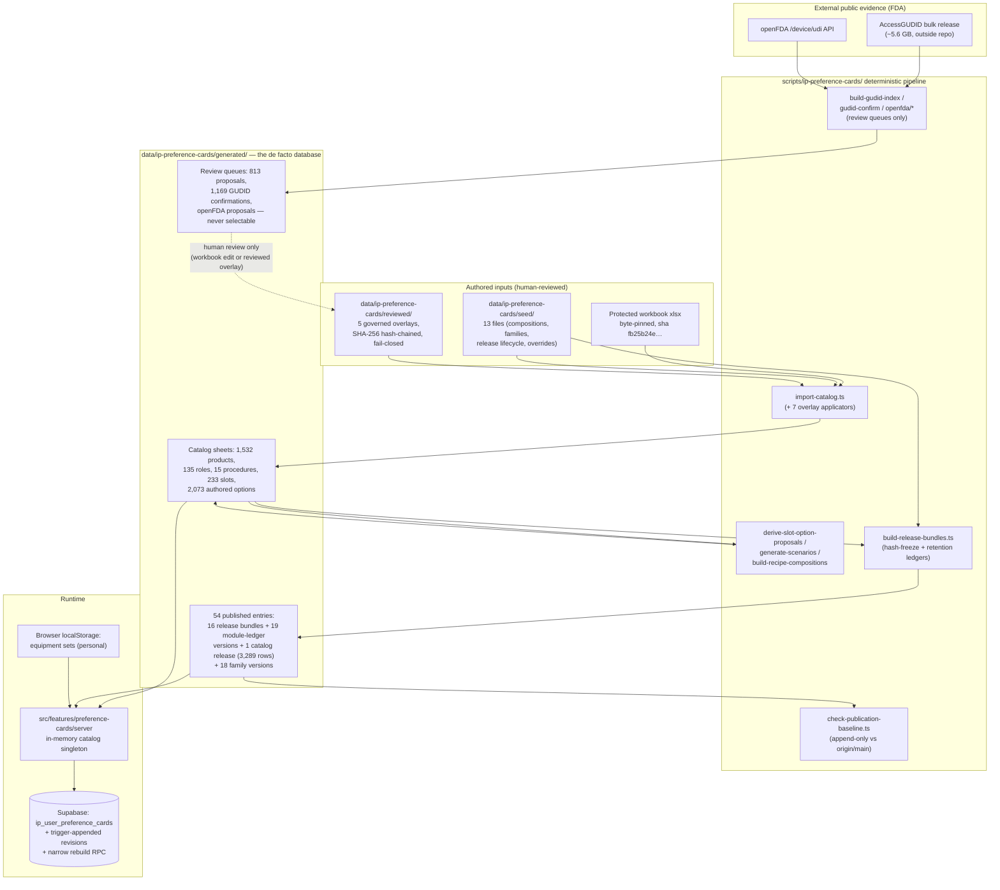

# Data and Relationship Audit — Device and Procedure Intelligence Platform (Phase D0, §2)

Phase D0 discovery document (2026-08-08) — describes current repository state and proposals. Physician-owner decisions D-01–D-10 were recorded 2026-08-08 in [decision-log.md](./decision-log.md) (D-03 and D-07 accepted with modification, D-10 with bounded scope); no production feature exists yet.

This is the entity/relationship evidence inventory behind [product-vision.md](./product-vision.md), [relationship-taxonomy.md](./relationship-taxonomy.md), [information-architecture.md](./information-architecture.md), [vertical-slice-spec.md](./vertical-slice-spec.md), and [data-readiness-report.md](./data-readiness-report.md). Every count and enum below was verified against the repository at branch `claude/device-intelligence-discovery` (`561460a1` == `origin/main`, clean tree). Nothing in this document asserts that any two products are clinically equivalent or substitutable; where the data itself makes a clinical claim, that is called out explicitly.

## 1. The current data graph

The system is a one-directional pipeline: authored inputs (a byte-pinned Excel workbook, a `seed/` layer, and five hash-chained `reviewed/` overlays) flow through deterministic scripts into `data/ip-preference-cards/generated/**` — the app's de facto database — which the server layer reads statically. Per-user state lives in Supabase; personal equipment sets live in browser localStorage. External FDA evidence (AccessGUDID, openFDA) only ever produces review queues; it never mutates the catalog.

**The trust ladder is encoded in the data, not in prose.** The proposal artifact `data/ip-preference-cards/generated/slot-product-option-proposals.json` carries a literal `semantics` block (verified): `product_roles` = `broad_catalog_discovery` (1,622 links), `slot_product_options` = `curated_exact_slot_defaults` (2,073 rows; 942 selectable+visible; only 28 arrived through the formal external clinician review round), `proposal_rows` = `unreviewed_not_selectable` (813 rows, each with reason text disclaiming compatibility, local approval, and clinical suitability). Graduation from a lower rung to a higher one happens only through the workbook or a reason-carrying reviewed overlay — never through code inference.

## 2. Identifier conventions

| Convention                        | Format                                       | Example                                                                                              | Notes                                                                                                                                                                                          |
| --------------------------------- | -------------------------------------------- | ---------------------------------------------------------------------------------------------------- | ---------------------------------------------------------------------------------------------------------------------------------------------------------------------------------------------- |
| Product                           | `PRD-` + 10 uppercase hex                    | `PRD-00C13A59AA`                                                                                     | Minted via `stableId(prefix, naturalKey)` (SHA-1-derived, rerun-stable)                                                                                                                        |
| Manufacturer                      | `MFR-` + 10 hex                              | `MFR-27E7CF849C`                                                                                     | Runtime alias grouping is code, not data                                                                                                                                                       |
| Slot                              | `SLOT-` + 10 hex                             | `SLOT-0037091804`                                                                                    | = SHA-1 of natural key `<PROC>\|<Section>\|<display_order>\|<ROLE>`, first 10 hex (`scripts/ip-preference-cards/catalog-utils.ts`)                                                             |
| Compatibility rule                | `CMP-` + 10 hex                              | `CMP-58DE7D49C4`                                                                                     |                                                                                                                                                                                                |
| Formulary row                     | `FORM-` + 10 hex                             | (scaffold only)                                                                                      |                                                                                                                                                                                                |
| Source                            | `SRC` + 3 digits                             | `SRC001`, `SRC046` (AccessGUDID)                                                                     |                                                                                                                                                                                                |
| Procedure / role / modifier codes | SCREAMING_SNAKE                              | `EBUS_TBNA`, `AIRWAY_BALLOON_DILATOR`, `HIGH_BLEED_RISK`                                             | 8 permanent role-code aliases (see §3.5)                                                                                                                                                       |
| Scenario                          | kebab-case                                   | `ebus-rose-molecular`                                                                                | Three golden ids pinned in `seed/scenario-overrides.json`                                                                                                                                      |
| Release bundle                    | `release-<proc>-v<maj>-<min>`                | `release-ebus-tbna-v1-0`                                                                             |                                                                                                                                                                                                |
| Module version                    | `module-<code>-v<maj>-<min>`                 | `module-ebus-tbna-specific-v1-0`                                                                     |                                                                                                                                                                                                |
| Recipe version                    | `recipe-<code>-v<maj>-<min>`                 | `recipe-ebus-tbna-v0-1`                                                                              | Authored, never derived                                                                                                                                                                        |
| Family version                    | `family-<kebab>-v<maj>-<min>`                | `family-boston-scientific-ultraflex-airway-stent-sems-covered-v1-0`                                  | Family code is `MANUFACTURER_BRAND__ROLE_CODE`                                                                                                                                                 |
| Requirement key                   | reviewed string                              | `FLEX_BRONCH_VIDEO_PROCESSOR`                                                                        | The ONLY cross-release semantic join; never derived from label or role code                                                                                                                    |
| Content hashes                    | 64-hex SHA-256 with in-band version envelope | `8ece7648…` (catalog release)                                                                        | Version strings: `ip-cards-release/1`, `ip-cards-catalog-retention/1`, `ip-cards-card-hash/1`, `ip-cards-rebuild-plan/1`, `ip-cards-product-family/1`, contract `ip-cards-resolver-contract/1` |
| Hospital item namespaces          | prefix `:` id                                | `catalog:PRD-…`, `set:<id>`, `custom:<id>`, `family-version:<id>`, `family-version-role:<role>:<id>` | Legacy `family:`/`family-role:` forms are read-only, never written again                                                                                                                       |
| Saved card                        | Postgres uuid + `share_token`                | —                                                                                                    | `ip_user_preference_cards`                                                                                                                                                                     |

## 3. Entity inventory

Each entity below uses the same nine-aspect table. "Governance states" quotes exact enum values from the repository. "Expose publicly?" is this audit's assessment for the owner's decision, not a decided policy.

### 3.1 Manufacturer

| Aspect                    | Evidence                                                                                                                                                                                                                                                                                                                                                                                                                                                                                                                                                                                                                                                              |
| ------------------------- | --------------------------------------------------------------------------------------------------------------------------------------------------------------------------------------------------------------------------------------------------------------------------------------------------------------------------------------------------------------------------------------------------------------------------------------------------------------------------------------------------------------------------------------------------------------------------------------------------------------------------------------------------------------------- |
| Identifier                | `MFR-` + 10 hex, e.g. `MFR-27E7CF849C`                                                                                                                                                                                                                                                                                                                                                                                                                                                                                                                                                                                                                                |
| Source of truth           | Workbook `Manufacturers` sheet (28 rows) + `data/ip-preference-cards/seed/catalog-additions.json` (25, of which 5 share deterministic manufacturer ids with workbook rows and are skipped on merge — `apply-catalog-additions.ts` keeps existing `manufacturer_id`s) → `generated/manufacturers.json` (48 deduplicated records) via `scripts/ip-preference-cards/import-catalog.ts`. Runtime display grouping is code: `src/features/preference-cards/server/manufacturer-aliases.ts` (exactly one alias group today — Thoracent / M.I.Tech, `MFR-CC1ABBE64F` + `MFR-FEE2053E6E`; the Micro-Tech pair is explicitly left unmerged pending catalog-owner confirmation) |
| Versioning                | None per record; file regenerated per import and byte-pinned by `scripts/ip-preference-cards/protected-artifacts.test.ts`                                                                                                                                                                                                                                                                                                                                                                                                                                                                                                                                             |
| Governance states         | None formal on the record; the refusal to merge unconfirmed aliases is a code-level governance stance                                                                                                                                                                                                                                                                                                                                                                                                                                                                                                                                                                 |
| Public vs institutional   | Public/global                                                                                                                                                                                                                                                                                                                                                                                                                                                                                                                                                                                                                                                         |
| Historical reconstruction | Manufacturer names are retained as-recorded (not alias-grouped) in the content-addressed catalog rows                                                                                                                                                                                                                                                                                                                                                                                                                                                                                                                                                                 |
| Expose publicly?          | Yes — vendor naming only                                                                                                                                                                                                                                                                                                                                                                                                                                                                                                                                                                                                                                              |
| Clinical claim?           | No                                                                                                                                                                                                                                                                                                                                                                                                                                                                                                                                                                                                                                                                    |
| Limitations               | Manufacturer-entity fragmentation and manufacturer-vs-US-distributor modeling (Scivita vs Boston Scientific) are named deferred milestones in the remediation ledger (`reviewed/external-review-remediation.json`)                                                                                                                                                                                                                                                                                                                                                                                                                                                    |

### 3.2 Product

| Aspect                    | Evidence                                                                                                                                                                                                                                                                                                                                                                                                                                                                                                                                                                                                                                                                                                                                                                                                                 |
| ------------------------- | ------------------------------------------------------------------------------------------------------------------------------------------------------------------------------------------------------------------------------------------------------------------------------------------------------------------------------------------------------------------------------------------------------------------------------------------------------------------------------------------------------------------------------------------------------------------------------------------------------------------------------------------------------------------------------------------------------------------------------------------------------------------------------------------------------------------------ |
| Identifier                | `PRD-` + 10 hex, e.g. `PRD-00C13A59AA`                                                                                                                                                                                                                                                                                                                                                                                                                                                                                                                                                                                                                                                                                                                                                                                   |
| Source of truth           | Workbook `Products` sheet (1,221 rows) + `seed/catalog-additions.json` (311 products) + overlays, in a fixed applicator order inside `import-catalog.ts` → `generated/catalog-products.json` (1,532 records)                                                                                                                                                                                                                                                                                                                                                                                                                                                                                                                                                                                                             |
| Versioning                | No per-record versions; whole file byte-pinned; point-in-time state retained per catalog release in `generated/catalog-rows.json` (content-addressed)                                                                                                                                                                                                                                                                                                                                                                                                                                                                                                                                                                                                                                                                    |
| Governance states         | Six independent axes, deliberately never collapsed: `verification_grade` `verified_source` (1,331) / `candidate` (200) / `unknown` (1); `visibility_state` `prototype_visible` (753) / `hidden` (779); GUDID distribution `in_distribution` / `not_in_distribution` (103 products) / `conflicting`; reviewed `catalogLifecycleContext` `current_market` \| `legacy_active_installed_base` \| `historical_reference` \| `unknown`; `slottingScope` `standard` \| `installed_base` \| `catalog_only` \| `hospital_local` \| `not_applicable`; `regulatoryStatus` `us_cleared_510k` \| `us_approved_pma` \| `us_granted_de_novo` \| `breakthrough_designated_investigational` \| `breakthrough_designated_premarket_review` \| `not_us_authorized` \| `unknown` (absent decision = `unknown`, "never an implied clearance") |
| Public vs institutional   | Public/global product facts; no institution fields                                                                                                                                                                                                                                                                                                                                                                                                                                                                                                                                                                                                                                                                                                                                                                       |
| Historical reconstruction | Yes — any retained `catalogReleaseId` re-materializes its exact product rows, hash-verified, with typed failures and no fallback to current data                                                                                                                                                                                                                                                                                                                                                                                                                                                                                                                                                                                                                                                                         |
| Expose publicly?          | `verified_source` + `prototype_visible` rows are designed for public display with citations — adopted 2026-08-08 as the initial public-indexable cohort criteria (D-07 as modified; indexing itself awaits the separate D-03 launch decision); `hidden` exists precisely as the exposure control                                                                                                                                                                                                                                                                                                                                                                                                                                                                                                                         |
| Clinical claim?           | Yes — `compatibility_text` and category/subcategory classification embed device-use claims                                                                                                                                                                                                                                                                                                                                                                                                                                                                                                                                                                                                                                                                                                                               |
| Limitations               | Stale doc comment in `src/features/preference-cards/server/catalog.ts` still says "the 1,221-product array"; the remediation ledger defers a cohort of attribute-poor variant rows to a future enrichment milestone; `slottingScope` `not_applicable` (breakthrough cohort) is discoverable on the emerging view but hard-refused at save time (`product_not_slottable`)                                                                                                                                                                                                                                                                                                                                                                                                                                                 |

### 3.3 Product variant / configuration

| Aspect                    | Evidence                                                                                                                                                                                                                                                                                                                                                                          |
| ------------------------- | --------------------------------------------------------------------------------------------------------------------------------------------------------------------------------------------------------------------------------------------------------------------------------------------------------------------------------------------------------------------------------- |
| Identifier                | No first-class variant entity exists. Each size/configuration is its own `PRD-` row with its own `catalog_number`/`gtin`                                                                                                                                                                                                                                                          |
| Source of truth           | Spec columns on `catalog-products.json` rows (`diameter_mm`, `french_size`, `working_length_cm`, `min_working_channel_mm`, `delivery_system_od_mm`, `spec_json`); configuration-family behavior comes only from reviewed family versions plus `allowsSizeAtProcedure` in `src/features/preference-cards/domain/size-at-procedure.ts` (regex `/^AIRWAY_STENT_(?!SIZING_DEVICE$)/`) |
| Versioning                | Follows the product row (none per record; retained per catalog release)                                                                                                                                                                                                                                                                                                           |
| Governance states         | Inherits the product's six axes; a `FamilyPick` surfaces the least-confirmed variant's `verificationTier` for the whole line                                                                                                                                                                                                                                                      |
| Public vs institutional   | Public/global                                                                                                                                                                                                                                                                                                                                                                     |
| Historical reconstruction | Via retained catalog rows; a family pick pins `productFamilyVersionId` + `catalogReleaseId` + `definitionHash` and re-verifies on every reconstruction                                                                                                                                                                                                                            |
| Expose publicly?          | Same posture as products; spec ranges (`specRanges` over 7 spec keys) are factual and citable                                                                                                                                                                                                                                                                                     |
| Clinical claim?           | "Size at time of procedure" is a clinical technique statement (documented in `domain/family-pick.ts`)                                                                                                                                                                                                                                                                             |
| Limitations               | Two documented grouping defects motivate the reviewed-family system: BD Safe-T-Centesis trays split across discovery families, and Argyle chest tubes (16–40 Fr plus a right-angle 28 Fr) over-merged with no `french_size` recorded (`domain/product-family.ts`)                                                                                                                 |

### 3.4 Product source / evidence

| Aspect                    | Evidence                                                                                                                                                                                                                                        |
| ------------------------- | ----------------------------------------------------------------------------------------------------------------------------------------------------------------------------------------------------------------------------------------------- |
| Identifier                | `SRC` + 3 digits (e.g. `SRC001`; `SRC046` = FDA AccessGUDID); links are composite (`product_id`, `source_id`)                                                                                                                                   |
| Source of truth           | Workbook `Sources` (46) / `Product_Sources` (1,366) sheets + additions → `generated/sources.json` (71) and `generated/product-sources.json` (1,850 links). Products also carry `primary_source_id` / `primary_source_location` / `source_as_of` |
| Versioning                | `revision_date` per source; files byte-pinned                                                                                                                                                                                                   |
| Governance states         | Per source: `reliability_tier` (e.g. `Tier 1 - manufacturer`) and a `use_policy` that gates dropdown eligibility; per link: `claim_type` (e.g. `Exact catalog entry`) and `verification_status`                                                 |
| Public vs institutional   | Public — it is the citation layer                                                                                                                                                                                                               |
| Historical reconstruction | Source provenance fields are retained inside content-addressed catalog rows                                                                                                                                                                     |
| Expose publicly?          | Yes — public display of product facts depends on exactly this layer                                                                                                                                                                             |
| Clinical claim?           | The binding itself is a factual sourcing claim ("this spec traces to page N of document X")                                                                                                                                                     |
| Limitations               | The AccessGUDID use policy (cited in-code as SRC046) states a GUDID record is not by itself evidence of orderability; the pipeline honors this by emitting review queues only                                                                   |

### 3.5 Clinical role

| Aspect                    | Evidence                                                                                                                                                                                                                                                                        |
| ------------------------- | ------------------------------------------------------------------------------------------------------------------------------------------------------------------------------------------------------------------------------------------------------------------------------- |
| Identifier                | SCREAMING_SNAKE `role_code`, e.g. `AIRWAY_BALLOON_DILATOR`; 135 roles in `generated/roles.json`                                                                                                                                                                                 |
| Source of truth           | Workbook `Roles` sheet (98) + reviewed additions (19 in `reviewed/procedure-additions.json`, 13 + 5 more in the external-review overlays) canonicalized against the closed taxonomy in `src/features/preference-cards/domain/role-taxonomy.ts`                                  |
| Versioning                | Renames only via `ROLE_CODE_ALIASES` — 8 PERMANENT one-way aliases (e.g. `PLEUROSCOPE`→`THORACOSCOPE_SEMIRIGID`, `PDT_KIT`→`PERC_TRACH_KIT`) that can never be dropped because `ip_user_preference_cards.builder_inputs` and legacy family item ids embed raw role-code strings |
| Governance states         | Closed vocabulary, fail-closed: 19 reviewed category headings; 33 legacy headings mapped; an unmapped heading is a hard import failure. Per role: `requires_current_ifu` boolean                                                                                                |
| Public vs institutional   | Public/global browse vocabulary                                                                                                                                                                                                                                                 |
| Historical reconstruction | The role-taxonomy set is pinned per release bundle (`roleTaxonomyPin`); aliases resolve inbound only                                                                                                                                                                            |
| Expose publicly?          | Yes — the role taxonomy is public atlas content (accepted 2026-08-08 via D-03/D-07; during Phase D1 still public-unlisted and noindex)                                                                                                                                          |
| Clinical claim?           | Yes — `selection_guidance` is clinical selection advice; alias commentary embeds clinical judgments (e.g. medical thoracoscopy and pleuroscopy treated as one procedure)                                                                                                        |
| Limitations               | Six template roles have no catalogued product at all (PPE, suction, specimen handling, collateral-ventilation assessment, energy platform, WLL lavage fluid) — the stated reason custom free-text items exist                                                                   |

### 3.6 Product-to-role relationship

| Aspect                    | Evidence                                                                                                                                                                           |
| ------------------------- | ---------------------------------------------------------------------------------------------------------------------------------------------------------------------------------- |
| Identifier                | Composite (`product_id`, `role_code`) — enforced unique at import                                                                                                                  |
| Source of truth           | Workbook `Product_Roles` sheet (1,268) + additions → `generated/product-roles.json` (1,622 links)                                                                                  |
| Versioning                | None per record; retained per catalog release (one of the three files `catalogReleaseId` hashes)                                                                                   |
| Governance states         | `role_fit`: `Primary` (1,083) / `Exact` (428) / `Compatible` (111). Trust rung: `broad_catalog_discovery` — explicitly NOT an exact-slot endorsement                               |
| Public vs institutional   | Public/global                                                                                                                                                                      |
| Historical reconstruction | Yes — inside the content-addressed catalog release                                                                                                                                 |
| Expose publicly?          | Yes, when labeled as discovery-grade ("products that can serve this role"), never as slot defaults                                                                                 |
| Clinical claim?           | Yes — `role_fit` asserts a device can serve a clinical role                                                                                                                        |
| Limitations               | The completed external review demonstrated this table can be wrong at the row level (6 role-fit mutations, 2 cohort splits); it is the broadest, least-reviewed rung of the ladder |

### 3.7 Procedure

| Aspect                    | Evidence                                                                                                                                                                                                                                                                                                                        |
| ------------------------- | ------------------------------------------------------------------------------------------------------------------------------------------------------------------------------------------------------------------------------------------------------------------------------------------------------------------------------- |
| Identifier                | SCREAMING_SNAKE `procedure_code`, e.g. `EBUS_TBNA`, `THERAPEUTIC_BRONCH`, `CHEST_TUBE`; recipe layer `recipe-<kebab>-v0-1` (authored, never derived)                                                                                                                                                                            |
| Source of truth           | Workbook `Procedures` sheet (13) + `reviewed/procedure-additions.json` (adds `PHOTODYNAMIC_THERAPY`, `BRONCH_ABLATION`) → `generated/procedures.json` (15); composition authored in `seed/procedure-compositions.json` → `generated/procedure-compositions.json` via `scripts/ip-preference-cards/build-recipe-compositions.ts` |
| Versioning                | `template_version` 0.1–0.3; `RecipeVersion` pins exact module version ids (composition, never inheritance); `compositionActions` (7 action types, each with mandatory reason) are the only override channel; `allowedModifierCodes` is release-pinned authorization, not a UI hint                                              |
| Governance states         | ALL 15 procedures: status `Draft - clinician review required` (EBUS: `Draft - clinician/pathology review required`), `clinical_owner` null everywhere. `GovernanceState` enum: `draft` \| `in_review` \| `approved` \| `retired`                                                                                                |
| Public vs institutional   | Global authored clinical content                                                                                                                                                                                                                                                                                                |
| Historical reconstruction | Full — recipe version retained beside its replacement; release bundle pins recipe + module hashes                                                                                                                                                                                                                               |
| Expose publicly?          | Not until clinician review (confirmed 2026-08-08 by D-03/D-07 as modified — draft clinical-use content is never public); the draft status must travel with any preview under the existing DRAFT/prototype watermark convention                                                                                                  |
| Clinical claim?           | Yes — the template is a clinical statement of what a procedure needs; `requirementSequences` is documented in-code as "a clinical statement" of setup order                                                                                                                                                                     |
| Limitations               | A 16th release pointer, `CUSTOM_COMPOSITION`, exists only at the release layer with no `procedures.json` row; no clinical owner is assigned anywhere                                                                                                                                                                            |

### 3.8 Procedure requirement (slot)

| Aspect                    | Evidence                                                                                                                                                                                                                                                                   |
| ------------------------- | -------------------------------------------------------------------------------------------------------------------------------------------------------------------------------------------------------------------------------------------------------------------------- | --------- | --------------- | ------------------------------------------------------------------------------------------------------------------------------------------------------------------------------------------ |
| Identifier                | `slot_id` = `SLOT-` + first 10 hex of SHA-1 of natural key `<PROC>                                                                                                                                                                                                         | <Section> | <display_order> | <ROLE>`(e.g.`SLOT-0037091804`); semantic identity is `requirementKey`— assigned only by the reviewed mapping`seed/recipe-module-map.json`, "never derived from the label or the role code" |
| Source of truth           | Workbook `Procedure_Slots` (174) + reviewed additions (59) → `generated/procedure-slots.json` (233); `procedureSlotToRecipeSlot` (`domain/procedure-slot-row.ts`) is the single conversion point                                                                           |
| Versioning                | Slots live inside module versions; cross-module merge only on identical 14-field `clinicalFingerprint`, else a blocking `recipe_composition_conflict`; `sourceSlotAliases` preserve pre-composition ids                                                                    |
| Governance states         | `requiredness`: `required` \| `conditional` \| `optional` \| `backup` \| `emergency_only`; `openHoldStatus`: `open_or_set_up_now` \| `have_in_room` \| `hold_unopened` \| `emergency_pull` \| `do_not_substitute`; `selection_mode` `single` \| `multiple`; `allow_custom` |
| Public vs institutional   | Global                                                                                                                                                                                                                                                                     |
| Historical reconstruction | Via the module ledger (full frozen slot lists retained verbatim)                                                                                                                                                                                                           |
| Expose publicly?          | Same posture as procedures — draft-gated                                                                                                                                                                                                                                   |
| Clinical claim?           | Yes — `generic_requirement` prose and `dependency_rule` are per-slot clinical requirement statements, deliberately bundled with requiredness as "one clinical statement" (`domain/schemas.ts`)                                                                             |
| Limitations               | Slot ids churn on republish; `requirementKey` is the only stable join, and ambiguous keys (two slot ids claiming one key) block a card rebuild outright                                                                                                                    |

### 3.9 Setup phase (setup zone / procedural phase / section)

| Aspect                    | Evidence                                                                                                                                                                                                                                                                                                                                                                                                                                      |
| ------------------------- | --------------------------------------------------------------------------------------------------------------------------------------------------------------------------------------------------------------------------------------------------------------------------------------------------------------------------------------------------------------------------------------------------------------------------------------------- |
| Identifier                | Section = the workbook's own 41 section-name strings; zones/phases are closed enums                                                                                                                                                                                                                                                                                                                                                           |
| Source of truth           | `seed/section-zone-phase-map.json` maps sections → `setup_zone` + `procedural_phase`, consumed by `build-recipe-compositions.ts`                                                                                                                                                                                                                                                                                                              |
| Versioning                | None (no formatVersion field); per-entry `needs_review` flag                                                                                                                                                                                                                                                                                                                                                                                  |
| Governance states         | `setupZone` (9): `room_capital_equipment`, `equipment_tower`, `back_table`, `mayo_stand`, `sterile_field`, `specimen_station`, `emergency_cart`, `other`, `unassigned`; `proceduralPhase` (9): `pre_room`, `pre_induction_or_sedation`, `airway_access`, `diagnostic`, `therapeutic`, `specimen_handling`, `rescue_or_contingency`, `post_procedure`, `unassigned`. An unmapped section forces both to `unassigned` and appends a review note |
| Public vs institutional   | Global                                                                                                                                                                                                                                                                                                                                                                                                                                        |
| Historical reconstruction | Zone/phase land on module slots, hence in the module ledger                                                                                                                                                                                                                                                                                                                                                                                   |
| Expose publicly?          | Yes as vocabulary; assignments inherit the procedure's draft gate                                                                                                                                                                                                                                                                                                                                                                             |
| Clinical claim?           | Mild — where equipment sits and in which phase it is used                                                                                                                                                                                                                                                                                                                                                                                     |
| Limitations               | `Accessories` is still `unassigned`/`unassigned` with `needs_review: true` — an explicit open review item                                                                                                                                                                                                                                                                                                                                     |

### 3.10 Module (recipe module)

| Aspect                    | Evidence                                                                                                                                                                                                                                                                                                                                                               |
| ------------------------- | ---------------------------------------------------------------------------------------------------------------------------------------------------------------------------------------------------------------------------------------------------------------------------------------------------------------------------------------------------------------------- |
| Identifier                | `moduleVersionId` `module-<kebab>-v<maj>-<min>`, e.g. `module-ebus-tbna-specific-v1-0`                                                                                                                                                                                                                                                                                 |
| Source of truth           | `seed/recipe-module-map.json` (membership is explicit only: "Matching role codes, similar labels, and clinical resemblance never create membership on their own") → `generated/recipe-modules.json` (19 modules: 3 `core` — `FLEX_BRONCH_CORE`, `THERAPEUTIC_BRONCH_CORE`, `PLEURAL_PROCEDURE_CORE`; 1 `optional` — `PROCEDURAL_FLUOROSCOPY`; 15 `procedure_specific`) |
| Versioning                | Published module versions are immutable; `generated/module-ledger.json` (19 entries) retains each pinned version verbatim with `definitionHash` + `firstPublishedByReleaseBundleId`; four blocking validation codes (`module_ledger_entry_mutated`, `module_ledger_diverged_from_live`, `module_ledger_duplicate_entry`, `module_ledger_entry_missing`)                |
| Governance states         | `governanceState` `draft` \| `in_review` \| `approved` \| `retired` — all 19 currently `draft`; `clinicalOwner`/`operationalOwner` null everywhere; a `retired` module in a composition raises blocking `retired_module_selected`                                                                                                                                      |
| Public vs institutional   | Global                                                                                                                                                                                                                                                                                                                                                                 |
| Historical reconstruction | The ledger is the mechanism — re-deriving an old version from current mappings is explicitly rejected in-code                                                                                                                                                                                                                                                          |
| Expose publicly?          | Structure yes; the cross-procedure equivalence reasons are draft, unowned clinical claims                                                                                                                                                                                                                                                                              |
| Clinical claim?           | Yes — each shared-requirement `reason` asserts cross-procedure equivalence of equipment needs                                                                                                                                                                                                                                                                          |
| Limitations               | `recipe-composition-report.json` records 8 procedures deliberately NOT mapped onto shared cores pending clinician review                                                                                                                                                                                                                                               |

### 3.11 Modifier

| Aspect                    | Evidence                                                                                                                                                                                                                                                                                                                                                                                                                                              |
| ------------------------- | ----------------------------------------------------------------------------------------------------------------------------------------------------------------------------------------------------------------------------------------------------------------------------------------------------------------------------------------------------------------------------------------------------------------------------------------------------- |
| Identifier                | SCREAMING_SNAKE `modifier_code`, e.g. `ROSE`, `HIGH_BLEED_RISK`, `TECH_CHEST_TUBE_SMALL_BORE`                                                                                                                                                                                                                                                                                                                                                         |
| Source of truth           | Workbook `Modifier_Catalog` (30 rows → `generated/modifier-catalog.json`) compiled to `generated/modifier-definitions.json` (20 definitions) by `generate-scenarios.ts`; 12 hand-tuned modifiers with real actions live in `src/features/preference-cards/seed/operational.ts` — the workbook-derived rest ship `actions: []`, `informational: true` on purpose (the workbook records effects as prose; synthesizing actions "would invent slot ids") |
| Versioning                | Modifier SET pinned per release bundle (`modifierSetPin`)                                                                                                                                                                                                                                                                                                                                                                                             |
| Governance states         | `releaseState` `mvp` \| `phase_1_1` \| `phase_2` (rollout axis, distinct from governance); `active` flag; `groupCode` `location` \| `anesthesia_airway` \| `imaging_navigation` \| `sampling` \| `therapeutic` \| `risk_rescue` \| `pleural`; `conflictsWith` mutual exclusions; 14 action types incl. `add_slot`, `replace_role`, `require_room_capability`, `add_rescue_module`                                                                     |
| Public vs institutional   | Global                                                                                                                                                                                                                                                                                                                                                                                                                                                |
| Historical reconstruction | Via the pinned set in each release bundle                                                                                                                                                                                                                                                                                                                                                                                                             |
| Expose publicly?          | Vocabulary yes; effects follow the procedure draft gate                                                                                                                                                                                                                                                                                                                                                                                               |
| Clinical claim?           | Yes — modifier actions change clinical setup (documented fix: `allowedModifierCodes` moved into `recipeDefinitionHash` because "hiding a control is not authorization")                                                                                                                                                                                                                                                                               |
| Limitations               | Only the 12 hand-tuned modifiers do anything; unknown/inactive modifier selection is a blocking `unknown_modifier`                                                                                                                                                                                                                                                                                                                                    |

### 3.12 Capability requirement (location capabilities / dependency rules)

| Aspect                    | Evidence                                                                                                                                                                                                                                                        |
| ------------------------- | --------------------------------------------------------------------------------------------------------------------------------------------------------------------------------------------------------------------------------------------------------------- |
| Identifier                | None standalone — capabilities are strings checked at resolution; dependency rules are free text on slots                                                                                                                                                       |
| Source of truth           | `BuildContext.locationCapabilities` (hospital-local, always current, never pinned — `HOSPITAL_LOCAL_CURRENT_CONTEXT_FIELDS` in `domain/release-bundle.ts`); the `require_room_capability` modifier action raises blocking `room_capability_missing` when absent |
| Versioning                | None — deliberately current-only                                                                                                                                                                                                                                |
| Governance states         | Resolution message severities only (`info` \| `warning` \| `blocking`)                                                                                                                                                                                          |
| Public vs institutional   | Institution-specific by design                                                                                                                                                                                                                                  |
| Historical reconstruction | Deliberately none — a reopened card shows reviewed requirements against today's room                                                                                                                                                                            |
| Expose publicly?          | No — describes what a specific location can do                                                                                                                                                                                                                  |
| Clinical claim?           | `dependencyRule` text is a clinical condition statement                                                                                                                                                                                                         |
| Limitations               | No capability registry or vocabulary exists; this is the thinnest entity in the graph and a gap for brief R3's deferred capability analyzer                                                                                                                     |

### 3.13 Compatibility relationship

| Aspect                    | Evidence                                                                                                                                                                                                                                                                                                                                                       |
| ------------------------- | -------------------------------------------------------------------------------------------------------------------------------------------------------------------------------------------------------------------------------------------------------------------------------------------------------------------------------------------------------------- |
| Identifier                | `rule_id` `CMP-` + 10 hex, e.g. `CMP-58DE7D49C4`                                                                                                                                                                                                                                                                                                               |
| Source of truth           | Workbook `Compatibility` sheet (179) + reviewed additions → `generated/compatibility-raw.json` (187 raw statements, free-text source/target); typed rules (`TypedCompatibilityRule` in `domain/types.ts`) evaluated by `domain/evaluate-compatibility.ts`; the typed rule SET is pinned per release bundle                                                     |
| Versioning                | Per-release set pin; raw rows carry per-rule `verification_status`/`verification_grade`                                                                                                                                                                                                                                                                        |
| Governance states         | Severity `info` \| `warning` \| `blocking`; operators `eq, neq, lt, lte, gt, gte, in, not_in, exists, requires`; per-item `compatibilityState` `pass` \| `fail` \| `unknown` \| `not_evaluated`; `evidenceSourceId` links a rule to a source; the completed review round added 7 rules at `verified_source` grade and the corrections overlay 1 at `candidate` |
| Public vs institutional   | Global                                                                                                                                                                                                                                                                                                                                                         |
| Historical reconstruction | Via the release bundle's `compatibilityRuleSetPin`                                                                                                                                                                                                                                                                                                             |
| Expose publicly?          | The verified subset with citations is candidate atlas content (pending decision); a missing attribute resolves `unknown` with warning `compatibility_unknown` — never a silent pass — which is the honest display posture                                                                                                                                      |
| Clinical claim?           | Yes, explicitly — each rule encodes a device-compatibility claim (e.g. tool OD vs scope working channel)                                                                                                                                                                                                                                                       |
| Limitations               | Most raw rows have null `resolved_source_type`/`resolved_source_id`; the verification-grade distribution across the 187 raw statements is per-rule and mixed                                                                                                                                                                                                   |

### 3.14 Contingency / rescue requirement

| Aspect                    | Evidence                                                                                                                                                                                            |
| ------------------------- | --------------------------------------------------------------------------------------------------------------------------------------------------------------------------------------------------- |
| Identifier                | Rescue module `code` (e.g. `MAJOR_AIRWAY_BLEEDING`, appended by `HIGH_BLEED_RISK` in the therapeutic-bronch golden scenario)                                                                        |
| Source of truth           | `RescueModule` in `domain/types.ts`; entered only via a modifier's `add_rescue_module` action (`domain/effective-slots.ts`); rescue-module SET pinned per release bundle                            |
| Versioning                | Per-release set pin; missing module at resolution is blocking `rescue_module_missing`                                                                                                               |
| Governance states         | Rescue slots carry the same slot enums; relevant values: requiredness `backup`/`emergency_only`, phase `rescue_or_contingency`, hold status `emergency_pull`                                        |
| Public vs institutional   | Global                                                                                                                                                                                              |
| Historical reconstruction | Via the release bundle pin                                                                                                                                                                          |
| Expose publicly?          | Follows the procedure draft gate                                                                                                                                                                    |
| Clinical claim?           | Yes — a rescue module asserts what must be available if a complication occurs                                                                                                                       |
| Limitations               | Contingency also appears as ordinary conditional slots (e.g. `CHEST_TUBE_SMALL_BORE` as a Rescue-section slot `SLOT-26B0E004DD` in `BRONCH_ABLATION`) — two mechanisms express one clinical concept |

### 3.15 Manufacturer family (brand family)

| Aspect                    | Evidence                                                                                                                                                                            |
| ------------------------- | ----------------------------------------------------------------------------------------------------------------------------------------------------------------------------------- |
| Identifier                | `brand_family` free-text string on product rows; no id                                                                                                                              |
| Source of truth           | Workbook-authored per product; fallback chain for display is `brand_family` → `subcategory` → `product_name` (`server/catalog-store.ts`)                                            |
| Versioning                | None — mutable label                                                                                                                                                                |
| Governance states         | None                                                                                                                                                                                |
| Public vs institutional   | Public marketing vocabulary                                                                                                                                                         |
| Historical reconstruction | Retained as a row column in catalog releases                                                                                                                                        |
| Expose publicly?          | Yes as a label; never as an equivalence assertion                                                                                                                                   |
| Clinical claim?           | No inherently — but grouping by it implies one, which is why it is concept #1 in [relationship-taxonomy.md](./relationship-taxonomy.md) and must not carry the other seven meanings |
| Limitations               | Documented over/under-merge defects (BD Safe-T-Centesis, Argyle) originate here                                                                                                     |

### 3.16 Discovery grouping

| Aspect                    | Evidence                                                                                                                               |
| ------------------------- | -------------------------------------------------------------------------------------------------------------------------------------- | ---------- | ------------------------------------------------------------------------------------------------------------------------------------------------- |
| Identifier                | `discoveryKey` = `manufacturerGroup                                                                                                    | familyName | productKind`— deliberately renamed from`familyKey` "so it cannot be passed where a persistable identity is required" (`domain/product-family.ts`) |
| Source of truth           | Recomputed from mutable labels on every request in the server catalog layer; never stored                                              |
| Versioning                | None by design — in-code verdict: "a terrible identity"                                                                                |
| Governance states         | None; `reviewedFamilyVersionId` (nullable) is the only bridge to something governed — null withholds the whole-line pick action        |
| Public vs institutional   | Public display-only                                                                                                                    |
| Historical reconstruction | Impossible and refused: legacy v3 cards that stored a `familyKey` are permanently view/print-only; no closest-match mapping is allowed |
| Expose publicly?          | As browse organization only, labeled as unverified grouping (evidence rung 7 in the brief's display model)                             |
| Clinical claim?           | None asserted, but visual grouping can be read as one — display must not let it                                                        |
| Limitations               | Over/under-merges inherited from brand-family strings; unpersistable by construction                                                   |

### 3.17 Reviewed product family

| Aspect                    | Evidence                                                                                                                                                                                                                                                                                                                                                                        |
| ------------------------- | ------------------------------------------------------------------------------------------------------------------------------------------------------------------------------------------------------------------------------------------------------------------------------------------------------------------------------------------------------------------------------- |
| Identifier                | `productFamilyVersionId` (e.g. `family-boston-scientific-ultraflex-airway-stent-sems-covered-v1-0`) + `productFamilyCode` (`MANUFACTURER_BRAND__ROLE_CODE`) + `definitionHash` (`ip-cards-product-family/1`)                                                                                                                                                                    |
| Source of truth           | `seed/product-families.json` (lifecycle + membership basis) → membership derived against the family's own pinned `catalogReleaseId` by `build-release-bundles.ts` → `generated/product-family-versions.json` (18 versions, all airway stents). Membership is an explicit sorted `memberProductIds` list — "Never a predicate, never a label match, never inferred at read time" |
| Versioning                | Immutable once published; corrections require a new version; splits require a NEW code (a `supersedes` chain must stay within one code); 10 blocking ledger validation codes incl. `product_family_definition_mutated`, `product_family_membership_diverged`                                                                                                                    |
| Governance states         | `draft` \| `approved` \| `retired` (no `in_review`); all 18 currently `draft`; `reviewBasis` prose is REQUIRED for approval; lifecycle fields sit deliberately outside the definition hash. Asymmetric resolution rule: a RETIRED family still resolves for pinned cards; a DRAFT one never resolves from a pin ("a save-time caller is untrusted")                             |
| Public vs institutional   | Global                                                                                                                                                                                                                                                                                                                                                                          |
| Historical reconstruction | Yes — the four-field pin (`productFamilyVersionId` + `catalogReleaseId` + `definitionHash` + `roleCode`) is verified on every reopen; validation checks members against the family's own catalog release, not the current one                                                                                                                                                   |
| Expose publicly?          | Identity and membership facts are public catalog data; the within-line interchangeability implication must NOT be exposed as reviewed — every `reviewBasis` states clinical membership review is PENDING                                                                                                                                                                        |
| Clinical claim?           | Yes, explicitly flagged as unreviewed: membership implies "which products a physician is asking the room for"                                                                                                                                                                                                                                                                   |
| Limitations               | Draft family versions ARE included in the publication baseline (locked on merge, unlike draft releases) — a deliberate asymmetry so a pending review's subject cannot be edited underneath it; brief R7 keeps this entity's meaning as-is                                                                                                                                       |

### 3.18 Equipment set

| Aspect                    | Evidence                                                                                                                                                       |
| ------------------------- | -------------------------------------------------------------------------------------------------------------------------------------------------------------- |
| Identifier                | `set:<setId>`; members keyed `<productId>:<roleCode>`                                                                                                          |
| Source of truth           | Browser localStorage only, key `ip-preference-cards:equipment-sets:v1` (verified in `domain/equipment-set.ts`), `{version: 1, sets}`, max 50 sets × 60 members |
| Versioning                | `StoredEquipmentSets.version` = 1; role codes canonicalized through the permanent aliases on read because sets "long outlive a role rename"                    |
| Governance states         | Derived: a set is `unverified` if ANY member is unverified or US-status-pending, else `prototype_visible` ("only as confirmed as its least-confirmed part")    |
| Public vs institutional   | Personal (physician-owned, client-side); scope literal `personal` when no hospital context exists                                                              |
| Historical reconstruction | At card-save time only: members re-checked row by row against the pinned catalog release; a missing member drops the whole set atomically on rebuild           |
| Expose publicly?          | No — personal data, and outside every server governance wall                                                                                                   |
| Clinical claim?           | Implicit — a set asserts these products together cover the listed roles (`additionalCoveredRoles` included)                                                    |
| Limitations               | No server persistence, no sharing, no institution linkage — cited in the brief as a reason R3's institutional pillar is deferred                               |

### 3.19 Local formulary item

| Aspect                    | Evidence                                                                                                                                                                                                                                                                                                                                                                                                                                                                                        |
| ------------------------- | ----------------------------------------------------------------------------------------------------------------------------------------------------------------------------------------------------------------------------------------------------------------------------------------------------------------------------------------------------------------------------------------------------------------------------------------------------------------------------------------------- |
| Identifier                | Hospital item id, namespaced by origin (seeded id, `catalog:`, `family-version:`, `set:`, `custom:`); role options join `roleCode` → `hospitalItemId`                                                                                                                                                                                                                                                                                                                                           |
| Source of truth           | `HospitalItem` + `HospitalRoleOption` in `domain/types.ts`; TODAY populated only by the demo layer — 31 reviewed stand-ins in `seed/demo-stand-ins.json` (1:1 validated against `src/features/preference-cards/seed/operational.ts` by `validate-seed.ts`) inside a fictional "Demo IP Program" profile                                                                                                                                                                                         |
| Versioning                | None — hospital-local state is deliberately current-only, never pinned (`HISTORICAL_CATALOG_EXCLUDED_HOSPITAL_LOCAL_FIELDS`)                                                                                                                                                                                                                                                                                                                                                                    |
| Governance states         | `verificationState`: `locally_approved` \| `prototype_visible` \| `demo_only` \| `unverified` \| `hidden` (resolver mapping: `hidden` → blocking `hidden_product_selected`; `unverified` → resolved + info badge; `demo_only`/`prototype_visible` → warnings); `substitutionClass`: `preferred` \| `acceptable` \| `shortage_substitute` \| `backup` \| `emergency_only` \| `no_substitute`; `preferenceRank` ordering; `itemType` has 11 values incl. `procedure_kit` (drives kit suppression) |
| Public vs institutional   | Institution-specific by design (org/site/location scoped)                                                                                                                                                                                                                                                                                                                                                                                                                                       |
| Historical reconstruction | Deliberately none                                                                                                                                                                                                                                                                                                                                                                                                                                                                               |
| Expose publicly?          | No — would encode a specific institution's stock, storage locations, and ranked preferences                                                                                                                                                                                                                                                                                                                                                                                                     |
| Clinical claim?           | Ranking and substitution class are local clinical-operational judgments                                                                                                                                                                                                                                                                                                                                                                                                                         |
| Limitations               | No real institution entity exists anywhere in the repository; everything present is demo-labeled                                                                                                                                                                                                                                                                                                                                                                                                |

### 3.20 Local inventory / availability

| Aspect                    | Evidence                                                                                                                                                                                                                                                  |
| ------------------------- | --------------------------------------------------------------------------------------------------------------------------------------------------------------------------------------------------------------------------------------------------------- |
| Identifier                | `formulary_id` `FORM-` + 10 hex                                                                                                                                                                                                                           |
| Source of truth           | Workbook `Hospital_Formulary` sheet → `generated/hospital-formulary-staging.json` (1,221 rows, byte-pinned staging evidence)                                                                                                                              |
| Versioning                | None; byte-protection between milestones                                                                                                                                                                                                                  |
| Governance states         | Fields exist (`hospital_carries`, `preferred`, `local_item_number`, `local_uom`, `storage_location`, `par_level`, `last_reviewed`) but in the current file `hospital_carries`/`preferred` are all false and every local field is null — an EMPTY scaffold |
| Public vs institutional   | Institution-specific by design; currently contains no institutional data                                                                                                                                                                                  |
| Historical reconstruction | n/a (empty)                                                                                                                                                                                                                                               |
| Expose publicly?          | The schema is safe to describe; populated data would be institution-private                                                                                                                                                                               |
| Clinical claim?           | Would carry local availability claims once populated                                                                                                                                                                                                      |
| Limitations               | This emptiness, plus localStorage equipment sets and the absent institution entity, is the verified basis for deferring brief R3                                                                                                                          |

### 3.21 Saved selection (builder inputs / picks)

| Aspect                    | Evidence                                                                                                                                                                                                                                                                                                        |
| ------------------------- | --------------------------------------------------------------------------------------------------------------------------------------------------------------------------------------------------------------------------------------------------------------------------------------------------------------- |
| Identifier                | No own id; keyed by card. Pick namespaces: `catalog:<productId>`, `family-version:<id>` / `family-version-role:<role>:<id>`, `custom:<id>`, `set:<setId>`; legacy `family:`/`family-role:` forms parse but are never written and cannot map to a reviewed family                                                |
| Source of truth           | `ip_user_preference_cards.builder_inputs` (identifiers only: `schemaVersion`, `releaseBundleId`, `scenarioId`, `input`, `catalogPicks`, `familyPicks`, `customItems`, `equipmentSets`); the server re-derives everything at save time — "the client's own resolution is never trusted" (`server/user-cards.ts`) |
| Versioning                | `schemaVersion` preserved on re-save, never silently upgraded; version-2 (pre-release-pin) and version-3 (discovery-key) inputs are permanently view/print/share/duplicate-only                                                                                                                                 |
| Governance states         | `selectionsAreExplicit` flips absent-key semantics from "use current formulary rank" to "not chosen"; explicit `null` means "deliberately nothing"; `conditionalStates` `include` \| `exclude` \| `undecided`; waivers require a 10–500-char reason each                                                        |
| Public vs institutional   | Per-user (personal + institutional context ids)                                                                                                                                                                                                                                                                 |
| Historical reconstruction | Yes — `rebuildBuilderContext` is the single reconstruction path shared by reopen, save, reconciliation, and rebuild planning, resolving product identity from the PINNED catalog release with typed failures and no fallback                                                                                    |
| Expose publicly?          | No — user-owned                                                                                                                                                                                                                                                                                                 |
| Clinical claim?           | Selections are the physician's clinical choices                                                                                                                                                                                                                                                                 |
| Limitations               | Ten typed reconstruction error codes (e.g. `legacy_family_identity`, `historical_catalog_unavailable`) degrade a card to view-only rather than guessing                                                                                                                                                         |

### 3.22 Card (resolved preference card)

| Aspect                    | Evidence                                                                                                                                                                                                                                                                                                                                                                                   |
| ------------------------- | ------------------------------------------------------------------------------------------------------------------------------------------------------------------------------------------------------------------------------------------------------------------------------------------------------------------------------------------------------------------------------------------ |
| Identifier                | Card row uuid + THREE content hashes with distinct jobs: `snapshotHash` (storage identity; excludes `generatedAt` and waiver acknowledgments), `snapshotIntegrityHash` (tamper detection over the complete snapshot), `resolvedContentHash` (semantic projection); `CARD_HASH_VERSION` = `ip-cards-card-hash/1`; engine `ip-cards-resolver/0.3.0`, contract `ip-cards-resolver-contract/1` |
| Source of truth           | Produced only by `resolveCard` (`domain/resolve-card.ts`); persisted as immutable `card_snapshot` in Supabase `ip_user_preference_cards` under RLS; share access via security-definer RPC `ip_get_shared_preference_card` (still requires sign-in)                                                                                                                                         |
| Versioning                | Snapshot immutable; every write trigger-appends a revision (§3.24); resolution order is fixed and fully traced (13 trace-event kinds, trace inside the hash)                                                                                                                                                                                                                               |
| Governance states         | `readinessState` `blocked` \| `complete_with_warnings` \| `complete`; `governanceState` folded to the weakest of recipe + included modules (`retired` < `draft` < `in_review` < `approved`); `prototype` flag true unless approved AND no demo/prototype items; per-item `resolutionState` (7 values incl. `suppressed_by_kit`, `waived`)                                                  |
| Public vs institutional   | Mixes global catalog identity with institutional scope and personal choices                                                                                                                                                                                                                                                                                                                |
| Historical reconstruction | Yes while the resolver contract holds and the pinned release's modules remain in the ledger; snapshots failing their own hash on read return `snapshot_unverifiable` rather than rendering                                                                                                                                                                                                 |
| Expose publicly?          | No — institution- and user-scoped clinical content                                                                                                                                                                                                                                                                                                                                         |
| Clinical claim?           | Yes — the card as a whole asserts "this equipment list is what this procedure needs", watermarked as prototype while governance is draft                                                                                                                                                                                                                                                   |
| Limitations               | `catalogImportId` on a card is the source-workbook digest, NOT the catalog-release digest a bundle pins — an in-code documented field-name trap                                                                                                                                                                                                                                            |

### 3.23 Release (bundle / pointer / ledger / retained catalog)

| Aspect                    | Evidence                                                                                                                                                                                                                                                                                                                                                                                                                           |
| ------------------------- | ---------------------------------------------------------------------------------------------------------------------------------------------------------------------------------------------------------------------------------------------------------------------------------------------------------------------------------------------------------------------------------------------------------------------------------- |
| Identifier                | Bundle `release-<proc>-v1-0`; pointer map keyed by procedure code; `catalogReleaseId` 64-hex (current `8ece7648…`); `definitionHash` per bundle (`ip-cards-release/1`)                                                                                                                                                                                                                                                             |
| Source of truth           | Lifecycle facts authored in `seed/release-bundles.json`; every pin COMPUTED by `build-release-bundles.ts` ("nobody hand-writes a pin") → `generated/release-bundles.json` (16 bundles + 16 pointers), `module-ledger.json` (19), `catalog-rows.json` (3,289 content-addressed rows) + `catalog-release-manifests.json` (1 retained release), `product-family-versions.json` (18), `release-impact-report.json` (16, all "initial") |
| Versioning                | `releaseState` `draft` → `published` → `retired`, forward-only; all 16 bundles `published` 2026-07-31, none superseding; a frozen release keeps its published hash — recomputation drift is a blocking build failure; "current" is ONLY the authored pointer (no latest-version or date sorting anywhere)                                                                                                                          |
| Governance states         | Two deliberately orthogonal axes: `releaseState` (frozen?) vs `governanceState` (clinically reviewed?) — all 16 published bundles are governance `draft`, an honest representable state                                                                                                                                                                                                                                            |
| Public vs institutional   | Global; the retained catalog rows exclude every hospital-local field by a test-asserted exclusion list                                                                                                                                                                                                                                                                                                                             |
| Historical reconstruction | This IS the reconstruction layer; every resolution path hash-verifies and degrades to view-only rather than substituting current content                                                                                                                                                                                                                                                                                           |
| Expose publicly?          | Yes — ids and hashes are content addresses of authored educational content; exposing that governance is `draft` is part of the safety story                                                                                                                                                                                                                                                                                        |
| Clinical claim?           | Indirect — a bundle freezes a set of clinical setup decisions, tracked as unreviewed                                                                                                                                                                                                                                                                                                                                               |
| Limitations               | The 54 published entries (16 + 19 + 1 + 18) are guarded append-only by `scripts/ip-preference-cards/check-publication-baseline.ts` (`npm run ip-cards:release:check-base`), but no CI workflow in this worktree invokes it (`.github/workflows/` holds only `worktree-scope.yml`); the bundles sit in the documented "pre-publication window" until merged to main                                                                 |

### 3.24 Provenance (card revisions, rebuild provenance, source bindings)

| Aspect                    | Evidence                                                                                                                                                                                                                                                                                                                                                                                                                                                                      |
| ------------------------- | ----------------------------------------------------------------------------------------------------------------------------------------------------------------------------------------------------------------------------------------------------------------------------------------------------------------------------------------------------------------------------------------------------------------------------------------------------------------------------- |
| Identifier                | Revision: (`card_id`, `revision_number`) in `ip_user_preference_card_revisions`; rebuild document version literal `ip-cards-rebuild/1`; import binding `workbook_sha256` `fb25b24e…`; review-round binding `normalizedCorrectionsSha256` `589bd148…` + completed-workbook sha `78b112ba…`                                                                                                                                                                                     |
| Source of truth           | Revisions: appended ONLY by a database trigger on card writes — no application writer exists (`server/card-revisions.ts`). Rebuild provenance: written once via the sole service-role RPC `ip_create_rebuilt_preference_card` (`server/rebuild-writer.server.ts`), which re-verifies the source revision inside the inserting statement; direct table inserts of provenance rows are trigger-refused even for service_role. Import provenance: `generated/import-report.json` |
| Versioning                | Revisions are append-only, ordered by `revision_number`; each carries all three card hashes plus a derived (never stored) `printDocumentHash`; `snapshot_integrity_hash` is null on pre-split rows ("a placeholder would be a claim")                                                                                                                                                                                                                                         |
| Governance states         | Rebuild provenance decisions use exactly three answer values — `confirmed` \| `dropped` \| `acknowledged_unresolved` — with no accept-all; the written card's delta must be a subset of per-answer measured contracts (`unauthorizedFinalState`); provenance reads are three-state: none / valid / invalid (invalid shown with an integrity notice, never silently downgraded)                                                                                                |
| Public vs institutional   | Per-user                                                                                                                                                                                                                                                                                                                                                                                                                                                                      |
| Historical reconstruction | Full — any retained revision loads, integrity-verifies, and (when its inputs still parse) re-derives a builder session; reconciliation and rebuild cite the exact reviewed revision id                                                                                                                                                                                                                                                                                        |
| Expose publicly?          | No — user clinical history                                                                                                                                                                                                                                                                                                                                                                                                                                                    |
| Clinical claim?           | The provenance makes "this card was reviewed" a checkable claim rather than an interface assertion                                                                                                                                                                                                                                                                                                                                                                            |
| Limitations               | An in-code comment in `server/rebuild-card.ts` states the provenance migration "has never been applied"; per the Phase D0 brief the migration IS applied remotely (remote version `20260807232643`) — the comment is stale relative to the deployed state and should be corrected when that file is next touched                                                                                                                                                              |

## 4. Source-of-truth chains

Five chains cover every byte in the system. In all five, data moves in one direction only, and the application never reads `seed/` or `reviewed/` directly.

1. **Catalog chain.** Byte-pinned workbook → `import-catalog.ts` applies overlays in a fixed, commented order (product overrides → role taxonomy → addition roles → catalog additions → procedure additions → external-review corrections → completed implementation → final closed-vocabulary assertion) → 13 generated sheet JSONs + `import-report.json` → in-memory catalog singleton (`server/catalog.ts`). Every overlay record carries a human `reason`; every overlay failure is a hard import error, never a silent skip.
2. **Procedure/recipe chain.** Generated slots + `seed/recipe-module-map.json` + `seed/procedure-compositions.json` → `build-recipe-compositions.ts` (every imported slot claimed exactly once; behavioral differences must be restored by explicit actions or the build fails as data loss) → `build-release-bundles.ts` (computes and freezes the pin closure; writes nothing on any blocking validation) → append-only ledgers → `check-publication-baseline.ts` against the `origin/main` merge base.
3. **Evidence chain.** AccessGUDID bulk release / openFDA API → `gudid-index.json` (15,229 rows) → `gudid-confirmations.json` (1,169) and `generated/openfda/**` (48 files, manifest-hash-frozen) → review queues only. Nothing auto-applies; graduation requires the workbook owner's hand or a reviewed overlay.
4. **Card chain.** Builder inputs (identifiers only) → `rebuildBuilderContext` (single shared reconstruction path) → `resolveCard` → immutable snapshot → Supabase row under RLS → trigger-appended revision. Release-pinned definitions are historical; hospital-local context is deliberately current.
5. **Review-round chain.** `external-review-corrections.json` → generated Excel workbook (admin-gated export, hash embedded in its metadata sheet) → clinician completes offline → import normalizer → `external-review-remediation-decisions.json` (97 decisions: 73 approve / 20 approve-with-modification / 4 reject) → `external-review-completed-implementation.json` (expect-state-guarded delta) → import. The chain is bound by SHA-256 at every hop; editing the corrections content after the round closed fails the import closed.

## 5. Cross-cutting observations

- **Publication ≠ clinical approval, everywhere.** All 16 bundles are `published` yet governance `draft`; all 15 procedures are draft with `clinical_owner` null; all 19 modules and 18 families are draft with owners null; all 1,221 verification-backlog decisions are `Pending`. Nothing in the system is clinically signed off, and the data model says so honestly rather than hiding it — any public surface must carry this forward (brief R5, pending decision).
- **Equivalence is structurally refused.** No entity records that two products are interchangeable: discovery groupings are unpersistable, reviewed families self-label their interchangeability implication as review-PENDING, the historical catalog refuses inferred lineage ("a replacement relationship guessed from names… is a clinical claim"), and the rebuild planner refuses substitution and fuzzy matching. The eight-concept split this motivates is in [relationship-taxonomy.md](./relationship-taxonomy.md).
- **The institutional layer is a designed absence.** Formulary scaffold empty, equipment sets client-side, demo stand-ins fictional and labeled, hospital-local fields test-excluded from retention. This is the verified evidence base for deferring the capability/gap pillar (brief R3) and for [user-jobs-and-personas.md](./user-jobs-and-personas.md) treating the institution as a future actor.
- **Identity conventions are load-bearing.** `requirementKey` is the only semantic join across releases; role-code aliases are permanent because saved rows embed raw strings; content hashes carry in-band version envelopes so semantic changes fail loudly. Any new platform surface must reuse these identifiers rather than minting parallel ones — see [information-architecture.md](./information-architecture.md) and [vertical-slice-spec.md](./vertical-slice-spec.md).

## 6. Claims register (verification notes)

Verified directly against the repository during this audit: all generated-artifact counts in §3 (record counts via `jq` over `data/ip-preference-cards/generated/**`), the governance splits (1,331/200/1 grades; 753/779 visibility; 942 selectable+visible; 28 selectable-not-visible; eligibility distribution 944/933/168/18/10), the `semantics` trust-ladder block, release-bundle states/pointers (16/16, all `published` 2026-07-31, all governance `draft`, `CUSTOM_COMPOSITION` pointer present), module kinds (3 core / 1 optional / 15 procedure_specific), `role_fit` values (Primary 1,083 / Exact 428 / Compatible 111), catalog-rows count (3,289), `catalogReleaseId` and `workbook_sha256` values, Supabase table/RPC names, the localStorage key, and the engine/contract version constants. Statements about in-code doc comments, applicator behavior, and hash-chain values not re-derived here are taken from the Phase D0 area inventories, which cite the exact files; spot checks found no disagreements with the repository beyond the two noted inventory-internal discrepancies (module-kind breakdown and `role_fit` vocabulary), both resolved above in the repository's favor.
