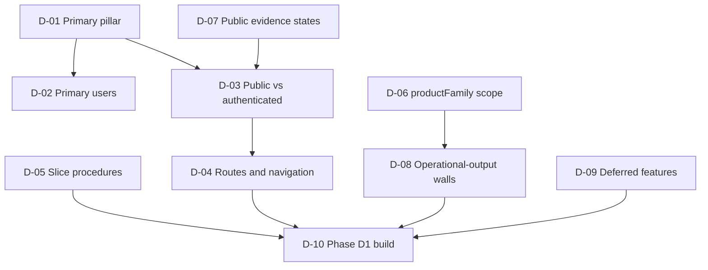

# Phase D0 Decision Log — Device and Procedure Intelligence Platform

Phase D0 discovery document (2026-08-08) — describes current repository state and proposals. **Physician-owner decisions D-01–D-10 were recorded 2026-08-08** (D-03 and D-07 accepted with modification, D-10 accepted with bounded scope); no production feature exists yet.

This is the decision packet for the physician owner. It has two parts:

- **Part 1 — Decisions REQUIRED from the owner.** Ten charter decisions that gate Phase D1. Each is presented with context, options, the discovery team's recommendation, and consequences, followed by the owner's recorded decision of 2026-08-08.
- **Part 2 — Decisions MADE within Phase D0.** Small, reversible, process-level choices made to execute the discovery itself. They are logged for transparency and imply no owner approval of anything in Part 1.

Sibling documents argue each decision in depth: [product-vision.md](./product-vision.md), [user-jobs-and-personas.md](./user-jobs-and-personas.md), [data-relationship-audit.md](./data-relationship-audit.md), [relationship-taxonomy.md](./relationship-taxonomy.md), [information-architecture.md](./information-architecture.md), [vertical-slice-spec.md](./vertical-slice-spec.md), [data-readiness-report.md](./data-readiness-report.md).

How the ten decisions depend on each other:



---

## Part 1 — Decisions REQUIRED from the physician owner (phase gate)

All ten decisions below were recorded by the physician owner on **2026-08-08**. Recommendations came from the Phase D0 shared brief (R1–R10); the recorded decision under each item is now the governing statement, and where it modifies the recommendation, the modification controls.

### D-01. Primary product pillar

**Context.** The preference-card system's data graph (1,532 products, 135 roles, 1,622 product-role links, 15 procedures, 233 slots, 2,073 authored slot options, 71 sources, 1,850 product-source rows) now supports more than its single current consumer. Three candidate pillars emerged: (A) a Device and Clinical Use Atlas (device/role reference), (B) a Procedure Intelligence Workspace (procedure-first requirements/phases/contingencies), and (C) an Institutional Capability & Gap Analyzer. The choice determines what the platform _is_ and what everything else links into.

**Options considered.**

1. **A first** — device/role atlas as the entity spine.
2. **B first** — procedure workspace as the organizing surface.
3. **C first** — institution-facing capability analysis.
4. **All three at once** — no primary pillar.

**Recommendation (R1): Option 1 — Pillar A, Device and Clinical Use Atlas.** It has the highest data readiness (1,331 `verified_source` products, six independent governance axes, source citations), the lowest clinical risk (vendor-neutral device facts, no clinical recommendations), is the only pillar with public-suitable content today, and builds the device/role entity spine every other pillar links into. See [product-vision.md](./product-vision.md) and [data-readiness-report.md](./data-readiness-report.md).

**Consequences.**

- _Option 1:_ fastest path to a public-defensible surface; procedure content follows once governed (see D-03). Cost: the clinically richest material (procedures) ships second.
- _Option 2:_ leads with the highest-value content, but all 15 procedures are `Draft - clinician review required` with `clinical_owner` null — the primary surface would launch behind authentication and a DRAFT watermark.
- _Option 3:_ blocked on data that does not exist — the formulary scaffold (`data/ip-preference-cards/generated/hospital-formulary-staging.json`) is empty of institution data, equipment sets are browser localStorage only, and there is no institution entity.
- _Option 4:_ dilutes a solo-maintainer effort and forfeits the sequencing benefit of a spine.

**Argued in:** [product-vision.md](./product-vision.md).

**DECISION (2026-08-08): ACCEPTED — Option 1.** The Device and Clinical Use Atlas is the primary product pillar; the Procedure Intelligence Workspace is secondary. Institutional capability and gap analysis is deferred until real institutional data and an institution model exist.

---

### D-02. Primary user group

**Context.** Today's implicit user is the card author (the owner) plus admin QA reviewers. A platform framing requires naming who the product primarily serves, because it drives copy register, defaults, and which surfaces are built first. The data already encodes team-facing artifacts (role-based slots, contingency modules, kit BOM behavior) that map to procedure-team preparation work.

**Options considered.**

1. **Procedure team preparing and learning** — bronchoscopy nurse, procedure technician, IP fellow — with the interventional pulmonologist as owner/reviewer.
2. **IP physician only** (author-centric, as today).
3. **Institutional stakeholders** (value analysis, procurement).
4. **General public / patients.**

**Recommendation (R4): Option 1.** The atlas serves the team's lookup-and-learn jobs; the workspace serves the IP physician plus team for procedure preparation. The physician remains the governance owner and reviewer. See [user-jobs-and-personas.md](./user-jobs-and-personas.md).

**Consequences.**

- _Option 1:_ aligns surfaces with the people who physically prepare rooms and learn devices; requires copy discipline (no clinical recommendations to non-physician users, evidence badges everywhere).
- _Option 2:_ preserves the status quo; caps the platform's reach at one user.
- _Option 3:_ premature — no institutional data exists (see D-01, Option 3).
- _Option 4:_ out of scope; the corpus is professional-education material, not patient-facing content.

**Argued in:** [user-jobs-and-personas.md](./user-jobs-and-personas.md).

**DECISION (2026-08-08): ACCEPTED — Option 1.** The primary audience is the procedure team preparing and learning: bronchoscopy nurses, procedure technicians, pulmonary/IP fellows, and respiratory therapists. The interventional pulmonologist remains the clinical owner, reviewer, and governance authority.

---

### D-03. Public vs authenticated scope

**Context.** Today the module is public-unlisted behind `NEXT_PUBLIC_ENABLE_PREFERENCE_CARDS` (direct link, noindex, hidden from nav), with Supabase RLS for personal cards and `site_admin` for 10 admin QA pages. The corpus splits cleanly on existing axes: 1,331 of 1,532 products are `verified_source` and 753 are `prototype_visible`, while all 15 procedures remain governance-draft and 813 slot-option proposals are unreviewed. What may be public is a clinical-risk decision only the owner can make.

**Options considered.**

1. **Split by evidence state** — public: atlas device/role pages restricted to `verified_source` + `prototype_visible` facts with citations, the existing emerging view's labeled investigational cohort, and the role taxonomy; authenticated (public-unlisted → sign-in, as today): procedure workspace, cards, institutional overlays; admin: governance/QA.
2. **Everything authenticated** (no public surface).
3. **Everything public** including draft procedure content.

**Recommendation (R5): Option 1.** Draft procedure content is NOT public until clinician review; if previewed at all it carries the existing "DRAFT PROTOTYPE — NOT APPROVED FOR CLINICAL USE" watermark convention. Proposals (813) are never public in any option. See [information-architecture.md](./information-architecture.md) and [data-readiness-report.md](./data-readiness-report.md).

**Consequences.**

- _Option 1:_ a public atlas of cited, verified device facts with zero clinical recommendations; the governance walls already in the data enforce the boundary.
- _Option 2:_ safest, but forfeits the atlas's public-reference value and discoverability.
- _Option 3:_ publishes procedure content the governance metadata itself labels as requiring clinician review — inconsistent with the repository's own evidence framing and with the owner's professional standing.

**Argued in:** [information-architecture.md](./information-architecture.md).

**DECISION (2026-08-08): ACCEPTED WITH MODIFICATION.** The target architecture is a public atlas, authenticated procedure workspace, and admin-only governance tooling. During Phase D1, however, all new device-intelligence routes remain public-unlisted and noindex. Public indexing requires a separate owner launch decision after the vertical slice, an evidence-filtering audit, and a usability review.

---

### D-04. Route and navigation direction

**Context.** All current routes live under `/preference-cards/*` (public-unlisted) plus admin QA pages. A platform framing implies entity-first routes (devices, roles, procedures) that preference cards link out of, rather than the card builder being the front door. No routes are created in Phase D0; this decision sets direction only.

**Options considered.**

1. **New top-level device-intelligence area** — indicative: `/[locale]/devices`, `/[locale]/devices/[productId]`, `/[locale]/clinical-roles/[roleCode]`, `/[locale]/procedures/[procedureCode]`, `…/readiness`, `/[locale]/compare`, `/[locale]/institution/capabilities` — cross-linked with the PRESERVED `/preference-cards/*` routes (builder and admin unchanged).
2. **Grow everything under `/preference-cards/*`.**
3. **Replace `/preference-cards/*`** with the new area and migrate.

**Recommendation (R6): Option 1.** Entity pages get honest, shareable URLs; the existing builder, admin surface, and their access gates stay untouched. Route names above are indicative, not final. See [information-architecture.md](./information-architecture.md).

**Consequences.**

- _Option 1:_ clean IA; two areas must stay cross-linked and consistent; nav/access tiers for the new area need their own entries in the module-access model.
- _Option 2:_ no new surface area, but the platform stays framed as a card tool, and public atlas pages would sit under a card-builder path.
- _Option 3:_ breaks existing direct links and destabilizes a working, gated surface for no user benefit.

**Argued in:** [information-architecture.md](./information-architecture.md).

**DECISION (2026-08-08): ACCEPTED — Option 1.** Create a new top-level device-intelligence route area and cross-link it with the preserved `/preference-cards/*` routes. Existing preference-card routes are not replaced, redirected, or removed during Phase D1.

---

### D-05. Three vertical-slice procedures

**Context.** Phase D1 (if approved, D-10) builds a read-only vertical slice over a small set of procedures. Three exemplars were verified in depth during discovery and differ usefully in structure:

|                               | EBUS_TBNA                                                                                                                       | THERAPEUTIC_BRONCH                                                                                                                                                                                 | CHEST_TUBE                                                                                                                                                                                                              |
| ----------------------------- | ------------------------------------------------------------------------------------------------------------------------------- | -------------------------------------------------------------------------------------------------------------------------------------------------------------------------------------------------- | ----------------------------------------------------------------------------------------------------------------------------------------------------------------------------------------------------------------------- |
| Slots                         | 15 (7 req / 4 cond / 4 opt)                                                                                                     | 29 (3 req / 21 cond / 5 opt)                                                                                                                                                                       | 13 (3 req / 7 cond / 3 opt)                                                                                                                                                                                             |
| Release                       | `release-ebus-tbna-v1-0`                                                                                                        | `release-therapeutic-bronch-v1-0`                                                                                                                                                                  | `release-chest-tube-v1-0`                                                                                                                                                                                               |
| Distinctive verified behavior | Linear EBUS scope deliberately first in requirement order; reviewed FNA/FNB needle options and an installed-base scope decision | HIGH_BLEED_RISK appends the MAJOR_AIRWAY_BLEEDING rescue module; deliberately-blocking APC platform/probe compatibility mismatch; 7 reviewed conditional slots from the laser/imaging review round | Mutually exclusive small-bore/large-bore techniques; DIGITAL_DRAINAGE role replacement; kit BOM suppression; the only proposal-derived options ever promoted to selectable (18 drainage upserts, explicitly nondefault) |

**Options considered.**

1. **EBUS_TBNA + THERAPEUTIC_BRONCH + CHEST_TUBE.**
2. A different trio from the remaining 12 procedures.
3. Fewer than three (one or two exemplars).

**Recommendation (R10, slice portion): Option 1.** Together they exercise sampling, therapeutic-contingency, and pleural-procedure shapes: modifier-driven rescue modules, blocking compatibility, mutual exclusion, role replacement, BOM suppression, and reviewed-overlay provenance — the full mechanism set — while all three already have published v1-0 release bundles. See [vertical-slice-spec.md](./vertical-slice-spec.md).

**Consequences.**

- _Option 1:_ maximum mechanism coverage for three procedures; the slice doubles as a regression harness for the resolver behaviors listed above.
- _Option 2:_ possible, but no other trio was verified in depth during D0; choosing it re-opens discovery work.
- _Option 3:_ cheaper, but risks a slice that generalizes poorly (e.g., a slice without CHEST_TUBE never exercises kit BOM suppression or role replacement).

**Argued in:** [vertical-slice-spec.md](./vertical-slice-spec.md).

**DECISION (2026-08-08): ACCEPTED — Option 1.** The Phase D1 exemplar procedures are `EBUS_TBNA`, `THERAPEUTIC_BRONCH`, and `CHEST_TUBE`.

---

### D-06. productFamily as-is vs supplemented by new relationship types

**Context.** The repository's `productFamily` (18 reviewed family versions, all governance-draft) has one real meaning: a reviewed at-procedure selection group. Discovery identified eight distinct relationship concepts the single term is at risk of being asked to carry — manufacturer family, configuration family, at-procedure selection group, clinical equivalence group, procurement substitute group, local formulary group, educational comparison group, and compatibility relationship. Four of the eight do not exist in the data today, and the discovery `familyKey` grouping has documented over-merge defects (e.g., the Argyle over-merge). See [relationship-taxonomy.md](./relationship-taxonomy.md) and [data-relationship-audit.md](./data-relationship-audit.md).

**Options considered.**

1. **Keep productFamily as-is; supplement later** with separately named, separately reviewed relationship structures per the taxonomy.
2. **Broaden productFamily** to carry additional meanings (equivalence, substitution, formulary).
3. **Convert/migrate** existing family versions into a new generalized relationship model now.

**Recommendation (R7): Option 1.** No conversion, no new family versions, no governance-state changes now. Each future relationship type gets its own named structure, review path, and display semantics — in particular, clinical equivalence and procurement substitution DO NOT EXIST today, must not be inferred from any existing grouping, and would each require a named clinical review with explicit scope and differences.

**Consequences.**

- _Option 1:_ zero disturbance to the 54-entry published baseline; new relationship types arrive only with their own review processes.
- _Option 2:_ semantic overload — a term that means "reviewed selection group" would silently start implying equivalence or substitutability, which the data cannot support and this platform must never claim.
- _Option 3:_ a migration with no consumer, touching governance-draft artifacts, before the owner has even chosen a pillar.

**Argued in:** [relationship-taxonomy.md](./relationship-taxonomy.md).

**DECISION (2026-08-08): ACCEPTED — Option 1.** The current reviewed productFamily model remains unchanged as the at-procedure selection group. It is not broadened to imply manufacturer identity, clinical equivalence, substitution, or formulary policy. New relationship types may be added later only as separately named and separately reviewed structures.

---

### D-07. Which evidence states may be shown publicly

**Context.** The evidence model orders nine states from verified product fact (GUDID/UDI-backed, `verified_source`) down to honest "unknown." The verified split today: 1,331 `verified_source` / 200 `candidate` / 1 `unknown` products; 753 `prototype_visible` / 779 `hidden`; 813 proposals each carrying disclaimer text; 103 catalog products GUDID-flagged "Not in Commercial Distribution." Badges must carry the axis they came from, and the absence of a reviewed regulatory decision must display as unknown — never implied clearance.

**Options considered.**

1. **Public = states (1) and (2) plus labeled context:** verified product facts and manufacturer-sourced (candidate, badged) facts with citations, the labeled investigational cohort on the existing emerging view (breakthrough = "an agreement to review, not an authorization"), and the role taxonomy. Everything from reviewed clinical-use relationships downward stays authenticated; proposals (state 4) are never public anywhere.
2. **Public = state (1) only** (verified facts; hide candidate-grade entirely).
3. **Public includes state (3)** (reviewed clinical-use relationships, e.g. the 28 externally clinician-reviewed options).

**Recommendation (R5, evidence portion): Option 1.** Candidate-grade facts are honest when badged as manufacturer-sourced; hiding them (Option 2) makes the atlas thinner without a safety gain, while clinical-use relationships (Option 3) belong behind authentication until the owning procedures clear clinician review. See [data-readiness-report.md](./data-readiness-report.md).

**Consequences.**

- _Option 1:_ the public surface is a cited fact reference; every fact wears its provenance badge; no clinical-use claims in public.
- _Option 2:_ simplest possible public claim ("everything is UDI-verified") at the cost of 200 candidate products' worth of useful, labeled reference content.
- _Option 3:_ leaks clinical-use content whose parent procedures the governance data marks draft; contradicts D-03.

**Argued in:** [data-readiness-report.md](./data-readiness-report.md).

**DECISION (2026-08-08): ACCEPTED WITH MODIFICATION — narrowed initial public cohort.** When public indexing is later authorized (see D-03), the initial public-indexable atlas cohort must satisfy `verification_grade = verified_source` AND `visibility_state = prototype_visible`. Candidate-grade manufacturer-sourced facts remain authenticated/unlisted until a separate public-content review. The existing emerging-device cohort may retain its separately labeled investigational context. Proposals and draft clinical-use relationships are never public.

> **SUPERSEDED IN PART (2026-08-15) by D-11 — the Device Atlas cohort predicate is now inclusion-first.** The `visibility_state = prototype_visible` conjunct above is no longer the atlas gate. See [D-11](#d-11-inclusion-first-device-atlas-visibility-d2b) below. The rest of this decision stands: candidate-grade and unknown-grade products remain outside Device Intelligence, proposals and draft clinical-use relationships are never public, and public indexing remains a separate decision under D-03.

---

### D-08. Which relationships may drive operational outputs

**Context.** "Operational output" means anything a user acts on: a resolved preference card, a readiness/gap result, a printable checklist. The data already encodes a trust ladder — `product_roles` (1,622 links) is broad catalog discovery, `slot-product-options` (2,073; 942 selectable+visible) is curated defaults, and `slot-product-option-proposals` (813) is unreviewed and not selectable. The existing resolver enforces these walls (e.g., `product_not_slottable` refusal for the breakthrough cohort at save time).

**Options considered.**

1. **Only the existing walls drive outputs:** authored selectable options, APPROVED reviewed family versions, canonical role codes, and release-pinned definitions. Proposals, candidate-grade products, draft families, and discovery groupings may be SHOWN (badged, authenticated contexts) but never drive a card or readiness result. No LLM-generated equivalence or substitution claims, ever.
2. **Widen** outputs to include proposals or discovery groupings ("more complete" results).
3. **Narrow** outputs to externally clinician-reviewed material only (28 of 2,073 options).

**Recommendation (R8): Option 1.** It is exactly the discipline already enforced in code and data; the platform inherits it rather than relitigating it. See [data-relationship-audit.md](./data-relationship-audit.md) and [relationship-taxonomy.md](./relationship-taxonomy.md).

**Consequences.**

- _Option 1:_ operational outputs remain fully attributable to reviewed or authored, release-pinned inputs.
- _Option 2:_ an unreviewed proposal — whose own row text disclaims compatibility, approval, and suitability — could shape a clinical checklist. Rejected on safety grounds.
- _Option 3:_ honest but near-empty: only 28 options arrived through the formal external clinician review round; the author-curated workbook rows are the deliberate, governed backbone of the current system.

**Argued in:** [data-relationship-audit.md](./data-relationship-audit.md).

**DECISION (2026-08-08): ACCEPTED — Option 1.** Operational outputs may be driven only by the existing governed walls: authored selectable options, approved reviewed family versions, canonical role codes, and release-pinned definitions. Proposals, candidate products, draft families, discovery groupings, and inferred relationships may be displayed only in properly labeled contexts and may not drive cards, checklists, or readiness results.

---

### D-09. Which features are deferred

**Context.** Discovery evaluated ten candidate products on the graph. Building all of them is not feasible for a solo-maintained platform, and several are blocked on data or review processes that do not exist (no institution entity; no clinical equivalence or substitution review process).

**Options considered.**

1. **Defer five now:** Formulary & Procurement Intelligence; Shortage & Substitution Navigator (needs an equivalence/substitute review process that does not exist); Device Change-Impact Dashboard (the 16 impact reports exist as a foundation, but no dashboard yet); Training & Setup Academy (folds into workspace views plus the existing education modules); Governance Workbench (the admin surface already exists — evolve it, don't rebuild it). Pillar C (institutional capability) is designed-for in the IA but deferred per D-01.
2. **Defer fewer** (pull one of the above into scope).
3. **Defer more** (atlas only, no workspace direction).

**Recommendation (R9 + R3): Option 1.** Each deferral has a named unblock condition (real institutional data; a named substitution review process; owner demand for the impact dashboard), so deferrals are re-openable decisions rather than deletions. See [product-vision.md](./product-vision.md) and [information-architecture.md](./information-architecture.md).

**Consequences.**

- _Option 1:_ effort concentrates on the two pillars with data behind them; preference cards remain a last-mile OUTPUT of the workspace (with room-setup/nursing checklists, procurement-gap report, and training views as future outputs), not the organizing principle.
- _Option 2:_ any pulled-forward feature starts blocked on missing data or missing review process.
- _Option 3:_ smallest scope, but forgoes the procedure workspace direction the exemplar analysis supports.

**Argued in:** [product-vision.md](./product-vision.md).

**DECISION (2026-08-08): ACCEPTED — Option 1.** Deferred: institutional capability as a real product; formulary and procurement intelligence; shortage and substitution navigation; the device change-impact dashboard; a standalone Training and Setup Academy; a rebuilt governance workbench. Training views may be incorporated into the procedure workspace, and existing governance surfaces evolve rather than being replaced.

---

### D-10. What Phase D1 builds

**Context.** If the owner accepts the direction above, the next phase needs a concrete, bounded scope. Discovery drafted a read-only vertical slice specification against the three exemplar procedures, using only mechanisms and data verified in D0.

**Options considered.**

1. **Read-only vertical slice** per [vertical-slice-spec.md](./vertical-slice-spec.md): device page + procedure workspace view + a capability-view stub on demo data + generated-output actions, for EBUS_TBNA / THERAPEUTIC_BRONCH / CHEST_TUBE first. No writes, no new catalog data, no governance-state changes.
2. **Public atlas first** (device/role pages for the verified public cohort), workspace later.
3. **Data/governance work first** (e.g., advance procedure review) before any new surface.
4. **No D1** — stop after discovery.

**Recommendation (R10): Option 1.** The slice proves the platform framing end-to-end on real, release-pinned data while touching nothing governed; the atlas (Option 2) becomes its natural public-facing extension once D-03/D-07 scope is set. Option 3 is owner-time-bound (clinician review is the owner's own bottleneck) and can proceed in parallel with a read-only slice.

**Consequences.**

- _Option 1:_ one phase yields a demonstrable product spanning all three pillars' seams (device page, workspace, capability stub) with zero governance risk.
- _Option 2:_ fastest public value, but defers the procedure workspace that the exemplar analysis shows is the richest surface.
- _Option 3:_ improves the data's governance state but produces nothing visible to evaluate the platform framing against.
- _Option 4:_ the discovery documents remain a reference for the preference-card system as-is.

**Argued in:** [vertical-slice-spec.md](./vertical-slice-spec.md).

**DECISION (2026-08-08): ACCEPTED WITH BOUNDED PHASE D1 SCOPE.** Build a read-only vertical slice containing: device index/detail presentation; clinical-role links; procedure workspaces for the three exemplar procedures; an explicitly labeled demo-only capability panel; and read-only output previews or links. Phase D1 must add no persistence, no migration, no catalog or governance change, no public indexing, no clinical equivalence or substitution claim, and no second resolution engine.

---

## Part 2 — Decisions MADE within Phase D0

These are process decisions taken to execute discovery. They are reversible, they changed no governed data, and they imply no owner approval of any Part 1 item.

### D0-A. Documentation-only scope

Phase D0 produced only documents under `docs/ip-device-intelligence/` and a deterministic audit tool under `scripts/ip-device-intelligence/`. No routes, no runtime feature code, no migrations, no catalog changes, no seed or generated-data edits, no changes under `src/` or `supabase/`.

### D0-B. Deterministic data-readiness audit tool

A read-only audit script was added at `scripts/ip-device-intelligence/audit-data-readiness.ts` (with a jest test in `scripts/ip-device-intelligence/__tests__/`), wired as the npm script `ip-intel:audit` in `package.json` — the single line added outside the two permitted directories. It emits a deterministic JSON artifact at `docs/ip-device-intelligence/data-readiness-audit.json` (format `ip-device-intel-audit/1`; no timestamps; provenance content-addressed to the workbook sha256 and catalog release id; stable-sorted arrays), recorded in the repository for commit with the Phase D0 documentation set. The artifact backs the counts in [data-readiness-report.md](./data-readiness-report.md) and can be re-run to detect drift.

### D0-C. No PR, no publication-side effects

Phase D0 opens no pull request and performs no release actions. The 54-entry published baseline (16 release bundles + 19 module-ledger versions + 1 catalog-release manifest + 18 product-family versions) was verified unchanged against `origin/main` via the existing `ip-cards:release:check-base` gate (54 unchanged / 0 advanced / 0 new).

### D0-D. `npm ci` in the worktree

Dependencies were installed with `npm ci` in this worktree as a baseline requirement so that the verification gates (`ip-cards:validate-data`, `build:content`, `type-check`, `build`, focused jest: 80 suites / 1,359 tests passed, 1 intentionally skipped) could run against `claude/device-intelligence-discovery` at `561460a1` (== `origin/main`, clean tree at phase start).

### D0-E. Inventory via read-only agents

The repository inventory (domain resolution, taxonomy/families, server + Supabase, release backbone, scripts pipeline, docs + tests, routes/access, seed, generated, reviewed overlays) was conducted by read-only agents producing per-area evidence files; the resulting counts were then cross-checked against the repository and the audit artifact. Findings are consolidated in [data-relationship-audit.md](./data-relationship-audit.md) and [data-readiness-report.md](./data-readiness-report.md).

### What Phase D0 explicitly did NOT do

- No product-family approvals — the 18 family versions remain governance-draft, untouched.
- No governance-state changes — all 15 procedures remain `Draft - clinician review required`, `clinical_owner` null.
- No release publication or pointer moves — no new bundle, ledger, catalog-release, or "current" pointer changes.
- No substitution engine and no equivalence claims — clinical equivalence and procurement substitution groups do not exist in the data and were not inferred, created, or implied anywhere in these documents.
- No production feature — no route, page, API, or migration was added or modified.

---

## What happens next

All ten decisions were recorded by the physician owner on 2026-08-08: D-01, D-02, D-04, D-05, D-06, D-08, and D-09 accepted as recommended; D-03 and D-07 accepted with modification; D-10 accepted with bounded scope. The modifications are reflected in the sibling documents that argue those decisions ([information-architecture.md](./information-architecture.md), [relationship-taxonomy.md](./relationship-taxonomy.md), [vertical-slice-spec.md](./vertical-slice-spec.md)). Phase D1 is now authorized under the bounded scope recorded in D-10 and the D1-time constraints of D-03 (all new routes public-unlisted and noindex; public indexing needs a separate launch decision).

---

## Part 3 — Phase D1 implementation record (added 2026-08-08; Parts 1–2 are the Phase D0 record and are unchanged)

The D-10 slice was implemented on branch `claude/device-intelligence-vertical-slice` and delivered as a draft pull request for owner review. Record of what the implementation did and did not do, against the ten decisions:

- **D-03/D-04 honored.** Six new routes under `/[locale]/devices`, `/[locale]/clinical-roles`, `/[locale]/procedures` — every one public-unlisted, per-page robots-noindexed, proxy-stamped `X-Robots-Tag`, absent from navigation, behind a new production env flag (`NEXT_PUBLIC_ENABLE_DEVICE_INTELLIGENCE`, set nowhere). All existing preference-card routes preserved; two additive cross-links only.
- **D-05 honored.** The procedure surfaces serve exactly `EBUS_TBNA`, `THERAPEUTIC_BRONCH`, `CHEST_TUBE`; every other code 404s and the index labels the set as the Phase D1 exemplars.
- **D-06 honored.** No new relationship structures; `productFamily` untouched; discovery `familyKey` rendered display-only with its caption.
- **D-07 honored (as of D1; superseded by D-11 on 2026-08-15).** Atlas cohort = `verified_source` AND `prototype_visible`, enforced at store construction (753 products); candidate/hidden products unreachable on the new routes including by direct id. Phase D2B replaced this predicate with the inclusion-first rule — see [D-11](#d-11-inclusion-first-device-atlas-visibility-d2b).
- **D-08 honored.** Readiness and output previews are driven only by the existing governed walls; proposals render as counts and never satisfy anything; candidate/unknown/demo evidence can never produce plain `ready`.
- **D-10 boundaries held.** No persistence of any kind (no table, no Supabase write, no localStorage key, no new cache beyond a second in-memory index over the same imported JSON), no migration, no catalog/seed/reviewed/generated data change, no release or pointer change, no governance-state change, no equivalence/substitution claim, no second resolution engine, no server action, no write API. The Phase D0 audit artifact remained byte-identical and the 54-entry publication baseline unchanged throughout.

Two pre-existing-code changes were required and are within scope: the catalog Fuse cache became per-store (a latent single-slot cache that would have cross-contaminated two store instances), and the two preserved catalog pages gained the cross-links R6 calls for. Implementation details: [d1-implementation.md](./d1-implementation.md); validation: [d1-validation.md](./d1-validation.md); review packet: [d1-review/](./d1-review/). Public indexing, candidate-cohort review, and route consolidation remain open owner decisions.

---

## Part 4 — Phase D2B decision record (added 2026-08-15)

### D-11. Inclusion-first Device Atlas visibility (D2B)

**Context.** Phase D1 shipped the atlas cohort as `verification_grade = verified_source` AND `visibility_state = prototype_visible` (D-07 as modified). The merged current-U.S.-status research package (PR #105, merged as `d93e210039aee3a0a28701f19ad550f38663d232`) then researched all 779 hidden products and could conclusively establish current U.S. distribution for very few of them: of the 578 hidden **verified-source** products, 10 reached high confidence, 24 moderate, 18 were conflicted, and 526 remained unresolved for reasons that are limits of the research method (`identity_unresolved`, `insufficient_evidence`), not defects in the products' sourcing. Under D-07 all 578 stayed absent from an educational catalog.

**Owner decision (2026-08-15): ACCEPTED — false exclusion is the greater harm.**

> It is acceptable for a small number of legacy or no-longer-orderable products to appear and be corrected later. It is not acceptable for hundreds of adequately sourced products to remain absent merely because current availability has not been conclusively established.

**The predicate.** Device Atlas inclusion is decided by sourced identity alone:

```
include ⟺ verification_grade = verified_source AND NOT explicitly excluded by the owner
```

`visibility_state` is no longer an atlas gate. It remains governed canonical data driving the preserved preference-card dropdown and admin surfaces, which D2B does not touch.

**Consequences.**

- Atlas cohort 753 → **1,331**; **578** verified-source products newly included; 200 candidate-grade + 1 unknown-grade still excluded; 0 explicit owner exclusions.
- Current market status and FDA safety actions become **overlays** — controlled labels on the product, generated from the PR #105 package into a compact 212 KB / 578-row artifact that pins the source SHA-256. They change what a page says, never whether it exists.
- An **active exact safety action** sets a recommendation gate (`blocked_active_safety_action`) that disqualifies a product from being a default or a recommendation. It does not affect visibility, and it is never mistaken for a discontinuation — the three ERBE flexible cryoprobes stay listed as current U.S. distribution _and_ carry a prominent lot-specific FDA notice.
- The only mechanism that removes an otherwise-verified product is a reviewed owner exclusion for a data-quality defect or an explicit owner decision. There is no denylist based on market status, recall status, or availability.
- Candidate-grade and unknown-grade products remain outside Device Intelligence; D-07's other provisions are unaffected.
- `NEXT_PUBLIC_ENABLE_DEVICE_INTELLIGENCE` is unchanged and remains off/unset; feature-off 404s, `noindex, nofollow, noarchive`, absence from navigation and sitemap, the three-exemplar procedure limit, and public-unlisted status all hold.
- Correction path: owner exclusions for wrong admissions, refreshed status overlays for stale market/safety knowledge. Neither reintroduces a visibility gate on current availability.

**Implemented in:** [d2b-inclusion-first-visibility.md](./d2b-inclusion-first-visibility.md). Accounting artifact: [d2b-review/newly-included-products.csv](./d2b-review/newly-included-products.csv).

---

## Part 5 — Phase D2C decision record (added 2026-08-18)

### D-12. Normalized Device Atlas taxonomy (D2C)

**Context.** After D2B went live, the physician owner reviewed the production atlas and found the user-facing category facet materially inconsistent: `Guidewire` and `Airway stenting` both held guidewires (Amplatz/Jagwire vs the two MAXXwires), `Airway stenting` also held the AEROSIZER sizing device, and physically identical bronchoscopes were split across `Flexible bronchoscopy`, `Bronchoscopy platform`, `EBUS platform`, and `Peripheral navigation` by manufacturer and workflow. The canonical categories mix physical class, subtype, clinical application, procedure domain, and platform grouping in one facet.

**Owner decision (2026-08-18): the Device Atlas browses by a normalized physical taxonomy.** The primary user-facing facet answers "what kind of device is this"; clinical use stays with the governed Clinical role and Procedure facets. Canonical `primary_category` / `subcategory` are **retained unchanged for compatibility and provenance but are no longer the Device Atlas browsing taxonomy** — they keep driving the preserved preference-card catalog surfaces, and they render on atlas product pages only inside an explicitly labeled provenance area.

**Mechanism.** A reviewed, deterministic classification layer (`data/ip-device-intelligence/reviewed/product-taxonomy-rules.json`: pair rules covering all 222 cohort category pairs, 16 scoped name rules, per-product overrides for corrections) generates a compact controlled-code overlay (`data/ip-device-intelligence/generated/product-taxonomy-overlay.json`, 1,331 rows) via `npm run ip-intel:taxonomy-overlay`. 28 populated device classes, 138 controlled subtypes, confidence high/moderate/needs_review as review metadata only.

**Boundaries.** Taxonomy state is never a visibility, search, membership, market/safety, or recommendation gate; ambiguous products stay visible with the most plausible broad class and `needs_review`. Inclusion-first D-11 accounting is unchanged (1,331 / 200 / 1 / 0). No canonical field, verification grade, visibility state, selectability, product-role or procedure-role link, compatibility rule, market/safety overlay row, or published release changed. Full record: [d2c-taxonomy-normalization.md](./d2c-taxonomy-normalization.md); review artifacts: [d2c-review/](./d2c-review/).
