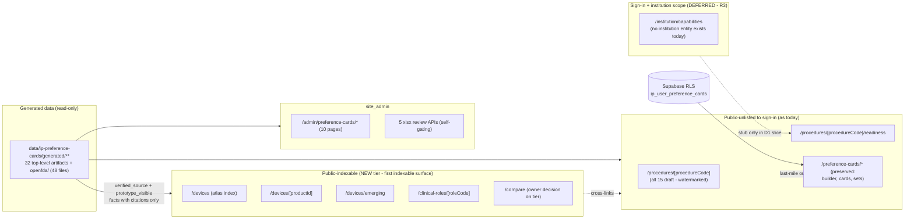
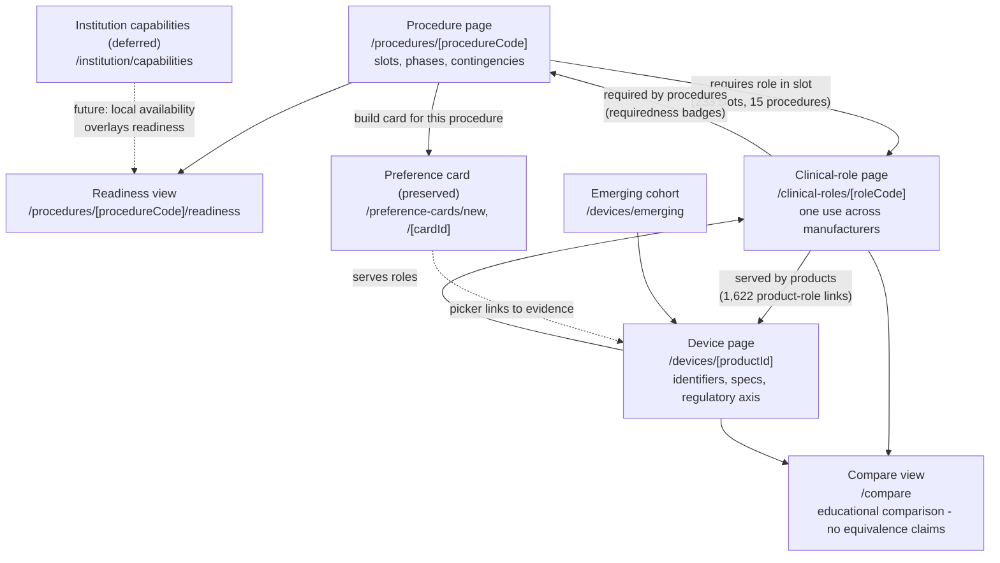

# Information architecture — Device and Procedure Intelligence Platform

Phase D0 discovery document (2026-08-08) — describes current repository state and proposals; no production feature exists; all recommendations await physician-owner decisions recorded in decision-log.md.

This document audits the route and access surface that exists today, evaluates the five
information-architecture options from the discovery charter, and details the recommended
direction (brief R6): a new top-level device-intelligence area cross-linked with the preserved
`/preference-cards/*` routes. **No routes are created in Phase D0.** Every proposed path below is
indicative, not final. Related documents: [product-vision.md](./product-vision.md),
[user-jobs-and-personas.md](./user-jobs-and-personas.md),
[data-relationship-audit.md](./data-relationship-audit.md),
[relationship-taxonomy.md](./relationship-taxonomy.md),
[vertical-slice-spec.md](./vertical-slice-spec.md),
[data-readiness-report.md](./data-readiness-report.md), and
[decision-log.md](./decision-log.md).

---

## 1. Current route audit

The preference-card system is a locale-prefixed Next.js App Router surface: **14 public pages,
10 admin pages, 6 API routes, and 3 server-action files (7 exported actions)**. Every page is
force-dynamic and robots-noindexed; the whole module is hidden from site navigation.

### 1.1 Public pages (14) — `/[locale]/preference-cards/...`

| Route                                           | Purpose                                                                                                    | Primary server functions / data                                                                                        |
| ----------------------------------------------- | ---------------------------------------------------------------------------------------------------------- | ---------------------------------------------------------------------------------------------------------------------- |
| `/preference-cards`                             | Dashboard: metric tiles, golden-scenario cards (governance + readiness state), caller's saved cards        | `getDashboardMetrics`, `getCatalogOverview`, `listUserCards`                                                           |
| `/preference-cards/new`                         | 5-step builder wizard (create mode); `?scenario=` selects one scenario, resolved server-side               | `getScenarioDefinition(s)`, `getCurrentReleaseBundleForScenario`                                                       |
| `/preference-cards/catalog`                     | Full-text / faceted catalog search; filters live in URL params                                             | `getCatalogFacets`, `searchCatalog`, `validateKnownCatalogFilters` (`src/features/preference-cards/server/catalog.ts`) |
| `/preference-cards/catalog/product/[productId]` | Product detail (identifiers, specs, regulatory axis); `productId` must match `PRD-[A-Z0-9]{6,20}` else 404 | `getProductDetail`                                                                                                     |
| `/preference-cards/catalog/uses`                | Clinical-use (role) index, optional `?procedure=` filter                                                   | `getCatalogFacets`, `getUseIndex`                                                                                      |
| `/preference-cards/catalog/uses/[roleCode]`     | One clinical use across manufacturers; legacy role codes redirect via `canonicalRoleCode()`                | `getUseDetail`, `specColumnPriority`; renders `ProductFamilyTable`, `RoleComparisonTable`                              |
| `/preference-cards/emerging`                    | Emerging / investigational cohort with regulatory badges                                                   | `getEmergingDevices`                                                                                                   |
| `/preference-cards/sets`                        | Reusable equipment-set (tray) manager — browser localStorage only                                          | `EquipmentSetManager`, `useEquipmentSets`                                                                              |
| `/preference-cards/[cardId]`                    | Saved-card view with rebuild-provenance panel                                                              | `loadUserCard`, `loadCurrentCardRevision`                                                                              |
| `/preference-cards/[cardId]/edit`               | Edit; refuses ~20 enumerated integrity failures rather than re-resolving against today's definitions       | `loadEditableUserCard`                                                                                                 |
| `/preference-cards/[cardId]/print`              | Print view, `spatial` (setup zones) or `chronological` (procedural phases) mode                            | `loadUserCard`, `PrintCardView`                                                                                        |
| `/preference-cards/[cardId]/reconcile`          | Read-only drift report (test asserts no form, no button)                                                   | `reconcileSavedCard`, `listCardRevisions`                                                                              |
| `/preference-cards/[cardId]/rebuild`            | Per-decision rebuild gate; requires `?revision=`; no accept-all                                            | `prepareCardRebuild`                                                                                                   |
| `/preference-cards/shared/[token]`              | Token-addressed read-only card view for non-owners (owner opt-in)                                          | `loadSharedCard` (security-definer RPC)                                                                                |

Route files live under `src/app/[locale]/preference-cards/`. All catalog rendering reads through
one server module (`src/features/preference-cards/server/catalog.ts` over the in-memory store in
`catalog-store.ts`) backed by statically imported generated JSON in
`data/ip-preference-cards/generated/`.

### 1.2 Admin pages (10) — `/[locale]/admin/preference-cards/...`

| Route                                                            | Purpose                                                                            |
| ---------------------------------------------------------------- | ---------------------------------------------------------------------------------- |
| `/admin/preference-cards/recipes`                                | Release-bundle table with readiness / governance badges                            |
| `/admin/preference-cards/formulary`                              | Formulary role rows — derived from demo context; no real institution entity exists |
| `/admin/preference-cards/catalog-qa`                             | Catalog verification queue                                                         |
| `/admin/preference-cards/catalog-qa/[productId]`                 | Per-product verification workspace + slot-option proposals                         |
| `/admin/preference-cards/catalog-qa/clinical-use`                | Clinical-use review workbook controls + counts                                     |
| `/admin/preference-cards/catalog-qa/clinical-use/import`         | Clinical-use review import workbench                                               |
| `/admin/preference-cards/catalog-qa/external-review-remediation` | Remediation workbook export controls                                               |
| `/admin/preference-cards/catalog-qa/openfda`                     | OpenFDA proposal triage queue                                                      |
| `/admin/preference-cards/catalog-qa/slot-options`                | Exact-slot review workbook controls + queue                                        |
| `/admin/preference-cards/catalog-qa/slot-options/import`         | Exact-slot review import workbench                                                 |

Each admin surface reads a dedicated server data module under
`src/features/preference-cards/data/` (catalog-verification, clinical-use-review,
slot-option-proposals, openfda-proposals, release-bundles, demo-context).

### 1.3 API routes (6) — `/api/preference-cards/...`

`src/proxy.ts` short-circuits before the Supabase gate for anything under `/api/`, so **every API
route authenticates itself** (verified: the `pathname.startsWith('/api/')` branch in
`src/proxy.ts` returns before the auth check).

| Route                                | Method | Gate                                                                                                                                                                                                |
| ------------------------------------ | ------ | --------------------------------------------------------------------------------------------------------------------------------------------------------------------------------------------------- |
| `catalog-search`                     | GET    | Self-gates by the module's own tier predicate (`isPublicUnlistedPath('/preference-cards')`) — re-gating the module automatically re-gates this route; 404s when `preferenceCardsEnabled()` is false |
| `clinical-use-review/export`         | POST   | `requirePreferenceCardsSiteAdminApi`                                                                                                                                                                |
| `clinical-use-review/import`         | POST   | `requirePreferenceCardsSiteAdminApi`; macro-free `.xlsx` ≤ 20 MB                                                                                                                                    |
| `exact-slot-review/export`           | POST   | `requirePreferenceCardsSiteAdminApi`                                                                                                                                                                |
| `exact-slot-review/import`           | POST   | `requirePreferenceCardsSiteAdminApi`; `.xlsx` ≤ 20 MB                                                                                                                                               |
| `external-review-remediation/export` | GET    | `requirePreferenceCardsSiteAdminApi`                                                                                                                                                                |

There is no API for card CRUD — cards go through server actions only.

### 1.4 Server actions (3 files, 7 exported actions)

| File                                                            | Actions                                                                                                                                                |
| --------------------------------------------------------------- | ------------------------------------------------------------------------------------------------------------------------------------------------------ |
| `src/app/[locale]/preference-cards/actions.ts`                  | `renameCardAction`, `deleteCardAction`, `duplicateCardAction`, `setCardShareAction`                                                                    |
| `src/app/[locale]/preference-cards/new/actions.ts`              | `saveUserCardAction` (client sends selections, never its resolution — server re-resolves and stores its own snapshot), `revalidatePreferenceCards`     |
| `src/app/[locale]/preference-cards/[cardId]/rebuild/actions.ts` | `createRebuiltCardAction` (writes exactly one new draft card; validates locale as `z.enum(activeLocales)` specifically to close an open-redirect sink) |

Ownership is never re-checked in actions because RLS makes a foreign card id match no row.

### 1.5 The four-layer access stack

1. **Env flag** — `preferenceCardsEnabled()` (`src/features/preference-cards/feature.ts`):
   always on outside production; in production requires
   `NEXT_PUBLIC_ENABLE_PREFERENCE_CARDS === 'true'`. Both layouts (public and admin) call
   `notFound()` when off; the catalog-search API 404s.
2. **Public-unlisted module tier** — `/preference-cards` appears in both
   `PUBLIC_UNLISTED_EXACT_PATHS` and `PUBLIC_UNLISTED_PATH_PREFIXES` in
   `src/lib/site-auth/access.ts` (verified). Anyone with the direct link can browse and build
   with no account; the proxy stamps `X-Robots-Tag: noindex, nofollow, noarchive` on every
   matching response (verified in `src/proxy.ts`).
3. **Supabase RLS** — saving, editing, and listing cards requires sign-in; per-user rows in
   `ip_user_preference_cards` under row-level security. The share token is the only cross-user
   read path.
4. **`site_admin` entitlement** — `getRequiredEntitlement` in `src/lib/site-auth/access.ts`
   returns `site_admin` for any `/admin` path (verified), checked against active, unexpired
   `site_entitlements` rows plus a verified-email requirement. The five review APIs re-implement
   the same check per request via `requirePreferenceCardsSiteAdminApi`
   (`src/features/preference-cards/server/admin-access.ts`), returning 401/403/503 JSON.

### 1.6 noindex and navigation-hidden status

- Every page sets robots `{ index: false, follow: false, noarchive: true }`, and the proxy
  additionally stamps the `X-Robots-Tag` header for the public-unlisted tier. **Nothing in this
  module is search-indexable today.**
- `/preference-cards` is listed in `unlistedModulePathPrefixes` (`src/lib/draft-modules.ts`,
  line 71 — verified), so the module is hidden from site navigation entirely.
- It is listed in `nonPublicModules` (`src/lib/non-public-modules.ts`, line 37 — verified), so
  `/admin/modules` shows it with an access column **computed** from the same predicates the
  proxy enforces (currently `direct-link`), never stored.
- Analytics identity: `resolveSiteModuleId` collapses every subroute to module id
  `preference-cards` (verified in `src/lib/site-auth/access.ts`).

### 1.7 Locale handling

All pages sit under the `[locale]` dynamic segment; `activeLocales = ['en', 'es', 'zh-CN']`,
default `en`. The proxy redirects locale-less URLs using the locale cookie, then
`Accept-Language` (verified in `src/proxy.ts`). Pages call `setRequestLocale` and translate
under the `preferenceCards` namespace; the xlsx import/export routes validate workbook locale
with `isActiveLocale`. Catalog data is identical in all locales — only UI strings are localized.

### 1.8 The dead `preference_cards_builder` entitlement

`preference_cards_builder` is a member of the `SiteEntitlement` union
(`src/lib/site-auth/access.ts` — verified). It is grantable and filterable in the admin user
tooling (`src/app/[locale]/admin/page.tsx`, `src/app/api/admin/users/export/route.ts` — verified),
but `getRequiredEntitlement` **never returns it**: no route requires it today. It is a latent
hook — a plausible mechanism for a future gated builder or institutional tier, but currently
dead as a route gate. Whether to use it, retire it, or repurpose it is an owner decision for
[decision-log.md](./decision-log.md).

---

## 2. The five IA options

All five options were named in the discovery charter. Each is scored against the pillar
priorities in the brief (R1 atlas primary, R2 workspace secondary, R3 institutional deferred)
and against the persona set in [user-jobs-and-personas.md](./user-jobs-and-personas.md).

### Option 1 — Expand the existing catalog routes in place

Grow `/preference-cards/catalog/*` into the atlas: more product detail, more role pages, richer
comparison — all under the current path and module tier.

- **Pros:** zero migration; reuses the entire gating stack unchanged; smallest diff; the
  catalog server module already powers everything needed.
- **Cons:** the URL and module identity permanently frame device intelligence as a sub-feature
  of preference cards — exactly the misframing Phase D0 exists to correct. The module tier is
  one policy for the whole path prefix, so the catalog cannot become indexable while the builder
  stays unlisted without splitting predicates anyway. Analytics collapse to one module id.
  Public users would reach reference content through a builder-branded surface.
- **Fit:** poor for R1 (public atlas), acceptable for R2 only.

### Option 2 — New top-level device-intelligence area

Create new top-level route groups (`/devices`, `/clinical-roles`, `/procedures`, …) served by
the same server layer and generated data.

- **Pros:** clean entity spine (device pages, role pages, procedure pages) that every pillar
  links into; each path prefix can carry its own access tier, so the atlas can become indexable
  while the workspace stays gated; correct naming for the product the data actually supports;
  new analytics module ids.
- **Cons:** two surfaces can render the same entity (product page vs device page) — duplication
  must be managed deliberately (section 4.1); new access predicates and navigation entries;
  cross-link and redirect maintenance.
- **Fit:** strong for R1 and R2; leaves room for R3 without building it.

### Option 3 — Procedure-first navigation

Make procedures the organizing principle: everything (devices, roles, cards) reached by
navigating into a procedure.

- **Pros:** matches how the procedure team thinks on the day of a case (R4); mirrors the data
  model's composition chain (procedure → modules → slots → options).
- **Cons:** **all 15 procedures are `Draft - clinician review required`** with `clinical_owner`
  null (brief §1), so a procedure-first IA gates the entire platform behind the least-ready,
  highest-clinical-risk content — the inverse of R1/R2 sequencing. Roles and devices span
  procedures (135 roles, 1,622 product-role links), so nesting them under one procedure
  misrepresents the graph. The 1,331 verified products — the readiest public asset — would have
  no public front door.
- **Fit:** wrong as the top-level organizer; correct as the navigation style _inside_ the
  authenticated workspace.

### Option 4 — Separate public and institutional shells

Split into two distinct application shells (or hosts): a public reference site and an
authenticated institutional application.

- **Pros:** the crispest possible public/institutional boundary; independent SEO, caching, and
  deployment posture for the public shell.
- **Cons:** there is no institutional layer to shell yet — `hospital-formulary-staging.json` is
  an empty scaffold, equipment sets are browser localStorage, and no institution entity exists
  anywhere (brief §2). Splitting shells duplicates auth, layout, i18n, and component
  infrastructure for a boundary the existing tier system already expresses per path. Premature
  by at least two phases.
- **Fit:** a possible end-state if the institutional pillar matures; not a D1/D2 architecture.

### Option 5 — Preserve and cross-link only

Change nothing structurally: keep `/preference-cards/*` as-is and add cross-links between its
existing pages.

- **Pros:** zero risk; zero migration; the module keeps working for beta testers.
- **Cons:** does not create the atlas entity spine; the public-suitable data stays noindexed
  under a builder-branded path; the platform re-framing never becomes visible to any user; the
  dead entitlement and one-policy tier problems remain untouched.
- **Fit:** insufficient alone — but its preservation instinct is correct and is folded into the
  recommendation.

---

## 3. Recommended direction (brief R6 — pending owner decision)

**Option 2 combined with Option 5's preservation rule:** add a broader top-level
device-intelligence area, cross-linked with the **preserved** `/preference-cards/*` routes
(builder and admin unchanged). Preference cards remain a last-mile output of the procedure
workspace (R3), not the IA's organizing principle. This is a recommendation pending the
physician owner's decision; **no routes are created in Phase D0**.

### 3.1 Indicative route map — _indicative, not final paths_

Every row maps a proposed route to the existing server functions and data that would power it
and to its proposed access tier. Tier vocabulary: **public-indexable** (a new tier — see §4.2),
**public-unlisted** (today's direct-link tier), **sign-in** (Supabase auth + RLS),
**site_admin**.

| Indicative route                                 | Would be powered by (existing today)                                                                                                                                                            | Proposed tier                                                                                                                                                                    |
| ------------------------------------------------ | ----------------------------------------------------------------------------------------------------------------------------------------------------------------------------------------------- | -------------------------------------------------------------------------------------------------------------------------------------------------------------------------------- |
| `/[locale]/devices`                              | `searchCatalog`, `getCatalogFacets`, `getCatalogOverview` (`src/features/preference-cards/server/catalog.ts`) over `data/ip-preference-cards/generated/`                                        | Public-indexable, restricted to verified_source + prototype_visible facts with citations (R5)                                                                                    |
| `/[locale]/devices/[productId]`                  | `getProductDetail` (same `PRD-` id validation as the current product page)                                                                                                                      | Public-indexable for the verified subset; candidate-grade products badged or held back per R5/R8                                                                                 |
| `/[locale]/devices/emerging` _(cohort view)_     | `getEmergingDevices` — the existing labeled investigational cohort, breakthrough framed as "an agreement to review, not an authorization"                                                       | Public-indexable (R5 keeps this cohort public with its existing labeling)                                                                                                        |
| `/[locale]/clinical-roles/[roleCode]`            | `getUseIndex`, `getUseDetail`, `canonicalRoleCode()` redirect, `specColumnPriority`; `ProductFamilyTable`, `RoleComparisonTable`                                                                | Public-indexable (role taxonomy is public per R5)                                                                                                                                |
| `/[locale]/procedures/[procedureCode]`           | `getScenarioDefinition(s)`, `getCurrentReleaseBundleForScenario` (`data/release-bundles.server.ts`), `procedure-compositions.json` (15 compositions, all draft)                                 | Public-unlisted → sign-in, as today (R2/R5): draft procedure content is not public until clinician review; any preview carries the existing DRAFT/prototype watermark convention |
| `/[locale]/procedures/[procedureCode]/readiness` | Reconciliation machinery (`reconcileSavedCard` pattern), release bundles, and — later — institutional capability data; today it could run only over the demo context                            | Sign-in (institution-scoped when an institution entity exists)                                                                                                                   |
| `/[locale]/compare`                              | Role-scoped comparison machinery (`RoleComparisonTable`, spec columns) — an educational comparison group per [relationship-taxonomy.md](./relationship-taxonomy.md), never an equivalence claim | Owner decision: public-indexable for verified facts, or public-unlisted initially                                                                                                |
| `/[locale]/institution/capabilities`             | **Nothing real yet** — `hospital-formulary-staging.json` is an empty scaffold; equipment sets are localStorage; designed-for per R3, stub-only in the D1 slice per R10                          | Sign-in (eventually institution membership; the dead `preference_cards_builder` entitlement is one candidate mechanism — proposal only)                                          |

Preserved unchanged: `/[locale]/preference-cards/*` (all 14 pages), `/[locale]/admin/preference-cards/*`
(all 10 pages), all 6 `/api/preference-cards/*` routes, all 3 action files. Cross-links flow both
ways: a device page links to the roles it serves and the procedures that require them; the
builder's picker links out to device pages for evidence.

---

## 4. Migration, SEO, navigation, and authorization implications

### 4.1 Duplication analysis vs existing routes

| Existing route                                                      | Proposed counterpart               | Overlap and proposed handling                                                                                                                                                                                                                                                   |
| ------------------------------------------------------------------- | ---------------------------------- | ------------------------------------------------------------------------------------------------------------------------------------------------------------------------------------------------------------------------------------------------------------------------------- |
| `/preference-cards/catalog/product/[productId]`                     | `/devices/[productId]`             | Same `getProductDetail` data. Two options: (a) one canonical device page with the old path redirecting, or (b) keep the old page as a builder-context view. Recommendation: single canonical page + redirect, so the verified fact surface exists exactly once. Owner decision. |
| `/preference-cards/catalog/uses` and `uses/[roleCode]`              | `/clinical-roles/[roleCode]`       | Same `getUseDetail` / `getUseIndex`. The `canonicalRoleCode()` legacy-code redirect must carry over to the new path — role-code canonicalization is load-bearing (8 permanent role aliases). Same canonical-page-plus-redirect recommendation.                                  |
| `/preference-cards/emerging`                                        | `/devices/emerging` _(indicative)_ | Same `getEmergingDevices` cohort and labeling. This is the one existing page R5 already designates as public-suitable.                                                                                                                                                          |
| `/preference-cards/catalog`                                         | `/devices`                         | Same search/facet machinery; the atlas index would default to the verified_source + prototype_visible subset, while the builder-context catalog keeps its current tier filters.                                                                                                 |
| `/preference-cards/sets`                                            | _(none in atlas)_                  | Equipment sets are personal, browser-localStorage data — they belong with the builder / future institutional layer, not the public atlas. Stays under the preserved routes.                                                                                                     |
| Builder + card lifecycle (`/new`, `/[cardId]/*`, `/shared/[token]`) | _(none)_                           | Preserved unchanged per R6; cards remain the last-mile output.                                                                                                                                                                                                                  |

### 4.2 SEO implications — the atlas would be the FIRST indexable surface

Today **nothing** in this module (and nothing in the public-unlisted tier generally) is
indexable: per-page robots metadata plus the proxy's `X-Robots-Tag: noindex, nofollow,
noarchive` header. Making the atlas indexable requires, at minimum:

1. A **new path-tier class** in `src/lib/site-auth/access.ts` — public _without_ the noindex
   stamping — since today the public-unlisted predicate is what triggers the header. This is an
   access-model change, not a metadata tweak.
2. Removing the per-page `robots { index: false }` metadata on atlas pages only.
3. Canonical URLs and `hreflang` handling across en / es / zh-CN (the proxy's cookie-based
   locale redirect interacts with crawlers; locale-less URLs currently redirect).
4. Sitemap generation for ~1,532 product pages and 135 role pages — bounded to the
   verified_source + prototype_visible subset per R5 (753 prototype_visible; 1,331
   verified_source; the intersection is the candidate public set and must be computed, not
   assumed).
5. An editorial gate: indexable pages must render only evidence states 1–2 (and labeled state 3)
   from the display model in the brief — never the 813 proposals, never draft procedure content.
6. Stable URLs: `PRD-` ids and canonical role codes are already permanent identifiers, which is
   what makes indexability feasible at all.

### 4.3 Navigation implications

- The module is hidden from all site navigation today (`unlistedModulePathPrefixes`,
  `src/lib/draft-modules.ts` line 71). A public atlas needs real navigation entries — the first
  time any of this data graph appears in site nav.
- `/admin/modules` computes its access column from the same predicates the proxy enforces
  (`moduleAccessMode`, never stored). New top-level areas need their own `nonPublicModules`
  entries while unlisted, and the computed-not-stored pattern should be preserved so the admin
  index can never disagree with the proxy.
- `resolveSiteModuleId` maps all `/preference-cards` subroutes to one analytics id. New areas
  need their own mappings (e.g. `devices`, `procedures`) so atlas traffic and builder traffic
  are separable — one of the concrete payoffs of Option 2 over Option 1.

### 4.4 Authorization implications

- **Per-route tiers:** atlas routes → public-indexable (new tier, §4.2); procedure workspace →
  public-unlisted → sign-in exactly as today (R5); readiness and institution routes → sign-in
  (institution scoping is future work per R3); admin/governance → `site_admin` unchanged.
- **The `/api/` self-gating pattern must be preserved.** `src/proxy.ts` skips all `/api/` paths,
  so any new API route (an atlas typeahead, a compare endpoint) must gate itself the way
  `catalog-search/route.ts` does — by evaluating the owning module's own tier predicate, so
  re-gating the module automatically re-gates its APIs. New APIs that copy this pattern inherit
  the guarantee; new APIs that forget it are silently public.
- **RLS remains the write gate:** nothing in the atlas writes; the workspace and cards keep
  writing exclusively through server actions over RLS-scoped rows.
- **The dead entitlement:** `preference_cards_builder` could become the institutional-tier gate,
  be retired, or stay latent. Recording that choice in [decision-log.md](./decision-log.md)
  prevents it from being rediscovered as a surprise later.

---

## 5. Diagrams

### 5.1 Public vs institutional boundary (proposed; indicative)

### 5.2 Procedure / device / institution navigation graph (proposed; indicative)

---

## 6. Phase D0 boundary

To restate the constraint this document operates under: Phase D0 creates **no routes, no
navigation changes, no access-tier changes, no redirects, and no migrations**. Sections 3–5 are
an indicative target architecture for the physician owner to accept, amend, or reject; the
accepted subset would be built starting with the read-only vertical slice described in
[vertical-slice-spec.md](./vertical-slice-spec.md), against the data-quality gates in
[data-readiness-report.md](./data-readiness-report.md). Decisions land in
[decision-log.md](./decision-log.md).
