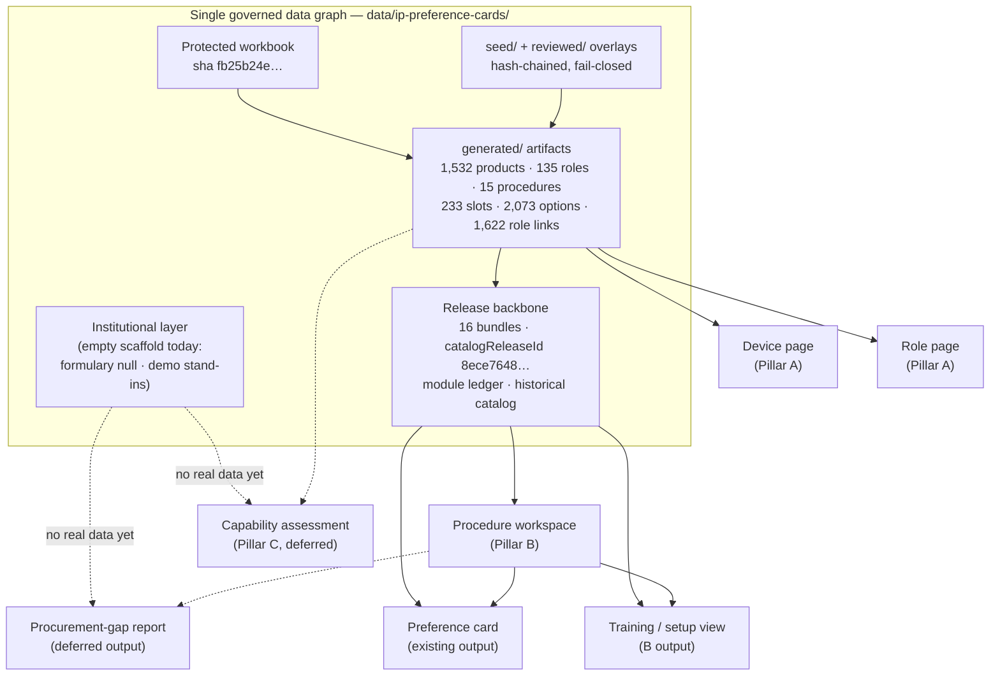

# Device and Procedure Intelligence Platform — product vision

Phase D0 discovery document (2026-08-08) — describes current repository state and proposals. Physician-owner decisions D-01–D-10 were recorded 2026-08-08 in [decision-log.md](./decision-log.md) (D-03 and D-07 accepted with modification, D-10 with bounded scope); no production feature exists yet.

## 1. Strategic premise

The repository's preference-card feature has accumulated a governed data graph that is
more valuable than its single current consumer. Behind the 14 public pages and 10 admin
pages of `/[locale]/preference-cards` sits: 1,532 catalog products (1,331 graded
`verified_source`), 135 clinical roles, 15 procedure templates with 233 equipment slots,
2,073 authored slot options, 1,622 product-role links, 71 cited sources with 1,850
product-source rows, 1,169 FDA GUDID confirmations, 187 raw compatibility statements
with per-rule verification grades, and an immutability backbone of 16 hash-frozen
release bundles, a content-addressed historical catalog (3,289 retained rows), and
append-only card revisions — all built and validated by a deterministic pipeline under
`scripts/ip-preference-cards/` and read at runtime from
`data/ip-preference-cards/generated/` (the feature's de facto database).

The premise of this phase: **that graph is a Device and Procedure Intelligence
Platform waiting for more than one consumer.** Today the only end-user product built on
it is the preference-card builder. The same entities — device, role, procedure, slot,
source, compatibility rule, release — can also answer device-reference questions, procedure-preparation questions, and (eventually) institutional-capability questions.

Three commitments frame everything below:

1. **Preference cards remain the last-mile output.** Nothing proposed here replaces or
   reorganizes the card builder; the proposal is to surface the graph that already feeds
   it. The `/preference-cards/*` routes, the builder, and the admin QA surface are
   preserved as-is (brief recommendation R6; accepted 2026-08-08 as decision D-04).
2. **Do not weaken existing foundations.** The release backbone (append-only
   publication baseline over 54 published entries, guarded by
   `scripts/ip-preference-cards/check-publication-baseline.ts`), the six independent
   product-governance axes, the trust ladder (broad discovery → curated options →
   unreviewed proposals), and the no-LLM deterministic resolver are the platform's
   competitive substance, not incidental plumbing. Every proposed product reads through
   these walls; none bypasses them.
3. **Evidence states drive what may power outputs.** Only authored selectable options,
   approved reviewed family versions, canonical role codes, and release-pinned
   definitions may drive an operational result (a card, a readiness verdict). Proposals,
   candidate-grade products, and draft families may be shown — badged, in authenticated
   contexts — but never drive a result. No product is ever claimed clinically
   equivalent or substitutable for another (brief recommendation R8; accepted
   2026-08-08 as decision D-08).

Companion documents: personas in [user-jobs-and-personas.md](./user-jobs-and-personas.md),
the entity/relationship audit in [data-relationship-audit.md](./data-relationship-audit.md),
the eight-concept relationship taxonomy in [relationship-taxonomy.md](./relationship-taxonomy.md),
the proposed surface map in [information-architecture.md](./information-architecture.md),
the Phase D1 slice in [vertical-slice-spec.md](./vertical-slice-spec.md), and the
quantified readiness audit in [data-readiness-report.md](./data-readiness-report.md)
(artifact: `docs/ip-device-intelligence/data-readiness-audit.json`, regenerated by
`npm run ip-intel:audit`).

## 2. Ten candidate products, three pillars

The phase charter names ten candidate products. They are not ten products to build;
they collapse onto three pillars plus a set of outputs, with the remainder deferred.
This mapping is a proposal pending the physician owner's decision.

| #   | Candidate product                       | Maps to                                       | One-line rationale                                                                                                                                                                                                 |
| --- | --------------------------------------- | --------------------------------------------- | ------------------------------------------------------------------------------------------------------------------------------------------------------------------------------------------------------------------ |
| 1   | Device & Clinical Use Atlas             | **Pillar A** (core)                           | The device/role reference is the entity spine every other surface links into, and it is the data the repo has most of (1,331 verified-source products with citations).                                             |
| 2   | Product Comparison Explorer             | **Pillar A** (view)                           | Role-scoped comparison without equivalence claims already part-exists (`RoleComparisonTable`, spec columns); it is an atlas view, not a separate product.                                                          |
| 3   | Procedure Intelligence Workspace        | **Pillar B** (core)                           | The procedure-first read of slots, modifiers, contingencies, and compatibility is the highest-clinical-value surface, gated by the all-procedures-draft governance state.                                          |
| 4   | Training & Setup Academy                | **Pillar B** (view, deferred as a standalone) | Setup zones, procedural phases, and scenario walkthroughs already exist in the resolver's output; teaching views fold into the workspace and the repo's existing education modules rather than a separate academy. |
| 5   | Preference Card Generator               | **Output of B** (exists today)                | Already built and preserved; becomes one of several last-mile outputs of the workspace rather than the module's organizing principle.                                                                              |
| 6   | Institutional Capability & Gap Analyzer | **Pillar C** (deferred)                       | The requirement side exists (slots × roles), but the institutional side is an empty scaffold — designed-for in the IA, not built.                                                                                  |
| 7   | Formulary & Procurement Intelligence    | Deferred (C-adjacent)                         | `hospital-formulary-staging.json` has 1,221 rows with every institutional field null/false; there is no real institution entity to be intelligent about.                                                           |
| 8   | Shortage & Substitution Navigator       | Deferred                                      | Requires a procurement-substitute review process (relationship taxonomy concept 5) that does not exist; substitution without named clinical review is a claim this repository refuses to make.                     |
| 9   | Device Change-Impact Dashboard          | Deferred (foundation exists)                  | 16 release impact reports and the reconciliation/rebuild diff machinery are a real foundation, but the audience (institutions with saved state at scale) does not exist yet.                                       |
| 10  | Clinical Data Governance Workbench      | Deferred (evolve, don't rebuild)              | The 10 admin QA pages, review workbook round-trips, and proposal queues already are this product; it should evolve with the platform, not be rebuilt.                                                              |

## 3. Pillar evaluations

### 3.1 Pillar A — Device and Clinical Use Atlas

**Core user.** The procedure team preparing and learning — bronchoscopy nurse,
procedure technician, IP fellow — with the interventional pulmonologist as owner and
reviewer (brief recommendation R4, pending decision). Secondarily: any clinician or
trainee who needs vendor-neutral device facts with citations.

**Core job.** "What is this device, exactly? What clinical roles does it serve, in
which procedures is that role required, who else makes devices for the role, and what
is the evidence and US regulatory posture behind each fact?"

**Information displayed.** Product identity (catalog number, GTIN, dimensions,
`spec_json` extras), manufacturer, page-level source citations (71 sources, 1,850
product-source rows — the audit found 100% of authored-option products in all three
exemplar procedures carry at least one source row), the six governance axes
(verification grade, visibility, GUDID distribution evidence, lifecycle context,
slotting scope, 7-value US regulatory axis — never collapsed), role pages for the 135
roles with `selection_guidance` and per-procedure requiredness, cross-manufacturer
role-scoped comparison, and the labeled investigational cohort (the existing emerging
view's framing: breakthrough designation is "an agreement to review, not an
authorization").

**Existing repository data.** `data/ip-preference-cards/generated/catalog-products.json`
(1,532), `roles.json` (135), `product-roles.json` (1,622), `sources.json` (71),
`product-sources.json` (1,850), `manufacturers.json` (48), `gudid-confirmations.json`
(1,169), plus the reviewed governance overlay
`data/ip-preference-cards/reviewed/external-review-corrections.json`. The rendering
layer largely exists: catalog search, product detail, role ("uses") index and detail,
and emerging pages under `src/app/[locale]/preference-cards/catalog/`, all reading the
in-memory catalog singleton in `src/features/preference-cards/server/catalog.ts`.

**Missing data.** 779 of 1,532 products are `hidden` (unverified current US status);
200 are `candidate` grade and 1 `unknown`; dimension gaps among authored-option
products run 20 (EBUS_TBNA) / 58 (THERAPEUTIC_BRONCH) / 89 (CHEST_TUBE) in the audit;
one manufacturer-identity question is explicitly open (Micro-Tech Endoscopy vs
Micro-Tech / Thoracent, unmerged pending owner confirmation in
`src/features/preference-cards/server/manufacturer-aliases.ts`); 187 raw compatibility
statements exist, but 131 of them have both resolved ids null, and the audit found
those unresolved statements reference catalog numbers and marketing names, not role
codes — resolution into typed rules is partial.

**Verification risks.** Displaying regulatory judgments (`not_us_authorized`,
breakthrough states) is an accuracy obligation, not decoration; GUDID artifacts are
frozen at their run date (their summary predates the current 1,532-product catalog) and
drift must be surfaced, not hidden; the public tier must be mechanically restricted to
`verified_source` + `prototype_visible` facts with citations (brief recommendation R5,
pending decision) — a filter discipline, not an editorial habit.

**Route structure (indicative only — no routes are created in D0).**
`/[locale]/devices`, `/[locale]/devices/[productId]`,
`/[locale]/clinical-roles/[roleCode]`, `/[locale]/compare`.

**Public/authenticated boundary.** Public: verified + visible product facts with
citations, role taxonomy, the labeled emerging cohort. Authenticated/admin: hidden and
candidate-grade rows, proposal queues, governance tooling.

**Likely user impact.** A citation-backed, vendor-neutral IP device reference does not
otherwise exist in this form; for the team-and-trainee audience it converts the
catalog from a picker backend into a reference work. It also creates the stable
link targets (device page, role page) every other pillar and the cards themselves point
into.

**Implementation complexity.** Moderate. Read-only views over an existing store; the
work is information architecture, public-tier filtering, and route/locale plumbing —
not new entities, migrations, or resolution logic.

**Relationship to preference cards.** The atlas is the same data the builder's pickers
already query; card line items would deep-link to device and role pages, and the
builder remains the write path. Nothing moves.

### 3.2 Pillar B — Procedure Intelligence Workspace

**Core user.** The IP physician and the procedure team together (R4, pending
decision): the physician as the clinical decision-maker, the nurse/technician as the
people who set the room.

**Core job.** "What does this procedure require, in what order and zone; what changes
under this scenario or modifier; what contingencies must be staged; which requirements
have no verified product yet; and what outputs (card, setup checklist, training view,
gap report) fall out of that?"

**Information displayed.** The 15 procedure templates and their 233 slots with
requiredness, sections, setup zones and procedural phases, dependency rules (7 / 21 /
10 in the three exemplars), the modifier system (30 catalog entries, 20 compiled
definitions), rescue-module reachability (e.g. `HIGH_BLEED_RISK` appending
`MAJOR_AIRWAY_BLEEDING`, the only `add_rescue_module` action, defined in
`src/features/preference-cards/seed/operational.ts`), typed compatibility evaluations,
coverage and readiness, and the golden-scenario walkthroughs — each rendered with the
existing "DRAFT PROTOTYPE — NOT APPROVED FOR CLINICAL USE" convention until clinician
review changes the governance state.

**Existing repository data.** `procedures.json` (15), `procedure-slots.json` (233),
`recipe-modules.json` (19), `procedure-compositions.json` (15), `scenarios.json` (15),
`modifier-catalog.json` (30) / `modifier-definitions.json` (20), `release-bundles.json`
(16 published bundles + 16 pointers), `module-ledger.json` (19), and the deterministic
resolver (`ip-cards-resolver-contract/1`, 10 pinned source files). The three exemplars
are fully composed and release-pinned: `release-ebus-tbna-v1-0`,
`release-therapeutic-bronch-v1-0`, `release-chest-tube-v1-0`.

**Missing data.** Every procedure is `Draft - clinician review required` (EBUS adds
"/pathology") with `clinical_owner` null; role coverage is incomplete (in
THERAPEUTIC_BRONCH, 7 of 29 roles are proposals-only and 3 have no option and no
mapped product anywhere); 31 demo stand-ins substitute for hospital-local roles; the
audit found no Rescue-section slots in any exemplar — rescue content is reachable only
through modifier actions; and 813 slot-option proposals remain unreviewed.

**Verification risks.** Highest of the three pillars: a procedure-first surface reads
as clinical guidance. Draft templates must stay watermarked and non-public until
clinician review (R5, pending decision); readiness verdicts must be driven only by
authored selectable options (R8); the workspace must not present proposals-only or
demo-stand-in coverage as real coverage — the audit's per-role ladder exists precisely
to keep those states distinguishable.

**Route structure (indicative only).** `/[locale]/procedures/[procedureCode]`,
`/[locale]/procedures/[procedureCode]/readiness`.

**Public/authenticated boundary.** Authenticated / public-unlisted (as
`/preference-cards` is today: direct link, noindex, hidden from navigation, per
`src/lib/site-auth/access.ts`) until clinician review; admin for governance views.

**Likely user impact.** Highest clinical value: it turns the graph into team
preparation, contingency planning, and training material — the questions a charge
nurse and a fellow actually ask before a case — instead of exposing them only through
the card wizard's five steps.

**Implementation complexity.** Moderate-to-high. The resolver, release backbone, and
scenario machinery exist; the workspace is a reorganized read of them plus new views
(readiness rollups, contingency browsing). No new resolution logic, but real design
work to show draft state honestly.

**Relationship to preference cards.** The card becomes one output button among several
(card, setup/nursing checklist, training view, procurement-gap report). The builder,
its release pinning, and its save path are unchanged; the workspace links into the
builder rather than replacing it.

### 3.3 Pillar C — Institutional Capability & Gap Analyzer

**Core user.** IP program director, procurement / value-analysis staff, nurse manager
— the people who answer "can our program do this procedure, and what would it take?"

**Core job.** "Given what this institution actually stocks, which procedures are fully
equipped, where are the gaps by slot and role, and what would acquiring or losing a
device change?"

**Information displayed (when buildable).** Per-procedure capability rollups (slots ×
institutional stock), gap lists by role with requiredness, and the procurement-gap
report as a generated output.

**Existing repository data.** Only the requirement side and a scaffold:
`hospital-formulary-staging.json` (1,221 rows — institutional fields all null/false;
the audit found exactly one populated local field repo-wide, an EBUS needle row
`PRD-0D6E4DB711` with `local_notes` "Do not procure; historical traceability only."),
31 demo stand-ins (`data/ip-preference-cards/seed/demo-stand-ins.json`), a fictional
"Demo IP Program" profile, and equipment sets in browser localStorage
(`ip-preference-cards:equipment-sets:v1`). The type-level boundary already
distinguishes release-pinned vs hospital-local-current context fields
(`src/features/preference-cards/domain/release-bundle.ts`), so the architecture is
designed for this pillar.

**Missing data.** Everything institutional: there is no institution entity anywhere in
the repository; no real formulary rows (0 carried / 0 preferred across all three
exemplars' role intersections: 107 / 60 / 377 rows all empty); no per-institution
persistence; no procurement-substitute or local-formulary groups (relationship
taxonomy concepts 5 and 6 — both explicitly nonexistent by design until a review
process exists).

**Verification risks.** A capability verdict multiplies two uncertainties: draft
requirement templates × absent stock data. Any substitution or "close enough" logic
would be an unreviewed clinical claim. Institutional data is also the first genuinely
private data class in the graph (procurement posture, par levels), demanding
institution-scoped access design before ingestion.

**Route structure (indicative only).** `/[locale]/institution/capabilities`.

**Public/authenticated boundary.** Authenticated and institution-scoped only; never
public.

**Likely user impact.** Potentially large operational value, but unmeasurable today —
there is no data to analyze and no institutional user in the system.

**Implementation complexity.** Highest: new entities, migrations, multi-tenancy, and a
data-ingestion relationship with at least one real institution. All of this is out of
scope for D0 and blocked regardless of engineering effort.

**Relationship to preference cards.** When real, it would let card readiness and the
demo stand-ins reflect an actual room; until then, cards correctly resolve against the
demo profile and say so.

## 4. Recommendation (accepted 2026-08-08 as decisions D-01 and D-09)

Proposed per the shared brief (R1–R3) and accepted by the physician owner on
2026-08-08 — with the D-03 modification that every new route stays public-unlisted
and noindex during Phase D1: **Pillar A primary, Pillar B secondary, Pillar
C deferred, preference cards remain an output.** The argument is value + readiness +
risk together — explicitly not ease of implementation alone:

- **A primary.** Not because it is easiest, but because it is the only pillar whose
  data is already at displayable evidentiary strength (1,331 of 1,532 products
  verified-source, every authored-option product in the three exemplars source-backed,
  1,169 GUDID confirmations), whose content is lowest clinical risk (vendor-neutral
  facts with citations, no recommendations), and whose output — device and role pages —
  is the entity spine B, C, and the cards all link into. Building A first makes every
  later surface cheaper _and_ safer; that compounding value, not effort, is the case.
- **B secondary.** It is the highest-clinical-value surface and most of its machinery
  exists, but every procedure template is draft with no clinical owner. Its gate is
  governance, not engineering: it ships authenticated/unlisted with draft watermarks,
  and its promotion to a broader audience is a clinician-review milestone, not a
  release date.
- **C deferred.** Value is real but unrealizable: the institutional layer is an empty
  scaffold and no institution entity exists. Building UI over absent data would
  manufacture the appearance of capability analysis — a risk, not a product. The IA
  keeps C's seams (the pinned-vs-hospital-local field boundary already in the domain
  types) so deferral costs nothing structurally.
- **Cards remain an output.** The builder is the proven, guarded write path (release
  pinning, append-only revisions, reviewed rebuild). Reorganizing the platform around
  it would invert the dependency; keeping it as the last mile preserves every
  invariant while letting the graph serve more readers.

Deferred candidates (7, 8, 9, 10 and standalone 4) follow R9: each lacks either its
data (formulary, shortage), its audience (change-impact), or its justification for a
rebuild (governance workbench). Phase D1, if approved, is the read-only vertical slice
in [vertical-slice-spec.md](./vertical-slice-spec.md) over EBUS_TBNA,
THERAPEUTIC_BRONCH, and CHEST_TUBE.

## 5. Representative user journeys

Three journeys, one per exemplar procedure, each asking the four question types the
platform must answer. Slot, role, and scenario details below are verified against
`data/ip-preference-cards/generated/` and the Phase D0 audit artifact.

### 5.1 EBUS-TBNA (`EBUS_TBNA`, release `release-ebus-tbna-v1-0`)

An IP fellow preparing for a staging bronchoscopy with rapid on-site evaluation.

- **Device question** (atlas): "Which EBUS-TBNA needles are verified, and what do
  their sources say?" — 15 slots (7 required / 4 conditional / 4 optional) across
  sections Imaging, Platform, Sampling, Scope accessory, Suction; the linear EBUS
  scope is deliberately first in requirement order ("the defining instrument");
  reviewed EBUS decisions approved FNA/FNB needle options and an installed-base EBUS
  scope. 61 distinct authored-option products (51 verified_source / 9 candidate /
  1 unknown), all 61 source-backed, 16 GUDID-confirmed.
- **Procedure question** (workspace): "What changes when ROSE and molecular studies
  are requested?" — the golden scenario `ebus-rose-molecular` adds the `ROSE` and
  `SPEC_MOLECULAR` modifiers; 13 modifiers are allowed including `HIGH_BLEED_RISK`,
  which is the one path that appends the `MAJOR_AIRWAY_BLEEDING` rescue module.
- **Institutional question** (capability, deferred): "Do we stock a suitable specimen
  workflow?" — today unanswerable: the role ladder shows `GENERIC_SPECIMEN` and
  `RADIATION_PROTECTION` with no authored option, no proposal, and no mapped product
  anywhere; the formulary intersection is 60 rows with 0 carried / 0 preferred and one
  populated local field (the do-not-procure needle note).
- **Operational question** (output): "Print the room's card" — the existing builder
  resolves this scenario today (readiness `complete_with_warnings` against the demo
  profile), with 3 roles covered by demo stand-ins (a cross-cutting overlay;
  `VIDEO_PROCESSOR` among them also has selectable authored options).

### 5.2 Therapeutic bronchoscopy (`THERAPEUTIC_BRONCH`, release `release-therapeutic-bronch-v1-0`)

A team staging for central airway obstruction with a high bleeding risk.

- **Device question**: "Which airway stents and energy devices are in the catalog, at
  what evidence grade?" — 378 distinct authored-option products (330 verified_source /
  48 candidate), all source-backed, 132 GUDID-confirmed; 29 slots (3 required / 21
  conditional / 5 optional) across 11 sections including Energy, Stent, Dilation,
  Cryotherapy, Retrieval.
- **Procedure question**: "What must be staged for major airway bleeding, and what
  does the APC setup require?" — the golden scenario `central-airway-obstruction`
  appends the `MAJOR_AIRWAY_BLEEDING` rescue module via `HIGH_BLEED_RISK` and contains
  a deliberately blocking APC platform/probe compatibility mismatch — the workspace's
  teaching case that compatibility evaluation refuses rather than guesses. 21
  dependency rules — the densest contingency structure of the three exemplars.
- **Institutional question** (deferred): "Could our program add laser resection?" —
  today the whole reviewed laser/imaging round (`LASER_CONSOLE`, `LASER_FIBER`,
  `LASER_SAFETY_EQUIPMENT`, `TOMOSYNTHESIS_NAVIGATION_SYSTEM`, `FLUOROSCOPY_C_ARM`,
  plus `ENERGY_PLATFORM` and `GENERIC_SUCTION`) is proposals-only, and
  `LASER_RESISTANT_ETT` has no mapped product at all — an honest record of the
  reviewed decision not to author fictitious commercial products.
- **Operational question**: "Card plus a procurement-gap list" — the card resolves
  today (7 demo stand-ins); the gap list is exactly the proposals-only and unmapped
  role sets above, which the platform can already enumerate but must label as
  draft/unreviewed.

### 5.3 Chest tube insertion (`CHEST_TUBE`, release `release-chest-tube-v1-0`)

A nurse setting up for bedside chest tube placement, small-bore technique.

- **Device question**: "Which drainage systems are clinician-reviewed?" — CHEST_TUBE
  carries the only proposal-derived options ever promoted to selectable: the 18
  reviewed drainage upserts (explicitly nondefault). 113 distinct authored-option
  products (83 verified_source / 30 candidate), all source-backed, 60 GUDID-confirmed;
  13 slots (3 required / 7 conditional / 3 optional).
- **Procedure question**: "Small-bore vs large-bore, and what does the kit cover?" —
  golden scenario `chest-tube`: `TECH_CHEST_TUBE_SMALL_BORE` / `_LARGE_BORE` are
  mutually exclusive; `DIGITAL_DRAINAGE` replaces the `GENERIC_DRAINAGE_UNIT` role;
  kit BOM suppression removes lines the kit already contains. 10 dependency rules; no
  rescue module is reachable for this procedure.
- **Institutional question** (deferred): "What do we actually carry on the pleural
  cart?" — 107 formulary rows intersect the roles, 0 carried / 0 preferred / 0 local
  fields; `DRESSING_SECUREMENT` has no option, no proposal, and no product mapped
  anywhere — the reviewed "do not author fictitious commercial products" decision made
  visible.
- **Operational question**: "Card for the cart, sized at bedside" — the card resolves
  today; 89 dimension gaps among this procedure's authored-option products are the
  largest spec-completeness deficit of the three exemplars, which limits
  dimension-based display (not resolution).

### 5.4 One graph, seven surfaces

### 5.5 Data sufficiency today, per journey

Grounded in the Phase D0 audit (`docs/ip-device-intelligence/data-readiness-audit.json`;
provenance workbook sha `fb25b24e…`, catalog release `8ece7648…`):

| Journey question           | EBUS_TBNA                                                                                                 | THERAPEUTIC_BRONCH                                                                                                                             | CHEST_TUBE                                                                                                           |
| -------------------------- | --------------------------------------------------------------------------------------------------------- | ---------------------------------------------------------------------------------------------------------------------------------------------- | -------------------------------------------------------------------------------------------------------------------- |
| Device (atlas)             | **Sufficient**: 51/61 products verified, 61/61 sourced; 20 dimension gaps; 2 compat rules grade `unknown` | **Sufficient**: 330/378 verified, 378/378 sourced; 58 dimension gaps; 202 of 378 products hidden pending status verification                   | **Sufficient**: 83/113 verified, 113/113 sourced, all 13 compat rules verified; 89 dimension gaps limit spec display |
| Procedure (workspace)      | **Sufficient with draft watermark**: 11/15 roles selectable; 2 proposals-only, 2 unmapped                 | **Partial**: 14/29 roles selectable; 7 proposals-only (entire laser/imaging round), 3 unmapped; richest contingency data (21 dependency rules) | **Sufficient with draft watermark**: 8/13 roles selectable; 1 proposals-only, 1 unmapped                             |
| Institutional (capability) | **Not sufficient**: 60 formulary rows, 0 carried/preferred                                                | **Not sufficient**: 377 rows, all empty                                                                                                        | **Not sufficient**: 107 rows, all empty                                                                              |
| Operational (card/output)  | **Sufficient (demo-scoped)**: resolves today; 3 demo stand-ins                                            | **Sufficient (demo-scoped)**: resolves today; 7 demo stand-ins; 36 proposals + 11/18 draft families pending review                             | **Sufficient (demo-scoped)**: resolves today; 3 demo stand-ins; 117 proposals pending review                         |

## 6. Success metrics (proposed; each measurable, with its measuring source)

### User value

- **Reference reach**: distinct device and role pages viewed per month, and
  atlas-page → builder-session conversion — measured by the existing site analytics
  events under module id `preference-cards` (`resolveSiteModuleId` in
  `src/lib/site-auth/access.ts`), extended with the new area's module id.
- **Preparation completion**: share of builder sessions reaching a saved card, and
  median time from first workspace view to saved card — measured from
  `ip_user_preference_cards` rows joined to analytics session events.
- **Custom-item fallback rate**: share of saved-card line items that are free-text
  custom items (a proxy for "the catalog didn't have what I needed") — measured from
  `builder_inputs.customItems` in saved cards.

### Data quality

- **Verification-grade mix**: verified_source share of catalog products (baseline
  1,331 / 1,532) and of authored-option products per procedure (baselines 51/61,
  330/378, 83/113) — measured by `npm run ip-intel:audit` (byte-stable artifact,
  rerun-diffable).
- **Role-coverage ladder**: count of proposals-only and no-option-no-proposal roles
  per procedure (baselines: EBUS 2+2, THERAPEUTIC 7+3, CHEST_TUBE 1+1) — measured by
  the same audit's per-role ladder.
- **Dimension completeness**: dimension gaps among authored-option products
  (baselines 20 / 58 / 89) — audit artifact.
- **Compatibility resolution**: resolved typed rules vs the 187 raw statements, and
  rules at `unknown` grade (baseline: 2 unknown in EBUS, 1 candidate in
  THERAPEUTIC) — audit artifact plus `compatibility-raw.json`.
- **Review-queue burn-down**: unreviewed slot-option proposals (baseline 813 global;
  12 / 36 / 117 in the exemplars) — `slot-product-option-proposals.json` counts via
  `ip-cards:validate-data` and the audit.

### Clinical safety

- **Zero unreviewed drivers**: no card or readiness result ever driven by a proposal,
  candidate-grade product, or draft family — enforced and therefore measurable as a
  permanent zero via `resolveCatalogPick` refusals and the jest suites
  (`npx jest scripts/ip-device-intelligence --runInBand` plus the preference-cards
  suites); any nonzero is a release blocker, not a trend.
- **Draft-state visibility**: 100% of procedure-derived surfaces carry the draft
  watermark while `procedures.json` status begins "Draft -" — measured by asserting
  the watermark against the status field in component tests.
- **Governance-state progression**: procedures with a named `clinical_owner` and a
  non-draft governance state (baseline 0 of 15; all 16 bundles governanceState
  draft) — `procedures.json` and `release-bundles.json`.
- **Publication integrity**: `ip-cards:release:check-base` violations on the 54
  published entries (baseline 0; 54 unchanged) — the check's own output.

### Institutional efficiency (activates only if Pillar C is approved and real data exists)

- **Formulary population**: institutional fields populated in the formulary layer
  (baseline: 1 populated local field repo-wide) — formulary artifact or its Supabase
  successor.
- **Stand-in retirement**: demo stand-ins replaced by real institutional mappings
  (baseline 31 stand-ins) — `demo-stand-ins.json` vs institution records.
- **Capability coverage**: per-procedure share of required slots satisfiable from
  institutional stock, and procurement-gap items closed per quarter — the capability
  rollup itself, once an institution entity exists; until then this metric is
  explicitly unmeasurable and reported as such.

---

_All counts in this document come from the Phase D0 shared brief (verified 2026-08-08
against branch `claude/device-intelligence-discovery` at the `origin/main` merge
state) or from `docs/ip-device-intelligence/data-readiness-audit.json`. No statement
in this document asserts that any product is clinically equivalent to or substitutable
for any other._
