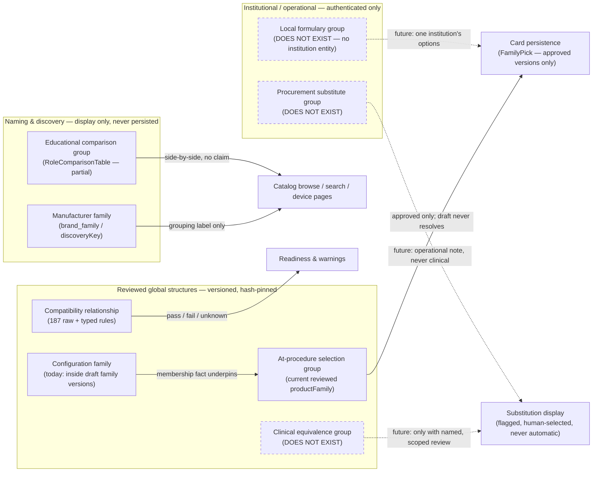

# Relationship taxonomy: eight concepts the word "family" must stop carrying

Phase D0 discovery document (2026-08-08) — describes current repository state and proposals. Physician-owner decisions D-01–D-10 were recorded 2026-08-08 in [decision-log.md](./decision-log.md) (D-03 and D-07 accepted with modification, D-10 with bounded scope); no production feature exists yet.

This document defines the eight distinct product-relationship types the Device and Procedure
Intelligence Platform would need, shows why the single `productFamily` concept cannot carry all of
them, and specifies the evidence-and-safety display model that governs what each relationship may
and may not drive. Companion documents: [data-relationship-audit.md](./data-relationship-audit.md)
(the current data graph), [information-architecture.md](./information-architecture.md) (where these
relationships would surface), [vertical-slice-spec.md](./vertical-slice-spec.md) (the proposed
first build), [product-vision.md](./product-vision.md), and
[data-readiness-report.md](./data-readiness-report.md).

Two constraints hold throughout and are restated at the end:

1. **No conversion of existing families in this phase.** The reviewed `productFamily` model stays
   exactly as it is; new relationship types would be separate reviewed structures added later.
2. **No LLM-created equivalence or substitution claims, ever.** Every relationship that could
   influence what reaches a patient requires a named human review.

---

## 1. Evidence: one term, at least four meanings

The repository already demonstrates — in its own code comments and data — that "product family" is
being asked to represent several different things at once. None of this is speculative; each
meaning below is documented in the repository.

### 1.1 `brand_family` is a marketing label, not a grouping

Every row in `data/ip-preference-cards/generated/catalog-products.json` (1,532 products) carries a
`brand_family` string sourced from the protected workbook. It records how a manufacturer names a
line ("Ultraflex", "superDimension"). It is a naming fact with no membership list, no review, and
no stability guarantee.

### 1.2 The discovery `familyKey` over- and under-merges — by its own admission

`src/features/preference-cards/domain/product-family.ts` computes a discovery grouping from
`manufacturerGroup | familyName | productKind`, where `familyName` falls back
`brand_family → subcategory → product name`. The file's own header documents two real defects:

- **BD Safe-T-Centesis (split + over-merge).** `PIG1260TSP` and `PIG1280TSP` are two sizes of the
  same PLUS tray, yet they land in _different_ discovery families, while one of them merges with
  every other BD thoracentesis catheter including the 6 Fr tray (`product-family.ts`, header
  comment).
- **Argyle chest tubes (over-merge).** Eight straight PVC thoracic catheters from 16 Fr to 40 Fr
  plus a right-angle 28 Fr all share subcategory "Surgical Chest Tube" with no `brand_family`, so
  the label-derived key merges a 16 Fr straight tube with a 40 Fr and a right-angle variant — and
  none of the rows records `french_size`, so a size-range description would print empty
  (`product-family.ts`, header comment).

The field was deliberately renamed `discoveryKey` — "the two are the same string today", the
comment notes, but the rename exists so the value "cannot be passed where a persistable identity is
required." Legacy version-3 cards that recorded a family by this key are intentionally
unmigratable: `LEGACY_FAMILY_IDENTITY_MESSAGE` in the same file forbids manufacturer+role
matching, label similarity, and "closest family" guessing.

### 1.3 Reviewed family versions are really at-procedure selection groups

The 18 entries in `data/ip-preference-cards/generated/product-family-versions.json` (all
`governanceState` `draft`, none approved) exist for one purpose: letting a card say "this reviewed
line, size chosen at the time of the procedure." The consuming code is
`src/features/preference-cards/domain/family-pick.ts` (a `FamilyPick` pins
`productFamilyVersionId` + `catalogReleaseId` + `definitionHash` + `roleCode`) and
`src/features/preference-cards/domain/size-at-procedure.ts`, which restricts the mechanism to
airway-stent roles via the pattern `/^AIRWAY_STENT_(?!SIZING_DEVICE$)/`.

Each version's `reviewBasis` states explicitly that this is _not_ an equivalence claim: "Clinical
membership review is PENDING — no individual device in this line has been clinically reviewed for
interchangeability within it" (verbatim from
`family-boston-scientific-ultraflex-airway-stent-sems-covered-v1-0`).

### 1.4 Size-at-procedure is a distinct clinical behavior, not a grouping

A family pick deliberately leaves the hospital item's `attributes` empty and its catalog number
null so compatibility rules resolve `unknown` rather than passing — "the honest answer until a
size is picked" (`family-pick.ts`). Deferring size selection to the procedure is a clinical
workflow statement about _when_ a choice is made, orthogonal to _which products form a line_.

**Conclusion.** One term currently gestures at: a marketing label (1.1), a label-derived browse
grouping with known defects (1.2), a reviewed selection group for card persistence (1.3), and a
deferred-choice clinical workflow (1.4) — and adjacent needs (equivalence, procurement
substitution, local formulary, education, compatibility) have no term at all. The taxonomy below
separates them. Per brief recommendation R7 (accepted 2026-08-08 as decision D-06), `productFamily` keeps its
real meaning — the reviewed at-procedure selection group — and everything else gets its own named
structure.

---

## 2. The eight relationship types

Each type is defined with the same block so the differences are auditable. "Exists today?" cites
repository evidence or states plainly that the concept does not exist and must not be inferred.

### 2.1 Manufacturer family

- **Intended meaning:** how a manufacturer names and markets a product line. A naming fact about
  branding, nothing more.
- **Allowed member differences:** anything the manufacturer chooses to sell under the name —
  sizes, configurations, generations, even different intended uses. The platform does not control
  this vocabulary.
- **Prohibited member differences:** none are enforceable, which is precisely why this type may
  never carry equivalence meaning. Its only integrity requirement is fidelity to the cited source.
- **Global or procedure-specific:** global.
- **Institution-specific:** no.
- **Clinical review required:** no — it is a sourced naming fact, not a clinical claim. Source
  citation is still required (the catalog's product–source rows already provide this).
- **Versioning required:** no formal versioning; recomputed from catalog labels each build. A
  brand rename is a new fact, not a mutation of a reviewed structure.
- **May users persist it in a card:** no, never. The unmigratable legacy `family:`/`family-role:`
  card identifiers are the standing precedent for why label-derived keys must not be persisted.
- **May it drive substitutions:** never.
- **Difference from the current reviewed product-family model:** the reviewed model is an explicit
  sorted member list pinned to a catalog release and content-hashed; a manufacturer family is a
  mutable string with no member list at all.
- **Exists today?** Yes — the `brand_family` field on rows of
  `data/ip-preference-cards/generated/catalog-products.json` and the `discoveryKey` grouping in
  `src/features/preference-cards/domain/product-family.ts`, with the §1.2 defects documented
  in-file.

### 2.2 Configuration family

- **Intended meaning:** one engineered device offered in multiple sizes or configurations — same
  design, same manufacturer, same intended use, differing only in catalogued dimensions.
- **Allowed member differences:** dimensional and packaging attributes only (diameter, length,
  French size, gauge, working length, kit contents variants explicitly reviewed as the same
  device).
- **Prohibited member differences:** different device design or mechanism, different manufacturer,
  different intended use, different regulatory pathway, a new generation with changed behavior.
- **Global or procedure-specific:** global (a catalog fact about the device line).
- **Institution-specific:** no.
- **Clinical review required:** yes — membership is a reviewable claim ("these really are one
  device in sizes"), and the existing draft families show why: structural homogeneity checks
  passed, but clinical membership review is explicitly pending.
- **Versioning required:** yes — explicit member list, content-hashed, pinned to the catalog
  release it was reviewed against, exactly as `ReviewedProductFamilyVersion` already works
  (`src/features/preference-cards/domain/product-family.ts`).
- **May users persist it in a card:** not directly. Persistence happens through an at-procedure
  selection group (§2.3) built on top of it.
- **May it drive substitutions:** no. Sizes of one device are not substitutes for one another —
  size is clinically load-bearing.
- **Difference from the current reviewed product-family model:** structurally this is what the 18
  reviewed family versions _contain_; the current model fuses this membership fact with the
  §2.3 selection behavior into one object. Separating them lets a line be documented without
  authorizing deferred-size selection.
- **Exists today?** Partially — the 18 draft versions in
  `data/ip-preference-cards/generated/product-family-versions.json` are configuration-family
  memberships in substance (e.g., 18 Ultraflex covered-stent variants sharing product kind and
  coverage), but none is approved and the type is not yet distinguished from §2.3.

### 2.3 At-procedure selection group

- **Intended meaning:** a reviewed group a clinician may commit to _before_ the procedure, with
  the exact size or configuration chosen _during_ the procedure once measurement exists — the
  airway-stent case: "diameter and length are chosen once the stenosis is measured"
  (`src/features/preference-cards/domain/family-pick.ts`).
- **Allowed member differences:** size and configuration within one reviewed line, for one role.
- **Prohibited member differences:** cross-manufacturer members; members serving a role outside
  the group's reviewed `roleCodes` (role codes are part of identity — the same brand line serves
  `AIRWAY_STENT_SILICONE_STRAIGHT` and `AIRWAY_STENT_SILICONE_Y` as _different_ member sets, per
  `product-family.ts`); members that change device kind.
- **Global or procedure-specific:** the group definition is global; its _use_ is per-slot within a
  procedure, and the role gate is deliberate
  (`allowsSizeAtProcedure` in `src/features/preference-cards/domain/size-at-procedure.ts` admits
  only airway-stent roles, excluding the sizing device).
- **Institution-specific:** no.
- **Clinical review required:** yes — `assertProductFamilySelectableForNewCard` allows only
  `approved` versions; draft never resolves from a save-time pin ("a save-time caller is
  untrusted", `product-family.ts`), while retired still resolves for already-pinned cards.
- **Versioning required:** yes — the four-field pin (`productFamilyVersionId`,
  `catalogReleaseId`, `definitionHash`, `roleCode`), each independently verified on
  reconstruction.
- **May users persist it in a card:** yes — this is the _only_ relationship type designed for card
  persistence (`FamilyPick`). Note the current state: because all 18 versions are draft, no family
  is presently selectable for a new card; the mechanism exists, fully guarded, awaiting review.
- **May it drive substitutions:** no. It drives deferred size choice within one line, not
  replacement of one product by another.
- **Difference from the current reviewed product-family model:** none — this _is_ the current
  model's real meaning, which brief recommendation R7 (accepted 2026-08-08 as decision D-06)
  keeps as-is under a clarified name.
- **Exists today?** Yes — `family-pick.ts`, `size-at-procedure.ts`, the
  `ReviewedProductFamilyPin` verification path in `product-family.ts`, and the 18 draft versions.

### 2.4 Clinical equivalence group

- **Intended meaning:** products a named clinical reviewer has judged interchangeable **for one
  explicit role and use context**, with the review recording its scope, the differences it
  considered, and the differences it deems clinically acceptable.
- **Allowed member differences:** only those the review explicitly names as acceptable for that
  role (manufacturer, catalog number, dimensions within reviewed bounds).
- **Prohibited member differences:** any difference the review did not address; different intended
  use; any unreviewed member; and any generalization across roles — equivalence for one role never
  implies equivalence for another.
- **Global or procedure-specific:** scoped per role/use context; may be further scoped to a
  procedure.
- **Institution-specific:** no — it would be a global clinical claim (institutions may consume it
  via §2.6, never author it into the global layer).
- **Clinical review required:** mandatory and named — reviewer identity, review basis, scope, and
  documented differences, at least as strict as the existing family `reviewBasis` requirement
  ("Approval is a claim that somebody looked at the membership; the file has to say what they
  looked at", `product-family.ts`).
- **Versioning required:** yes — versioned, content-hashed, release-pinned like reviewed families.
- **May users persist it in a card:** only a future _approved_ version, and not in this phase.
- **May it drive substitutions:** it is the only type that could ever justify a clinically framed
  substitution, strictly within its reviewed scope — and no such group exists.
- **Difference from the current reviewed product-family model:** the current model explicitly
  disclaims this meaning; every `reviewBasis` says interchangeability review is pending. An
  equivalence group makes the claim the family model refuses to make, which is why it must be a
  separate structure with its own review.
- **Exists today?** **Does not exist — must not be inferred.** Nearest textual neighbors that must
  NOT be read as equivalence: the 18 reviewed drainage slot options whose reason text states "no
  brand or model preference is implied and stocking remains hospital-local"
  (`data/ip-preference-cards/reviewed/external-review-completed-implementation.json`); `role_fit`
  values in `product-roles.json` (a device can serve a role ≠ devices are interchangeable); and
  draft family memberships.

### 2.5 Procurement substitute group

- **Intended meaning:** an operational purchasing relationship — "if product A is unavailable,
  product B can be procured for this role, possibly with a documented workflow change." A supply
  statement, never a clinical claim.
- **Allowed member differences:** manufacturer, price, packaging, ordering channel, and workflow
  differences _provided each workflow difference is explicitly recorded on the relationship_.
- **Prohibited member differences:** any difference presented as clinically neutral without a
  §2.4 review; substitutes that silently change which clinical role is satisfied.
- **Global or procedure-specific:** may be authored globally (market fact: "B replaced A") or
  institutionally; consumption is institution-facing.
- **Institution-specific:** typically yes.
- **Clinical review required:** the _procurement_ grouping needs operational review; the moment a
  substitute changes clinical workflow or device behavior, clinical sign-off is additionally
  required. The relationship must always render as procurement information, never as equivalence.
- **Versioning required:** yes — shortage relationships are time-bound and need effective dates
  and retirement.
- **May users persist it in a card:** no. Cards persist chosen items; a substitute group could at
  most _surface_ an alternative for a human to choose explicitly.
- **May it drive substitutions:** only as flagged operational suggestions requiring explicit human
  selection; never automatic, never clinically framed.
- **Difference from the current reviewed product-family model:** families group one line from one
  manufacturer; substitutes cross manufacturers and exist precisely because products are _not_ the
  same.
- **Exists today?** **Does not exist — must not be inferred.** The nearest latent hook is the
  `substitutionClass` enum on `HospitalRoleOption`
  (`src/features/preference-cards/domain/types.ts`, values including `shortage_substitute` and
  `no_substitute`), but that is a per-institution ranking annotation on a single option, not a
  substitute group, and today it is populated only for the fictional Demo IP Program.

### 2.6 Local formulary group

- **Intended meaning:** one institution's own operational statement: "at our institution, these
  are the items we stock and treat as our options for role R." Local governance, local scope.
- **Allowed member differences:** whatever that institution's own clinical/value-analysis
  governance accepts — bounded to one role and one institution.
- **Prohibited member differences:** none imposed centrally, but the group must never leak into
  global display, never be reused across institutions, and never be presented as a
  manufacturer-level or platform-level equivalence.
- **Global or procedure-specific:** neither — institution-scoped (potentially per site/location,
  matching the existing `organizationId`/`siteId`/`locationId` scoping on `HospitalItem`).
- **Institution-specific:** yes, by definition.
- **Clinical review required:** yes, but by the institution's own governance, not by the platform
  author. The platform records who approved it locally.
- **Versioning required:** yes — formularies change, and saved cards must not drift with them.
  The existing `selectionsAreExplicit` mechanism (a re-ranked formulary can no longer silently
  change what a saved card asks for, `src/features/preference-cards/domain/types.ts`) is the
  precedent.
- **May users persist it in a card:** the chosen _item_ persists as a snapshot (as today); the
  group itself does not.
- **May it drive substitutions:** only inside that institution, under that institution's
  governance, rendered as local policy.
- **Difference from the current reviewed product-family model:** families are global reviewed
  catalog structures; a formulary group is a local operational overlay with a different reviewer,
  different scope, and different lifetime.
- **Exists today?** **Does not exist — must not be inferred.** There is no institution entity
  anywhere in the repository. `data/ip-preference-cards/generated/hospital-formulary-staging.json`
  is an empty scaffold (1,221 rows; `hospital_carries`/`preferred` false and every local field
  null), equipment sets live in browser localStorage
  (`ip-preference-cards:equipment-sets:v1`), and the only populated "institution" is the
  explicitly fictional Demo IP Program.

### 2.7 Educational comparison group

- **Intended meaning:** a side-by-side comparison assembled to teach or to support browsing —
  "here are the devices serving this role, with their specifications and evidence states" —
  making no equivalence claim.
- **Allowed member differences:** any; heterogeneity is the point. Missing specifications are
  shown as missing.
- **Prohibited member differences:** none — but prohibited _presentations_: implied
  interchangeability, implied ranking, hidden verification states, or spec values displayed
  without their evidence grade.
- **Global or procedure-specific:** global (role- or question-scoped); may be embedded in
  procedure teaching contexts.
- **Institution-specific:** no.
- **Clinical review required:** no equivalence review, because no equivalence claim is made.
  Factual accuracy is still governed by the existing source-citation layer (71 sources, 1,850
  product–source rows).
- **Versioning required:** not as a reviewed structure; a rendered comparison should state the
  catalog release it reflects.
- **May users persist it in a card:** no.
- **May it drive substitutions:** never.
- **Difference from the current reviewed product-family model:** a comparison is a _view_, not an
  identity; it has no member list to review because inclusion asserts nothing beyond "serves this
  role in the catalog."
- **Exists today?** Partially —
  `src/features/preference-cards/components/RoleComparisonTable.tsx` renders role-scoped
  comparisons grouped by manufacturer with spec columns, per-item `VerificationBadge`, and an
  explicit missing-value label; `ProductFamilyTable.tsx` sits alongside it. What does not exist is
  authored cross-role or thematic comparison content.

### 2.8 Compatibility relationship

- **Intended meaning:** a directed, typed statement between two devices or roles — requires /
  supports / conflicts / changes-workflow — with an evidence grade. ("Tool OD must fit scope
  working channel"; "this catheter requires this robotic platform.")
- **Allowed member differences:** not membership-based; each relationship is a pair (or
  role-to-role attribute rule) with operator, attributes, unit, severity, and message.
- **Prohibited member differences (prohibited readings):** symmetry and transitivity — "A fits C"
  and "B fits C" never implies anything about A vs B; and silent passes — a missing attribute must
  resolve `unknown`, never pass (`src/features/preference-cards/domain/evaluate-compatibility.ts`
  emits `compatibility_unknown` warnings).
- **Global or procedure-specific:** global, optionally context-gated by modifier codes
  (`modifierCodes[]` on `TypedCompatibilityRule` scopes a rule to selected modifiers).
- **Institution-specific:** no.
- **Clinical review required:** per-rule evidence grading, already practiced: raw statements carry
  per-rule `verification_status`, and the completed external review added 7 rules at
  `verified_source` versus the proposal round's single `candidate`-grade rule
  (`data/ip-preference-cards/reviewed/external-review-completed-implementation.json`).
- **Versioning required:** yes — rule sets are pinned by hash into release bundles (the
  compatibility-rules definition-set pin in
  `data/ip-preference-cards/generated/release-bundles.json`).
- **May users persist it in a card:** the _evaluation result_ persists on card items
  (`compatibilityState`: `pass`/`fail`/`unknown`/`not_evaluated`), not the rule itself.
- **May it drive substitutions:** no. It may warn or block a combination; it never proposes a
  replacement.
- **Difference from the current reviewed product-family model:** entirely different shape —
  directed pairwise claims with operators and evidence, versus an undirected membership list.
- **Exists today?** Yes — 187 raw statements in
  `data/ip-preference-cards/generated/compatibility-raw.json` and the typed rule engine in
  `evaluate-compatibility.ts` with per-rule severity and `evidenceSourceId`.

---

## 3. Proposed relationship model (diagram)

Dashed nodes and edges denote structures that **do not exist today** and are proposals pending the
physician owner's decision. Solid paths exist in the repository now.

What each type may never drive, compactly: manufacturer families and educational comparisons may
never drive persistence, readiness, or substitution; configuration families may never drive
substitution; at-procedure selection groups may never drive substitution; compatibility
relationships may never propose substitutes; and nothing may drive a clinically framed
substitution except a future approved clinical equivalence group — which does not exist.

---

## 4. Evidence-and-safety display model

The brief (§6) fixes nine evidence states, strongest to weakest. The table below proposes a badge
or label for each (badge copy remains a proposal; the visibility and drive columns reflect the
decisions recorded 2026-08-08), where it may be shown, and what it may
drive. Badge copy must always carry the axis it came from — verification grade, visibility,
distribution, lifecycle, slotting scope, and regulatory status are six independent axes in the
catalog and are never collapsed into one indicator.

| #   | Evidence state                                                                                          | Proposed badge / label                      | Visibility                                                                                                    | May drive a card / readiness result?                                                                                                                |
| --- | ------------------------------------------------------------------------------------------------------- | ------------------------------------------- | ------------------------------------------------------------------------------------------------------------- | --------------------------------------------------------------------------------------------------------------------------------------------------- |
| 1   | Verified product fact (GUDID/UDI-backed, `verified_source`)                                             | `Verified — <source type>` with citation    | Public candidate (only when also `prototype_visible`)                                                         | Yes, via authored selectable options                                                                                                                |
| 2   | Manufacturer-sourced fact (document-backed, `candidate`)                                                | `Candidate — manufacturer document`         | Authenticated/unlisted — per D-07 as modified (2026-08-08), not public until a separate public-content review | Display and selection with badge (existing `unverified_product` info-message pattern: usable and badged, not withheld); never presented as verified |
| 3   | Reviewed clinical-use relationship (authored options; 28 externally clinician-reviewed; installed-base) | `Reviewed option` / `Installed-base option` | Authenticated procedure contexts                                                                              | Yes — this is the wall: authored selectable options and (once approved) family versions                                                             |
| 4   | Proposed / unreviewed (813 proposals)                                                                   | `Unreviewed proposal — not selectable`      | Never public; admin/review surfaces only                                                                      | Never                                                                                                                                               |
| 5   | Institution mapping (local formulary, when it exists)                                                   | `Local — <institution>`                     | Authenticated, institution-scoped                                                                             | Locally, under local governance                                                                                                                     |
| 6   | Clinician preference (personal, e.g. equipment sets)                                                    | `Personal`                                  | Owner only                                                                                                    | Only as the owner's own selection                                                                                                                   |
| 7   | Inferred grouping (discovery `familyKey`)                                                               | `Grouped by name — not reviewed`            | Browse only                                                                                                   | Never; unpersistable by construction                                                                                                                |
| 8   | Historical / retired (release-pinned)                                                                   | `Historical — release <id>`                 | Authenticated reconstruction contexts                                                                         | Only reconstruction of already-pinned cards (retired resolves; draft never does)                                                                    |
| 9   | Unavailable / incomplete                                                                                | `Unknown`                                   | Anywhere the fact would appear                                                                                | Resolves as `unknown` — never a silent pass, never implied clearance                                                                                |

Absence of a reviewed regulatory decision displays as **unknown**, never as implied clearance.

### 4.1 Warning copy — reuse existing conventions verbatim

- **Draft content watermark:** `DRAFT PROTOTYPE — NOT APPROVED FOR CLINICAL USE` — the existing
  `prototypeBanner` string in `messages/en.json` (also `es`, `zh-CN`). Any preview of draft
  procedure content, draft families, or unreviewed groupings carries it.
- **Proposal disclaimer:** reuse the generated proposals' own wording — each row in
  `data/ip-preference-cards/generated/slot-product-option-proposals.json` states that the proposal
  "does not assert compatibility, local approval, or clinical suitability."
- **Breakthrough designation:** "an agreement to review, not an authorization" — the existing
  framing in `src/features/preference-cards/components/VerificationBadge.tsx`. Breakthrough-cohort
  products remain discoverable on the emerging view
  (`src/app/[locale]/preference-cards/emerging/page.tsx`) and hard-refused at save time
  (`product_not_slottable`, enforced in `src/features/preference-cards/server/catalog.ts`).

### 4.2 Public vs. authenticated (decided 2026-08-08 — D-03 and D-07 as modified)

Per D-03 as modified, the split below is the **target** architecture: during Phase D1 every new
device-intelligence route remains public-unlisted and noindex, and public indexing requires a
separate owner launch decision after the vertical slice, an evidence-filtering audit, and a
usability review. Per D-07 as modified, the initial public-indexable cohort — when authorized —
is exactly `verification_grade = verified_source` AND `visibility_state = prototype_visible`;
candidate-grade facts stay authenticated/unlisted until a separate public-content review; the
emerging cohort keeps its separately labeled investigational context; proposals and draft
clinical-use relationships are never public.

- **May be publicly visible:** device/role facts restricted to `verified_source` +
  `prototype_visible` with citations; the role taxonomy; the emerging view's labeled
  investigational cohort with the breakthrough framing above. Counts for context: 1,331 of 1,532
  products are `verified_source`; 753 are `prototype_visible`; only 942 of 2,073 slot options are
  selectable+visible.
- **Requires authentication (public-unlisted → sign-in, as today):** procedure workspace content
  (all 15 procedures are `Draft - clinician review required`), cards, candidate-grade detail
  surfaced for work, installed-base options, institutional overlays, historical reconstruction.
- **Admin only:** proposals queue, review ledgers and decision artifacts
  (`data/ip-preference-cards/reviewed/**` contents are internal governance records), verification
  backlog, governance QA.

### 4.3 What may drive operational outputs (decided 2026-08-08 — D-08 accepted)

Only the existing walls: **authored selectable options, APPROVED reviewed family versions,
canonical role codes, and release-pinned definitions** may drive a card or a readiness result.
Everything else — the 813 proposals, 200 candidate-grade products, 18 draft family versions,
discovery groupings, and any future unapproved equivalence or substitute structure — is
**exploration-only**: it may be shown in authenticated contexts with the correct badge, and it may
never be selectable, never persisted, and never counted toward readiness.

### 4.4 What must NEVER be called equivalent or substitutable

Without an explicit, named, scoped clinical review producing an approved §2.4 (or, for
operational framing only, §2.5/§2.6) structure:

- members of a manufacturer family or discovery grouping;
- members of a configuration family or at-procedure selection group (a reviewed line is not an
  interchangeability claim — its own `reviewBasis` says so);
- products sharing a role (`role_fit` is capability, not equivalence);
- products appearing in the same slot's options (the 18 reviewed drainage options explicitly
  imply "no brand or model preference");
- products linked by any compatibility relationship;
- products co-appearing in an educational comparison;
- anything an LLM groups, ranks, or matches.

---

## 5. Phase boundaries (restated)

1. **No conversion of existing families in this phase.** The 18 draft family versions, their
   hashes, their governance states, and the `FamilyPick` mechanism are untouched. New relationship
   types, if the owner approves them, arrive later as separate reviewed structures with their own
   identifiers, review requirements, and versioning — never by reinterpreting existing data.
2. **No LLM-created equivalence or substitution claims, ever.** Deterministic tooling may surface
   candidates for _human_ review (as the proposals pipeline already does, with its disclaimer);
   no model output may create, imply, or rank equivalence or substitutability.
3. Where this document proposes anything — names, badges, visibility tiers, the separation of
   §2.2 from §2.3 — it is a proposal pending the physician owner's decision, to be recorded in
   [decision-log.md](./decision-log.md).
