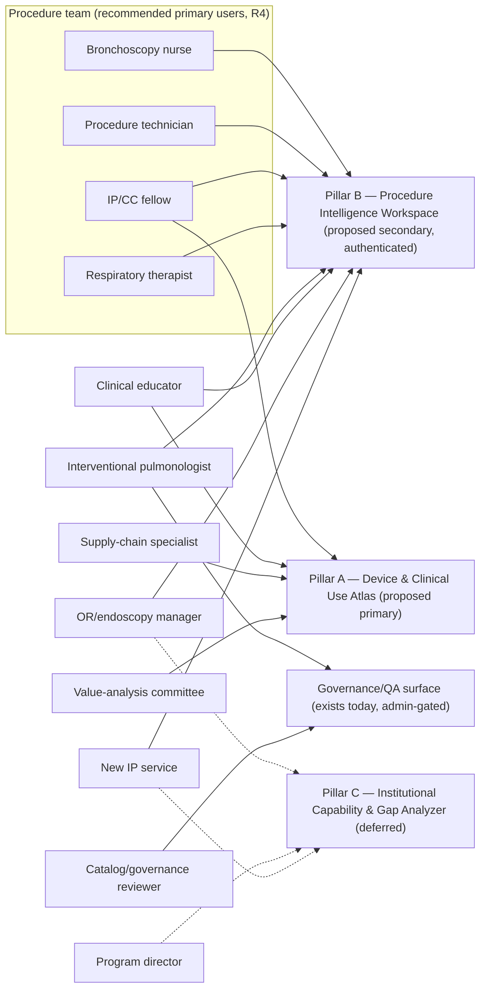

# User jobs and personas — Device and Procedure Intelligence Platform

Phase D0 discovery document (2026-08-08) — describes current repository state and proposals; no production feature exists; all recommendations await physician-owner decisions recorded in decision-log.md.

## 1. How to read this document

This document defines the twelve user groups named in the platform charter, the questions each
group most needs answered, which proposed pillar would serve them, and — critically — what the
repository can actually answer for them **today**. Persona needs and priority scores mix two
kinds of claims:

- **Repository evidence** (verified): entity counts, routes, governance states, and data gaps,
  taken from the Phase D0 shared brief and spot-checked against repo files. These are cited with
  backticked paths.
- **Domain judgment** (flagged): how often a group faces a question, how much it hurts today,
  and how much clinical value an answer carries. These are the physician owner's calls to
  confirm or overrule; every judgment-heavy score is marked as such in §5.

Pillar assignments follow the recommendations in [product-vision.md](./product-vision.md)
(Pillar A — Device and Clinical Use Atlas; Pillar B — Procedure Intelligence Workspace;
Pillar C — Institutional Capability & Gap Analyzer, deferred) and are **proposals pending the
owner's decision**, not settled fact. Data-readiness statements are expanded in
[data-readiness-report.md](./data-readiness-report.md); the relationship vocabulary referenced
below is defined in [relationship-taxonomy.md](./relationship-taxonomy.md); the surface each
persona would touch is laid out in [information-architecture.md](./information-architecture.md).

One repository observation frames the whole persona list: the catalog author already anticipated
these stakeholders in the data itself. Every one of the 15 procedure templates in
`data/ip-preference-cards/generated/procedures.json` is in a draft status whose text names the
disciplines whose review is required — `EBUS_TBNA` is "Draft - clinician/pathology review
required", `IPC_PLACEMENT` is "Draft - clinician/homecare/supply-chain review required",
`PERC_TRACH` is "Draft - ICU/surgery review required", `RIGID_BRONCH` is "Draft -
clinician/anesthesia review required", `WLL` is "Draft - anesthesia/OR review required",
`TB_RULEOUT` is "Draft - infection control and lab review required", and `EBV` is "Draft -
valve-program review required" (verified against the generated file). The persona set below is
therefore not speculative marketing segmentation; most groups are already written into the
data's own governance annotations.

## 2. Persona overview

| #   | Persona                            | One-line need                                                   | Proposed pillar                            | Readiness today                                                      |
| --- | ---------------------------------- | --------------------------------------------------------------- | ------------------------------------------ | -------------------------------------------------------------------- |
| 1   | Interventional pulmonologist       | Own, review, and use per-procedure equipment intelligence       | B (primary), A, governance owner           | High — builder, cards, reconcile/rebuild exist                       |
| 2   | Pulmonary/critical-care fellow     | Learn what each device is and why a setup looks the way it does | A + B (training views)                     | Medium — catalog pages exist; procedure content is draft             |
| 3   | Bronchoscopy nurse                 | Prepare the room: what must be present, opened vs held          | B                                          | Medium-high — spatial view, open/hold states exist; draft-gated      |
| 4   | Respiratory therapist              | Bedside/ICU procedure support and airway-device reference       | B + A                                      | Medium — `ICU_BRONCH`, `PERC_TRACH` templates exist (draft)          |
| 5   | Procedure technician               | Exact setup order, kit contents, device handling                | B                                          | Medium-high — chronological view, kit suppression exist; draft-gated |
| 6   | OR/endoscopy manager               | Match room/schedule capability to procedure requirements        | B + C (deferred)                           | Low-medium — requirements exist; no real room/institution data       |
| 7   | Supply-chain specialist            | Ordering identifiers, distribution status, sourcing risk        | A                                          | High for identity; substitution intentionally absent                 |
| 8   | Value-analysis/formulary committee | Evidence behind add/keep/remove decisions                       | A (+ deferred formulary product)           | Medium — sources and regulatory axis exist; no pricing/utilization   |
| 9   | Hospital program director          | Service-line capability and gap picture                         | C (deferred) over B                        | Low — no institution entity exists                                   |
| 10  | Hospital building a new IP service | Complete, tiered equipment list to stand up a service           | B lists + C overlay (deferred)             | Medium for lists; low for institutional overlay                      |
| 11  | Clinical educator                  | Device-recognition and setup curriculum material                | A + B (training views)                     | Medium — catalog/comparison pages exist; draft labeling required     |
| 12  | Catalog/governance reviewer        | Review proposed relationships into the reviewed state           | Governance surface (exists; evolve per R9) | Highest — 10 admin QA pages + 5 xlsx APIs ship today                 |

## 3. The twelve user groups

### 3.1 Interventional pulmonologist

**Who they are.** The proceduralist who owns the case: selects equipment, sets preferences,
signs off on what the team prepares. In this repository today, also the catalog author and the
sole clinical governance authority (all 15 procedure templates have `clinical_owner` null and
await clinician review).

**Highest-value questions.**

- "What is my card for tomorrow's central airway obstruction case, and what changed since I saved it?"
- "Which needle options are authored and selectable for this EBUS sampling slot?"
- "Does this cryoprobe work with the console we own?" (compatibility)
- "Is this device still in commercial distribution, and what is its regulatory status?"
- "What did the reviewed decision actually approve here, and what is still proposed?"

**Pillar.** B is the daily surface (builder, saved cards, reconcile, rebuild); A is the
reference layer behind every option; the governance surface is where their review authority is
exercised. Recommendation R4 casts the physician as owner/reviewer of the atlas and lead user of
the workspace — pending their own decision.

**Readiness today.** Highest of any clinical persona. The full card lifecycle exists under
`src/app/[locale]/preference-cards/` (14 pages: wizard, catalog search/product/use pages,
emerging view, equipment sets, and card view/edit/print/reconcile/rebuild/shared). Saved cards
are per-user Supabase rows under RLS with trigger-appended revisions; the reviewed rebuild
writes 20-key provenance. Compatibility is partial: 187 raw statements with per-rule
`verification_grade`, resolving to honest `unknown` when attributes are missing. The gap is
governance, not plumbing: every clinical template is draft, so everything renders under the
"DRAFT PROTOTYPE — NOT APPROVED FOR CLINICAL USE" watermark until review happens.

### 3.2 Pulmonary/critical-care fellow

**Who they are.** A physician in training rotating through IP, expected to know devices on
sight, anticipate setup, and understand why a case needs what it needs — usually learning by
osmosis from nurses and attendings today.

**Highest-value questions.**

- "What equipment does an EBUS-TBNA actually need, and why is the linear echoendoscope listed first?"
- "What does this device do, who makes it, and what are its key specs?"
- "How does the setup differ between a small-bore and large-bore chest tube?"
- "What gets added to the room when the attending says 'high bleed risk'?"
- "Who else makes a device in this role, and how do the specs compare?"

**Pillar.** A for device recognition and role comparison (public per recommendation R5); B's
training-oriented views for procedure logic (authenticated while content is draft). R9 proposes
folding a "Training & Setup Academy" into workspace views plus this repository's existing
education modules rather than building a separate product.

**Readiness today.** Medium. The catalog/uses pages, `RoleComparisonTable` ("who else makes
this"), and product detail pages exist and are browseable by direct link. Procedure-level
teaching material exists only implicitly — requirement sequences, modifier effects, and the
golden scenarios encode real teaching content (e.g., `HIGH_BLEED_RISK` appending the
`MAJOR_AIRWAY_BLEEDING` rescue module), but no learner-framed view presents it, and all of it is
clinically draft.

### 3.3 Bronchoscopy nurse

**Who they are.** The person who turns a plan into a prepared room: pulls supplies, opens
sterile items, stages backups, and absorbs the cost when the card is wrong. Recommendation R4
names nurses among the primary users of the procedure workspace — pending owner decision.

**Highest-value questions.**

- "What must be available in the room for this procedure before we start?"
- "What should be opened now versus held unopened?" (the data model already distinguishes this:
  resolved lines carry an open/hold status, and the rescue-module pattern authors
  `hold_unopened` / `emergency_pull` lines)
- "Where does each item physically go?" (the spatial print view groups by setup zones)
- "What changes in my setup when ROSE or general anesthesia is added?"
- "This card is three weeks old — is it still right?" (reconciliation view)

**Pillar.** B, unambiguously. The card print modes (spatial by setup zone, chronological by
procedural phase) in `src/features/preference-cards/components/PreferenceCardViews.tsx` are
already nurse-and-tech-facing artifacts.

**Readiness today.** Medium-high mechanically, gated clinically. Open/hold status, emergency-pull
styling, quantity badges, and per-line verification marks all render today. What blocks
nurse-facing use is the governance wall: all 15 templates are draft with no clinical owner, so
per R5 nothing procedure-shaped should be presented as operational guidance until clinician
review — and the nurse is precisely the user most likely to treat it as operational.

### 3.4 Respiratory therapist

**Who they are.** Manages airway devices and ventilated patients; the key hands at ICU bedside
bronchoscopies, percutaneous tracheostomies, and trach-tube management.

**Highest-value questions.**

- "What is needed for a bedside ICU bronch, and how does bedside differ from the bronch suite?"
  (the modifier vocabulary already distinguishes `ENV_ICU_BEDSIDE` from `ENV_BRONCH_SUITE` and `ENV_OR`)
- "Which tracheostomy tubes are in the catalog, in what sizes and configurations?"
- "What must be ready before a perc trach starts, and what is the rescue plan equipment?"
- "Which scopes fit through which airways/adapters?" (compatibility)

**Pillar.** B for procedure preparation, A for airway-device reference.

**Readiness today.** Medium. `ICU_BRONCH` and `PERC_TRACH` templates exist (both draft;
`PERC_TRACH`'s own status text names "ICU/surgery" review), tracheostomy tubes are a covered
catalog area (`src/features/preference-cards/__tests__/tracheostomy-tubes.test.ts` exercises
them), and environment modifiers exist. Nothing is RT-framed yet, and the same draft gate
applies as for nurses.

### 3.5 Procedure technician

**Who they are.** Sets up towers, connects devices, manages instruments during the case, and
breaks down after; the person for whom setup _order_ and kit _contents_ matter most.

**Highest-value questions.**

- "In what order do I set this room up?" (the procedure template owns display order — the same
  suction-setup requirement is 11th in the EBUS sequence and 3rd in therapeutic bronch, by design)
- "What is inside this kit, and which separate line items does the kit make redundant?" (the
  resolver's kit BOM suppression answers this today for the chest-tube golden scenario)
- "Which accessories go with which scope/console?" (compatibility; the therapeutic-bronch golden
  scenario deliberately blocks an APC platform/probe mismatch)
- "What do I pull for the rescue cart versus the main table?"

**Pillar.** B (named a primary user in R4, pending decision).

**Readiness today.** Medium-high, same profile as the nurse: the chronological print view,
requirement sequencing (`goldenScenarioItemOrder` pins clinically reviewed item order for three
procedures), and kit suppression exist; clinical draft status gates operational use.

### 3.6 OR/endoscopy manager

**Who they are.** Runs the procedural platform: room assignments, block schedules, staff
coverage, equipment fleet. Cares about requirements in aggregate ("this Thursday needs
fluoroscopy twice and laser once"), not per-case clinical nuance.

**Highest-value questions.**

- "Which of today's cases need fluoroscopy, laser safety equipment, or a specific tower?"
- "Does room 4 have what a rigid bronch requires?" (room capability)
- "What does adding this new procedure type to the schedule require of my rooms?"
- "Which equipment is shared across procedures and becomes a scheduling bottleneck?"

**Pillar.** B for requirement aggregation; C for room/institution mapping — and C is
recommended deferred (R3), which limits this persona materially.

**Readiness today.** Low-medium. Per-procedure conditional requirements exist (e.g.,
`THERAPEUTIC_BRONCH`'s reviewed laser/imaging slots: laser console, fiber, safety equipment,
laser-resistant ETT, C-arm, radiation protection), so "what does this procedure demand of a
room" is answerable in the abstract. But room capability is explicitly a hospital-local field
that the historical-catalog layer names and excludes, and no real institutional data exists —
the formulary staging file's institution columns are uniformly false/empty (verified) and
hospital roles are 31 demo stand-ins. `WLL`'s draft status ("anesthesia/OR review required")
shows the data already expects this persona's review, not just their consumption.

### 3.7 Supply-chain specialist

**Who they are.** Buys, reorders, and tracks the physical inventory; lives in item numbers,
GTINs, units of measure, and vendor communications; first to feel a backorder or discontinuation.

**Highest-value questions.**

- "What is the exact catalog number and GTIN for reorder?" (the import preserves identifiers as
  text — leading zeros survive, e.g. catalog number `02841S`)
- "Is this product still in commercial distribution?" (103 catalog products carry a GUDID
  "Not in Commercial Distribution" flag today; 1,169 GUDID confirmations and a 15,229-row GUDID
  index back distribution evidence)
- "Which other products serve the same clinical role?" — answerable **only** as role membership.
  The repository is explicit that role membership does not establish substitutability, and a
  procurement-substitute relationship (taxonomy concept 5 in
  [relationship-taxonomy.md](./relationship-taxonomy.md)) does not exist and must not be inferred.
- "What does this manufacturer's line include, and which entries are one device in many sizes?"

**Pillar.** A. The deferred Shortage & Substitution Navigator (R9) is the product this persona
would eventually want; it is blocked on an equivalence/substitute review process that does not
exist, so the honest near-term offer is identity + distribution + role-membership facts.

**Readiness today.** High for identity and distribution (1,532 products, 48 manufacturers,
1,850 product-source rows, GUDID enrichment); deliberately empty for substitution. `IPC_PLACEMENT`'s
draft status naming "supply-chain review" confirms the author expects this group in the loop.

### 3.8 Value-analysis/formulary committee

**Who they are.** The multidisciplinary committee that decides what the institution stocks:
clinicians, nursing, supply chain, finance. Works from evidence packets; allergic to vendor
claims without sources.

**Highest-value questions.**

- "What is this device's US regulatory status, and what evidence backs each claimed fact?"
  (the catalog's 7-value regulatory axis and 71 sources with 1,850 product-source rows exist for this)
- "Which catalog relationships are clinician-reviewed versus merely proposed?" (2,073 authored
  slot options versus 813 unreviewed proposals, each proposal textually disclaiming
  compatibility/approval/suitability; only 28 options arrived through the formal external review round)
- "Is this 'verified' badge a clinical endorsement?" (No — the repository documents it as an
  evidence state, and this doc set must keep saying so.)
- "What would this device replace, and at what cost difference?" — **not answerable**: no
  pricing, utilization, or equivalence data exists anywhere in the repository.

**Pillar.** A now; the deferred Formulary & Procurement Intelligence product (R9) later, if ever.

**Readiness today.** Medium. Evidence display is a genuine strength (verification grades split
1,331 verified_source / 200 candidate / 1 unknown, source citations, six never-collapsed
governance axes). The committee's economic half — price, contract, utilization — has no data
and is out of scope for this repository as it stands.

### 3.9 Hospital program director

**Who they are.** Accountable for the IP service line's scope, quality, and growth; asks
capability questions ("can we support ablation?") and gap questions ("what stands between us
and offering thoracoscopy?").

**Highest-value questions.**

- "Which of the 15 catalogued procedures could our program equip today?"
- "What are the capital versus disposable requirements of each procedure we might add?"
- "Where are our gaps, and what would closing them take?"
- "How does our equipment coverage compare to what the procedure templates require?"

**Pillar.** C — and C is recommended deferred (R3) precisely because its inputs do not exist:
there is no institution entity anywhere in the repository, the hospital-formulary staging file
is an empty scaffold (1,221 rows with institution fields uniformly false/empty, verified),
equipment sets live in browser localStorage, and the only "institution" is a fictional Demo IP
Program. B's requirement lists give this persona the demand side; the supply side is missing.

**Readiness today.** Low. This is the clearest honest gap in the persona set; presenting a
capability analysis on demo data would be misleading, so the recommendation is a stub view
labeled as such in the Phase D1 slice ([vertical-slice-spec.md](./vertical-slice-spec.md)).

### 3.10 Hospital building a new IP service

**Who they are.** A program (or its planners) standing up interventional pulmonology from
little or nothing: needs a complete, tiered shopping and readiness list per procedure, and
wants to know what serves multiple procedures.

**Highest-value questions.**

- "What is the full equipment list to start an EBUS and pleural service?"
- "What is must-have versus conditional versus optional?" (the slot model encodes exactly this:
  e.g. `EBUS_TBNA` 15 slots — 7 required / 4 conditional / 4 optional; `CHEST_TUBE` 13 slots — 3/7/3)
- "Which purchases serve several procedures?" (module composition makes reuse explicit —
  `FLEX_BRONCH_CORE` underlies multiple procedures; the small-bore chest tube requirement
  reappears as a rescue slot in `BRONCH_ABLATION`)
- "Which items on the list are one product choice among several manufacturers?" (role pages)

**Pillar.** B's release-pinned requirement lists are the backbone; the "procurement-gap report"
named in R3 as a card-adjacent output is the natural deliverable; the institutional overlay
(what we already own) is C and deferred.

**Readiness today.** Medium for the demand list (233 authored slots across 15 procedures, with
requiredness levels, module reuse, and manufacturer options per role); low for anything
institution-aware. Same clinical-draft caveat: a start-up equipment list derived from
unreviewed templates must carry the draft watermark.

### 3.11 Clinical educator

**Who they are.** Builds curriculum for fellows, nurses, RTs, and techs — in this repository's
context, the author of the existing education modules (simulators, teaching modules) who wants
device and procedure content to link into them.

**Highest-value questions.**

- "Which devices should a learner recognize for this rotation, with specs and images?"
- "Can I link a stable device or role page from a teaching module?" (stable identifiers exist:
  `PRD-…` product ids, canonical role codes with permanent aliases)
- "How do I show 'compare these devices' without implying they are interchangeable?" (the
  educational-comparison concept — taxonomy concept 7 — exists partially as role-scoped
  comparison tables and deliberately makes no equivalence claim)
- "Is this content labeled safely for learners?" (draft watermark, verification badges)

**Pillar.** A for reference content (public per R5), B's training views for procedure logic;
R9 folds educator needs into these rather than a separate academy product.

**Readiness today.** Medium. Product/role/comparison pages exist and carry the evidence
vocabulary an educator needs; what is missing is learner framing, media, and any curriculum
structure — plus the same draft gate on procedure content. The three-locale support
(en / es / zh-CN) is an existing asset for education reuse.

### 3.12 Catalog/governance reviewer

**Who they are.** Whoever exercises review authority over the catalog's relationships — today
the physician owner plus, in one completed round, external clinician reviewers. Tomorrow,
possibly named specialty reviewers (the draft statuses already name pathology, anesthesia,
infection control, valve program).

**Highest-value questions.**

- "Which catalog relationships are reviewed versus proposed?" (2,073 authored options versus
  813 unreviewed proposals; 0 excluded; 28 options externally clinician-reviewed; 18 reviewed
  drainage options are the only proposal-derived rows ever promoted to selectable)
- "What is in my review queue, and what evidence sits behind each row?"
- "Did my workbook decisions round-trip faithfully?" (SHA-256-pinned workbooks, preview-only
  import, old-state-guarded application in the one loop that has closed)
- "What would applying this decision change downstream?" (16 impact reports exist as foundation)

**Pillar.** Not a new pillar: the governance surface already exists — 10 admin QA pages under
`src/app/[locale]/admin/preference-cards/` plus 5 site_admin-gated xlsx API routes (counts
verified against the route tree). R9 recommends evolving this surface, not rebuilding it.

**Readiness today.** Highest of all twelve. This is the only persona whose end-to-end workflow
ships today, including the deliberately unimplemented apply path for the two workbook workflows
(a governance wall, not a gap): review conclusions become handoff artifacts until a governed
apply path exists.

## 4. Jobs-to-be-done: scoring method

Each job is scored on the eight charter dimensions. Scales:

- **Clinical impact / Frequency / Urgency / Current pain** — H / M / L. These four are
  **domain-judgment scores**: they reflect the owner's clinical context as this document's
  authors understand it and are explicitly his to adjust.
- **Data readiness** — H / M / L, **repository-evidenced**: derived from verified counts and
  what exists in `data/ip-preference-cards/**` and the route tree (details in
  [data-readiness-report.md](./data-readiness-report.md)).
- **Implementation effort** — L / M / H (L = mostly exists already), **repository-evidenced**
  from existing routes, server modules, and generated artifacts. Estimative, but anchored.
- **Regulatory/clinical risk** — L / M / H, evidenced by governance state: anything
  procedure-shaped inherits the all-templates-draft state; anything implying equivalence or
  substitution is highest-risk because the underlying reviewed relationship does not exist.
- **Access tier** — Public / Auth / Admin: the suitability recommendation per R5 (public =
  verified, cited, vendor-neutral facts; authenticated = draft procedure content and personal or
  institutional data; admin = governance).

The rank ordering weights the three repository-evidenced dimensions (readiness, effort, risk)
against the four judgment dimensions, consistent with recommendations R1/R2 (atlas first because
it is ready, low-risk, and public-suitable; workspace second because it is highest-value but
draft-gated). The ordering is a proposal; reranking is a one-line decision for
[decision-log.md](./decision-log.md).

## 5. Ranked jobs-to-be-done

| Rank | Job                                                                                            | Primary personas  | Impact       | Freq | Urgency      | Pain  | Readiness | Effort         | Risk    | Tier       |
| ---- | ---------------------------------------------------------------------------------------------- | ----------------- | ------------ | ---- | ------------ | ----- | --------- | -------------- | ------- | ---------- |
| 1    | J-01 Look up a device: identity, specs, roles, sources, distribution, regulatory status        | 1, 2, 7, 8, 11    | M            | H    | M            | M     | **H**     | L              | **L**   | Public     |
| 2    | J-02 Browse a clinical role across manufacturers and compare specs (no equivalence claim)      | 2, 7, 8, 10, 11   | M            | H    | M            | M     | **H**     | L              | **L**   | Public     |
| 3    | J-03 See what a procedure requires: required / conditional / optional, by phase and zone       | 1, 3, 4, 5, 6, 10 | **H**        | H    | M            | **H** | **H**     | M              | **M-H** | Auth       |
| 4    | J-04 Prepare a specific case: modifiers applied, open-vs-hold, rescue lines, setup order       | 3, 5, 4, 1        | **H**        | H    | H            | **H** | M-H       | M              | **M-H** | Auth       |
| 5    | J-05 Build, save, print, share a preference card (exists; preserved as last-mile output)       | 1, 3, 5           | H            | M    | M            | M     | **H**     | **L (exists)** | M       | Auth       |
| 6    | J-06 Work the governance queue: proposals → reviewed, workbook round-trips, audit              | 12, 1             | M (indirect) | M    | M            | M     | **H**     | L-M            | L       | Admin      |
| 7    | J-07 Track emerging/investigational devices with labeled regulatory status                     | 1, 8, 9, 11       | M            | M    | L            | M     | **H**     | L              | L-M     | Public     |
| 8    | J-08 Check device-to-device compatibility (requires/supports/conflicts; unknown stays unknown) | 1, 5, 4           | **H**        | M    | M            | H     | M         | M              | M       | Auth       |
| 9    | J-09 Learn devices and setups: fellow/nurse/RT training views over atlas + workspace           | 2, 11, 3, 4       | M            | M    | L            | M     | M         | M              | M       | Mixed      |
| 10   | J-10 Assemble a value-analysis evidence pack: sources, verification, regulatory axis           | 8, 7              | M            | L    | L            | M     | M         | M              | M       | Auth       |
| 11   | J-11 Generate a new-program equipment list, tiered by requiredness, with role options          | 10, 9             | H            | L    | L            | H     | M         | M-H            | M-H     | Auth       |
| 12   | J-12 Analyze institutional capability and gaps against procedure requirements                  | 9, 6, 10          | H            | M    | L            | H     | **L**     | **H**          | M       | Auth       |
| 13   | J-13 Monitor change impact of catalog/release changes on saved cards and programs              | 1, 12, 6          | M            | L    | L            | M     | L-M       | H              | M       | Admin/Auth |
| 14   | J-14 Navigate a shortage: find substitutes for a back-ordered product                          | 7, 6              | H            | L    | H (episodic) | H     | **None**  | **H**          | **H**   | Auth       |

**Scoring rationale (short form).**

- **J-01/J-02 rank first on evidence, not impact.** Readiness is the repository's strongest:
  1,532 products (1,331 verified_source), 135 roles, 1,622 product-role links, 48 manufacturers,
  71 sources, 1,850 product-source rows, GUDID enrichment — and the pages substantially exist
  (`catalog/product/[productId]`, `catalog/uses/[roleCode]`, `RoleComparisonTable`,
  `ProductFamilyTable`). Risk is low because these are vendor-neutral, cited facts with no
  clinical recommendation. This is recommendation R1's reasoning restated at job level.
- **J-03/J-04 are the highest-impact jobs but carry the draft gate.** The data is authored
  (15 procedures, 233 slots, 2,073 options, modifiers, rescue modules, open/hold semantics,
  16 release bundles), so readiness is high — but every template is clinically draft with no
  clinical owner, which forces the Auth tier and M-H risk until clinician review. Impact/pain
  scores here are domain judgment: the claim that room preparation is the highest-pain daily
  job is the owner's to confirm.
- **J-05 exists.** It ranks on preservation value: R3 keeps cards as a last-mile output, and the
  effort score L reflects that the 14-page surface, RLS-backed cards, revisions, reconcile, and
  rebuild already ship.
- **J-06 ranks above its raw impact** because the surface exists (10 admin pages, 5 xlsx APIs)
  and because every other job's data quality depends on it: 813 proposals await review, and only
  one review loop has ever closed end-to-end.
- **J-07 is nearly free** — the emerging view exists with the "an agreement to review, not an
  authorization" framing — and is explicitly recommended public in R5.
- **J-08 readiness is honestly medium**: 187 raw statements with per-rule verification grades
  and typed rules that resolve missing attributes to `unknown`, but coverage is thin relative to
  the catalog, and the golden scenarios prove the mechanism more than the breadth.
- **J-09/J-10 are reframings of existing data** (medium effort) whose value depends on
  presentation work; both are judgment-scored on impact.
- **J-11 through J-14 are gap-limited, not idea-limited.** J-12 lacks its inputs entirely
  (empty formulary scaffold, localStorage equipment sets, no institution entity — R3 defers
  Pillar C for exactly this). J-13 has foundations (16 impact reports) but no consumer surface.
  J-14 is scored last despite high episodic urgency because the procurement-substitute
  relationship does not exist, must not be inferred, and R9 defers the product until a named
  review process exists; shipping it early would require exactly the equivalence claims this
  repository refuses to make.

## 6. What the recommended pillars serve first

Subject to the owner's decisions in [decision-log.md](./decision-log.md):

- **Pillar A (proposed primary — Device and Clinical Use Atlas)** serves J-01, J-02, and J-07
  first, and the evidence-display half of J-10. Its first-class personas are the supply-chain
  specialist, value-analysis committee, fellow, and educator — plus every other persona
  indirectly, because device and role pages are the entity spine other surfaces link into.
  Public tier, restricted to verified_source + prototype_visible facts with citations per R5.
- **Pillar B (proposed secondary — Procedure Intelligence Workspace)** serves J-03, J-04, J-08,
  and the workspace half of J-09, with J-05 preserved as its last-mile output and the J-11 list
  as a derived report. Its first-class personas are the procedure team — bronchoscopy nurse,
  procedure technician, fellow, respiratory therapist — with the interventional pulmonologist
  as lead user and reviewer (R4). Authenticated tier until clinician review lifts the draft
  state; nothing here should imply the drafts are approved.
- **The existing governance surface** continues to serve J-06 (and eventually J-13) for the
  catalog/governance reviewer; R9 recommends evolving it in place.
- **Pillar C (deferred)** is the eventual home of J-12 and the institutional overlay of J-11 for
  the program director, OR/endoscopy manager, and new-service personas; it stays deferred until
  a real institution entity and real formulary/inventory data exist (R3). The Phase D1 slice
  proposes only a clearly labeled stub ([vertical-slice-spec.md](./vertical-slice-spec.md)).
- **Explicitly not served, on purpose:** J-14 (shortage substitution) until a
  procurement-substitute review process exists, and any job that would require the platform to
  claim two products are clinically equivalent or substitutable — no pillar makes that claim,
  ever, per the standing evidence rules summarized in [product-vision.md](./product-vision.md)
  and [relationship-taxonomy.md](./relationship-taxonomy.md).

## 7. Evidence notes

Counts used here come from the Phase D0 shared brief (verified 2026-08-08) or from files read
directly during drafting. Independently re-verified while writing this document:

- 813 unreviewed slot-option proposals (`data/ip-preference-cards/generated/slot-product-option-proposals.json`).
- 15 procedures, all draft, `clinical_owner` null, with discipline-naming status strings
  (`data/ip-preference-cards/generated/procedures.json`).
- Hospital-formulary staging: 1,221 rows with `hospital_carries`, `preferred`, and
  `local_item_number` uniformly false/empty (`data/ip-preference-cards/generated/hospital-formulary-staging.json`).
- Route counts: 14 public pages, 10 admin pages, 6 API routes under the preference-cards trees.
- The latent `preference_cards_builder` entitlement in `src/lib/site-auth/access.ts` (declared,
  required nowhere) — relevant to the Auth tier's future without new infrastructure.

Judgment-call scores (clinical impact, frequency, urgency, current pain, and the relative
weighting that produces the rank order) are flagged as such in §4–§5 and await the physician
owner's confirmation. The persona-to-pillar assignments restate recommendations R1–R5/R9 and are
pending the same decisions; see [data-relationship-audit.md](./data-relationship-audit.md) for
the underlying relationship evidence and [information-architecture.md](./information-architecture.md)
for where each persona's surface would live.
