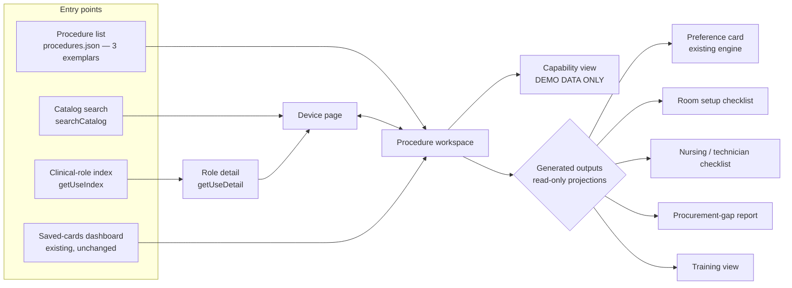

# Read-only vertical-slice specification (Phase D1 proposal)

Phase D0 discovery document (2026-08-08) — describes current repository state and proposals. Physician-owner decisions D-01–D-10 were recorded 2026-08-08 in [decision-log.md](./decision-log.md) (D-03 and D-07 accepted with modification, D-10 with bounded scope); no production feature exists yet.

This document specifies the Phase D1 vertical slice proposed as recommendation R10 in
[product-vision.md](./product-vision.md): a **read-only** device page, procedure workspace,
capability view (demo data only), and generated-output projections, scoped to the three exemplar
procedures `EBUS_TBNA`, `THERAPEUTIC_BRONCH`, and `CHEST_TUBE`. Nothing in this document is
built in Phase D0. Every screen element below is annotated with the **existing** data file or
server function that would power it — the slice adds presentation only, no new data, no new
persistence, no migrations. Personas and jobs are in
[user-jobs-and-personas.md](./user-jobs-and-personas.md); the navigation model is in
[information-architecture.md](./information-architecture.md); data-gap numbers are grounded in
the Phase D0 audit artifact `docs/ip-device-intelligence/data-readiness-audit.json` (produced by
`scripts/ip-device-intelligence/audit-data-readiness.ts`; provenance: workbook sha `fb25b24e…`,
catalog release `8ece7648…`) and narrated in
[data-readiness-report.md](./data-readiness-report.md).

**Decision status (2026-08-08).** The owner accepted this slice as Phase D1 with bounded scope
(decision D-10): device index/detail presentation, clinical-role links, procedure workspaces for
the three exemplar procedures, an explicitly labeled demo-only capability panel, and read-only
output previews or links. Phase D1 must add no persistence, no migration, no catalog or
governance change, no public indexing (per D-03 as modified, every new route stays
public-unlisted and noindex during D1), no clinical equivalence or substitution claim, and no
second resolution engine. The constraints in §6 are binding; wherever this specification
describes more than the bounded list, the D-10 scope controls.

## 1. Slice overview

All reads flow through the existing in-memory catalog singleton
(`src/features/preference-cards/server/catalog.ts` over the ten statically imported JSON files in
`data/ip-preference-cards/generated/`) and the existing demo build context
(`src/features/preference-cards/data/demo-context.server.ts`). Access tiers follow the existing
model in `src/lib/site-auth/access.ts` and `src/proxy.ts` (public-unlisted for atlas surfaces,
sign-in for institutional overlays, `site_admin` untouched), per recommendation R5 — pending the
owner's decision in [decision-log.md](./decision-log.md).

## 2. Screen 1 — Device page

One page per catalog product (1,532 products). Route identity follows the existing guard pattern
(`productId` matching `/^PRD-[A-Z0-9]{6,20}$/`, as enforced today by
`src/app/[locale]/preference-cards/catalog/product/[productId]/page.tsx`). The page is a
projection of `getProductDetail(productId)` in
`src/features/preference-cards/server/catalog.ts` plus role/procedure joins listed below.

### 2.1 Identity block

- **Source**: the `CatalogProduct` record (`data/ip-preference-cards/generated/catalog-products.json`,
  1,532 rows) as decorated by `decorateProduct` in
  `src/features/preference-cards/server/catalog-store.ts`.
- **Fields**: `product_name`, `catalog_number`, `gtin` / `gtin_raw`, `global_part_number`,
  `reference_part_number`, `alternate_ids`, `package_uom`, `sterile_status`, `reuse_status`,
  `description`, `size_display`.
- **Manufacturer**: `manufacturer_id` resolved through the runtime alias groups in
  `src/features/preference-cards/server/manufacturer-aliases.ts` (48 manufacturers in
  `manufacturers.json`; exactly one merged group today, Thoracent / M.I.Tech). Display the
  canonical group name; never merge groups the alias file does not merge.
- **Product kind / category**: `product_kind`, `primary_category`, `subcategory`.

### 2.2 Configurations (size variants)

- **Source**: the discovery `familyKey` computed in `decorateProduct`
  (`manufacturerGroupId | familyName | product_kind`) groups sibling rows; per-variant
  `size_display` plus the numeric spec fields (`diameter_mm`, `length_mm`, `french_size`,
  `gauge`, `working_length_cm`, `min_working_channel_mm`, `delivery_system_od_mm`, `spec_json`).
- **Rendering precedent**: `ProductFamilyTable.tsx` (server-rendered `
` rows) and the
  spec columns used by `RoleComparisonTable.tsx`.
- **Mandatory labeling**: this grouping is **manufacturer family** (concept 1 of the eight in
  [relationship-taxonomy.md](./relationship-taxonomy.md)) — a display-only discovery grouping
  with documented over-merge defects. It is never persisted and never presented as clinical
  equivalence. Missing spec dimensions render as "not recorded", following the
  `excludedMissingSpecCount` convention already in `searchCatalog` (thin data must not look like
  an empty shelf). The audit records 89 / 20 / 58 spec-dimension gaps among the authored-option
  products of CHEST_TUBE / EBUS_TBNA / THERAPEUTIC_BRONCH respectively.

### 2.3 Clinical roles

- **Source**: `product-roles.json` (1,622 links; fields `role_code`, `role_fit`, `notes`) joined
  to `roles.json` (135 roles; `role_name`, `category`, `selection_guidance`,
  `requires_current_ifu`). Already assembled by `getProductDetail` as `roles[]`.
- **Rendering**: one row per role with `role_fit` (e.g. `Primary`) and a link to the role detail
  view (`getUseDetail`). `requires_current_ifu` renders as the existing advisory flag, and
  `selection_guidance` is quoted as authored text, never paraphrased.

### 2.4 Relevant procedures

- **Source**: `getProductDetail(...).slots` — the product's rows in
  `slot-product-options.json` (2,073 authored options) joined through
  `procedure-slots.json` (233 slots) to `procedures.json` (15 procedures). Each row carries
  `slotLabel`, `requiredness`, `eligibilityStatus`, `selectable`.
- **Rendering**: grouped by procedure, showing the slot's requiredness badge and whether this
  product is an authored selectable option there. Because ALL 15 procedures carry a
  `Draft - …` status, each procedure name renders with its verbatim draft status string inline.

### 2.5 Compatibility and accessory dependencies

- **Typed rules**: the typed role-to-role rules authored in
  `src/features/preference-cards/seed/operational.ts` (`typedCompatibilityRules`, wired into the
  build context by `demo-context.server.ts`) rendered with the display semantics of
  `src/features/preference-cards/domain/evaluate-compatibility.ts` — operator, expected value,
  unit, severity, and `evidenceSourceId`. On a device page these render as _conditions_, not
  evaluations (no card is being resolved).
- **Raw statements**: `compatibility-raw.json` (187 rows: `rule_text`,
  `source_product_or_role` / `target_product_or_role`, `resolved_source_id` /
  `resolved_target_id`, per-rule `verification_grade`, `source_id`). Rows whose resolved ids
  match the product render with a verification badge per grade. Rows with both resolved ids
  null are **unresolved textual statements** (the audit found they reference catalog numbers and
  marketing names, not role codes) — the slice quotes them verbatim, badged "unresolved
  statement", and never machine-matches them. For the three exemplar procedures the audit found
  0 unresolved-textual rules touching their role sets; resolved rules touching them: 13
  (CHEST_TUBE, all `verified_source`), 12 (EBUS_TBNA: 10 `verified_source`, 2 `unknown`), 7
  (THERAPEUTIC_BRONCH: 6 `verified_source`, 1 `candidate` — the file's only candidate-grade
  rule, touching the ENERGY_PLATFORM role set).
- **Free text**: the product's own `compatibility_text` field renders as quoted manufacturer
  text with its `primary_source_id` citation.

### 2.6 Evidence and verification state

- **Six independent axes**, never collapsed (per `catalog-store.ts` and the brief's trust
  model): `verification_grade` (1,331 verified_source / 200 candidate / 1 unknown),
  `visibility_state` (753 prototype_visible / 779 hidden), GUDID distribution status (from
  `gudid-confirmations.json`, 1,169 rows; only `manufacturer_and_catalog_number` match strength
  counts; disagreement stays `conflicting`), `catalogLifecycleContext`, `slottingScope`, and the
  7-value US regulatory axis from the reviewed overlay
  `data/ip-preference-cards/reviewed/external-review-corrections.json`. Absence of a reviewed
  regulatory decision displays as **unknown, never implied clearance**.
- **Sources**: `getProductDetail(...).sources` — `product-sources.json` (1,850 links) joined to
  `sources.json` (71 sources), showing `claim_type`, `verification_status`, `reliability_tier`,
  `source_location`, and dates. The audit confirms 100% of authored-option products in all three
  exemplar procedures have at least one product-sources row.
- **Rendering precedent**: `VerificationBadge.tsx` and its legend; breakthrough designation
  keeps its warning styling and the existing copy ("an agreement to review, not an
  authorization").

### 2.7 Related products — no implied equivalence

- **Same clinical role**: `getProductDetail(...).otherManufacturers` — up to 6 products sharing
  the primary role, one per manufacturer group, as already computed in `catalog.ts`. Label:
  "Other manufacturers with products mapped to this clinical role." Never "alternatives to" or
  "equivalent to".
- **Same manufacturer line**: siblings by `brand_family` / `familyKey` (section 2.2). Label:
  "Same manufacturer product line."
- Both lists carry an explicit caption that shared role mapping is a catalog-discovery fact
  (`product_roles` = broad_catalog_discovery in the trust ladder), **not** a clinical
  equivalence or substitution claim — clinical equivalence groups do not exist in this
  repository (concept 4 in [relationship-taxonomy.md](./relationship-taxonomy.md)).

### 2.8 Institutional availability (authenticated only)

- **Source**: `data/ip-preference-cards/generated/hospital-formulary-staging.json` (1,221 rows;
  fields include `hospital_carries`, `preferred`, `local_item_number`, `local_description`,
  `storage_location`, `par_level`, `local_notes`), read via `getFormularyRoleRows` in
  `demo-context.server.ts`.
- **Today's truth, rendered honestly**: the scaffold is empty — the audit found 0 `carried` and
  0 `preferred` rows across all rows intersecting the three exemplars (107 / 60 / 377 rows
  respectively), and exactly **one** populated local field repo-wide (product `PRD-0D6E4DB711`,
  `local_notes`: "Do not procure; historical traceability only."). The device page therefore
  renders "No institutional data recorded" for signed-in users, with the one local-notes row as
  the only populated example. This section never renders for anonymous users.

## 3. Screen 2 — Procedure workspace

One workspace per exemplar procedure: `EBUS_TBNA` (15 slots), `THERAPEUTIC_BRONCH` (29 slots),
`CHEST_TUBE` (13 slots). Authenticated / public-unlisted per R5, because all 15 procedures are
governance-draft. Data comes from `procedures.json`, `procedure-slots.json`, the release-pinned
compositions (`procedure-compositions.json`, `release-bundles.json`), and the domain expansion
helpers (`expandEffectiveSlots` in `src/features/preference-cards/domain/effective-slots.ts`).

### 3.1 Overview and draft-status banner

- Procedure name, `template_version`, and the **verbatim** status string from
  `procedures.json`: `Draft - clinician/pathology review required` (EBUS_TBNA),
  `Draft - clinician review required` (THERAPEUTIC_BRONCH, CHEST_TUBE).
- The existing `PrototypeBanner.tsx` draft watermark renders on every workspace view
  (section 6.2). `clinical_owner` is null for all 15 procedures; the banner states that no
  clinical owner has signed off.

### 3.2 Phases

- **Source**: slot `section` (e.g. EBUS: Imaging, Platform, Sampling, Scope accessory, Suction)
  mapped to `setup_zone` and `procedural_phase` via
  `data/ip-preference-cards/seed/section-zone-phase-map.json`, using the same enums as
  `domain/types.ts` (9 setup zones, 9 procedural phases, both including `unassigned`).
- **Rendering precedent**: the spatial (setup-zone) and chronological (procedural-phase) tab
  layouts of `PreferenceCardViews.tsx`, reused as a read-only requirement browser (no
  selections, no resolution).

### 3.3 Required / optional / contingency roles with the role-coverage ladder

Each slot row shows `slot_label`, `generic_requirement` (authored clinician text, quoted),
requiredness, `selection_mode`, `allow_custom`, and a **coverage ladder** derived from existing
data (audit-verified; in all three exemplars every slot carries a distinct role, so the role
ladder and slot rollup are numerically identical):

| Ladder rung                               | Data rule                                       | CHEST_TUBE (13 roles)   | EBUS_TBNA (15)                             | THERAPEUTIC_BRONCH (29)                                                                                                                            |
| ----------------------------------------- | ----------------------------------------------- | ----------------------- | ------------------------------------------ | -------------------------------------------------------------------------------------------------------------------------------------------------- |
| Selectable authored options               | ≥1 `slot-product-options` row with `selectable` | 8                       | 11                                         | 14                                                                                                                                                 |
| Authored but non-selectable only          | options exist, none selectable                  | 3                       | 0                                          | 5                                                                                                                                                  |
| Proposals only                            | only `slot-product-option-proposals` rows       | 1 (GENERIC_SUCTION)     | 2 (FLUOROSCOPY_C_ARM, GENERIC_SUCTION)     | 7 (incl. LASER_CONSOLE, LASER_FIBER, LASER_SAFETY_EQUIPMENT, TOMOSYNTHESIS_NAVIGATION_SYSTEM, FLUOROSCOPY_C_ARM, ENERGY_PLATFORM, GENERIC_SUCTION) |
| No option, no proposal, no mapped product | nothing anywhere                                | 1 (DRESSING_SECUREMENT) | 2 (GENERIC_SPECIMEN, RADIATION_PROTECTION) | 3 (GENERIC_SPECIMEN, LASER_RESISTANT_ETT, RADIATION_PROTECTION)                                                                                    |

Requiredness split (from `procedure-slots.json`, audit-pinned): CHEST_TUBE 3 required / 7
contingency / 3 optional; EBUS_TBNA 7 / 4 / 4; THERAPEUTIC_BRONCH 3 / 21 / 5. Demo stand-in
coverage (from `data/ip-preference-cards/seed/demo-stand-ins.json`, 31 rows) is shown as its own
badge — 3 / 3 / 7 roles respectively — always labeled "demo stand-in", never as a real product.
Proposals-only rungs render the existing proposal disclaimer text and are **never selectable**.

### 3.4 Room capabilities

- **Source**: the `dependency_rule` strings on slots (10 / 7 / 21 slots carry one in
  CHEST_TUBE / EBUS_TBNA / THERAPEUTIC_BRONCH) plus the `require_room_capability` modifier
  action type defined in `domain/types.ts` and evaluated against `locationCapabilities` in the
  `BuildContext` (`demo-context.server.ts` supplies the demo location's capabilities today).
- **Rendering**: dependency rules are quoted verbatim next to the slots that carry them; the
  workspace lists which capabilities the demo location declares and which rules reference
  capabilities the context cannot confirm ("unknown", never silently passed).

### 3.5 Specimen handling (EBUS_TBNA)

- **Source**: the Sampling-section slots of EBUS_TBNA, including the specimen slot (role
  `GENERIC_SPECIMEN`, e.g. slot `SLOT-12ACA27E54`, "Slides, cell-block, formalin/RPMI and
  labels"), plus the specimen-related modifiers the procedure allows (ROSE, SPEC_MOLECULAR,
  SPEC_MICRO, SPEC_FLOW in `procedure-compositions.json`).
- **Honest gap**: GENERIC_SPECIMEN has no mapped product anywhere (audit); the workspace shows
  it as a requirement satisfied by local supplies (`allow_custom` is true on all 15 EBUS slots)
  and labels it "no catalog product mapped — locally supplied", consistent with the reviewed
  decision not to author fictitious commercial products.

### 3.6 Rescue requirements

- **Source**: rescue reachability is derived from `allowedModifierCodes` on the release-pinned
  composition, because generated release bundles pin one shared rescue-module set for all
  procedures (audit finding). The only `add_rescue_module` action in the repository is
  `HIGH_BLEED_RISK` → `MAJOR_AIRWAY_BLEEDING`, defined in
  `src/features/preference-cards/seed/operational.ts`.
- **Per exemplar**: EBUS_TBNA and THERAPEUTIC_BRONCH allow HIGH_BLEED_RISK, so the workspace
  shows the MAJOR_AIRWAY_BLEEDING rescue module's slots as a contingency band ("added when
  HIGH_BLEED_RISK is selected"). CHEST_TUBE has **no reachable rescue module and 0
  Rescue-section slots** — the workspace states this fact plainly rather than inventing a
  rescue pathway. None of the three exemplars has Rescue-section slots of its own.

### 3.7 Institutional product mappings (authenticated)

Same source and honesty rule as section 2.8: formulary rows intersecting the procedure's roles
(107 / 60 / 377) currently carry zero institutional signal, so this panel renders "No
institutional data recorded" with the empty-scaffold explanation. Demo stand-ins render in this
panel only under the demo profile, labeled as such.

### 3.8 Unresolved / missing roles (honest gaps)

A dedicated panel lists the bottom two ladder rungs (section 3.3) plus the needs-review load
from the audit: 117 / 12 / 36 unreviewed proposals touching the three procedures respectively,
THERAPEUTIC_BRONCH's 1 candidate-grade compatibility rule, and its 11 of 18 draft
product-family versions touching its roles. The panel links each gap to the admin review
surfaces that already exist (`/admin/preference-cards/catalog-qa/...`) for `site_admin` users,
and renders read-only counts for everyone else.

### 3.9 Navigation and actions

Every slot row links to the device pages of its authored options (section 2). The workspace
footer offers the five generated-output actions (section 5) — all read-only projections.

## 4. Screen 3 — Capability view

**This view runs on demo data only.** The formulary scaffold carries no institutional signal
(section 2.8), there is no institution entity anywhere in the repository, and equipment sets are
browser-localStorage only. The view therefore evaluates the fictional "Demo IP Program" context
from `demo-context.server.ts` and is watermarked `DEMO DATA — NOT AN ACTUAL INSTITUTION` on
every render. Its purpose in the slice is to prove the deterministic rules below against real
catalog structure, not to report on any real room.

Per requirement (slot), the view computes one primary state; the procedure headline is the
weakest requirement state. All rules read only existing data:

| #   | State                         | Deterministic rule (existing data only)                                                                                                                                                                                                                                                                                                                                                                   |
| --- | ----------------------------- | --------------------------------------------------------------------------------------------------------------------------------------------------------------------------------------------------------------------------------------------------------------------------------------------------------------------------------------------------------------------------------------------------------- |
| 1   | Ready                         | Every `required` slot's role has ≥1 institution-mapped item (`hospital_carries` true in the formulary, or a demo mapping) that is an authored selectable option (`slot-product-options.selectable`) on a `verified_source` product; all `dependency_rule` capability references are satisfied by `locationCapabilities`; every rescue module reachable via `allowedModifierCodes` has full role coverage. |
| 2   | Ready with limitations        | Rule 1 holds except: ≥1 covering product is `candidate` grade, ≥1 mapping is a demo stand-in, ≥1 typed compatibility rule evaluates `unknown` (missing attribute — never a silent pass, per `evaluate-compatibility.ts`), or a contingency/optional slot fails a lower rule.                                                                                                                              |
| 3   | Not ready                     | ≥1 `required` slot has no institutional mapping at all (with today's scaffold, this is the true state of every procedure outside the demo profile).                                                                                                                                                                                                                                                       |
| 4   | Missing required product role | A `required` slot's role has no authored selectable option in `slot-product-options.json` at all — proposals-only or wholly unmapped (structural catalog gap, independent of any institution; e.g. CHEST_TUBE `DRESSING_SECUREMENT`).                                                                                                                                                                     |
| 5   | Missing room capability       | A `dependency_rule` (or a `require_room_capability` action of a selected modifier) names a capability absent from the context's `locationCapabilities` — the same check that produces the domain's blocking `room_capability_missing`.                                                                                                                                                                    |
| 6   | Missing rescue pathway        | A rescue module reachable via `allowedModifierCodes` (`HIGH_BLEED_RISK` → `MAJOR_AIRWAY_BLEEDING`) contains ≥1 slot whose role has no coverage, or the module code fails to resolve (domain `rescue_module_missing`). For CHEST_TUBE the view reports "no rescue module is defined for this procedure" as a fact, not as this state.                                                                      |
| 7   | Available but unverified      | Coverage exists for the slot, but only via products graded `candidate`/`unknown` or mappings whose `verificationState` is `unverified`/`demo_only` — the usable-and-badged policy, surfaced at readiness level.                                                                                                                                                                                           |
| 8   | Inventory–formulary mismatch  | A formulary row asserts `hospital_carries` for a product that is not an authored selectable option for the slot (or whose `visibility_state` is `hidden`), or a `preferred` row conflicts with slot eligibility. With 0 carried rows today, this state is demonstrable only with demo fixtures.                                                                                                           |

States 4–8 also render as per-requirement diagnostic badges under whichever headline (1–3)
applies. Every state cell links to the evidence that produced it (slot row, formulary row,
rule id, modifier code).

## 5. Generated outputs

All five outputs are projections of already-resolved card/requirement data. They are read-only,
recomputed per request, carry the draft watermark, and persist **nothing**.

1. **Preference card — existing engine, unchanged.** `resolveCard` in
   `src/features/preference-cards/domain/resolve-card.ts` through the existing save/print
   surfaces (`PreferenceCardViews.tsx`, `PrintCardView` spatial/chronological modes,
   `domain/print-document.ts` hash). The slice adds links to it, not changes.
2. **Room setup checklist.** The resolved card's items grouped by `setupZone` (9-value enum in
   `domain/types.ts`), ordered by `setupSequence`, showing quantity, `openHoldStatus`, and
   `sterileStatus` — the spatial print view re-projected as a per-zone checklist.
3. **Nursing / technician checklist.** The same resolved items grouped by `responsibleRole`,
   then by `proceduralPhase`, with `openHoldStatus` rendered as the action column
   (open now / have in room / hold unopened / emergency pull / do not substitute).
4. **Procurement-gap report.** A projection of the capability view's states 3, 4, 7, and 8 plus
   the audit's needs-review counts: roles with no carried formulary item, proposals-only roles,
   unmapped roles, candidate-grade-only coverage, and spec-dimension gaps (89 / 20 / 58). With
   today's empty scaffold this report truthfully says "no institutional inventory recorded" and
   lists the structural catalog gaps instead.
5. **Training view.** The requirement browser re-projected for learners: slots ordered by
   `proceduralPhase`, quoting `generic_requirement`, the role's `selection_guidance` and
   `requires_current_ifu` flags, and dependency rules — authored text only, no generated
   clinical narrative.

Outputs 2, 3, and 5 consume the resolved item set the preference-card engine already produces
(same `BuildContext`, same `expandEffectiveSlots` path); output 4 consumes the capability
evaluation. None of them introduce a second resolution implementation.

## 6. Constraints

### 6.1 Hard constraints

- **Read-only.** No new persistence of any kind: no new tables, no new Supabase rows, no new
  localStorage keys, no server-side caches beyond the existing in-process catalog singleton.
- **No database migrations.** The existing unapplied rebuild-provenance migration situation is
  untouched.
- **No substitution engine and no equivalence claims.** Clinical equivalence groups,
  procurement substitute groups, and local formulary groups do not exist in this repository and
  the slice must not simulate them (concepts 4–6 in
  [relationship-taxonomy.md](./relationship-taxonomy.md)). "Same role" and "same manufacturer
  line" lists are always labeled as discovery facts.
- **No AI-generated clinical recommendations.** Every clinical sentence on screen is authored
  text quoted from the catalog (`generic_requirement`, `selection_guidance`, `dependency_rule`,
  `compatibility_text`, rule messages) with its source shown.
- **No catalog changes, no new entitlements, no changes to existing routes/gates.** The
  `preference_cards_builder` entitlement stays latent; `site_admin` surfaces stay as they are.

### 6.2 Draft watermark rules

- All 15 procedures are governance-draft with null `clinical_owner`. Therefore: the procedure
  workspace, capability view, and all five generated outputs render the existing
  `PrototypeBanner.tsx` watermark ("DRAFT PROTOTYPE — NOT APPROVED FOR CLINICAL USE") plus the
  procedure's verbatim `procedures.json` status string. The capability view additionally
  carries the `DEMO DATA` watermark (section 4).
- Device pages present sourced facts, not clinical recommendations, so they carry badges rather
  than the draft watermark — but any procedure-derived content embedded on a device page
  (section 2.4) shows the procedure's draft status inline.
- Draft procedure content is not public: workspace, capability view, and outputs sit behind the
  authenticated / public-unlisted tier per R5, pending the owner's decision.

### 6.3 Which evidence states may appear where

Evidence-state vocabulary is defined in [relationship-taxonomy.md](./relationship-taxonomy.md)
(evidence display model). Applied to this slice — noting that per D-03 as modified every Phase
D1 route is public-unlisted and noindex, so the device-page column means "reachable by direct
link," not "indexable"; indexability notes refer to the later D-07 cohort:

| Evidence state                                          | Device page (public)                                       | Workspace / capability (auth) | May drive outputs?            |
| ------------------------------------------------------- | ---------------------------------------------------------- | ----------------------------- | ----------------------------- |
| 1 Verified product fact (GUDID/UDI, verified_source)    | Yes, with citation                                         | Yes                           | Yes                           |
| 2 Manufacturer-sourced fact (candidate)                 | Yes, badged — never in the indexable cohort (D-07)         | Yes, badged                   | Only as "with limitations"    |
| 3 Reviewed clinical-use relationship (authored options) | Yes (role/slot facts) — never indexable while draft (D-07) | Yes                           | Yes                           |
| 4 Proposed / unreviewed (813 proposals)                 | **Never public**                                           | Badged, never selectable      | **Never**                     |
| 5 Institution mapping                                   | Never public                                               | Authenticated only            | Yes, labeled local            |
| 6 Clinician preference (personal cards)                 | Never                                                      | Owner only (existing RLS)     | Existing card engine only     |
| 7 Inferred grouping (discovery familyKey)               | Display-only, labeled                                      | Display-only, labeled         | **Never**                     |
| 8 Historical / retired (release-pinned)                 | Where already surfaced                                     | Via existing card views       | Existing reconstruction only  |
| 9 Unavailable / incomplete                              | Honest "unknown"                                           | Honest "unknown"              | Renders as gap, never guessed |

This restates decision D-08's walls (R8, accepted 2026-08-08): only authored selectable options, APPROVED reviewed
family versions, canonical role codes, and release-pinned definitions drive an operational
result; everything else may be shown, badged, in the appropriate tier — and never drives a
card, checklist, or readiness verdict.

## 7. Acceptance criteria

The slice is acceptable when all of the following hold:

1. **Zero writes.** Serving every view and output in this document performs no database write,
   no migration, and creates no new persistence. Verifiable by the absence of new tables,
   routes with mutating verbs (beyond the existing card actions, unchanged), and storage keys.
2. **Device page renders for any of the 1,532 products** from `getProductDetail` without
   fabricating fields: missing specs show "not recorded", missing regulatory decisions show
   "unknown", absent institutional data shows "No institutional data recorded".
3. **Workspace slot fidelity.** The three workspaces render exactly 15 / 29 / 13 slots with
   requiredness splits 7-4-4 / 3-21-5 / 3-7-3, matching
   `docs/ip-device-intelligence/data-readiness-audit.json` (which is byte-stable and
   jest-guarded by `scripts/ip-device-intelligence/__tests__/audit-data-readiness.test.ts`).
4. **Ladder honesty.** The coverage ladder shows the audit partitions of section 3.3, including
   the zero-coverage roles (DRESSING_SECUREMENT; GENERIC_SPECIMEN; RADIATION_PROTECTION;
   LASER_RESISTANT_ETT) rendered as explicit gaps, and proposals rendered with the existing
   disclaimer, never as selectable.
5. **Rescue truthfulness.** EBUS_TBNA and THERAPEUTIC_BRONCH show the
   HIGH_BLEED_RISK → MAJOR_AIRWAY_BLEEDING contingency band; CHEST_TUBE states no rescue module
   is defined; no view invents a rescue pathway.
6. **Capability view demo-only.** All eight states are demonstrable against the demo context
   with the deterministic rules of section 4; every render carries both the DRAFT and DEMO
   watermarks; against the real (empty) formulary the headline is "not ready / no institutional
   data" for all three procedures.
7. **Determinism.** Given the same release bundle and demo context, every output (2–5) is
   content-identical across requests, mirroring the audit script's double-compute check.
8. **No equivalence language.** No view or output contains wording asserting products are
   equivalent, interchangeable, or substitutable; related-product lists carry their discovery
   labels. Reviewable by copy audit.
9. **Evidence-state walls hold.** Proposals and discovery groupings never appear on public
   surfaces and never alter any output; candidate-grade coverage degrades readiness to "with
   limitations" rather than passing silently; unknown never renders as pass.
10. **Existing engines untouched.** Preference-card resolution, printing, revisions, reconcile,
    and rebuild behave byte-identically to today; the slice only links to them.

## 8. Non-goals (explicit)

- No substitution or shortage navigation, no equivalence review workflow, no clinical
  equivalence groups (deferred per R9; requires a review process that does not exist).
- No real institution entity, no formulary editing, no inventory integration — the capability
  view stays a demo-data proof until real institutional data exists (R3).
- No new persistence for equipment sets (they remain browser localStorage) and no per-user
  database work.
- No changes to governance state: procedures stay draft; no family versions are approved,
  converted, or renamed (R7); no proposals are promoted.
- No public exposure of draft procedure content; no changes to the access-tier machinery.
- No AI-generated clinical narratives, recommendations, or compatibility inferences anywhere.
- No editing of the catalog, workbook, seed, reviewed overlays, or generated artifacts; no new
  import-pipeline steps.
- No mobile/print-specific redesign beyond the existing print views; no localization beyond the
  existing en / es / zh-CN mechanism.

The decision to proceed with this slice, its route names, and its tier assignments belong to
the physician owner and are tracked in [decision-log.md](./decision-log.md).
